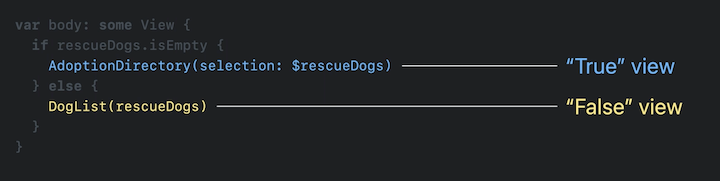

# [**Demystify SwiftUI**](https://developer.apple.com/videos/play/wwdc2021/10022/)

### **Identity**

View Identity

* Views that share the same identity represent different states of the same UI element
* Views that represent distinct UI elements will always have different identities

**Types of Identity - Explicit and Structural Identity**

Explicit identity

* Assigned identifiers (such as name or pointer identity)
* SwiftUI does not use pointers for identity
* In a ForEach, the id: dictates the item’s explicit identity
* In a ScrollViewReader, you can use the explicit .id() modifier

Structural identity

* In SwiftUI, every view has an identifier, and this is where structural identity comes in
* For views that don’t move, SwiftUI uses their relative arrangement of views to distinguish them from each other
* Only works if SwiftUI can guarantee these views won’t swap
* Implicitly uses @ViewBuilder



Using if/else causes views to transition in and out. When possible, use a single view with different parameters/modifiers

* This will preserve state by using a single identifier


Avoid AnyView whenever possible

* It is a type erasing wrapper type
* Hides type of the view it is wrapping from its generic signature
* Makes code harder to understand
* Fewer compile-time diagnostics without AnyView

Bad code example:

```
func view(for dog: Dog) -> some View {
	var dogView: AnyView
	if dog.breed == .bulldog {
		dogView = AnyView(BulldogView())
	} else if dog.breed == .pomeranian {
		dogView = AnyView(PomeranianView())
	} else if dog.breed == .borderCollie {
		dogView = AnyView(BorderCollieView())
		if sheepNearby {
			dogView = AnyView(HStack {
				dogView
				SheepView()
			})
		}
	} else {
		dogView = AnyView(UnknownBreedView())
	}
	return dogView
}
```

Good code example:

```
@ViewBuilder
func view(for dog: Dog) -> some View {
	switch dog.breed {
		case .bulldog:
			BulldogView()
		case .pomeranian:
			PomeranianView()
	case .borderCollie:
		HStack {
			BorderCollieView()
			if sheepNearby {
				SheepView)
			}
		}
	default:
		UnknownBreedView)
	}
}
```

---

### **LifeTime**

View value != view identity
When a view is first created, it is given an identity

* Over time, new values for the view are created, but the view is still the same (identity)
* onDisappear is when the view’s lifetime ends

@State and @StateObject are persisted for the lifetime of the View

* When using if/else to show/hide views, each view gets its own set of State/StateObject
* So if you have two instances of a view that show/hide, they do not share the same values/identity unless those values are passed in


State lifetime = View lifetime

A view’s value is short-lived
A views’s lifetime is the duration of its identity
Persistence of state is tied to lifetime
Provide a stable identity for your data

* ForEach depends on this (amongst other things in SwiftUI)


### **Dependencies**

Dependencies are an input for a view

* When dependencies change, the view is required to produce a new body
* Actions are what trigger changes to a view’s dependencies


Dependency graph

* Underlying representation of SwiftUI views
* Identity is the backbone of the graph
* Efficiently updates the UI
* Value comparison reduces body generation

Kinds of dependencies

* @Binding
* @Environment
* @State
* @StateObject
* @ObservedObject
* @EnvironmentObject

Identifier stability

* Directly impacts lifetime
* Helps performance
* Minimizes dependency churn
* Avoids state loss
* An identifier should not change over time

Identifier uniqueness

* Each id should be mapped to a single view
* Improves animation
* Also helps performance
* Correctly reflects dependencies

The code below has a problem - once the condition is met, the view will get a new identifier


Moving the condition inside the opacity modifier will fix the issue and improve performance


An opacity of 1.0 is an inert modifier, and allows SwiftUI to remove the modifier and improve performance
