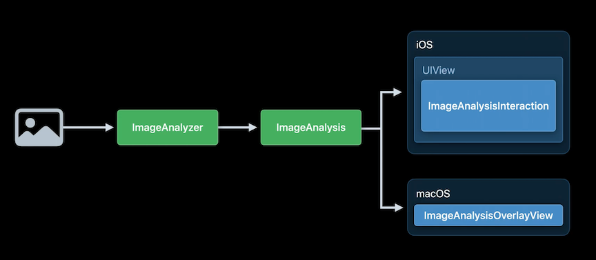
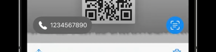

# [**Add Live Text interaction to your app**](https://developer.apple.com/videos/play/wwdc2022/10026/)

What is Live Text

* Text interactions
* Translate
* Data detection
* QR codes

### **Live Text API**

* Available in swift
* Works on static images
* Can be adapted to work on paused video frames
* [**Capture machine-readable codes and text with VisionKit**](https://developer.apple.com/videos/play/wwdc2022/10025/) session
* iOS 16



---

### **Adopting Live Text**

* Uses an `ImageAnalyzer` and `ImageAnalysisInteraction`
* Conform to `ImageAnalysisInteractionDelegate`
* This will add a Live Text button for you
	* Tapping it will highlight any selectable items, underline data detectors, and show quick actions
	* Quick actions show more actions when long tapping

```
import UIKit
import VisionKit

class LiveTextDemoController: BaseController, ImageAnalysisInteractionDelegate, UIGestureRecognizerDelegate {
   
    let analyzer = ImageAnalyzer()
    let interaction = ImageAnalysisInteraction()
    
    override func viewDidLoad() {
        super.viewDidLoad()
        imageview.addInteraction(interaction)
    }
    
    override var image: UIImage? {
        didSet {
            interaction.preferredInteractionTypes = []
            interaction.analysis = nil
            analyzeCurrentImage()
        }
    }
    
    func analyzeCurrentImage() {
        if let image = image {
            Task {
               let configuration = ImageAnalyzer.Configuration([.text, .machineReadableCode])
                do {
                    let analysis = try await analyzer.analyze(image, configuration: configuration)
                    if let analysis = analysis, image == self.image {
                        interaction.analysis = analysis;
                        interaction.preferredInteractionTypes = .automatic
                    }
                }
                catch {
                    // Handle error…
                }
            }
        }
    }
}
```

---

### **Tips and Tricks**

**Preferred interaction types**

`interaction.preferredInteractionTypes = .automatic`

* `.automatic` is default
	* Provides text selection, but will also highlight data detectors if the live text button is active
* `.textSelection` will only allow text selection
* `.dataDetectors` will disable text selection, but data detectors will be underlined and tappable and will not see a Live Text button
* `[]` will disable interaction
* With `.textSelection` or `.automatic`, you can still long press to interact with data detectors
	* Use `interaction.allowLongPressForDataDetectorsInTextMode = false` to disable this functionality

**Supplementary Interface**



* Live Text button (bottom right)
* Quick Actions (bottom left)
* Size and position are automatic
* Customizable
	* `interaction.isSupplementaryInterfaceHidden = true` removes Live Text button and quick actions
	* You can adjust content insets with `interaction.supplementaryInterfaceContentInsets = UIEdgeInsets(top: 0, left: 12, bottom: 18, right: 12)`
	* Can use a custom font with `supplementaryInterfaceFont = UIFont.init(name: @"Copperplate", size: 0)`
		* Live Text will ignore the point size

Match highlights to content

```
func contentsRect (for interaction: ImageAnalysisInteraction) -> CGRect {
	return CGRectMake(0.2, 0, 0.6, 1)
}

interaction.setContentsRectNeedsUpdate()
```

**Interaction placement**

* Over image content
* `UIImageView` will handle content rect calculations automatically for you
	* Just set the interaction on the ImageView
	* Do NOT put the interaction on a ScrollView

**Handling gesture conflicts**

```
func interaction(_ interaction: ImageAnalysisInteraction, shouldBeginAt point: CGPoint, for interactionType: InteractionTypes) -> Bool {
	return interaction.hasInteractiveltem(at: point) ||
			interaction.hasActiveTextSelection
}

func gestureRecognizerShouldBegin(_ gestureRecognizer: UIGestureRecognizer) -> Bool {
	let windowPoint = gestureRecognizer.location(in: nil)
	let point = interaction.view.convert (windowPoint, from: nil)
	let cancelForLiveText = interaction.hasInteractiveltem(at: point) ||
								interaction.hasActiveTextSelection

	return !cancelForLiveText
}

override func hitTest(_ point: CGPoint, with event: UIEvent?) -> UIView? {
	let windowPoint = self.convert (point, to: nil)
	let interactionPoint = self.convert (windowPoint, to: interaction.view)

	if let bounds = interaction.view?.bounds, bounds.contains (interactionPoint) {
		if interaction.hasInteractiveltem(at: point) || interaction.hasActiveTextSelection {
			return interaction.view
		}
	}

	return super.hitTest (point, with: event)
}
```

**Maximize performance**

* Use one `ImageAnalyzer` in your app
* Minimize image conversions
	* Pass in the native type that you have, but using a `CVPixelBuffer` is the most efficient
* Analyze only when image appears on screen
* Wait for scrollviews to stop scrolling to start analysis

**Other Live Texts availability**

* UITextField/UITextView have Live Text support using camera for text input
* WebKit
* Quick Look
* **Use the camera for keyboard input in your app** #session from WWDC 2021
* [**Quick Look Previews from the Ground Up**](https://developer.apple.com/videos/play/wwdc2018/237/) session from WWDC 2018

**AVKit**

* In iOS 16, AVPlayerView/AVPlayerViewController provide Live Text support in paused frames automatically
* `allowsVideoFrameAnalysis` property, enabled by default
* Only for non-FairPlay protected content
* AVPlayerLayer
	* Must get frame after video pauses
	* `let frame = playerLayer.currentlyDisplayedPixelBuffer()`
	* Will only reutrn a value if video is paused
	* Do not write to resulting pixel buffer
	* Again, only for non-FairPlay protected content