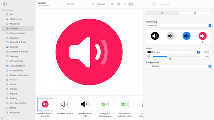
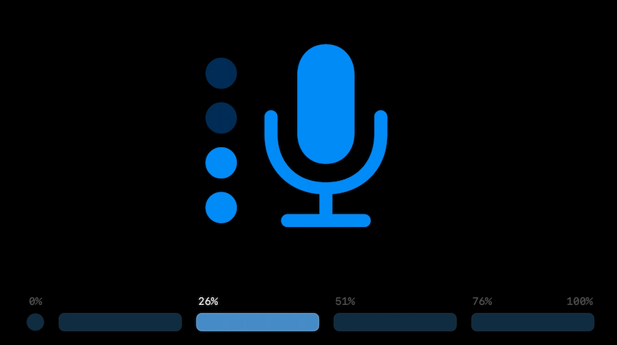
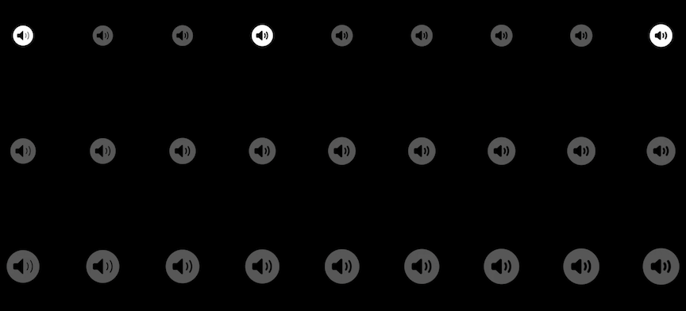
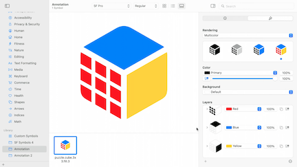
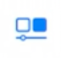

# **Adopt Variable Color in SF Symbols**

Prequels:

* **Explore the SF Symbols 3 app** #session from WWDC 2021
* [**What's new in SF Symbols 4**](What's new in SF Symbols 4.md) session

### **Variable Color overview**

Variable Color is a new feature of SF Symbols that allows you to affect the appearance of a symbol using a percentage value

* New preview area added to SF Symbols 4
* Allows you to see how a symbol changes with different percentage values

* Variable color can be sued with all rendering modes
* No rules for how many parts of a symbol can be affected - one layer, or many
* Layers are given percentage values dictating when they are active
	* In the image below, none of the dots are active at 0%
	* One dot is active for 0-25%, two at 26-50%, three at 51-75%, and all four at 76-100%
* When decimals would be an issue, values are rounded (e.g. 0%, 1-33%, 34-67%, 68-100%)

---

### **Custom symbols**

* Custom symbols can be created with all the flexibility that system symbols have
	* Available in nine different weights
	* Each one of those nine weights is available at three different scales
	* Each one of those 27 variants is available in four rendering modes with and without Variable Color
* Variable templates mean you don't have to draw 27 different combinations of weights and scales - you only have to draw 3
	* Rest are generated automatically

**Unified Annotation**

* For hierarchical and palette rendering modes, you previously had to break your symbol into different layers and assign each later a hierarchy level
* For the multicolor rendering mode, you broke your custom symbol into different layers again and assigned a color to each layer
* Now, this is all streamlined with unified annotation
	* Uses a single-layer structure for a symbol, and shares that structure across all rendering modes
	* You also have control over how the symbol looks in monochrome rendering
	* Allows you to add variable color
* You can drag a symbol into the SF Symbols app
	* Use the preview area to view it under each rendering mode
	* Drag parts of the symbol into the `Layers` area on the right to make a layer with part of the symbol
	* When you switch between rendering modes, you see the same layers you made in other rendering modes
	* You can assign colors to each layer in multicolor mode

* When arranging layers for variable color, order matters
	* Layers to be filled in first go lower on the list, layers to be filled in later go higher
* To enable variable color for a layer, click the variable color button for the layer

* In monochrome, you can choose `Erase` for a layer instead of `Draw` to have that layer erase from the background layer
* To create many layers from a single layer, select the parts of the symbol that you want to split up, control-click, and choose `Split into New Layers` from the contextual menu
* Setting a layer to `Hidden` excludes a layer from that rendering mode

**New template version**

* 4.0 supports monochrome rendering mode and Variable Color
* Existing custom systems will be automatically updated to unified annotation
* Export 3.0 or earlier to maintain compatibility with earlier platforms