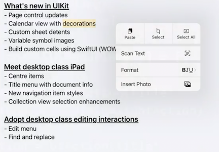

# [**Adopt desktop-class editing interactions**](https://developer.apple.com/videos/play/wwdc2022/10071/)

### **Edit menu**

Edit menu now has multiple appearances on the iPad based on interaction type:

* Horizontal paging menu when reacting to touch
* Vertical context menu when reacting to pointer input
* The iPhone keeps the horizontal paging menu
* Mac Catalyst apps present context menus

Data detectors integration

* Unit and currency conversions
* Smart lookup
	* e.g. "Get Directions" when tapping on an address
* Get this automatically with no code changes

Adding items into text edit menus

* New method on `UITextViewDelegate`
* Also on `UITextFieldDelegate` and `UITextInput`
* Inserting menu items using `UIMenuController` is now deprecated in iOS 16

```
func textView(_ textView: UITextView, 
					editMenuForTextIn range: NSRange, 
					suggestedActions: [UIMenuElement]) -> UIMenu?
```

To insert items, implement the method below

* Will only show the `Hightlight` action below when text is selected
* `Insert Photo` is always used, regardless of text selection

```
func textView(_ textView: UITextView,
					editMenuForTextIn range: NSRange,
					suggestedActions: [UIMenuElement]) -> UIMenu? {
    var additionalActions: [UIMenuElement] = []
    if range.length > 0 {
        let highlightAction = UIAction(title: "Highlight", ...)
        additionalActions.append(highlightAction)
    }
    let insertPhotoAction = UIAction(title: "Insert Photo", ...)
    additionalActions.append(insertPhotoAction)
    return UIMenu(children: suggestedActions + additionalActions)
}
```



**UIEditMenuInteraction**

* Programmatic edit menu presentation
* Context menu presentation on secondary click
* replaces `UIMenuController`
* To implement:
	* Create the interaction, and add it to the view
	* Configure a gesture recognizer to present the menu from (with specific touch types allowed)
		* Add the gesture recognizer to the view
	* When the gesture recognizer is triggered, determine if there is content at the location of the gesture
	* Create a `UIEditMenuConfiguration` with a source point at the gesture's location
	* Present the menu with the created configuration

```
let editMenuInteraction = UIEditMenuInteraction(delegate: self)
view.addInteraction(editMenuInteraction)

let tapRecognizer = UITapGestureRecognizer(target: self, action: #selector(didTap(_:)))
tapRecognizer.allowedTouchTypes = [UITouch.TouchType.direct.rawValue as NSNumber]
view.addGestureRecognizer(tapRecognizer)

@objc func didTap(_ recognizer: UITapGestureRecognizer) {
    let location = recognizer.location(in: self.view)
    if self.hasSelectedObjectView(at: location) {
        let configuration = UIEditMenuConfiguration(identifier: nil, sourcePoint: location)
        editMenuInteraction.presentEditMenu(with: configuration)
    }
}
```

Sometimes, the menu will show blocking the selected view's context

* To show the menu around the selected view, implement the delegate method `editMenuInteraction(targetRectFor:configuration)`
	* This returns a CGRect used to determine where to present the menu from and is in the coordinate space of the interaction's view
	* If the method is not implemented or a null CGRect is provided, the menu will be presented from the source point of the configuration
* To then add a `Duplicate` action, implement `editMenuInteraction(menuFor:configuration:suggestedActions)` and append the custom action after the system suggested actions
* Now when bringing up the edit menu, it appears above the selected view instead of over top of it

```
func editMenuInteraction(_ interaction: UIEditMenuInteraction, targetRectFor configuration: UIEditMenuConfiguration) -> CGRect {
    guard let selectedView = objectView(at: configuration.sourcePoint) else { return .null }
    return selectedView.frame
}

func editMenuInteraction(_ interaction: UIEditMenuInteraction, menuFor configuration: UIEditMenuConfiguration, suggestedActions: [UIMenuElement]) -> UIMenu? {
    let duplicateAction = UIAction(title: "Duplicate") { ... }
    return UIMenu(children: suggestedActions + [duplicateAction])
}
```

Menu covering view | Menu above view
------------------ | ---------------
 | 

Mac Catalyst support

* Presents context menus on right click
* Programmatic presentation
	* Bridges on iPad idiom
	* Not supported on Mac idiom

Using UIMenu with edit menu

* `UIEditMenuInteraction` is built on the `UIMenuElement` family of API
	* Watch the [**Modernizing Your UI for iOS 13**](https://developer.apple.com/videos/play/wwdc2019/224/) session from WWDC 2019
* Uses `UIMenuSystem.context` to build its menus
	* Watch the [**Take your iPad apps to the next level**](https://developer.apple.com/videos/play/wwdc2021/10057/) session from WWDC 2021

**UIMenu enhancements**

* Preferred element size new in iOS 16
	* `.small`, `.medium`, and `.large`
* New `.keepsMenuPresented` attribute on `UIMenuElement` to keep menus presented after an action is performed
	* Useful to perform multiple actions on an element without having to reopen the menu every time


```
UIAction(title: "Increase",
         image: UIImage(systemName: "increase.indent"),
         attributes: .keepsMenuPresented) { ... }

UIAction(title: "Decrease",
         image: UIImage(systemName: "decrease.indent"),
         attributes: .keepsMenuPresented) { ... }
```

---

### **Find and replace**

New find panel on iOS/iPadOS 16

* On iPad, will transition automatically between an inline floating shortcut bar when a hardware keyboard is attached, to resting on top of the software keyboard otherwise
* iPhone uses a more compact layout to adapt to the smaller screen size
* Automatic dismissal, minimization, and keyboard avoidance are all taken care of by the system
* On a Mac, the find panel is presented inline with your content, behaving just like the AppKit find bar, and using a familiar layout that users expect on the Mac
* Included with:
	* UITextView
	* WKWebView
	* PDFView
	* Quick Look

```
open var findInteraction: UIFindInteraction? { get }
textView.isFindInteractionEnabled = true
```

Find invocation

* Keyboard shortcuts (⌘F, ⌘G) provided as system shortcuts
* Find menu in macOS menu bar
* Available when text view becomes the first responder
* Can be invoked programmatically with `findInteraction.presentFindNavigator(showingReplace:)`

Find panel + Mac Catalyst

* Embedded inline on macOS (floating on iOS)
* Scroll view will adjust insets automatically
* Adapts to trait collection changes
* Make sure there's enough room to host the panel in your UI

Find options

* Accessible via the magnifying glass menu in the search bar
* Customizable via `optionsMenuProvider` on `UIFindInteraction`


**Custom views**

* `UIFindInteraction` is installable on any view
* Works with existing find implementations
* Easy to adopt if you already use UITextInput
* To implement if you don't already have an existing implementation:
	* After installing `UIFindInteraction` on your custom view, set up a find interaction delegate
	* The find interaction delegate, besides being notified about when a find session begins or ends, is responsible for dealing out `UIFindSession`s
		* `UIFindSession` is an abstract base class that encapsulates all of the state for a given session, such as the currently highlighted result
		* It also services all actions requested from the UI, such as "go to the next result," or "search for this string."
* If you want to manage all of this state yourself:
	* You can choose to vend a subclass of `UIFindSession` from your find interaction delegate
		* A good option if you already have an existing find and replace implementation in your app, and want to bridge it over to the system UI
	* Otherwise,  let the system take care of the state for you, and instead adopt the `UITextSearching` protocol on whatever class encapsulates the content of the document being displayed. 
		* To do this, return a `UITextSearchingFindSession`, and connect it with your document class

System managing state | Custom state management
--------------------- | -----------------------
 | 

If you don't already have a find implementation for your custom view, here's an example

* We have a custom document class and a custom view which displays this document
	* The `UIFindInteraction` will be installed on this view
	* A `UITextSearchingFindSession` will be provided with this document as the "searchable object."
* Make sure either your view controller or your custom view can become first responder so keyboard shortcuts work as expected
* Create the find interaction, and provide a session delegate to deal out find sessions
* When asked for a find session by the interaction, return a new `UITextSearchingFindSession` providing your document as the searchable object
* Your document class must conform to the `UITextSearching` protocol

```
let customDocument = MyDocument(string: "")
lazy var customView = MyTextView(document: customDocument)

lazy var findInteraction = UIFindInteraction(sessionDelegate: self)

override var canBecomeFirstResponder: Bool { true }

override func viewDidLoad() {
    customView.addInteraction(findInteraction)
}

func findInteraction(_ interaction: UIFindInteraction, sessionFor view: UIView) -> UIFindSession? {
    return UITextSearchingFindSession(searchableObject: customDocument)
}
```

**UITextSearching**

* The class which implements the `UITextSearching` protocol is responsible for actually finding text in your document
* The system will call `performTextSearch`, and hand you an aggregator object to which you can provide results
	* `performTextSearch(queryString: "words", resultAggregator: aggregator)` 
	* The aggregator works with `UITextRange` to represent results in your document
	* The aggregator is an abstract class you use to encapsulate whatever data makes sense for how the test is stored (e.g. DOM range when use in WebKit)
	* The aggregator is thread-safe, so you can provide it results on a background thread
* You will need to decorate results for a given style
	* `decorate(foundTextRange: UITextRange, document: ..., usingStyle: .found)`
* The `UITextSearching` find session and protocol also support multiplexing across multiple visible documents using the same interaction
	* e.g. searching across multiple emails

