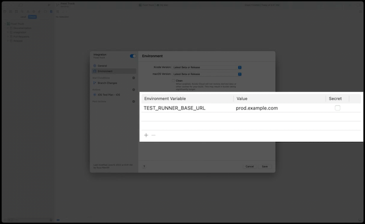
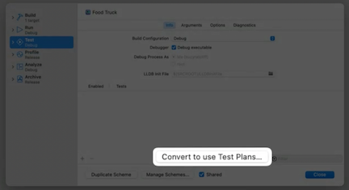
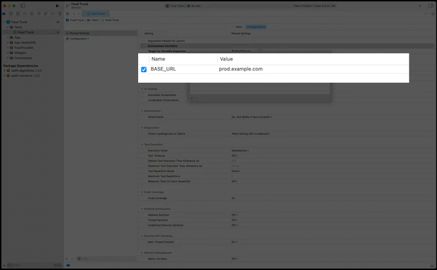
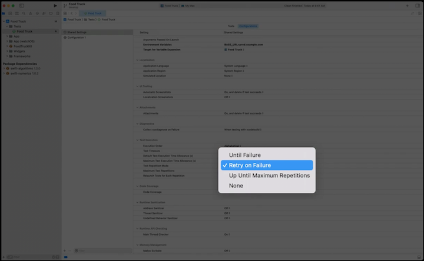
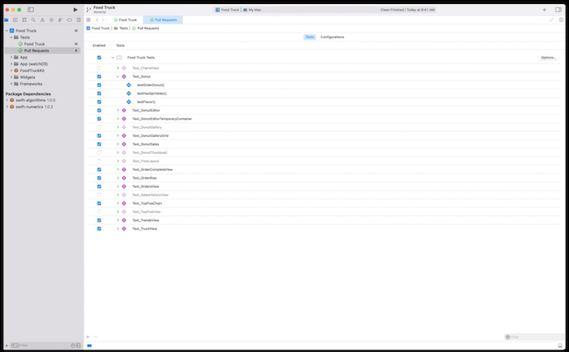
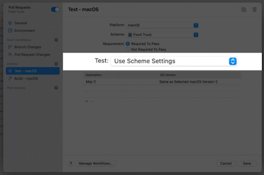
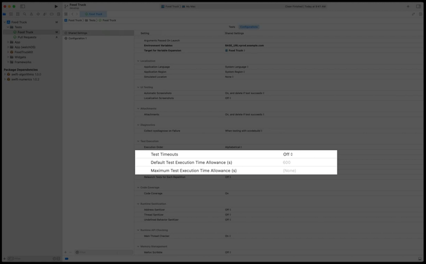
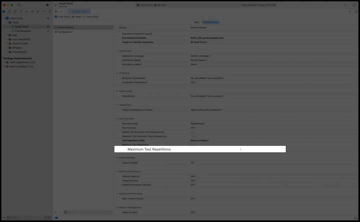

# [**Author fast and reliable tests for Xcode Cloud**](https://developer.apple.com/videos/play/wwdc2022/110361/)

### **Authoring reliable tests**

[**Meet Xcode Cloud**](https://developer.apple.com/videos/play/wwdc2021/10267/) session from WWDC 2021 for basic Xcode Cloud information

**Implement `setup()` and `tearDown`**

* Avoid local dates and times
* Explicitly configure locale on simulator
* Mock device permissions in a unit test and use alert handlers in a UI test
* Prepare dependent files - e.g. a test may expect to have an empty documents directory
* Explicitly configuring the simulator is sometimes the easiest choice, enhancing the test’s setup method is generally more robust
	* For example (code below), the Food Truck app depends on a menu file. As part of instantiating the truck object in the setup function, a mock data file is generated containing the donut menu items
	* Rather than relying on teardown methods to prepare for subsequent tests, it's recommended to establish all state preparation in the setup method
* For more details on how to configure scripts, check out the [**Customize your advanced Xcode Cloud workflow**](https://developer.apple.com/videos/play/wwdc2021/10269/) session from WWDC 2021

```
var truck: Truck!

override func setUp() async throws {
    let directoryURL = FileManager.default.temporaryDirectory
    let fileName = UUID().uuidString
    let fileURL = directoryURL.appendingPathComponent(fileName, isDirectory: false)
    let data = await mockDonutMenuData()
    try data.write(to: fileURL)
    truck = Truck(menuURL: fileURL)
}
```

**`XCTSkip` tests that fail to meet preconditions**

* Instructs the XCTest Runner to cease executing the current test and mark it as skipped
* May be used to bypass a yet-to-be supported OS version or device type
* Can leverage `XCTSkip` by setting an environment variable to skip tests specific to staging or production environments
	* Parameterize test runner and test host
	* Prefix environment variables with `TEST_RUNNER_`
	* `BASE_URL` becomes `TEST_RUNNER_BASE_URL`
	* Test plans require the same format as test code. Namely, the `TEST_RUNNER_` prefix is not added
	* Xcode Cloud’s Environment variables will take precedence over what’s specified in your project’s test plans

```
var truck: Truck!

func testOrderDonut() throws {
    let host = ProcessInfo.processInfo.environment["BASE_URL"]
    try XCTSkipIf(host == "prod.example.com")

    let expectation = XCTestExpectation(description: "Order donut")
    truck.order(with: .sprinkles, host: host) { error, donut in
        XCTAssertTrue(donut.hasSprinkles)
        expectation.fulfill()
    }       
    wait(for: [expectation], timeout: 5)
}
```

**Adding environment variables**

1. Navigate to cloud reports
2. `Control-Click` on your app
3. Select `Manage Workflows` in the context menu
4. Double click on the specific workflow you want to edit
5. Select `Environment` in the sidebar
6. In the middle of the sheet, under `Environment Variables`, add the variable's name and value



An alternative to setting the environment variable in the Xcode Cloud Workflow is to instead set it within the test plan

1. In the scheme editor, select `Test` in the sidebar
2. Click `Convert to use Test Plans...` on the bottom of the window
3. Click on the test plan in the sidebar
4. Select `Configurations`
5. Enter names/values for the `Environment Variables` setting

Convert to use Test Plans | Enter Environment Variable
------------------------- | --------------------------
 | 

**Increase `XCTestExpectation` timeout or replace with `async/await`**

* A test can fail due to an unexpected timeout
	* Could be the result of a slow server or an overly anxious user interface test
* One approach to resolving this is to increase the timeout in `wait(for: [expectation], timeout: 5)`
* Usually preferable to instead replace both the app and test code timeout handling with async/await
	* Allows the test to pause until the await call finishes without any timeout

```
var truck: Truck!

func testOrderDonut() async throws {
    let host = ProcessInfo.processInfo.environment["BASE_URL"]
    try XCTSkipIf(host == "prod.example.com")

    let donut = try await truck.orderDonut(with: .sprinkles, host: host)
    XCTAssertTrue(donut.hasSprinkles)
}
```

**Declare tests that are expected to fail**

* Use `XCTExpectFailure` instead of disabling or skipping tests
* Your test executes normally and the results are transformed
	* A failure in a test will now be reported as an expected failure, while that failed test within its suite will be reported as a pass
	* Eliminates the noise generated by expected failures
* [**Embrace Expected Failures in XCTest**](https://developer.apple.com/videos/play/wwdc2021/10207/) session from WWDC 2021

```
var truck: Truck!

func testOrderDonut() async throws {
    let host = ProcessInfo.processInfo.environment["BASE_URL"]
    try XCTSkipIf(host == "prod.example.com")

    XCTExpectFailure("<https://dev.myco.com/bug/98> Donut ordering service is down")
    let donut = try await truck.orderDonut(with: .sprinkles, host: host)
    XCTAssertTrue(donut.hasSprinkles)
}
```

**Leverage test repetitions**

* A tool that runs the same test multiple times waiting for:
	* The first failure
	* The first success
	* Or a statistical result
* Use to confirm initial reliability before checking in code
* Diagnose unreliable code
* Retry inconsistent services
	* For tests that rely on an unreliable external service, you may want to leverage the retry-on-failure repetition policy to confirm a test can succeed
	* Preferable to mock services
		* For info on mocking dependencies, watch the [**Testing Tips & Tricks**](https://developer.apple.com/videos/play/wwdc2018/417/) session from WWDC 2018

To enable test repetitions in a test plan:

* Go to the Test Plan editor and select `Configurations`
* Under the `Test Execution` section, there is a popup to select `Test Repetition Mode`



* For more info on test repetition, watch the [**Diagnose unreliable code with test repetition**](https://developer.apple.com/videos/play/wwdc2021/10296/) session from WWDC 2021
* For more info on writing quality tests, watch the [**Write Tests to Fail**](https://developer.apple.com/videos/play/wwdc2020/10091/) session from WWDC 2020

---

### **Configuring for faster results**

**Create second workflow containing only pull request tests**

1. Create a new Test Plan
2. Select it in the sidebar
3. Select `Tests` in the main window
4. Select/Deselect tests based on whether you want them to run in this workflow
5. Navigate to cloud reports in the sidebar
6. `Control-Click` on your app
7. Select `Manage Workflows` in the context menu
8. Click the `+` on the bottom left and give your new workflow a name
9. In the window sidebar, click the `+` button next to `Start Conditions`
10. Select `Pull Request Changes` from the context menu
11. Click the `+` next to `Actions`
12. Select `Build` from the context menu
13. Again, click the `+` next to `Actions`
14. Select `Test` from the context menu
15. In the new Test action, select the test plan to use from the `Test` picker

Select tests to run | Create new Pull Request Test Plan
------------------- | ---------------------------------
 | 

Check out [**Testing in Xcode**](https://developer.apple.com/videos/play/wwdc2019/413/) session from WWDC 2019 to learn more about Test Plans

**Enable parallel test execution**

* By default, Xcode Cloud tests your platforms in parallel
* You can enable Xcode to run tests in parallel on a target and test object class level
	1. Go to your test plan editor and select `Tests`
	2. Click the `Options` button on the right side of the window
	3. Check the `Execute in parallel (if possible)` option
*  Tests must be designed to run independently to take advantage of parallel execution
	*  Proper setup and teardown are essential to reliable test case behavior

**Halt runaway tests by setting execution time allowance**

* Can be caused by infinite loops, or waiting indefinitely for a failed server
* To set a execution time allowance
	1. Go to your Test Plan editor and select `Configurations`
	2. Under the `Test Execution` category, enable `Test Timeouts`
	3. Specify the number of seconds to wait (default is 600 seconds)



**Minimize retries for unreliable tests**

* Repetitions add to the time it takes to run the test suite
* Unnecessary repetitions are wasteful and you may want to optimize test repetition value to a lower number
* You may consider removing the problematic test altogether from the pull request workflow
	1. Go to your Test Plan editor and select `Configurations`
	2. Under the `Test Execution` category, set a value for `Maximum Test Repetitions` 



For more info on faster test results, check out the [**Get your test results faster**](https://developer.apple.com/videos/play/wwdc2020/10221/) session from WWDC 2020

