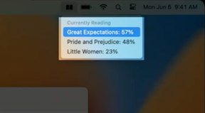
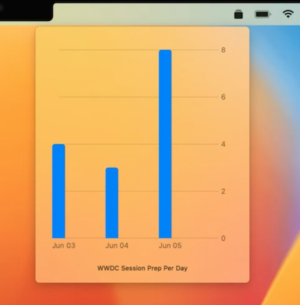
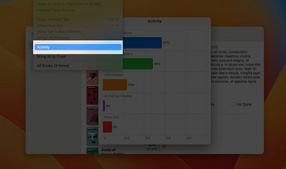
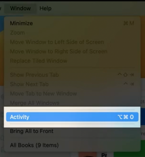

# **Bring multiple windows to your SwiftUI app**

### **Scene basics**

SwiftUI Scene Types

* WindowGroup - provides a way to build data-driven applications across all of Apple's platforms
* DocumentGroup - lets you build document-based apps on iOS and macOS
* Settings - defines an interface for representing in-app settings values on macOS
* Two new additions
	* Window - a scene which represents a single, unique window on all platforms
		* Unlike WindowGroup, the Window scene will only ever represent its contents in a single, unique window instance
	* MenuBarExtra - renders as a persistent control in the system menu bar

```
// Scene Composition

@main
struct MultiSceneApp: App {
    var body: some Scene {
        WindowGroup {
            ContentView()
        }

        #if os(iOS) || os(macOS)
        DocumentGroup(viewing: CustomImageDocument.self) { file in
            ImageViewer(file.document)
        }
        #endif

        #if os(macOS)
        Settings {
            SettingsView()
        }
        #endif
    }
}
```

**Single Windows**

* Will only ever represent its contents in a single window
* Useful for when multiple widows don't fit design

```
import SwiftUI

@main
struct BookClub: App {
    @StateObject private var store = ReadingListStore()

    var body: some Scene {
        WindowGroup {
            ReadingListViewer(store: store)
        }
        Window("Activity", id: "activity") {
            ReadingActivity(store: store)
        }
    }
}
```

**Menu bar extras**

* macOS Only
* Persistent control in macOS menu bar
* Available as long as your app is running, regardless of whether it's the currently active app
* Supports two rendering styles
	* Default - shows the contents in a menu which pulls down from the menu bar
	* Window - presents its contents in a chromeless window anchored to the menu bar

```
// Default style
@main
struct UtilityApp: App {
    var body: some Scene {
        MenuBarExtra("Utility App", systemImage: "hammer") {
            AppMenu()
        }
    }
}

// Window style
@main
struct UtilityApp: App {
    var body: some Scene {
        MenuBarExtra("Time Tracker", systemImage: "rectangle.stack.fill") {
            TimeTrackerChart()
        }
        .menuBarExtraStyle(.window)
    }
}
```

Default | Window
------- | ------
 | 

---

### **Auxiliary scenes**

* Useful when opening multiple windows with the same state would not fit well with the app's design
* The title provided to our scene will be used as the label for a menu item which is added to a section of the Window menu
* When selecting this item, the scene's window will be opened if not already so

```
import SwiftUI

@main
struct BookClub: App {
    @StateObject private var store = ReadingListStore()

    var body: some Scene {
        WindowGroup {
            ReadingListViewer(store: store)
        }
        
        // Auxiliary scene
        Window("Activity", id: "activity") {
            ReadingActivity(store: store)
        }
    }
}

struct ReadingListViewer: View {
    @ObservedObject var store: ReadingListStore

    var body: some View {
        Text("Reading List")
    }
}

struct ReadingActivity: View {
    @ObservedObject var store: ReadingListStore

    var body: some View {
        Text("Reading Activity")
    }
}

class ReadingListStore: ObservableObject {
}
```



---

### **Scene navigation**

SwiftUI provides several new callable types via the environment for presenting windows tied to the scenes your app defines

* Presenting a scene uses the `@Environment(\.openWindow) private var openWindow` environment variable
* Presenting an identified scene
	* Supports both `WindowGroup` and `Window` scenes
	* Identifier must match with an existing scene defined in the app

```
import SwiftUI

@main
struct BookClub: App {
    @StateObject private var store = ReadingListStore()

    var body: some Scene {
        WindowGroup {
            ReadingListViewer(store: store)
        }
        Window("Activity", id: "activity") {
            ReadingActivity(store: store)
        }
    }
}

struct OpenWindowButton: View {
    @Environment(\.openWindow) private var openWindow

    var body: some View {
        Button("Open Activity Window") {
            openWindow(id: "activity")
        }
    }
}

struct ReadingListViewer: View {
    @ObservedObject var store: ReadingListStore

    var body: some View {
        Text("Reading List")
    }
}

struct ReadingActivity: View {
    @ObservedObject var store: ReadingListStore

    var body: some View {
        Text("Reading Activity")
    }
}

class ReadingListStore: ObservableObject {
}
```

* Presenting a scene value
	* Only works with `WindowGroup`
	* Type must match with an existing scene

```
import SwiftUI

@main
struct BookClub: App {
    @StateObject private var store = ReadingListStore()

    var body: some Scene {
        WindowGroup {
            ReadingListViewer(store: store)
        }
        Window("Activity", id: "activity") {
            ReadingActivity(store: store)
        }
        WindowGroup("Book Details", for: Book.ID.self) { $bookId in
            BookDetail(id: $bookId, store: store)
        }
    }
}

struct OpenWindowButton: View {
    var book: Book
    @Environment(\.openWindow) private var openWindow

    var body: some View {
        Button("Open In New Window") {
            openWindow(value: book.id)
        }
    }
}

struct ReadingListViewer: View {
    @ObservedObject var store: ReadingListStore

    var body: some View {
        Text("Reading List")
    }
}

struct ReadingActivity: View {
    @ObservedObject var store: ReadingListStore

    var body: some View {
        Text("Reading Activity")
    }
}

struct BookDetail: View {
    @Binding var id: Book.ID?
    @ObservedObject var store: ReadingListStore

    var body: some View {
        Text("Book Details")
    }
}

struct Book: Identifiable {
    var id: UUID
}

class ReadingListStore: ObservableObject {
}
```

* Presenting a new document
	* Uses `@Environment(\.newDocument) private var newDocument` environment variable
	* Supports both `FileDocument` and `ReferenceFileDocument`
	* `DocumentGroup` must have an editor role

```
import SwiftUI
import UniformTypeIdentifiers

@main
struct TextFileApp: App {
    var body: some Scene {
        DocumentGroup(viewing: TextFile.self) { file in
            TextEditor(text: file.$document.text)
        }
    }
}

struct NewDocumentButton: View {
    @Environment(\.newDocument) private var newDocument

    var body: some View {
        Button("Open New Document") {
            newDocument(TextFile())
        }
    }
}

struct TextFile: FileDocument {
    var text: String

    static var readableContentTypes: [UTType] { [UTType.plainText] }

    init() {
        text = ""
    }

    init(configuration: ReadConfiguration) throws {
        guard let data = configuration.file.regularFileContents,
              let string = String(data: data, encoding: .utf8)
        else {
            throw CocoaError(.fileReadCorruptFile)
        }
        text = string
    }

    func fileWrapper(configuration: WriteConfiguration) throws -> FileWrapper {
        let data = text.data(using: .utf8)!
        return FileWrapper(regularFileWithContents: data)
    }
}
```

* Presenting an existing document
	* Uses `@Environment(\.openDocument) private var openDocument` environment variable
	* Takes a `URL` to an existing file
	* Requires a defined document type for reading the file's type

```
import SwiftUI
import UniformTypeIdentifiers

@main
struct TextFileApp: App {
    var body: some Scene {
        DocumentGroup(viewing: TextFile.self) { file in
            TextEditor(text: file.$document.text)
        }
    }
}

struct OpenDocumentButton: View {
    var documentURL: URL
    @Environment(\.openDocument) private var openDocument

    var body: some View {
        Button("Open Document") {
            Task {
                do {
                    try await openDocument(at: documentURL)
                } catch {
                    // Handle error
                }
            }
        }
    }
}

struct TextFile: FileDocument {
    var text: String

    static var readableContentTypes: [UTType] { [UTType.plainText] }

    init() {
        text = ""
    }

    init(configuration: ReadConfiguration) throws {
        guard let data = configuration.file.regularFileContents,
              let string = String(data: data, encoding: .utf8)
        else {
            throw CocoaError(.fileReadCorruptFile)
        }
        text = string
    }

    func fileWrapper(configuration: WriteConfiguration) throws -> FileWrapper {
        let data = text.data(using: .utf8)!
        return FileWrapper(regularFileWithContents: data)
    }
}
```

**Presentation values**

* Prefer your model's identifier, rather than the model itself
	* Our new window would get a copy of the value if we passed the model - edits to either would not affect the other
* Value must conform to both `Hashable` and `Codable`
* Prefer lightweight values
* When a given value is provided to the WindowGroup for presentation, the value's equality will be used to determine if a new window should be created or if an existing window can be reused

```
// Button to open a window
struct OpenWindowButton: View {
    var book: Book
    @Environment(\.openWindow) private var openWindow

    var body: some View {
        Button("Open In New Window") {
            openWindow(value: book.id)
        }
    }
}

struct Book: Identifiable {
    var id: UUID
}
```

```
// Define BookDetail WindowGroup to handle the window opened

@main
struct BookClub: App {
    @StateObject private var store = ReadingListStore()

    var body: some Scene {
        WindowGroup {
            ReadingListViewer(store: store)
        }
        Window("Activity", id: "activity") {
            ReadingActivity(store: store)
        }
        WindowGroup("Book Details", for: Book.ID.self) { $bookId in
            BookDetail(id: $bookId, store: store)
        }
    }
}
```

**State Restoration**

* The presented value will also be automatically persisted by SwiftUI for the purposes of state restoration
* `ViewBuilder` is provided a `Binding` to the presented value
* `Binding` can be modified while the window is open
* Set to the most recent value when the scene is restored

---

### **Scene customizations**

* By default, SwiftUI will add a menu item in the File menu for each `WindowGroup` defined
	* Use `.commandsRemoved` to modify a scene so that it will no longer provide its default commands

```
import SwiftUI

@main
struct BookClub: App {
    @StateObject private var store = ReadingListStore()

    var body: some Scene {
        WindowGroup {
            ReadingListViewer(store: store)
        }
        Window("Activity", id: "activity") {
            ReadingActivity(store: store)
        }
        WindowGroup("Book Details", for: Book.ID.self) { $bookId in
            BookDetail(id: $bookId, store: store)
        }
        .commandsRemoved()
    }
}
```

* Absent any previous state for a window, SwiftUI will by default place it int he center of the screen
	* Use `.defaultPosition(...)` to provide a different default position
	* Position is relative to the screen size and takes into account the current locale
* You can also provide a default size with `.defaultSize(width: ..., height: ...)
* Keyboard shortcuts now work on scene types as well
	* Use `.keyboardShortcut(...) to create modifiers for the specific scene

```
import SwiftUI

@main
struct BookClub: App {
    @StateObject private var store = ReadingListStore()

    var body: some Scene {
        WindowGroup {
            ReadingListViewer(store: store)
        }

      	ReadingActivityScene(store: store)
      
        WindowGroup("Book Details", for: Book.ID.self) { $bookId in
            BookDetail(id: $bookId, store: store)
        }
        .commandsRemoved()
    }
}

struct ReadingActivityScene: Scene {
    @ObservedObject var store: ReadingListStore

    var body: some Scene {
        Window("Activity", id: "activity") {
            ReadingActivity(store: store)
        }
        #if os(macOS)
        .defaultPosition(.topTrailing)
      	.defaultSize(width: 400, height: 800)
        #endif
        #if os(macOS) || os(iOS)
        .keyboardShortcut("0", modifiers: [.option, .command])
        #endif
    }
}
```

