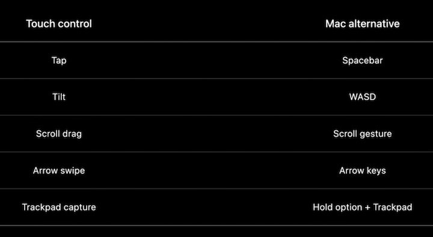
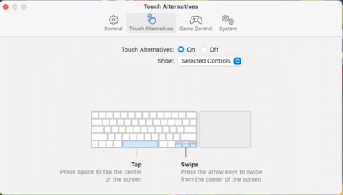
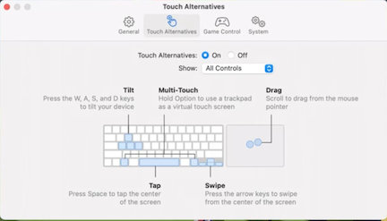
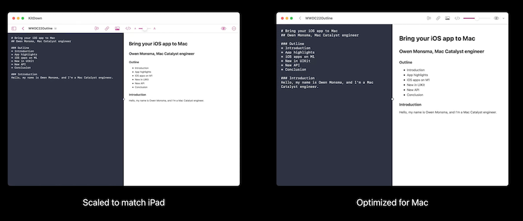
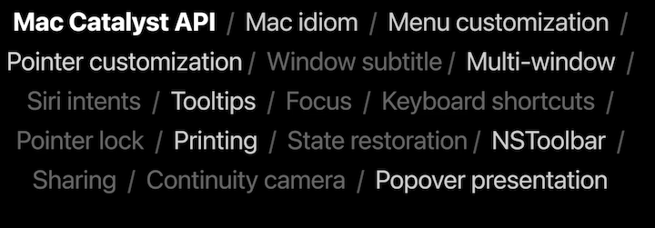
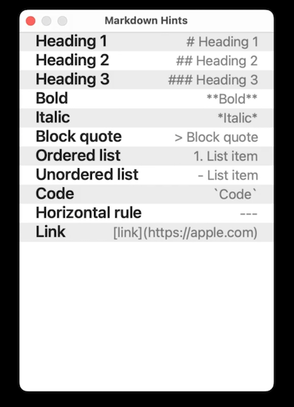

# **Bring your iOS app to the Mac**

### **iOS apps on M1**

Two new launch options for `Info.plist`

* Not bound to any SDK version
* Ignored on iOS and on Mac prior to macOS 12.1
* `UISupportsTrueScreenSizeOnMac` indicates the app is prepared for the wide variety of display configurations it may encounter
	* The app gets the true screen size and pixel density, rather than a compatible iPad size.
* `UILaunchToFullScreenByDefaultOnMac` tells the system that the prefers to enter fullscreen mode as soon as it's launched

```
<key>UISupportsTrueScreenSizeOnMac</key>
<true/>

<key>UILaunchToFullScreenByDefaultOnMac</key>
<true/>
```

**Touch Alternatives**

* Automatically converts keyboard, mouse, and trackpad input into iOS multitouch gestures and device motion expected by your app
* Shows a tutorial explaining how touch controls translate to a keyboard and mouse or trackpad
* To opt into automatic Touch Alternatives, create a new plist file in your app named `com.apple.uikit.inputalternatives.plist`
* In the app's settings, a user can switch between preferred controls specified in the plist and all controls

```
<key>defaultEnablement</key>
<string>enabled</strings>

<key>requiredOnboarding</key>
<array>
	<string>Tap</string>
	<string>Tilt</string>
<!--etc-->
</array>
```



Preferred Controls | All Controls
------------------ | ------------
 | 

**Native keyboard and trackpad**

* Directly implementing keyboard and cursor support in an app ensures the app behaves well on all devices (iPad and Mac)
* **Support hardware keyboards in your app** #session from WWDC 2020
* **Handle trackpad and mouse input** #session from WWDC 2020

---

### **Build for Mac Catalyst**

Adding a Mac Catalyst target in project settings:

* App will automatically be converted to a full Mac Catalyst app capable of running on every Mac
* Allows you to customize it further using Mac Catalyst API
* Also have the choice to optimize the interface for Mac, which will provide native AppKit styled controls, and ensure the app content renders at native scale.
* When the app is optimized for Mac:
	* The UINavigationBar gets translated into a NSToolbar, providing native AppKit controls
	* Text in the Mac idiom is handled with native Mac font rendering (in when not optimized, it renders at iPad size, and is scaled down to 77% its original size)



---

### **What's new**

**Desktop class iPad**

* [**Meet desktop class iPad**](Meet desktop-class iPad.md) session
* **Build a desktop class iPad app** #session
* Controls and navigation move from UINavigationBar into the NSToolbar
	* If you don't already create a toolbar, we give you one automatically
	* If you already manage your own NSToolbar in Catalyst, nothing changes
	* Center item controls become NSToolbarItems
* For document based apps, the window title shows the document name
	* If `Show window title icons` is enabled in Accessibility System Settings, the file proxy icon appears as well
	* If you use a navigation controller, the back button and other navigation controls are also brought into the toolbar.
		* Additionally, you get new document-centric menu items in the File menu: `Duplicate`, `Move`, `Rename`, and `Export As`
* If your app includes a search bar, it gets automatically pulled into the NSToolbar as well, first showing as a search button that expands into the bar on click

```
// Enabling File menu document items
override func duplicate(_ sender: Any?) { ... }

override func move(_ sender: Any?) { ... }

override func rename(_ sender: Any?) { ... }

override func export(_ sender: Any?) { ... }


// Removing File menu document items
override func buildMenu(with builder: UIMenuBuilder) {
	if builder.system == .main {
		builder.remove(menu: .document)
	}
}
```

---

### **New API**



New API:

* Window geometry
* Window controls
* NSToolbarItem hosting
* Popovers from toolbar

**Window API**

* Catalyst apps support multiple windows using the existing UIWindowScene API
* New in macOS Ventura, we've added API to let you customize your app windows:
	* By setting the style of the traffic-light window controls
	* Programmatically resizing and repositioning your windows
	* Disabling fullscreen for specific scenes.

```
// Resizing a window

func scene(_ scene: UIScene, willConnectTo session: UISceneSession, options connectionOptions:UIScene.ConnectionOptions) {
	guard let windowScene = (scene as? UIWindowScene) else { return }

	#if targetEnvironment(macCatalyst)
	let currFrame = windowScene.effectiveGeometry.systemFrame
	let newFrame = CGRect (origin: currFrame.origin, size: CGSize (width: 320, height: 480))
	let geometryRequest = UIWindowScene.MacGeometryPreferences(systemFrame:newFrame)
	windowScene.requestGeometryUpdate(geometryRequest) {error in
		// Handle error
	}
	windowScene.windowingBehaviors?.isMiniaturizable = false
	windowScene.sizeRestrictions?.allowsFullScreen = false
	#endif
}
```



The options are not reserved for screen creation - you can always check the current frame from the readonly effectiveGeometry property, modify it however you need, and request a new geometry update

```
// Additional window options

var frame = windowScene.effectiveGeometry.systemFrame
frame.origin = CGPoint (x: 300, y: 100)
let geometryRequest = UIWindowScene.MacGeometryPreferences(systemFrame: frame)
windowScene.requestGeometryUpdate(geometryRequest)
```

Two important aspects of the geometry to keep in mind

* Because systemFrame dictates the frame of the window on the Mac desktop, the size of one point for the systemFrame property is always the size of one AppKit point
	* If your app is optimized for Mac, this is the same scale as your UI elements
	* If your app is scaled to match iPad, it will differ by the 77% scale facto
* The origin of the coordinate space is the upper-left corner of the main display
	* If you have multiple displays, the main display is the one that shows the Menu bar in the system display settings

**Window Controls**

You can take control over the state of the three window control buttons

* New windowingBehaviors object on UIWindowScene has two properties, closable and miniaturizable, that will adjust these respective window behaviors and enable or disable the red and yellow window buttons
* The green window button handles both resizing your window on the desktop, and taking the window into fullscreen
	* Disable fullscreen with the new property on sizeRestrictions, `allowsFullScreen`
	* Disable resizing by using size restrictions and setting the minimum and maximum size to the same size
	* And by doing both, the green button also becomes disabled.
* And you can check whether your scene is currently fullscreen with the new `isFullScreen` property

```
// Additional window options
windowScene.windowingBehaviors?.isClosable = false
windowScene.windowingBehaviors?.isMiniaturizable = false

windowScene.sizeRestrictions?.allowsFullScreen=false

let fixedSize = CGSize(...)
windowScene.sizeRestrictions?.minimumSize = fixedSize
windowScene.sizeRestrictions?.maximumSize = fixedSize

if windowScene.isFullScreen { /* ... */ }
```

**Toolbars**

* UIViews can be added as items to the NSToolbar
* Can use NSUIViewToolbarItem just like any other NSToolbarItem, to instantiate a toolbar item from the NSToolbarDelegate's itemForIdentifier method
* NSToolbar expects unique toolbar item instances for toolbar customization mode
	* If you are using automatic NSToolbar hosting from your UINavigationBar, your view is cloned by the system for toolbar customization automatically 	* If you manage your own NSToolbar, your delegate will need to create unique instances of your UIView for each NSUIViewToolbarItem instance, rather than reusing the same UIView instance
	* You can opt out of navigation bar translation by using `navigationBar.preferredBehavioralStyle = ...`
		* Default value is automatic
		* You can set it to .mac to explicitly request translation
		* Setting it to .pad, your navigation bar no longer gets automatically translated

```
// UIView in NSToolbarItem
func toolbar(toolbar: NSToolbar, itemForIdentifier itemIdentifier: NSToolbarItem.Identifier, willBeInsertedIntoToolbar flag: Bool) -› NSToolbarItem? {
	if itemIdentifier == wordCountItemIdentifier {
		let wordCountView = WordCountView()
		return NSUIViewToolbarItem(itemIdentifier: itemIdentifier, uiView: wordCountView)
	}
}
```

```
// Popover from SToolbarItem

let wordCountDetailsVC=WordCountPreferencesViewController()
wordCountDetailsVC.modalPresentationStyle = .popover
wordCountDetailsVC.popoverPresentationController?.sourceItem = wordCountView
rootvc.present(wordCountDetailsVC, animated: true)
```
