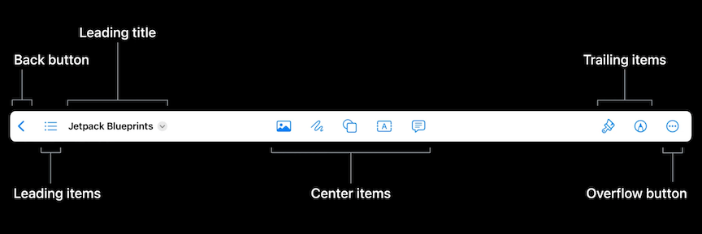

# **Build a desktop-class iPad app**

* [**Meet desktop class iPad**](Meet desktop-class iPad.md) session
* [**What's new in iPad app design**](What's new in iPad app design.md) session

### **UI organization**

Three navigation bar styles:

* Navigator
	* Familiar push/pop navigation
* Browser
	* Ideal for looking through and navigating back and forth between multiple documents or folder structures
* Editor
	* For focused viewing and editing of individual documents



Becoming an editor app

* Back action
* Title menu with document info
* Document renaming
* Center items

Use `navigationItem.style = .editor` to opt into the editor style

* Gives us leading aligned title
* Opens up the center area

Remove trailing `Done` button using `navigationItem.backAction = UIAction(…)`

* Gives us a back arrow to return to the document picker

**Title Menu**

* Menu attached to the title
* Actions for the entire context of the document
	* Document info at a glance
	* Drag and drop
	* Sharing
* App is document backed, so we can use the UIDocument's fileURL to instantiate a UIDocumentProperties object
	* Use that same URL to create an NSItemProvider
	* Use the item provider to create a UIDragItem to return from the properties object's dragItemsProvider
	* Also use it to construct a UIActivityViewController to return from the properties object's activityViewControllerProvider
	* Set the properties object as the editor view controller's navigationItem's documentProperties

```
let properties = UIDocumentProperties(url: document.fileURL)

if let itemProvider = NSItemProvider(contentsOf: document.fileURL) {
    properties.dragItemsProvider = { _ in
        [UIDragItem(itemProvider: itemProvider)]
    }
    properties.activityViewControllerProvider = {
        UIActivityViewController(activityItems: [itemProvider], applicationActivities: nil)
    }
}

navigationItem.documentProperties = properties
```


Renaming

* Rename delegate
* Rename UI built into bar
* Action automatically added to menu

```
// Adopt rename title menu action and rename UI
override func viewDidLoad() {
    navigationItem.renameDelegate = self
}

func navigationItem(_ navigationItem: UINavigationItem, didEndRenamingWith title: String) {
    // Rename document using methods appropriate to the app’s data model
}
```

Duplicate and move functions:

* Override `duplicate` and move `functions`
* UIKit automatically surfaces system-provided actions, including the rename action, in the navigationItem's titleMenuProvider as an array of suggested UIMenuElements
	* To include them to the title menu, just add them to the returned menu's children

```
override func duplicate(_ sender: Any?) {
    // Duplicate document
}

override func move(_ sender: Any?) {
    // Move document
}

func didOpenDocument() {
    ...
    navigationItem.titleMenuProvider = { [unowned self] suggested in
        var children = suggested

        ...

        return UIMenu(children: children)
    }
}
```

Custom functions

* Can add entirely custom actions or even whole menu hierarchies
* Add an export submenu with `export as HTML` and `PDF` sub-actions

```
func didOpenDocument() {
    ...
    navigationItem.titleMenuProvider = { [unowned self] suggested in
        var children = suggested
        children += [
            UIMenu(title: "Export…", 
                   image: UIImage(systemName: "arrow.up.forward.square"), 
                   children: [
                UIAction(title: "HTML", image: UIImage(systemName: "safari")) { ... },
                UIAction(title: "PDF", image: UIImage(systemName: "doc")) { ... }
            ])
        ]
        return UIMenu(children: children)
    }
}
```

When running on Mac Catalyst, you should see:

* The editor style with its leading aligned title
* Back action has also been carried over, and when clicked, brings up a file browser
* The system provided actions and rename functionality are automatically surfaced in the app's File menu
	* `titleMenuProvider` is not called on Mac Catalyst, so custom actions are not included in the File menu
	* To expose these actions, we need to manually add them to the app's main menu using the main `UIMenuSystem`

**Center items and customization**

* Use `navigationItem.customizationIdentifier = "editorView"` to enable customization
* Define center items with `navigationItem.centerItemGroups = [ ... ]`
* Define fixed groups with `UIBarButtonItem(title: "Sync Scrolling", ...).creatingFixedGroup()`
	* Not customizable, and cannot be moved by the user
* Create optional groups with `UIBarButtonItem(title: "Add Link", ...).creatingOptionalGroup(customizationIdentifier: "addLink")`
	* Completely customizable
	* Has a unique `customizationIdentifier` so the customization is persisted across app launches
* We can have items that are a customization option, but do not show up by default
	* Set `isInDefaultCustomization` to false to make it not included in the nav bar by default
	* Give the group a `representativeItem` so it has a title in the popover, and has a compact representation that it can be collapsed to when the bar runs out of space

```
UIBarButtonItemGroup.optionalGroup(customizationIdentifier: "textFormat",					 isInDefaultCustomization: false,
					 representativeItem: UIBarButtonItem(title: "Format", ...)
					 items: [
					      UIBarButtonItem(title: "Bold", ...),
					      UIBarButtonItem(title: "Italics", ...),
					      UIBarButtonItem(title: "Underline", ...),
					 ])
```

Because our bar is customizable, we will see a more button on the trailing edge, with an option to "Customize Toolbar"

* Tapping that activates customization mode
* Fixed items are de-emphasized and static
* All other items lift and shake to show that they're customizable
* Optional items like the Format group show up in the popover and can be dragged into the bar
* When run on a Mac, the center items have been converted to fully customizable macOS toolbar buttons

More Menu | Customization Mode
--------- | ------------------
 | 

When resizing the app:

* Items automatically overflow into the More menu
* Standard bar button items are automatically converted to their menu representation, but we're also able to provide a custom menu representation
* Since UIKit has no insight into the purpose of a custom view item, our slider item isn't automatically translated
	* We'll need to manually specify a menu representation
	* `preferredElementSize` gives the menu a more compact side by side appearance
	* `.keepsMenuPresented` attribute, we can keep the menu presented after each action is performed, allowing the font size to be changed multiple times without dismissing and re-presenting the menu

```
sliderGroup.menuRepresentation = UIMenu(title: "Text Size",
                                        preferredElementSize: .small,
                                        children: [
    UIAction(title: "Decrease",
             image: UIImage(systemName: "minus.magnifyingglass"),
             attributes: .keepsMenuPresented) { ... },
    UIAction(title: "Reset",
             image: UIImage(systemName: "1.magnifyingglass"),
             attributes: .keepsMenuPresented) { ... },
    UIAction(title: "Increase",
             image: UIImage(systemName: "plus.magnifyingglass"),
             attributes: .keepsMenuPresented) { ... },
])
```

---

### **Quick actions**

Multiple selection menu

* New design in iOS 16
* Affected items flock together
* Transition to drag and drop

Lightweight selection

* Multiple selection without edit mode
* No significant changes to the app's UI

```
// Enable multiple selection
collectionView.allowsMultipleSelection = true

// Enable keyboard focus
collectionView.allowsFocus = true

// Allow keyboard focus to drive selection 
collectionView.selectionFollowsFocus = true
```

The new `performPrimaryActionForItemAtIndexPath` method on UICollectionView

* Only called when a single item is tapped and the collection view is not editing
* We don't need to check for an editing state in this mode, since it will not be called when in edit mode
* In the code below, selecting multiple items will not scroll to each new element selected

```
func collectionView(_ collectionView: UICollectionView, 
                    performPrimaryActionForItemAt indexPath: IndexPath) {
  
    // Scroll to the tapped element
    if let element = dataSource.itemIdentifier(for: indexPath) {
        delegate?.outline(self, didChoose: element)
    }
}
```

**Add support for the menu**

* In iPadOS 16, UICollectionViewDelegate's existing single item menu method is deprecated
	* Its replacement supports displaying menus for anywhere from zero to many items
	* The number of items in the given indexPaths array depends on how many items are selected, and where the menu is invoked (empty, single item, multi-item)
	* On iPad, selection is flocked together to show the multi-selection when the menu is invoked
		* On the Mac, a ring is drawn around the selected cells to highlight them

```
func collectionView(_ collectionView: UICollectionView, 
                      contextMenuConfigurationForItemsAt indexPaths: [IndexPath], 
                      point: CGPoint) -> UIContextMenuConfiguration? {

    if indexPaths.count == 0 {
        // Construct an empty space menu
    } 
    else if indexPaths.count == 1 {
        // Construct a single item menu
    } 
    else {
        // Construct a multi-item menu
    }
}
```


---

### **Text experience**

* When using a `UITextView` for editing, no custom Find/Replace behavior is required
	* Enable default system functionality with `isFindInteractionEnabled = true`
* You can add custom actions to the text view's edit menu
	* Implement new `UITextViewDelegate` delegate method `textView(_ textView: _, editMenuForTextIn range: _, suggestedActions: _)`
	* In the implementation, construct and return a UIMenu that combines custom actions with the system menu

```
func textView(_ textView: UITextView,
              editMenuForTextIn range: NSRange,
              suggestedActions: [UIMenuElement]) -> UIMenu? {
    
    if textView.selectedRange.length > 0 {
        let customActions = [ UIAction(title: "Hide", ... ) { ... } ]
        return UIMenu(children: customActions + suggestedActions)
    }
    
    return nil
}
```


For more info on Editing interactions, check out the **Adopt desktop class editing interactions** #session