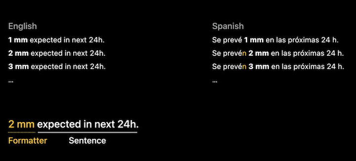

# [**Build global apps: Localization by example**](https://developer.apple.com/videos/play/wwdc2022/10110/)

### **Translation**

Localization in Swift code

```
let windPerceptionLabelText = String(
    localized: "Wind is making it feel cooler", 
    comment: "Explains the wind is lowering the apparent temperature"
)
```

* Make sure to use multiple strings for English words that are used in multiple places, if they are used in different contexts
	* An English word like "archive" that can be a noun and a verb might translated differently for each instance in other languages
* New API added tot he string initializer, which takes a default value (which can be used for the English string)
* Check out [**Streamline your localized strings**](https://developer.apple.com/videos/play/wwdc2021/10221/) session from WWDC 2021

```
let filter = String(localized: "Archive.label",
                 defaultValue: "Archive", 
                      comment: "Name of the Archive folder in the sidebar")

let filter = String(localized: "Archive.menuItem",
                 defaultValue: "Archive", 
                      comment: "Menu item title for moving the email into the Archive")
```

* Also make sure to use two different strings for use cases that can have multiple interpretations
	* For instance, the top example below works well with "my location" or a specific city in English, but would fail in some other languages to fit both cases

```
String(localized: "Show weather in \(locationName)", 
       comment: "Title for a user activity to show weather at a specific city")

String(localized: "Show weather in My Location",
       comment: "Title for a user activity to show weather at the user's current location")
```

**Comments**

* Very important for translators to give context
* Explains what interface element the string is shown in (e.g. label, button)
* The context of the UI element and where it is shown on screen (e.g. section header, context menu, user activity)
* What each variable's value is at runtime - important for matching the grammar of the sentence

**Localized remote content**

* Some content comes from a server
* Server can send an array of supported languages to the app
	* Should be an array of language IDs
* The device knows which languages the user prefers, so you don't have to check and compare them yourself
* Use `Bundle.preferredLocalizations` to match candidate languages sorted by how closely they match the user's language choices
	* First one is usually the best candidate
* That language should be used for any subsequent requests to the server


* Don't implement pluralization yourself - depending on the language, the rules get more and more complex
* Instead, use the top code below and include a `stringsdict` file, which encodes the plural rule
* Another option is to make use of Automatic Grammar Agreement (second example below)
* Check out [**Streamline your localized strings**](https://developer.apple.com/videos/play/wwdc2021/10221/) session from WWDC 2021

```
String(localized: "\(amountOfRain) in last \(numberOfHours) hour",
         comment: "Label showing how much rain has fallen in the last number of hours")

String(localized: "\(amountOfRain) in last ^[\(numberOfHours) hour](inflect: true)",
         comment: "Label showing how much rain has fallen in the last number of hours")
```

Don't always apply plural rules to all your strings

```
if selectedCount == 1 {
    return String(localized: "Remove this city 
                              from your favorites")
} else {
    return String(localized: "Remove these cities 
                              from your favorites")
}
```


---

### **Formatters**

If there is a unit in the sentence (e.g. hours, inches, liters, etc.), you want to use a formatter to do the localization

* Will correctly place the proper percent symbol before or after the number
* Accommodates for the user's preferred numbering system

```
let humidity = 54

// In a SwiftUI view
Text(humidity, format: .percent)

// In Swift code
humidity.formatted(.percent)
```

* Swift includes many different kinds of formatters
* Check out the [**Formatters: Make data human-friendly**](https://developer.apple.com/videos/play/wwdc2020/10160/) session from WWDC 2020


```
date.formatted(
    .dateTime.year()
    .month()   
) // Jun 2022

whatToExpect.formatted()
// New features, exciting API, and advanced tips

amountOfRain.formatted(
    .measurement(
        width: .narrow,
        usage: .rainfall)) // 12mm

(date...<later).formatted(
    .components(
        style: .wide
    )
) // 24 minutes, 18 Seconds

date.formatted(
    .relative(
        presentation: 
            .numeric
    )
) // 2 minutes ago

let components = PersonNameComponents()
…
nameComponentsFormatter
    .string(from: components)
// Andreas Neusüß or 田中陽子

excitementLevel.formatted(
    .number
    .precision(
        .fractionLength(2)
    )
) // 1,001.42

price.formatted(
    .currency(
        code: "EUR"
    )
) // $20.99

distance.formatted(
    .measurement(
        width: .wide,
        usage: .road)
) // 500 feet

bytesCopied.formatted(
    .byteCount(
        style: .file
)) // 42.23 MB
```

**Combine a Formatter with text**

Sometimes we need to combine a formatter with localized text

* Declare a function that takes a parameter about how much the precipitation will be in millimeters
* Get a preferred unit length based on locale, and convert the millimeter value to the preferred unit
* Use the formatting api to produce a formatted string for the value
	* The preferredUnit already has the information that we want to display rainfall. So when formatting, we set the usage to asProvided
	* If more than 1 millimeter or inches of rain will fall, we want to use the plural case
* Round the value to an integer
* Load a localized String with a given key, and provide a default value as well
	* use String Interpolation to include the integerValue, the formattedValue, and the number 24
		* the final number will always be 24, so we can provide it in code - but it will still be localized



```
func expectedPrecipitationIn24Hours(for valueInMillimeters: Measurement<UnitLength>) -> String {
    // Use user's preferred measures
    let preferredUnit = UnitLength(forLocale: .current, usage: .rainfall)

    let valueInPreferredSystem = valueInMillimeters.converted(to: preferredUnit)

    // Format the amount of rainfall
    let formattedValue = valueInPreferredSystem
        .formatted(.measurement(width: .narrow, usage: .asProvided))

    let integerValue = Int(valueInPreferredSystem.value.rounded())

    // Load and use formatting string
    return String(localized: "EXPECTED_RAINFALL", 
               defaultValue: "\(integerValue) \(formattedValue) expected in next \(24)h.", 
                    comment: "Label - How much precipitation (2nd formatted value, in mm or Inches) is expected in the next 24 hours (3rd, always 24).")
}
```

For the above example, the key is declared in a `stringsdict` file

* In English, we don't need to vary the string for plural, so we use the category `other`
* In Spanish, we do need to specify different strings for singular and plural

English | Spanish
------- | -------
 | 

---

### **Swift Packages**

* When defining a Swift package, you can use `defaultLocalization` to declare that the content is using English as primary language
	* Xcode now reads that parameter and recognizes that you are interested in providing a localized experience
	* Xcode will add the option to Export Localizations to the Product menu (this now also works for Swift packages)
		* Exports `.xcloc` files to send to translators
		* Import localizations to put localizations back into the package
	* Loading a string in a swift package requires that you specify the `bundle` argument
* Check out [**Swift packages: Resources and localization**](https://developer.apple.com/videos/play/wwdc2020/10169/) session from WWDC 2020

```
let package = Package(
    name: "FoodTruckKit",

    defaultLocalization: "en",

    products: [
       .library(
            name: "FoodTruckKit",
            targets: ["FoodTruckKit"]),
    ],
    …
)

let title = String(localized: "Wind",
                      bundle: .module, 
                     comment: "Title for section that
                               shows data about wind.")
```

* Library authors should:
	* Localize your Swift Package
	* Advertise supported languages
* App developers should:
	* Ensure that dependencies are localized
	* Test your app in all languages

---

### **Layout and SwiftUI**

* Most of the time a translated string is longer or shorter than the English equivalent
	* This affects the layout of your app
	* Different symbols might be used
	* May be right-to-left language
		* Check out [**Get it right ... to left**](https://developer.apple.com/videos/play/wwdc2022/10107/) session


Heights of labels adjust automatically to accommodate for languages with taller scripts


Labels will grow horizontally with a longer translation - but Grids can help with this

* Declare a `Grid` with a leading alignment
	* Will adjust for left-to-right or right-to-left
* Add a `GridRow` for each horizontal group
* Finally, declare the contents for the row
* SwiftUI handles all the measuring, sizing, and positioning of the views


```
// Requires data types "Row" and "row" to be defined

struct WeatherTestView: View {
    var rows: [Row]
    var body: some View {
        Grid(alignment: .leading) {
            ForEach(rows) { row in
                GridRow {
                    Text(row.dayOfWeek)
                    
                    Image(systemName: row.weatherCondition)
                        .symbolRenderingMode(.multicolor)
                    
                    Text(row.minimumTemperature)
                        .gridColumnAlignment(.trailing)
                    
                    Capsule().fill(Color.orange).frame(height: 4)
                    
                    Text(row.maximumTemperature)
                }
                .foregroundColor(.white)
            }
        }
    }
}
```

`ViewThatFits` will help when translations are too large to keep in the same layout

* [**Compose custom layouts with SwiftUI**](Compose custom layouts with SwiftUI.md) session


