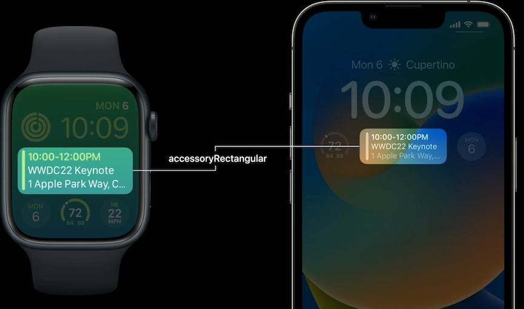
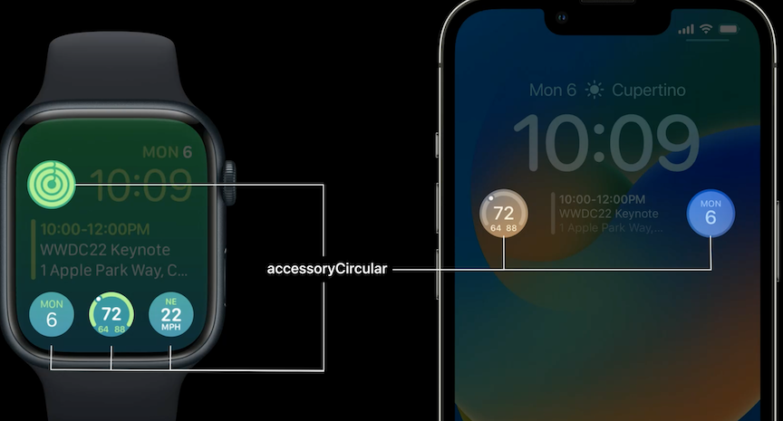
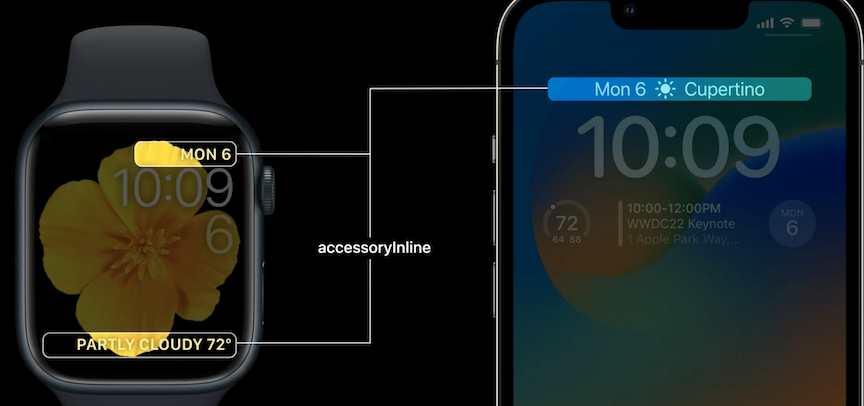
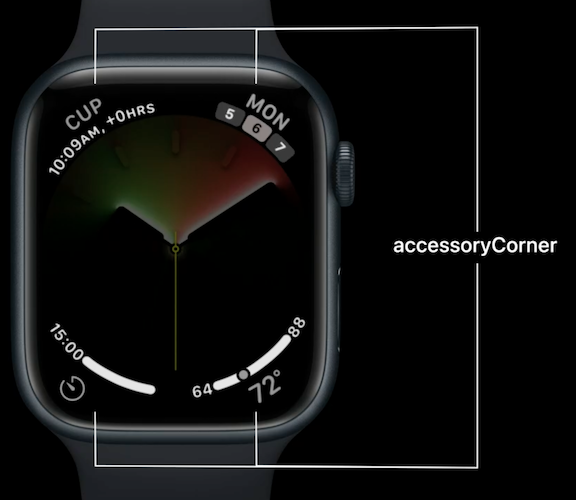
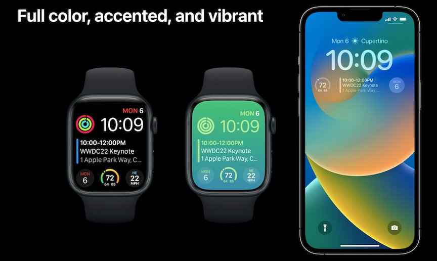
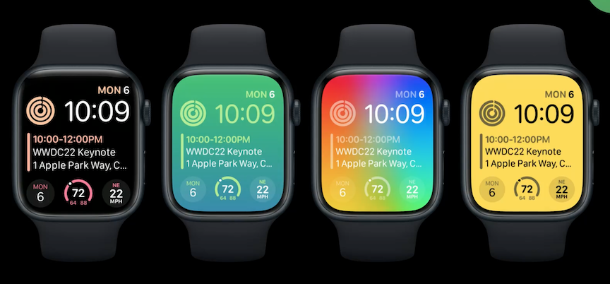
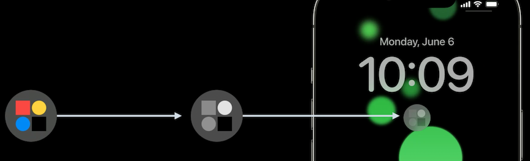
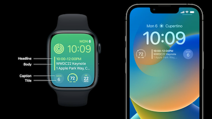
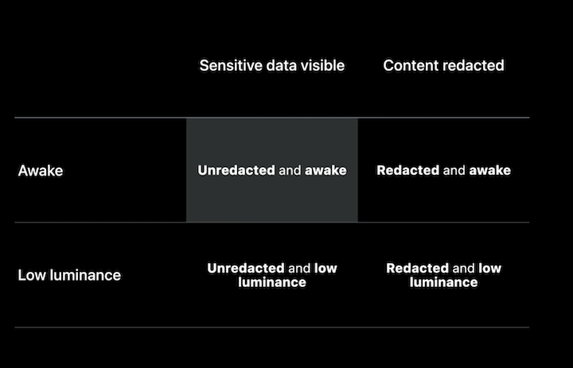

# [**Complications and widgets: Reloaded**](https://developer.apple.com/videos/play/wwdc2022/10050/)

I sure hope this is better than `The Matrix: Reloaded`...

### **Complication timeline**

* Third-party complications introduced in watchOS 2
* Graphic complications in watchOS 5
* SwiftUI complications and multiple complications in watchOS 7
* Now, complications have been remade with WidgetKit, allowing widgets to be shared between iOS and watchOS

New WidgetFamily families, prefixed with the word `accessory`

```
public enum WidgetFamily {
	case accessoryCircular
	case accessoryRectangular
	case accessoryInline

	// watchOS only
	case accessoryCorner
}
```

accessoryRectangular | accessoryCircular
-------------------- | -----------------
 | 
--------------- | ---------------
accessoryInline | accessoryCorner
--------------- | ---------------
 | 

Watch [**Go further with WidgetKit complications**](https://developer.apple.com/videos/play/wwdc2022/10051/) session for more information on

* WidgetKit complications
* Corner and Bezel complications
* Migrating from ClockKit

---

### **Colors**

Three different widget rendering modes:

* Full color
* Accented
* Vibrant


```
VStack(alignment: .leading) {
    Text("Headline")
        .font(.headline)
        .widgetAccentable()
    Text("Body 1")
    Text("Body 2")
}.frame(maxWidth: .infinity, alignment: .leading)
```


```
public struct WidgetRenderingMode {
	static var fullColor: WidgetRenderingMode
	static var accented: WidgetRenderingMode
	static var vibrant: WidgetRenderingMode
}

struct MyWidgetView : View {
	@Environment (\.widgetRenderingMode) var renderingMode

	var body: some View {
		switch renderingMode {
			...
		}
	}
}
```

In full color mode on watchOS, your content is displayed exactly as you specify

In accented mode, your views are split into two groups, and colored independently

* The two coloring groups are flatly colored, preserving only their original opacities
* Tell the system how to group your views with the `.widgetAccentable()` view modifier,
* or switch out your content based on the Widget Rendering Mode environment value to look perfect when flattened
* System can tint your content in a number of ways, some of which are inverted

```
VStack(alignment: .leading) {
	Text("Headline")
		.font(.headline)
		.widgetAccentable()
	Text("Body 1")
	Text("Body 2")
}.frame (maxWidth: .infinity, alignment: .leading)
```



In the iOS vibrant rendering mode, content is desaturated and colored appropriately for the lock screen background

* System maps your grayscale content into a material appearance
* Material is adaptive to the content behind it
* Lock screen can be configured to give the vibrant rendering mode a colored tint
	* A light source color ends up mostly opaque and vibrant
	* A dark source color appears as a less prominent blur of the background behind it, with only a slight amount of brightening
	* Avoid using transparent colors in this mode. Instead, use darker colors or black to represent less prominent content while maintaining legibility



**AccessoryWidgetBackground**

Gives consistent backdrop to widgets that need them

* Takes on different appearances in the various widget rendering modes
* Tuned by the system to look right for the style of the face or Lock Screen
* Soft transparent view in full color and accented, black in the vibrant environment (which results in a low brightness and full blur)

```
ZStack {
     AccessoryWidgetBackground()
     VStack {
        Text("MON")
        Text("6")
         .font(.title)
    }
}
```

---

### **Project Setup**

When adding a widget to a project, add the `Widget Extension` target to your project

* Already existed on iOS, new for watchOS

This section will build on the `Emoji Rangers` project from the [**Widgets Code-along**](https://developer.apple.com/videos/play/wwdc2020/10034/) sessions from WWDC 2020

* App tracks favorite emoji rangers
* Keeps you up-to-date with their health/recharge time with home screen widgets
* Already brought over to watchOS
* Extending it with support for new widget families, and bringing its widget extension to the watch

1. Add new watchOS target by duplicating iOS target
2. rename it
3. change bundle identifier to be prefixed with the watch app
4. target watchOS
5. Embed it in the watch app

Next, we look at the `EmojiRangerWidgetCode`

* Already supports widgets
* Uses `IntentTimelineProvider`, which is used when the system reloads content
* The `View` for the widget uses SwiftUI to generate content for the different families
* The `WidgetConfiguration`
* The Xcode `PreviewProvider`

The `WidgetConfiguration` already supports the `.systemSmall` and `.systemMedium` families, we want to add the new families

* Can add Circular, Rectangular, and Inline for all platforms, but...
* Need to use a platform macro to specify platform families to add watchOS specific widgets
* Can also use a platform macro for Previews

```
public var body: some WidgetConfiguration {
	IntentConfiguration(kind: kind, intent:
		DynamicCharacterSelectionIntent.self, provider: Provider()) { entry in
			EmojiRangerWidgetEntryView(entry: entry)
		}
		.configurationDisplayName("Ranger Detail")
		.description ("See your favorite ranger.")

#if os (watchos)
		.supportedFamilies([.accessoryCircular, .accessoryRectangular, .accessoryInline])
#else
		.supportedFamilies([.accessoryCircular, .accessoryRectangular, .accessoryInline, .systemSmall, .systemMediuml)
#endif
	}
}
```

**IntentRecommendation API**

* Need to implement this before we can successfully build for watchOS
* Intents are fully configurable on iOS, on watchOS we must provide a preconfigured list
* We do this by overriding the new recommendations method on IntentTimelineProvider

```
public protocol IntentTimelineProvider {
	...
	
	associatedtype Intent: INIntent
	
	func recommendations() -> [IntentRecommendation<Intent>]
	
	...
}


struct Provider: IntentTimelineProvider {
	...
	
	func recommendations() -> [IntentRecommendation<DynamicCharacterSelectionIntent>] {
		return recommendedIntents()
			.map { intent in
				return IntentRecommendation(intent: intent, description: intent.hero!.displayString)
			}
	}
	
	...
}
```

---

### **Making glanceable views**

The content intended for even a small widget doesn't fit well inside the new form factor, so we will specify it directly for `.accessoryCircular`

* We want to put a progress view in there, but this has a problem
	* Animating this progress view to be current will require a lot of timeline entries in short succession
	* We can use SwiftUI's new auto-updating ProgressView
		* It takes a date interval over which our Ranger will be fully healed
		* The system will keep our progress view updated, meaning we only need one timeline entry here.

```
struct EmojiRangerWidget EntryView: View {
	...
	
	@ViewBuilder
	var body: some View {
		switch family {
			case .accessoryCircular:
				ProgressView(interval: entry.character.injuryDate...entry.character.fullHealthDate,
								countdown: false,
								label: { Text(entry.character.name) },
								currentValueLabel: {
					Avatar(character: entry.character, includeBackground: false)
				})
				.progressViewStyle(.circular)
				
			...
		}
	}
}
```

Now we add `.accessoryRectangular`

* We have more space, can make a three line view
* We'll use an auto-updating date field for the time until healed

```
			...
			case .accessoryRectangular:
				HStack(alignment: .center, spacing: 0) {
					VStack(alignment: .leading) {
						Text(entry.character.name)
							.font(.headline)
							.widgetAccentable()
						Text("Level \(entry.character.level)")
						Text(entry.character.fullHealthDate, style: .timer)
					}.frame(maxWidth: .infinity, alignment: .leading)
					Avatar(character: entry.character, includeBackground: false)
				}
			...
```

Default parameters and making use of font styles is important

* iOS uses the regular text design
* watchOS uses a rounded design with a heavier weight
* Your widgets and complications will sit onscreen adjacent to others. So they look consistent, the recommendation is to use font styles Title, Headline, Body, and Caption



Now to add `.accessoryInline`

* Displays a line of text and optionally an image
* Note that inline accessories are drawn according to system-defined coloring and font
* At first, our text is too long for the watch slot, so we can use ViewThatFits to resolve this
	* Will choose the first content view that fits the available space w/o truncation or clipping
	* Refer to [Compose custom layouts with SwiftUI](Compose custom layouts with SwiftUI.md) session for more on this

```
ViewThatFits {
	Text("\(entry.character.name) is resting, combat-ready in \(entry.character.fullHealthDate, style: .relative)")
	Text("\(entry.character.name) ready in \(entry.character.fullHealthDate, style: .timer)")
	Text("\(entry.character.avatar) \(entry.character.fullHealthDate, style: .timer)")
}
```

---

### **Privacy**

Privacy states



You can support the always-on watch (and perhaps soon iPhone?) experience like this:

```
@Environment(\.isLuminanceReduced)
var isLuminanceReduced

var body: some View {
    if isLuminanceReduced {
        Text("🙈").font(.title)
    } else {
        Text("🐵").font(.title)
    }
}
```

To redact sensitive information, you can use the `.privacySensitive` modifier to mark only some views as redacted

```
VStack(spacing: -2) {
    Image(systemName: "heart")
        .font(.caption.bold())
        .widgetAccentable()
    Text("\(currentHeartRate)")
        .font(.title)
        .privacySensitive()
}
```