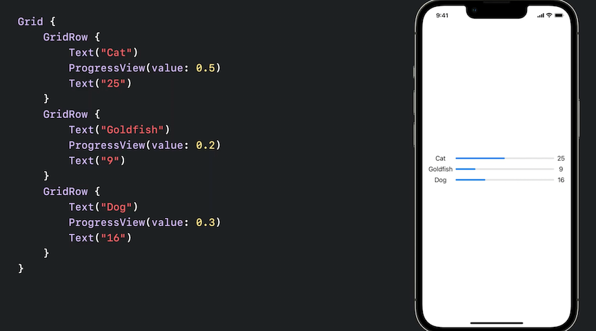
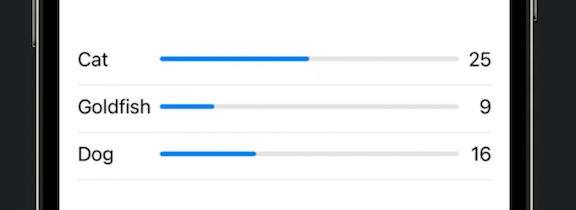
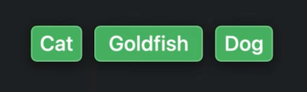
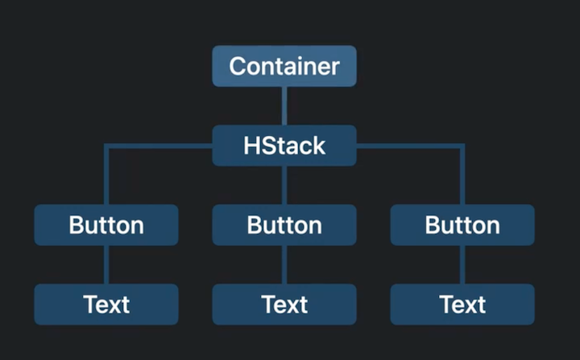
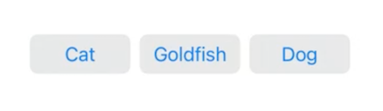
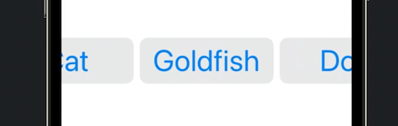
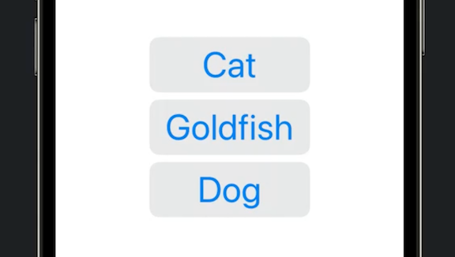
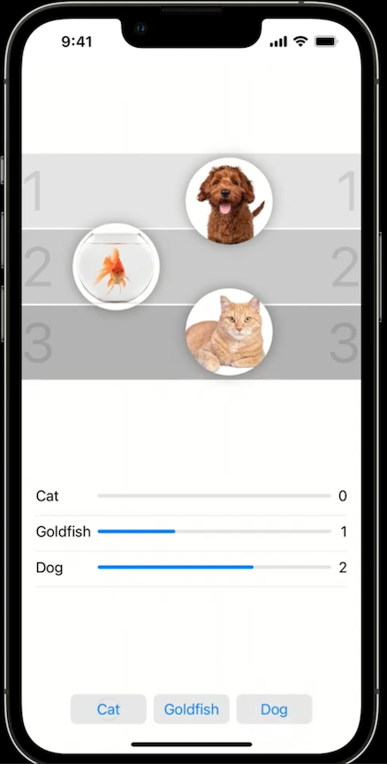

# **Compose custom layouts with SwiftUI**

### **Grid**

Want to make a view that does the following:

1. Three columns
2. First column is leading aligned
3. Last column is trailing aligned
4. First and last column are as wide as they need to be to fit the largest item
	* accounts for localization, one row being wider than another, dynamic type

An initial attempt yields some of what we want (points 1 and 4 above), but not others



Fixes to get what we want in ponts 2 and 3:

* We give our Grid an alignment to handle point 2 `Grid(alignment: .leading)`
* We specify our third column as having a trailing alignment `.gridColumnAlignment(.trailing)
* As a bonus, we put a divider line between each element vertically with `Divider().gridCellColumns(3)`
	* We could have also just used `Divider()` below instead of putting the divider inside of `GridRow`

```
// Data model
struct Pet: Identifiable, Equatable {
	let type: String
	var votes: Int = 0
	var id: String { type }
	
	static var exampleData: [Pet] = [
		Pet(type: "Cat", votes: 25),
		Pet(type: "Goldfish", votes: 9),
		Pet(type: "Dog", votes: 16)
	]
}

struct buttonsGrid: some View {
	@State private var pets: [Pet] = Pet.exampleData
	
	var body: some View {
		Grid(alignment: .leading) {
			ForEach(pets) { pet in
				GridRow {
					Text(pet.type)
					ProgressView(
						value: Double(pet.votes),
						total: Double(totalVotes))
					Text("\(pet.votes)")
						.gridColumnAlignment(.trailing)
				}
				GridRow {
					Divider().gridCellColumns(3)
				}
			}
		}
	}
}
```



---

### **Layout**

We want to make a row of buttons that meet the following requirements:

* Three buttons in a row
* We don't want the buttons to be sized to their text - we want equal sized buttons
* We don't want the buttons to grow to the size of their container

An initial attempt with an HStack, we get:

```
HStack {
	ForEach (Spets) { $pet in
		Button {
			pet.votes += 1
		} label: {
			Text(pet.type)
		}
	}
}
```



The layout hierarchy is doing the following:
1. The stack's container proposes a size to the stack
2. The stack proposes a size to the three buttons
3. Each button passes that size through to its text label
4. The text views calculate the size they want based on the string, and reports that to the button
5. The button reports that size back to the stack
6. The stack sizes itself with that info and places the buttons
7. The stack passes that size back to the container



We could simply put `.frame(maxWidth: .infinity)` on each `Text` item, but then the stack would expand to fill all the space available, whih would violate requirement 3

We need to do more (we will still use the maxWidth property on the Text views frames). We will use the `Layout` protocol

* Two required methods:
	* `sizeThatFits`
		* takes a `ProposedViewSize`, `subviews`, and `cache` input
		* cannot access the subviews directly, this is a collection of proxies
	* `placeSubviews`
		* use this to tell the subviews where to appear
		* takes `bounds`, `ProposedViewSize`, `subviews`, and `cache` input
			* Don't rely on `bounds` to start at (0, 0) - use `.minX` and `.minY` instead
	* `cache` is most often not needed, but can be used to optimize your view
		* used to share the results of intermediate calculations among method calls

**View Spacing**

Spacing between views needs to be accounted for:

* All views have spacing preferences that indicate the amount of space a view prefers to have between itself and the next view.
	* These preferences are stored in a ViewSpacing instance that's available to layout containers
	* The view might prefer different values on different edges, even different values for different kinds of adjacent views
	* Values can vary by platform as well
	* A built-in stack (e.g. HStack) ignores these when you use custom spacing
	* preferences on two adjacent views might have different spacing to each other. By default, SwiftUI uses the larger value

```
struct MyEqualWidthHStack: Layout {
	func sizeThatFits(proposal: ProposedViewSize,
						subviews: Subviews,
						cache: inout Void) -> CGSize {
		let maxSize = maxSize(subviews: subviews)
		
		let spacing = spacing (subviews: subviews)
		let totalSpacing = spacing.reduce(0) { $0 + $1 }

		return CGSize(
			width: maxsize.width * CGFloat(subviews.count) + totalSpacing,
			height: maxsize.height)
	}
	
	func placeSubviews(in bounds: CGRect,
						proposal: ProposedViewSize,
						subviews: Subviews,
						cache: inout Void) -> CGSize {
		let maxSize = maxSize(subviews: subviews)
		let spacing = spacing (subviews: subviews)

		let sizeProposal = ProposedViewSize(
			width: maxSize.width,
			height: maxSize.height)
			var x = bounds.minX + maxSize.width / 2
			
		for index in subviews.indices {
			subviews[index].place(
				at: CGPoint (x: x, y: bounds.midY),
				anchor: .center,
				proposal: sizeProposal)
			x += maxSize.width + spacing[index]
		}
	}
	
	func maxSize(subviews: Subviews) -> CGSize {
		let subviewSizes = subviews.map { $0.sizeThatFits(.unspecified) }
		let maxSize: CGSize = subviewSizes.reduce(.zero) { currentMax, subviewSize in CGSize(
			width: max (currentMax.width, subviewSize.width),
			height: max(currentMax.height, subviewSize.height))
		return maxSize
	}
	
	func spacing(subviews: Subviews) -> CGSize {
		let spacing = subviews.indices.map { index in
			guard index < subviews.count - 1 else { return 0 }
			return subviews[index].spacing.distancel
			to: subviews[index + 1].spacing,
			along: .horizontal)
		}
		return spacing
	}
}

MyEqualWidthHStack{
	ForEach ($pets) { $pet in
		Button {
			pet.votes += 1
		} label: {
			Text(pet.type)
				.frame(maxWidth: .infinitv)
		}
		.buttonStyle(.bordered)
	}
}
```



Why don't we just use GeometryReader?

* Geometry reader is used to measure view sizes, but it only measures its container view and report that size to its subview
* The information only flows downward - it does not effect the layout of its own container
* This example requires the Text in the Button subviews to affect the size of the root container
	* Attempting to send this information back up the stack can result in a layout loop

---

### **ViewThatFits**

Let's do a little refactoring:

* Put buttons into their own subview
* See what happens when we set a larger dynamic type value

```
MyEqualWidthHStack {
	Buttons (pets: $pets)
}
.environment(\.dynamicTypeSize, .accessibility3)

struct Buttons: View {
	@Binding var pets: [Pet]
	var body: some View {
		ForEach ($pets) { $pet in
			Button {
				pet.votes += 1
			} label: {
				Text(pet.type)
					.frame (maxWidth: .infinity)
			}
			.buttonStyle(.bordered)
		}
	}
}
```



`ViewThatFits` to the rescue!

* Will choose the view that fits best within it
	* for the code below, a `MyEqualWidthVStack` class was created (but not shown) to make the buttons equal width. It closely resembles the `MyEqualWidthHStack` code
	* If the dynamic type size override was removed, `ViewThatFits` would automatically go back to the `MyEqualWidthHStack` implementation

``` 
ViewThatFits {
	MyEqualWidthHStack{
		Buttons (pets: $pets)
	}

	MyEqua1WidthvStack {
		Buttons (pets: Spets)
	}
}
.environment(\.dynamicTypeSize, .accessibility3)
```



---

### **AnyLayout**

Want to build a view that meets the following requirements:

1. Show views in a circular arrangement
2. Rotates views according to rankings

We will do the following in our `Layout` protocol methods:

* For `sizeThatFits`, we want to return the size that the container view proposes
	* use `replacingUnspecifiedDimensions()` to convert that proposal to a concrete value (this handles nil values)
* For `placeSubviews`, offset each subview from the middle by a radius based on the size of the layout region and apply a rotation
	* apply an offset as well to reflect the rankings

But how do we apply the rankings? We can only access the subview proxies, not the views (or the data model)

* LayoutProtocol lets you stores values on each subview and read them from inside the layout protocol methods
	* Create a new type that conforms to `LayoutValueKey` Protocol and give it a default value
		* the default value establishes the associated value's type
	* Create a convenience value on view to set the value using `layoutValue(key: ..., value: ...)`

```
private struct Rank: LayoutValuekey {
	static let defaultValue: Int = 1
}

extension View {
	func rank( value: Int) -> some View {
		layoutValue(key: Rank.self, value: value)
	}
}

struct MyRadialLayout: Layout {
	func sizeThatFits(proposal: ProposedViewSize,
						subviews: Subviews,
						cache: inout Void) -> CGSize {
		return proposal.replacingUnspecifiedDimensions()
	}
	
	func placeSubviews(in bounds: CGRect,
						proposal: ProposedViewSize,
						subviews: Subviews,
						cache: inout Void) -> CGSize {
		// Calculate radius and angle

		let ranks = subviews.map { subview in
			subview[Rank.self]
		}
		let offset = getOffset (ranks)

		for (i, subview) in subviews.enumerated() {
			var point = CGPoint (x: 0, y: -radius)
				.applying (CGAffineTransform(rotationAngle: baseAngle * Double(i) + offset))
			
			point.x += bounds.midX
			point.y += bounds.midy

			subview.place(at: point, anchor: .center, proposal: .unspecified)
	}
}

MyRadialLayout{
	ForEach(pets) { pet in
		Avatar(pet: pet)
			.rank(rank(pet))
	}
}
```

This handles any ranking other than one: what if we have a three-way tie?

* This is where `AnyLayout` helps us out
	* We can transition to an HStack when we have a three-way tie
	* `AnyLayout` lets you apply different layouts to a single view hierarchy so you maintain the identity of the views when you transition from one layout type to another
	* You can use an animation to transition between different layout sets with `•animation(.default, value: ...)`

```
let layout = isThreeWayTie ? AnyLayout(HStack()) : AnvLayout(MyRadialLayout())

layout {
	ForEach(pets) { pet in
		Avatar(pet: pet)
			.rank(rank(pet))
	}
}
.animation(.default, value: pets)
```



