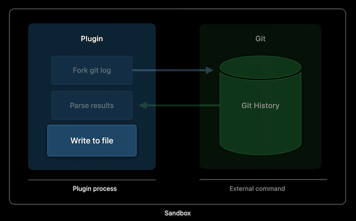
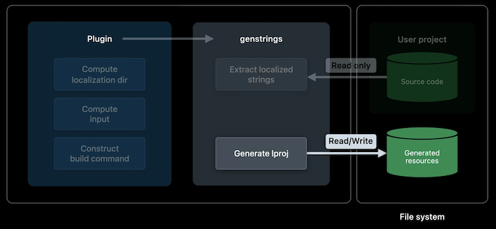

# [**Create Swift Package plugins**](https://developer.apple.com/videos/play/wwdc2022/110401/)

### **What is a package plugin?**

Swift code that uses the PackagePlugin API, similar to a package manifest. Plugins can extend the functionality of Xcode or the Swift Package Manager through well-defined extension points

How package plugins work:

* Xcode will compile and run your plugin
	* Uses information about available executables and input files to construct commands
* Plugin communicates back to Xcode in order to execute them as needed

What a package plugin can do:

* Create custom build tasks
	* Generate source code
	* Generate resource files
* Add custom commands to SwiftPM's command line interface or menu items to Xcode
* [**Meet Swift Package plugins**](./Meet%20Swift%20Package%20Plugins.md) session
* [**Creating Swift Packages**](https://developer.apple.com/videos/play/wwdc2019/410/) session from WWDC 2019

---

### **Custom commands**

Example plugin: add a text file that lists all the contributors to the project



* Create the directory structure of the plugin
	* Create a top level folder named `Plugins` as a sibling to Tests and Sources
	* Create a subfolder inside that with the package plugin name
	* In that subfolder add a new Swift file named `plugin.swift`
* In `Package.swift`, make sure the `swift-tools-version` is at least 5.6
	* Add the plugin target to `Package.swift` as well (see code below)
		* `name` points to the folder and also provides the menu item name in Xcode
		* Specify what type of extension point we want to use in `capability` - in this case, a custom `command`
		* `intent` can define a verb for the SwiftPM command line as well as a description of what the plugin does
		* `permissions` declare what permissions the plugin requires
			* Reason string will be presented to user of the plugin

```
// MARK: Plugins

        .plugin(
            name: "GenerateContributors",
            capability: .command(
                intent: .custom(verb: "regenerate-contributors-list",
                                description: "Generates the CONTRIBUTORS.txt file based on Git logs"),
                permissions: [
                    .writeToPackageDirectory(reason: "This command write the new CONTRIBUTORS.txt to the source root.")
                ]
            )),
```

In the plugin source file:

* Import `PackagePlugin` to get access to the API to generate plugins
* Conform the struct to `CommandPlugin`
	* Accept the fix-it to get the missing stubs for implementing the protocol
* Mark the struct as @main since it will be the main function of the plugin executable
* `performCommand` is the entry point for the command, and it receive two arguments
	* `context` - gives access to the resolved package graph and other information about the context we are being executed in
	* `arguments` - custom commands are invoked by the user, so they can provide input in the form of arguments
* Import `Foundation` to use the Process API to shell out to Git
* Define a process instance and set it to execute Git log with some formatting arguments
* Once the process has finished, read all the data from the pipe and convert it to a string
* Remove duplicates, and write to a file

```
import PackagePlugin
import Foundation

@main
struct GenerateContributors: CommandPlugin {

    func performCommand(context: PluginContext, arguments: [String]) async throws {
        let process = Process()
        process.executableURL = URL(fileURLWithPath: "/usr/bin/git")
        process.arguments = ["log", "--pretty=format:- %an <%ae>%n"]

        let outputPipe = Pipe()
        process.standardOutput = outputPipe
        try process.run()
        process.waitUntilExit()

        let outputData = outputPipe.fileHandleForReading.readDataToEndOfFile()
        let output = String(decoding: outputData, as: UTF8.self)

        let contributors = Set(output.components(separatedBy: CharacterSet.newlines)).sorted().filter { !$0.isEmpty }
        try contributors.joined(separator: "\n").write(toFile: "CONTRIBUTORS.txt", atomically: true, encoding: .utf8)
    }
}
```

We can now run the command plugin

* Right click on the package in the sidebar
* Choose the `GenerateContributors` option that is now available in the context menu
* A dialog will appear to select the packages/targets to be the input for the plugin
	* In this case, just click on the top level package and click `Run GenerateContributors`
* We will be presented with the permissions dialog, based on what we put in the package manifest
* The `CONTRIBUTORS.txt` file appears in the sidebar 

---

### **Plugins in detail**

Permission model

* Packages in the sandbox, similar to the evaluation of the package manifest itself
* Network access and writing to non-temporary locations other than the plugin's own work directory is prohibited
* Custom commands can optionally declare that they'd like to write to the package's root directory
	* If you are wrapping an existing third-party tool, you may have to look into how to confine it to the sandbox model

Structure of build tool plugins

* Provide a description on which executables to run during a build
* Specify inputs and outputs
* Similar to creating run script phases in Xcode projects

Types of build tool plugins

* In-build command
	* Use when your tool has a defined set of outputs
	* Automatically be re-run by the build system if your outputs are out-of-date compared to your inputs
* Pre-build command
	* Use when you don't have a clear set of outputs
	* Runs at the start of every build
		* Be careful about doing expensive work in pre-build commands or come up with a custom strategy for caching results that's appropriate to your use case

---

### **In-build commands**

Next example: create a new library that encapsulates icons to share between different tools being worked on

* Put asset catalog in the subfolder for the plugin
* Add the required minimum targets to the package manifest

```
platforms: [
            .macOS("10.15"),
            .iOS("12.0"),
            .tvOS("12.0"),
            .watchOS("6.0"),
        ],
```

* Add a basic SwiftUI view and preview
	* Uses the media assets we added previously

```
import SwiftUI

struct ContentView: View {
    var body: some View {
        Image("Xcode", bundle: .module)
            .resizable()
            .frame(width: 200.0, height: 200.0)
    }
}

struct ContentView_Previews: PreviewProvider {
    static var previews: some View {
        ContentView()
    }
}
```

In-build commands work a little different from custom commands in that they're providing a description of executables to run as well as their inputs and outputs.

* The executables can be provided by the system, third party packages, or can be created tailor-made for a plugin (take the third approach for this plugin)
* Plugins get run at the start of the build process in order to participate in computing the build graph
	* Executables get scheduled as part of build execution
* Back to the executable being built, we want to have a compile-time constant for each image in an asset catalog so that
	* Instead of needing to remember the correct strings for each image, we'll get them autocompleted as Swift symbols
	* Want to loop over the directory contents of the asset catalog to find all the image sets. For each image set parse its metadata to determine if it actually contains any images and should therefore get code generated for it
	* Then generate the code and write to a file
	* Since files were declared as outputs of the plugin, they will automatically be incorporated into the build of the target the plugin is being applied to

```
import Foundation

let arguments = ProcessInfo().arguments
if arguments.count &lt; 3 {
    print("missing arguments")
}
let (input, output) = (arguments[1], arguments[2]) // The first argument = path to the asset catalog, second = path provided by the plugin for our generated code

// Model objects for decoding contents.json
struct Contents: Decodable {
    let images: [Image]
}

struct Image: Decodable {
    let filename: String?
}

// Generated code by building out a string
var generatedCode = """
    import Foundation
    import SwiftUI
    
    """

// Loop over directory contents of the asset catalog to find image sets
try FileManager.default.contentsOfDirectory(atPath: input).forEach { dirent in
    guard dirent.hasSuffix("imageset") else {
        return
    }

    // Parse json
    let contentsJsonURL = URL(fileURLWithPath: "\(input)/\(dirent)/Contents.json")
    let jsonData = try Data(contentsOf: contentsJsonURL)
    let asset🐱alogContents = try JSONDecoder().decode(Contents.self, from: jsonData)
    
    // Check if there is a defined image for the image set
    let hasImage = asset🐱alogContents.images.filter { $0.filename != nil }.isEmpty == false

    // If the image set has an image, generate a SwiftUI image which loads that image from the package's bundle
    if hasImage {
        let basename = contentsJsonURL.deletingLastPathComponent().deletingPathExtension().lastPathComponent
        // Append string to generated code
        generatedCode.append("public let \(basename) = Image(\"\(basename)\", bundle: .module)\n")
    }
}

// Write generated code to a file
try generatedCode.write(to: URL(fileURLWithPath: output), atomically: true, encoding: .utf8)
```

To create the executable:

* Add a new folder inside `Sources` with the name `AssetConstantsExec`
* Add `main.swift` to that file (see code above)
* Declare the executable in the package manifest with `.executableTarget`
* Create a new `Plugins` folder
	* Add the `AssetConstants` subfolder
	* Add `plugin.swift` to that subfolder
* Add the plugin to the package manifest with `.plugin`

```
...
targets: [
	.target(
		name: "IconLibrary",
		dependencies: []),
		plugins: ["AssetConstants"]),
	.testTarget(
		name: "IconLibraryTests",
		dependencies: ["IconLibrary"]),
	.executableTarget(name: "AssetConstantsExec"),
	.plugin(name: "AssetConstants", capability: .buildTool(), dependencies: ["AssetConstantsExec"]),
	]
...	
```

Write the plugin in `plugin.swift`

* Conform struct to `BuildToolPlugin`
	* Must write the `createBuildCommand` function
		* Looks similar to `performCommand`, but instead of user arguments, we are giving a target here
		* This is the target that the plugin is being applied to, and the entry point will be called once per target that uses the given plugin
* This plugin will care particularly about source module targets, which are any targets which actually carry source files, in contrast to something like a binary target
	* To build up the array of build commands, we loop over all xcasset bundles in the target
	* Extract a string for the display name that will show up in the build log, as well as construct suitable input and output paths
	* Can also look up our executable here using the plugin API and then put our build command together

```
import PackagePlugin

struct AssetConstants: BuildToolPlugin {
	func createBuildCommands(context: PackagePlugin.PluginContext, target: PackagePlugin.Target) async throws -> [PackagePlugin.Command]
		guard let target = target as? SourceModuleTarget else {
			return []
		}

		return try target.sourceFiles(withSuffix: "xcassets").map { asset🐱alog in
			let base = asset🐱alog.path.stem
			let input = asset🐱alog.path
			let output = context.pluginWorkDirectory.appending(["\(base).swift"])

			return .buildCommand(displayName: "Generating constants for \(base)",
			                     executable: try context.tool(named: "AssetConstantsExec").path,
			                     arguments: [input.string, output.string],
			                     inputFiles: [input],
			                     outputFiles: [output])
		}
	}
}
```

---

### **Pre-build commands**

Next example:

* Automate some pre-build processing using the genstrings tool that ships with Xcode
	* The tool extracts localized strings from your code into a localization directory for further use
* Make the plugin a separate package so that it can be shared independently
* For more on resources and localization:
	* **Swift packages: Resources and localization** from WWDC 2020
	* **Localize your SwiftUI app** from WWDC 2021



Add plugin to `products` and `targets` in the package manifest

* Makes the plugin available to clients of a package instead of just privately

```
# // swift-tools-version: 5.6
import PackageDescription

let package = Package(
	name: "GenstringsPlugin",
	products: [
		.plugin(name: "GenstringsPlugin", targets: ["GenstringsPlugin"]),
	],
	targets: [
		.plugin(name: "GenstringsPlugin", capability: .buildTool()),
	]
)
```

Write the plugin code:

```
import Foundation
import PackagePlugin

@main struct GenstringsPlugin: BuildToolPlugin {
    func createBuildCommands(context: PluginContext, target: Target) async throws -> [Command] {
        guard let target = target as? SourceModuleTarget else {
            return []
        }

        let resourcesDirectoryPath = context.pluginWorkDirectory
            .appending(subpath: target.name)
            .appending(subpath: "Resources")
        let localizationDirectoryPath = resourcesDirectoryPath
            .appending(subpath: "Base.lproj")

        try FileManager.default.createDirectory(atPath: localizationDirectoryPath.string, withIntermediateDirectories: true)

        let swiftSourceFiles = target.sourceFiles(withSuffix: ".swift")
        let inputFiles = swiftSourceFiles.map(\.path)

        return [
	        .prebuildCommand(
	            displayName: "Generating localized strings from source files",
	            executable: .init("/usr/bin/xcrun"),
	            arguments: [
	                "genstrings",
	                "-SwiftUI",
	                "-o", localizationDirectoryPath
	            ] + inputFiles,
	            outputFilesDirectory: localizationDirectoryPath
	        )
	    ]
	}
}
```

Test the plugin out in a separate example package

* Create a new package from template. We'll add an API that provides a localized string to the package
* Add a use of that in the generated test

```
import Foundation

public func GetLocalizedString() -> String {
    return NSLocalizedString("World", comment: "A comment about the localizable string")
}


import XCTest
@testable import MyLibrary

final class MyLibraryTests: XCTestCase {
	func testExample() throws {
		// This is an example of a functional test case.
		// Use XCTAssert and related functions to verify your tests produce the correct
		// results.
		XCTAssertEqual (MyLibrary(). text, "Hello, \(GetLocalizedString())!")
	}
}
```

Next, add a path-based dependency on the plugin package in `Package.swift`

* Also add a use of the plugin to the library target

```
...
	dependencies: [
		.package(path: "../GenstringsPlugin"),
	],
	targets: [
		.target(
			name: "My Library",
			dependencies: [],
			plugins: [ .plugin(name: "GenstringsPlugin", package: "GenstringsPlugin"), ]),
		.testTarget(
			name: "MyLibraryTests",
			dependencies: ["MyLIbrary"]),
	]
...
```

Finally, change the code to use the resource bundle

* Run the test and look at the generated bundle, we will see the changes reflected there

```
public func GetLocalizedString() -> String {
    return NSLocalizedString("🌎", bundle: .module, comment: "A comment about the localizable string")
}
```