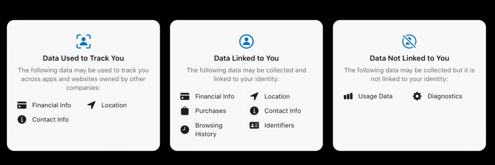
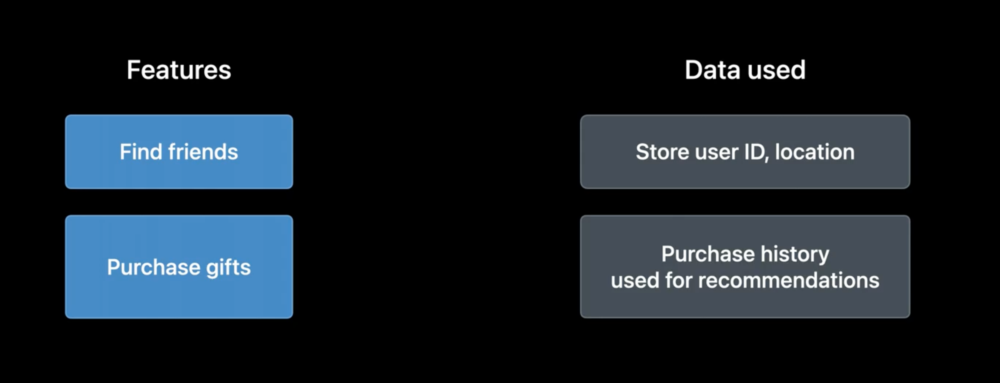
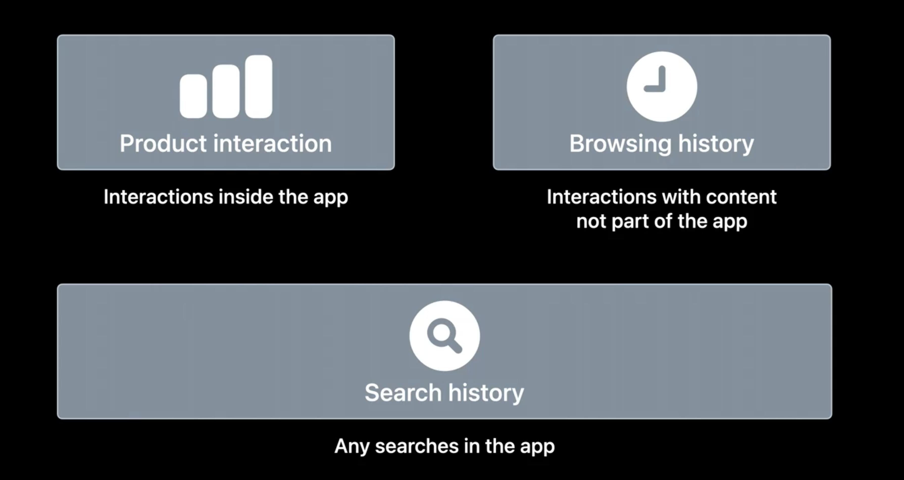

# [**Create your Privacy Nutrition Label**](https://developer.apple.com/videos/play/wwdc2022/10167/)

### **Label creation process**

Label creation process

* Create inventory of your app's features and data collection
* Enter information about app's privacy features into App Store Connect
* Update responses as necessary

**Questions asked**

* Categories of data collected
* Use cases for data
* Whether data is linked to identity
* Whether the data is used for tracking

**Inventory features**

* May be helpful to consult app stakeholders and documentation
* Use app privacy report to see what data is collected
* Review data stored server-side
	* including what systems have access to data
* You're responsible for your whole app, including SDKs
	* review SDK documentation

**Data minimization**

* Minimize data collection
* Use on-device processing where possible
* Storing data not linked to identity
* [**What's new in privacy**](What's new in privacy.md) session

To set your privacy information, use App Store Connect

* go to your app's page, and click on `App Privacy` on the left-hand side
* you'll first be asked about whether your app collects data
	* data is considered collected when it is transmitted off-device in a way where it's accessible for longer than it takes to process the request in real-time

**Collection**

* Declare collection for all features of the app
* Labels supplement a privacy policy/other disclosures or consent
* If you do collect data, you'll be asked what data you collect (e.g. name, email, phone, payment info, etc.)
* Can preview the label in process
* You'll be asked, for each type of collected data, you'll be asked:
	* what use cases the data collection supports
	* whether data is linked to a user's identity
		* considered linked to identity if it is associated with an account, device, or profile
	* whether each data typed is used for tracking purposes

**Tracking**

* Label reflects all potential use of data, including tracking with user permission
* Disclose data used for tracking on label
* Use App Tracking Transparency to request permission to track
	* [**Explore App Tracking Transparency**](https://developer.apple.com/videos/play/wwdc2022/10166/) session

You'll be able to preview and publish your label once you answer all questions. Labels are updated independent from app build updates.
* As you change how your app uses data, keep your label up to date
* As you use new sdks, add new features, or use collected data in new ways, evaluate whether your privacy label needs to change

---

### **Definitions and examples**

**IP Address**

* declare categories based on use
* e.g. if using to locate the user, declare `location`

**Product Interaction**

**Optional disclosure**

* Certain collection is optional to disclose
	* infrequent, optional, and independent from the app's functionality may be optional to disclose
	* Feedback/report a problem forms are possible examples
* Full details in developer documentation