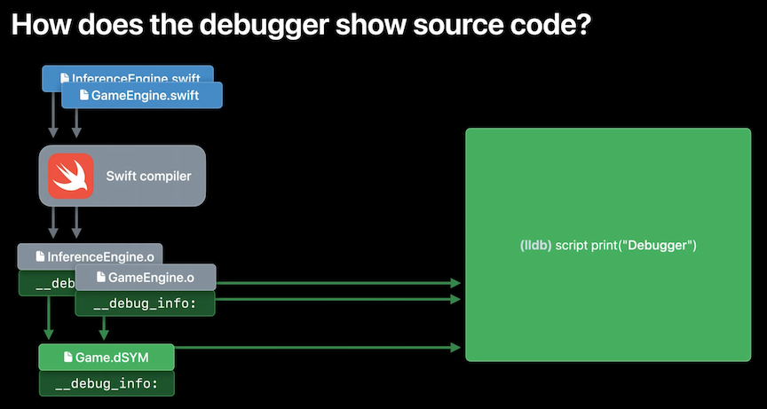
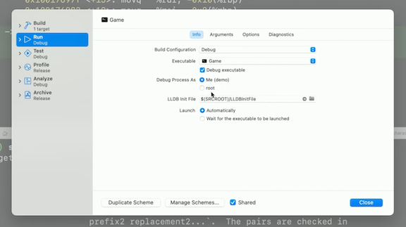
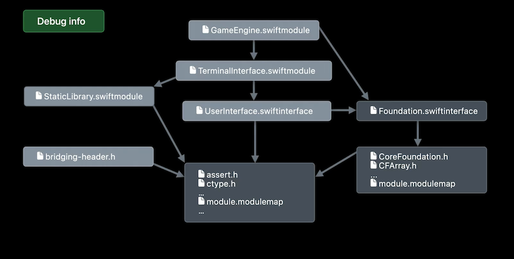
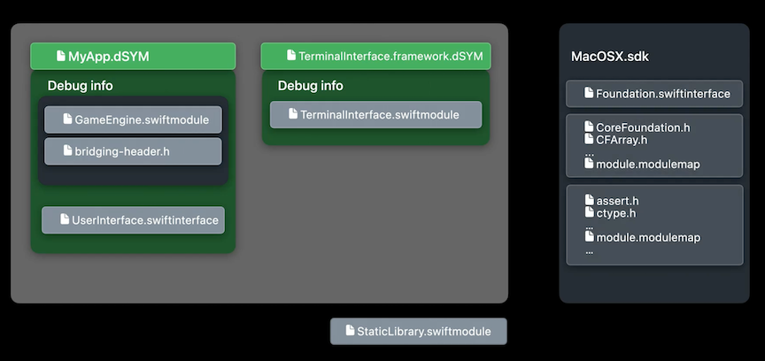

# **Debug Swift debugging with LLDB**

LLDB is the underlying debugging technology that ships with Xcode

* LLDB allows you to set breakpoints in your application, pause its execution, inspect the state of variables and objects, explore your code, and much more
* LLDB can help you understand what your code is doing and it enables you to find the point where the behavior of your code diverges from your expectation
* Learn more in the **Discover breakpoint improvements** #session from WWDC 2021

**How the debugger shows source code**

* When the compiler compiles a function, it generates machine code
* It leaves breadcrumbs for the debugger so an address in the executable can be mapped to a source file and line number and vice versa
	* These breadcrumbs are called debug info
	* On Apple platforms debug info is stored in object files. For archiving and distribution, debug info can be linked into .dSYM bundles
	* The debug info linker is called dsymutil
	* LLDB uses Spotlight to locate .dSYM bundles, so it's quite flexible in terms of where on disk they are

* `image list <framework>` can be used to verify that LLDB has actually found the dSYM for the framework
* `image lookup -va $pc` can be used to get more info about the current address
* `settings list target.source-map` can be used to redirect source paths
	* Useful if a source path is pointing towards where they were on the build server instead of a local machine
* In the scheme editor, you can define per-project LLDB init file
	* An example file would contain something like `settings set target.source-map /Volumes/BUILD_SERVER/projects /Users/demo/Desktop/Adventure/3rdparty`

* LLDB can remap source paths using `settings set target.source-map prefix new`
	* Can put this command into your project's .lldbinit file to have this run automatically
* Alternatively, each .dSYM bundle contains a XML .plist file where you can put a path prefix remapping dictionary
	* XML `<UUID>.plist` in `.dSYM` bundle `DBGSourcePathRemapping dictionary`
* Source paths are not language-specific at all, so this method works for Swift, C++, and Objective-C projects alike
* Learn more in the **Symbolication: Beyond the basics** #session from WWDC 2021

**Source path canonicalization**

* When building on a server farm, remote paths to source files can be different from machine to machine
* To avoid having to define one remap prefix per machine, we can canonicalize source paths before putting them into the debug info
	* For Clang: `-fdebug-prefix-map $PWD=/BUILDROOT`
	* For Swift: `-debug-prefix-map $PWD=/BUILDROOT`

There are several different keywords you can use to get information about variables

* `po`, `p`, `expr`
* The console equivalent of the Xcode variable view is `v` or `frame variable`
* To learn more about these, check out the **LLDB: Beyond "po"** #session from WWDC 2019

**More about LLDB**

* LLDB is a debugger. But LLDB is not just a debugger
* It is also a compiler
* In addition to the functionality of a debugger, LLDB also includes a fully functioning copy of the Swift and Clang compilers
	* These compilers power LLDB's expression evaluator, which you may know through `p` and `po` command aliases
	* With the expression evaluator we can go beyond looking at variables, we can perform computation, call functions, and even change the state of the program
* Check out the **Advanced Debugging with Xcode and LLDB** #session from WWDC 2018 for more

**Formatting local variables**

* `mem read UnsafePointer<Items>(self.inventory)` shows where in memory a variable is stored
	* LLDB can only show raw bites with this
* Type information allows LLDB to understand the structure and memory layout of a source variable
	* With type information, LLDB knows what fields an aggregate type has and types allow LLDB to use the appropriate data formatters to pretty-print them
* The debugger gets type information form `__debug_info_` and Swift reflection metadata
* On the compiler side, where the expression evaluator and `po` live, LLDB gets type information from modules
	* This clean separation is new in Xcode 14 and explains why the variable view can be fully functional even if the expression evaluator isn't

**swift-healthcheck**

* New in Xcode 14
* Running `swift-healthcheck` after a problem occurred, we can get access to a log of the Swift expression evaluator configuration
* The command writes a file, and tells you where to find the file

**How LLDB's compiler finds Swift modules**

* The app has a Swift module
	* It may import a system framework, such as Foundation
	* System frameworks are textual stable Swift interface files that live in the SDK
* Any Swift module might import a Clang module, which is a fancy name for one or more header files that are grouped together with the help of a module map file.
	* Clang modules can depend on other Clang modules
* The app might also import a Swift module that belongs to a locally built framework
	* Could also import textual Swift interface files that are not part of the SDK
	* To learn how, check out the **Binary Frameworks in Swift** #session from WWDC 2019
* The app might also link against a static library that contains Swift code, and then that comes with a Swift module too
* Bridging headers can also import Clang modules
* As a special feature in LLDB only, some module contents can be reconstructed from debug info alone

* The build system's job is to package up the modules so LLDB can find them
	* Modules from system frameworks stay in the SDK
	* LLDB will find a matching SDK to read them from as it's attaching to your program
* When debugging straight from the object files, LLDB will find all non-SDK modules where they were at build time
	* Dsymutil can package a debug info archive called a .DSYM bundle for every dynamic library, framework or dylib, and executable
* Each .dSYM bundle can contain binary Swift modules, which may contain bridging headers, textual Swift interface files, and most importantly, debug info
* Some Swift modules belong to static archives
	* In order for a Swift module to be picked up by dsymutil, it needs to be registered with the linker
	* For dynamic libraries and executables, the build system will do this automatically for you
	* Static archives are not produced by the linker, they are just collections of object files, like a zip file
		* The responsibility for registering any Swift modules with the linker falls onto every executable or dynamic library that links the static archive
		* In many cases, Xcode's build system will do this for you
		* If you are maintaining your own custom build system, or if you have defined custom build rules, this is something to be aware of

**Register Swift modules with the Linker**

* For Apple Platforms: `ld … -add_ast_path /path/to/My.swiftmodule`
	* Verify by checking the build log
	* Verify in the executable with `dsymutil -s MyApp | grep .swiftmodule`
* For Linux, use `swiftc -modulewrap My.swiftmodule -o My.swiftmodule.o`
	* Converts binary Swift module files into objects that you can link into your binary together with the rest of the debug info

**Avoiding serialized search paths in Swift modules**

* Use the `-no-serialize-debugging-options` compiler flag to tell the compiler to not serialize header search paths and other related options into the binary .swiftmodule files
	* In Xcode, use the `SWIFT_SERIALIZE_DEBUGGING_OPTIONS=NO` settings
* Great when compiling on different machines
* You can reintroduce these search paths in LLDB with one of the following settings:
	* `settings set target.swift-extra-clang-flags …`
	* `settings set target.swift-framework-search-paths …`
	* `settings set target.swift-module-search-paths …`