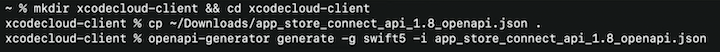

# **Deep dive into Xcode Cloud for teams**

Check out **Customize your advanced Xcode Cloud workflows** #session from WWDC 2021

### **Integrate with Xcode Cloud**

Webhooks allow easy integration with tools and services that support them

* You can connect a webhook in App Store Connect by telling Xcode Cloud what URL to send the webhook to
* Should start to see webhooks come in immediately

API allows a great amount of visibility into builds, allowing things like:

* Easily creating build dashboards
* Extracting your build artifacts
* Integrating build information into your existing software

Build an integration to integrate issue tracker with builds


Xcode Cloud API lives under the App Store Connect API

* Don't need to setup additional authentication

Documentation:


Can call the openAPI generator and tell it to create a swift client for an API



Create a webhook:

```
func routes(_ app: Application) throws {
	app.post("webhook") { req asvnc throws -> HTTPStatus in
		let payload = try req.content.decode (WebhookPayload.self)

		let build = payload.ciBuildRun
		
		guard let attributes = build.attributes, attributes.executionProgress == CiExecutionProgress.complete else {
			return .noContent
		}
		
		var commentString = """
Build \(attributes.number?.description ?? "--") Finished!\n
Commit \(attributes.sourceCommit?.commitSha ?? "--") by \(attributes.sourceCommit?.author?.displayName ?? "--"):
	\(attributes.sourceCommit?.message ?? "--")\n
"""		
		
		commentString += "\n"
		commentString += "\n"
		
		for buildAction in payload.ciBuildActions {
			guard let actionName = buildAction.attributes?.actionType?.rawValue else { continue }
			commentString += "Issues found for action: \(actionName)"
			do {
				let issues = try await CiBuildActionsAPI.getIssues(buildActionId:buildAction.id)
				commentString += issues.compactMap(\.attributes?.message).joined(separator: "\n")
			} catch let error {
				req.logger.report(error: error)
			}
		}
	
		let commitMessage = attributes.sourceCommit?.message
		let issued = issueStringExtractor (commitMessage: commitMessage)
	
		if (!issueId.isEmpty) {
			try await re.application.jira.post(
				comment: Comment (text: commentString),
				on: String(issueId)
			)
		}
		
		return .accepted
	}
}
```

Call the Xcode Cloud API to get more information about the build which just completed to include it on the issue tracker page

```
extension CiBuildActionsAPI {
	static func getIssues (buildActionId: String) async throws -> [Cilssue] {
		try await withCheckedThrowingContinuation { continuation in
			CiBuildActionsAPI.ciBuildActionsIssuesGetToManyRelated(id: buildActionId) { response, error in
				if let error = error {
					continuation.resume (throwing: error)
				}

				guard let issues = response?.data else {
					// No response - This should never happen
					continuation.resume (throwing: Abort(.internalServerError))
					return
				}

				continuation.resume(returning: issues)
			}
		}
	}
}
```

---

### **Manage your dependencies**

Xcode Cloud supports SPM, without requiring additional configuration if the repo is publicly available

* Check out [Making Dependencies Available to Xcode Cloud](https://developer.apple.com/documentation/xcode/making-dependencies-available-to-xcode-cloud) for information on how to make dependencies available to Xcode Cloud

---

### **Follow best practices**

**SwiftLint**

* Use a custom build script to integrate with SwiftLint

```
#!/bin/zsh

#ci post clone.sh
#Food Truck

# Use Homebrew to install the
brew install swiftlint

# Run SwiftLint
swiftlint $CI WORKSPACE
```

You can deactivate a workflow in Xcode from the "Manage Workflows" menu

**Restrict editing**

* Select Workflow -> Restrict Editing from the context menu
	* Can set who can edit a workflow
	* A key icon shows that we have restricted access
	* A lock shows we do not have access to edit a workflow

**Multiple start conditions**

* Same set of actions and post-actions
* Different build start conditions
* Easier maintenance

Rather than creating multiple workflows, create a single workflow with multiple start conditions

Multiple workflows | Multiple start conditions
------------------ | -------------------------
 | 