# **Design App Shortcuts**

All shortcuts begin with a fundamental component called `Actions`

* A task that can be completed by your app (e.g. create reminder, send a message)
* Can be used in a few ways:
	* Custom shortcuts - created using one or more actions from apps
	* App shortcuts - created by app developers containing one action

### **Identify a feature**

Focus on tasks that are

* Self-contained - they can be completed outside the app
	* Can be completed within search or Siri in its entirety
* Straightforward - they are efficient to get through
	* Tasks that require a lot of input or are time consuming are not a good fit
	* Focus on things that can be done quickly

**The maximum number of app shortcuts is 10**

---

### **Pick a name**

The name is used

* In the shortcuts app under your app's header
* In Spotlight
* As what people will say to invoke your shortcut with Siri

Keys to picking a name

* Keep it brief
* Make sure it's memorable
* It is required to include the app name
	* Can either be the official app name, or any alternative names you submit to the App Store
* Provide natural language variations as well: for example, provide "Start Voice Memo" and "New Voice Memo" in addition to "Record Voice Memo"
* You need to provide localized results for all supported languages

**Dynamic Parameters**

* An example would be "Start `Morning` Meditation", where `Morning` could also be `Evening`, `Walking`, etc.
* You can only have one dynamic parameter for your phrase
* Can only be used to select from a finite list
* Make sure other values in the list are predictable
* Options can be updated any time the app is open
* Each parameter value, in combination with the App Intent, creates a unique variant of your app shortcut
	* Automatically generated and shown in the Shortcuts app and Spotlight
	* Also available in the shortcuts editor
* **Design great actions for Shortcuts, Siri, and Suggestions** #session from WWDC 2021
* Be clear with your naming which part of the shortcut is the dynamic parameter
	* Keep naming simple
	* Additional options can be acquired via subsequent steps

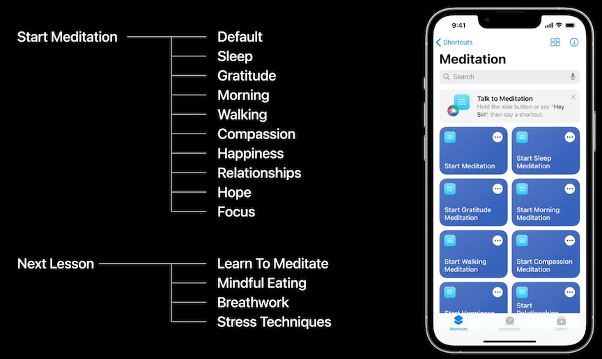

---

### **Refine your visual**

Custom Snippets and Live Activities provide options, request clarifications, and surface your app identity

* Snippets use a semi translucent material for the background
	* Place elements from your app on top of this material instead of filling the visual with an opaque background
	* Use vibrant label colors to ensure great contrast with the background

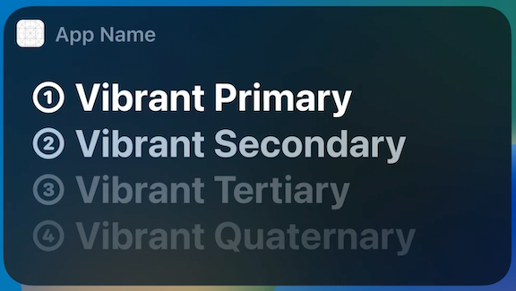

There are two ways to show results in iOS 16

* Live Activities
	* Useful when users would benefit from continuous access to this information; such as transit progress for a food order, or a timer counting down
	* Stays available, even on the lock screen, until the event has ended
* Custom Snippet
	* Better for when the shortcut is a self-contained action or piece of information
	* Snippets have a few key elements
		* Supporting dialog - what Siri speaks and is intended to accompany your custom visual		* Custom Visual
	* These elements communicate all the necessary information for this step of the shortcut
		* By default, your custom visual will consistently appear with supporting dialog
		* If the supporting dialog is fully redundant with your visual response, you should suppress the supporting dialog
	* Siri will read out the full dialog you provide on voice-only options like AirPods
	* Apple Watch now supports custom snippets as well with watchOS 9

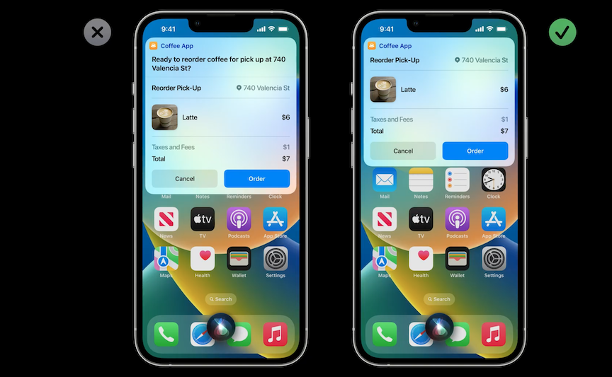

**Spotlight**

* App shortcuts will also appear in Spotlight in iOS 16
* If someone searches for your app name, one app shortcut (the first one in your App Shortcuts array) will appear as a Siri Suggestion below your app as a top hit
* Users can also search directly for your shortcut
* If your app is a Siri suggestion, when someone first launches Spotlight, your top shortcut will also appear here, even before anything has been typed into the search field
* Each unique app shortcut is decorated with a symbol on the right side (uses SF Symbols)
* The order of your actions and your parameters will influence the order your app shortcuts appear in Spotlight
	* Actions can only be reordered with app updates
		* Order of the parameters can be updated whenever the app is opened
* Pick a color for shortcuts to show in the shortcuts app, choose one that complements your app icon

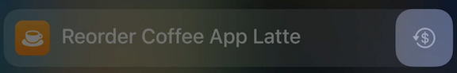

---

### **Ask for information**

**Parameter Confirmation**

* When possible, try to make a meaningful assumption to an ambiguous request and present it as an option for users to confirm
* Can be based on remembering a prior selection, or the most popular option

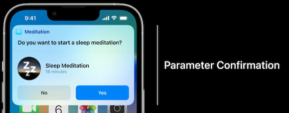

**Disambiguation**

* Provide a short list of options
* Helps users unfamiliar with the shortcut learn the possible values
* Best for lists of five values or less - Siri will read the entire list aloud in voice-only situations

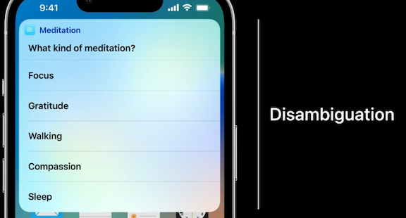

**Open Ended Request**

* Fewest guardrails - no suggested values and users can say anything in response
* Be clear what type of information your app is expecting
* The App Intent framework does provide a set of common options for these open-ended requests, such as numerical values, dates, or time values
	* Allow you to benefit from certain built-in dialog and visual patterns, as well as Siri's natural language understanding as it pertains to these types of information
* [**Dive into App Intents**](Dive into App Intents.md) session

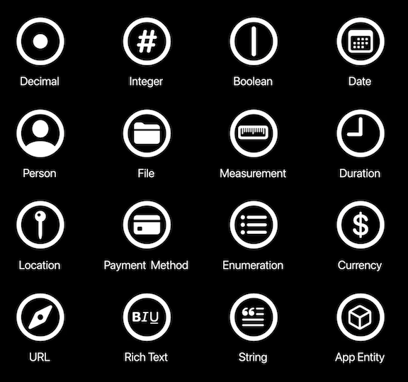

**Intent confirmation**

* If you have all the information you require, you may still want to do one final confirmation
* Only use this step for consequential actions:
	* A financial transaction
	* A destructive action like deleting content
	* An action that may just feel high risk, like sending a calendar invite to a big group
* Always have a pair of buttons in the snippet, offering to either proceed with (or cancel) the proposed action
* When confirming an intent, buttons should contain a verb reiterating the action that is about to be taken and not ambiguous words like "confirm."
	* App Intents framework provides a really helpful set of default verbs with corresponding synonyms
	* If you have a specific intent that falls outside the defaults, you can provide a custom string instead
		* Be sure to provide synonyms as well so that Siri understands all the similar phrases

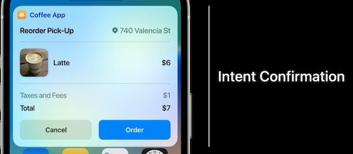

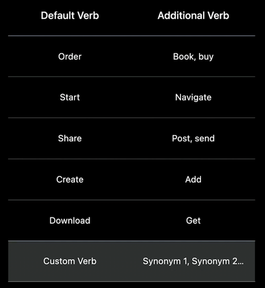

---

### **Make it discoverable**

* There is a new Siri tip button
	* Surface when people are likely to benefit - like before/after completing an action they may want to repeat in the future
	* Make dismissible
* New Shortcuts button, that will open the Shortcuts app directly to a page with all your app's Shortcuts

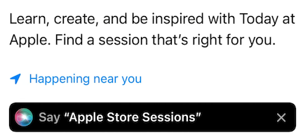 

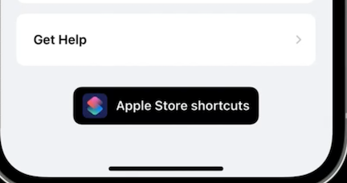

