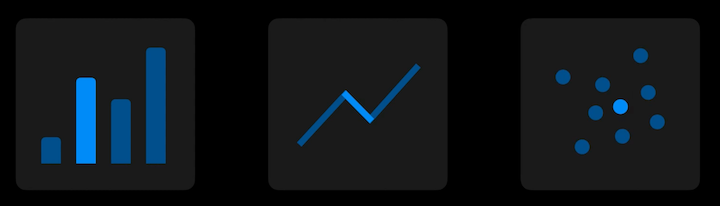
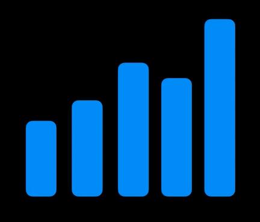
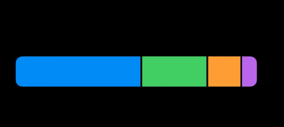
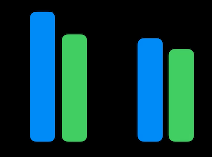
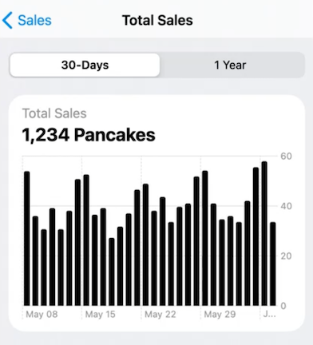
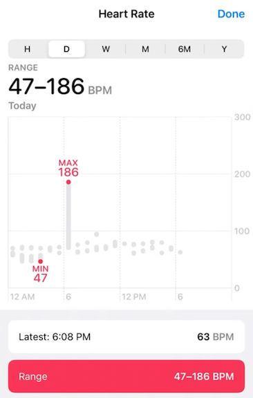

# **Design an effective chart**

Check out [**Design app experiences with charts**](Design app experiences with charts.md) session

An effective chart is:

* Focused
* Approachable
* Accessible to people with disabilities

We want to make a chart that visualizes pancake sales over the last 30 days. What direction(s) do we want to go:

* Do we want to show the pattern or range of recent sales?
* Identifying values could be useful to examine specific days
* Maximum sales, outlier days, and/or comparisons between days could be useful
* Average sales, minimum, trends, etc.

We can't do all of these things, that wouldn't be focused (and would make for a confusing chart). We will choose to just focus on *pattern*, *range*, and *values*.

The design process involves 5 topics:

* Marks - the chart's visual building blocks, like bars in a bar chart
* Axes - provide framing for marks to provide reference to their values
* Descriptions - make charts more approachable and easy to interpret
* Interaction - empowers deeper exploration of data and is critical to accessibility
* Color - adds personality, and can also enhance clarity

### **Marks**

Keys for marks:

* Design for goals and data
* Make accessible in VoiceOver

There are many ways to show data with marks, even just with bars:

Change | Proportions | Compare
------ | ----------- | -------
 |  | 

* For our data, we could use points - but when data varies greatly between data points, it can be hard to read
* A line mark could work better - but segments connecting far apart values can become more noticeable than the marks themselves
* Bar marks are more flexible. Zeroes are visible without creating a distraction, and are easy to read - more bar == more sales

**Accessibility**

VoiceOver is a screenreader that lets people read information on their screen through braille or speech

* Can be used to navigate content, like the elements in a chart
* Can use it to interact
* Through Audio Graphs, you can play a sonification of a chart
* Using Swift Charts, you automatically get:
	* Customizable accessibility labels for marks
	* An implementation of Audio Graphs
* **Bring accessibility to charts in your app** #session from WWDC 21
* [**Hello Swift Charts**](Hello Swift Charts.md) session

---

### **Axes**

* Consider the range
	* Fixed - like the battery charge level in a graph, always from 0 - 100%
	* Dynamic - like step counts in the health app. There is no maximum value, so we can change the Y value based on maximum value in the date range shown to best take advantage of vertical space
* Tailor the density of grid lines and labels
	* The more gridlines you have, the easier it is to estimate values
	* Some charts don't need them - like charts that show a general idea of a trend, but then lead to a more detailed chart
	* When you want to analyze values on a chart more precisely, gridlines can help with this
	* Too many gridlines can be distracting
* 

---

### **Descriptions**

* Provide context to make the chart more approachable
	* Can be brief, and should be part of the user interface around a chart
	* A title, such as "total sales" provides some context. Options on a segmented control (e.g. 30 days, 1 year) can provide more.
* Axis labels can add context as well
	* An alternative is to have the title define what an axis does - such as "Pancakes sold", which puts the chart's meaning front and center
* Summarize the main take-away
	* "Light Rain Forecasted" can provide the meaning of a chart showing precipitation over time
	* Adding data into the description can ground the chart with a concrete value, summarizing information (see image below)
* Use Audio Graphs
	* VoiceOver non-visually describes what the axes are
	* Provide several summaries about the data, including one you can customize
	* These descriptions, especially of the x and y axes, are critical for non-visually communicating the chart.
		* If Audio Graphs isn't an option, make sure VoiceOver still has immediate access to these types of descriptions some other way, like through accessibility text labels.

---

### **Interaction**

* Highlight sections of a chart to explore how data fits in a broader context
* Toggle between days/weeks/months/years
* Use large touch targets
	* Add padding to touch targets, so it's not just the bar you tap on. Expand touch area to full height or width, depending on the chart type
* Design for multiple types of input:
	* Touch, Mouse, Keyboard, Voice Control, Switch Control, VoiceOver
	* As you design interactions, it's important to make changes on the screen visible: like sizing the focus indicator for Switch Control or VoiceOver to be large, the same way touch targets are designed
* Design accessibility labels
	* Don't repeat unnecessary information
	* Spell entire words instead of using abbreviations
	* Make it clear what each part of the data refers to
	* Put context first - e.g. date before value
* Depending on the cart, it may make more sense to:
	* Summarize a section of the chart interactively if we have lots of data points
	* Summarize the entire chart if it is a summary chart leading to a more detailed chart

---

### **Color**

In addition to enhancing personality and giving a chart more "pop", color can be used to:

* Distinguish categories, such as the three rings in the Fitness app
* Communicate intensity, such as heat in a weather forecast
* Draw attention to features of a chart by *removing color*. The health app does so to highlight your minimum and maximum heart rate within a day.

* Consider using color to enhance
	* Use as an addition to understand, not the only means to convey critical information
	* An example would be to show enhance difference between compared values
	* Color should be added on top of other symbols, because people who are color blind might not be able to distinguish the difference otherwise
* Consider associated meanings
	* E.g. red vs. green for battery charge level
	* Culture can inform the meanings of colors too
		* In the US, it makes sense to color code Stocks with green for gains and red for losses.
		* In some countries like China, however, people expect the opposite, with red indicating gains and green indicating losses.
* Balance visual weight
	* If one color overpowers the other, it can imply an unintended hierarchy
* Choose distinct colors
	* Both for accessibility and readability
	* Choose colors that are easy to differentiate by name and contrast well from each other
	* Try making your colors distinct for people with color blindness
		* You can check your choices with color blindness filters
* Respect system settings - design colors to adapt for:
	* Dark Mode and Light Mode
	* Increase Contrast