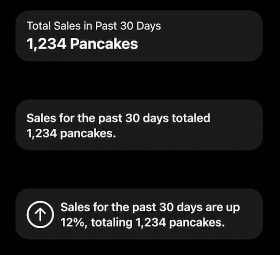
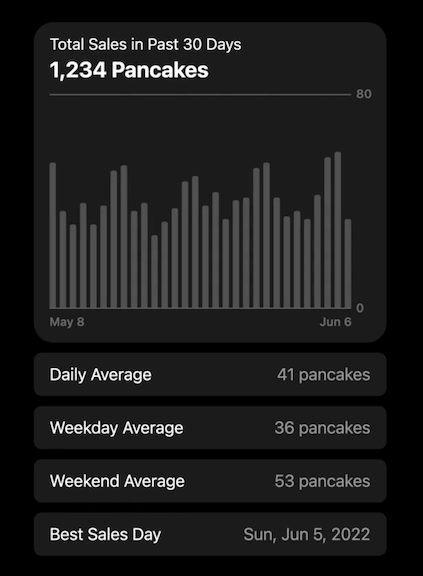
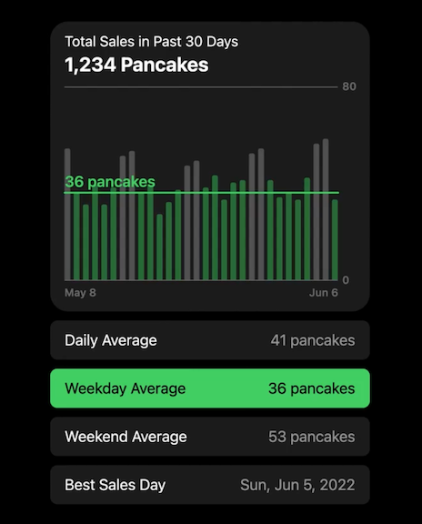
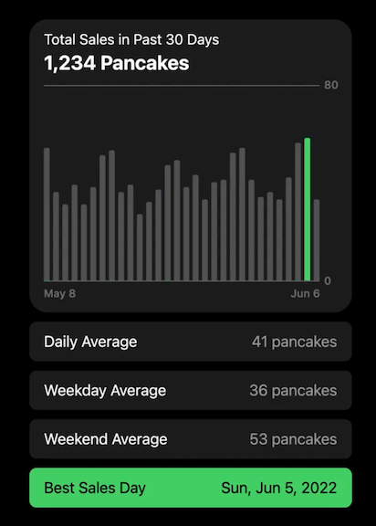
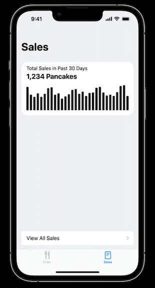
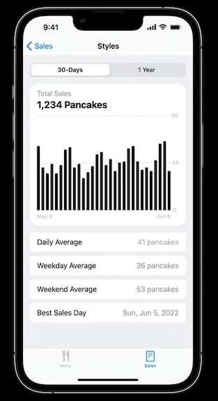
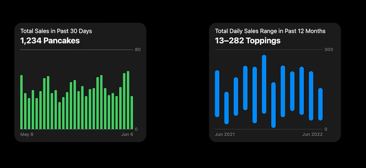
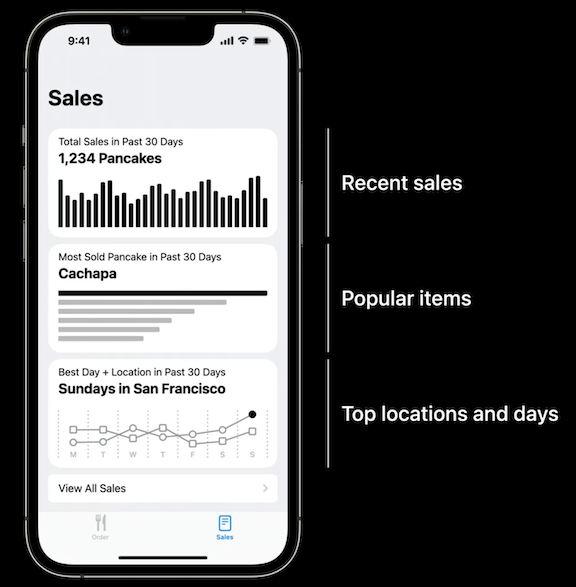

# [**Design app experiences with charts**](https://developer.apple.com/videos/play/wwdc2022/110342/)

### **When to use charts**

* Showing historical or predicted values
* Showing proportions of something completing/progressing
* Showing comparisons between values
* Charts provide focus
	* Direct attention towards specific data

---

### **How to use charts**

* Accompany charts with text that describes the chart contents
	* Should be informative (e.g. a total count for a bar chart)
	* Interpreting data can also be useful (define the trend shown in the chart)

Incorporate details

* Macro level
	* Describe entire data set (total, average)
* Medium level
	* Look at subsets of data (weekdays vs. weekends, time of day)
* Micro level
	* Focus on individual data points (largest/smallest item, etc.)

You can use a set of tappable rows under a chart that highlight different information

Information Buttons | Averages | Single Point
------------------- | -------- | ------------
 |  | 

**Static Charts**

* Rarely exist in isolation (e.g. watch complication)
* Tend to provide a preview of a larger chart
* Don't require labels, gridlines, or interactivity

**Interactive Charts**

* Typically the width of the view, but not full height
* Include access lines and labels
* Interactivity recommended for accessing precise values
* Ability to change the time range/scope will aid exporation

**Progressively reveal complexity**

* Start with a small static chart
* Create a navigation path to expanded versions of the chart
* When creating a link between two version of a chart, maintain continuity by preserving values, context, and state
	* Add information, but don't change values

Static chart | Expanded chart
------------ | --------------
 | 

---

### **Chart design systems**

When planning multiple charts

* Use familiar forms (e.g. bar and line charts)
	* When doing something unique, it should be introduced clearly
	* A new form should be central to an app, not supplementary
* Differences matter - variations indicate something has changed
	* Text can be used to define changes
	* Color can be used to help the user see there is a difference, and direct them to read a text
	* Modifying the styling can also help to convey separate meanings

* [**Design an effective chart**](Design an effective chart.md) session
* [**Hello Swift Charts**](Hello Swift Charts.md) session

