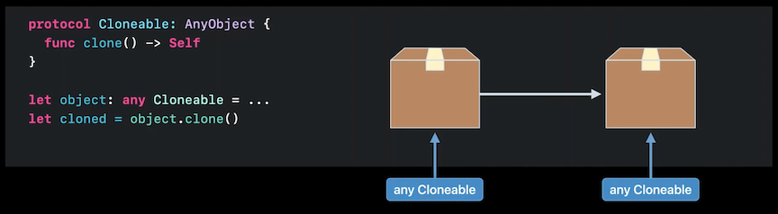
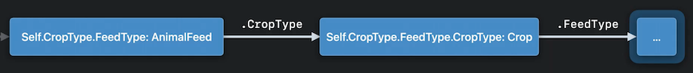
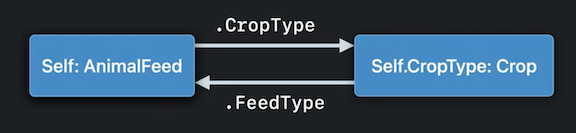
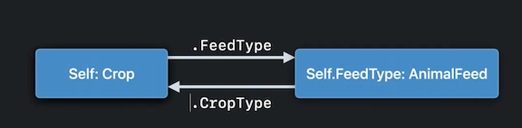
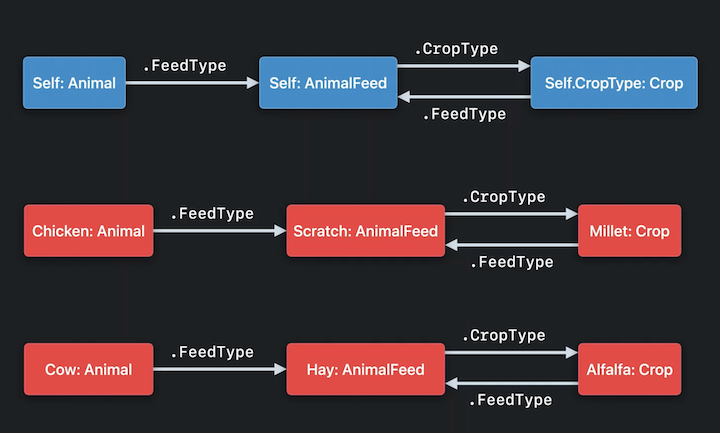

# [**Design protocol interfaces in Swift**](https://developer.apple.com/videos/play/wwdc2022/110353/)

This session picks up where the [**Embrace Swift generics**](Embrace Swift generics.md) session leaves off

### **Understand type erasure**

By using an `associated type`, we're declaring that: given some concrete type of `Animal`, calling `produce()` returns some specific type of Food, that depends on the concrete Animal type

```
protocol Animal {
	associatedType CommodityType: Food
	
	func produce() -> CommodityType
}
```


Type erasure replaces these associated types with corresponding existential types that have equivalent constraints

* We've erased the relationship between the concrete Animal type and the associated CommodityType by replacing them with `any Animal` and `any Food`
* The type `any Food` is called the **upper bound** of the associated CommodityType
* Since the `produce()` method is called on an `any Animal`, the return value is type erased, giving us a value of type `any Food`

Associated Type erasure is new in Swift 5.7

* Associated types appearing in the *result* (the right hand side of an `->`) of a function declaration are in the **producing position**
	* Calling the method will produce a value of this type
* The actual concrete type that is returned can safely convert to the **upper bound**
	* When we call a method on `any Animal`, we don't know the concrete result type at compile time, but we do know that it is a subtype of the upper bound
* Associated types appearing in the *parameter list* of a function declaration are in **consuming position**
	* The upper bound *cannot* safely convert to the actual concrete type, which is unknown
	* Type erasure does not allow us to work with associated types in consuming position
		* Instead, you must unbox the existential 'any' type by passing it to a function that takes an opaque 'some' type
		* Similar to an existing language feature in Swift 5.6, with protocol requirements returning `Self`



---

### **Hide implementation details**

* Generalizing the `Animal` protocol to allow feeding Animals
	* Add `isHungry` property to the protocol
	* `feedAnimals()` method on `Farm` will feed the subset of animals that are hungry

```
extension Farm {
	var hungryAnimals: [any Animal] {
		animals.filter(\.isHungry)
	}
	
	func feedAnimals() {
		for animal in hungryAnimals {
			...
		}
	}
}
```

* The initial implementation above uses the `filter()` method to select the subset of animals where the `isHungry` property is true
	* Calling filter() on an array of `any Animal` returns a new array of 'any Animal'
	* `feedAnimals()` only iterates over the result of hungryAnimals once, and then immediately discards this temporary array. This is inefficient if the farm contains a large number of hungry animals
* A way to avoid this temporary allocation is to use the standard library's lazy collections feature
	* Replacing the call to `filter` with `lazy.filter`, we get a lazy collection
	* A lazy collection has the same elements as the array returned by a plain call to `filter`, but it avoids the temporary allocation
		* However, now the type of the `hungryAnimals` property must be declared as this rather complex concrete type, `LazyFilterSequence<[any Animal]>`
		* This exposes an unnecessary implementation detail - the client, `feedAnimals()`, doesn't care that we used `lazy.filter` in the implementation of `hungryAnimals`; it only needs to know that it's getting some collection that it can iterate over

```
extension Farm {
	var hungryAnimals: LazyFilterSequence<[any Animal]> {
		animals.lazy.filter (\.isHungry)
	}
	
	func feedAnimals() {
		for animal in hungryAnimals {
			...
		}
	}
}
```

* An opaque result type can be used to hide the complex concrete type behind the abstract interface of a Collection
	* Now clients calling `hungryAnimals` only know they're getting some concrete type conforming to the Collection protocol, but they don't know the specific concrete type of collection.
* However, this actually hides too much static type information from the client
	* We're declaring that hungryAnimals outputs some concrete type conforming to Collection, but we don't know anything about this Collection's Element type
	* Without the knowledge that the element type is `any Animal`, all we can do with the element type is pass it around; we can't call any of the methods of the Animal protocol

```
extension Farm {
	var hungryAnimals: some Collection {
		animals.lazy.filter (\.isHungry)
	}
	
	func feedAnimals() {
		for animal in hungryAnimals {
			...
		}
	}
}
```

* We can strike the right balance between hiding implementation details and exposing a sufficiently-rich interface by using a **constrained opaque result type**
	* New in Swift 5.7
	* Written by applying type arguments in angle brackets after the protocol name
	* The Collection protocol has a single type argument, the Element type
* Inside the for loop in `feedAnimals()`, the `animal` variable has the type `any Animal`, allowing methods of the Animal protocol to be called on each hungry animal
* Works because the Collection protocol declares that the Element associated type is a primary associated type
	* You can declare your own protocols with primary associated types by naming one or more associated types in angle brackets after the protocol name
		* The associated types that work best as primary associated types are those that are usually provided by the caller, e.g. an Element type of a collection, as opposed to implementation details, such as the collection's Iterator type

```
extension Farm {
	var hungryAnimals: some Collection<any Animal> {
		animals.lazy.filter (\.isHungry)
	}
	
	func feedAnimals() {
		for animal in hungryAnimals {
			...
		}
	}
}
```

* 'Collection of Element' can be used with opaque result types using the `some` keyword, as well as with constrained existential types using the `any` keyword
	* Before Swift 5.7, you needed to write your own data type to represent an existential type with a specific generic argument
* If we wanted `hungryAnimals` to have the option of whether to compute the hungryAnimals lazily or eagerly, we can do this by instead returning `Collection<any Animal>`
	* Signals that this API can return different types across calls

```
extension Farm {
	var hungryAnimals: any Collection<any Animal> {
		if isLazy {
			return animals.lazy.filter(\.isHungry)
		} else {
			return animals.filter(\.isHungry)
		}
	}
}
```

---

### **Identify type relationships**

* Add a new associated type to the Animal protocol for the concrete type of animal feed that this animal eats
* Also add an `eat()` method that tells the animal to consume this type of feed
	* Additional complication: before we can feed an animal, we must grow the appropriate type of crop, and harvest the crop to produce the feed

```
protocol Animal {
	var isHungry: Bool { get }

	associatedtype FeedType: AnimalFeed
	func eat(_: FeedType)
}

// First set of concrete types
struct Cow: Animal {
	func eat(_: Hay) { ... }
}

struct Hay: AnimalFeed {
	static func grow() -› Alfalfa { ... }
}

struct Alfalfa: Crop {
	func harvest() -> Hay { ... }

let cow: Cow = ...
let alfalfa = Hay.grow()
let hay = alfalfa.harvest()
cow.eat(hay)

// Second set of concrete types
struct Chicken: Animal {
	func eat(: Scratch) { ... }
}

struct Scratch: AnimalFeed {
	static func grow() -> Millet { ... }
}

struct Millet: Crop {
	func harvest() -> Scratch { ... }
}

let chicken: Chicken
let millet = Scratch.grow()
let scratch = millet.harvest)
chicken.eat(scratch)
```

* We want to abstract over these two sets of related concrete types, so I can implement the `feedAnimal()` method once, and have it feed both cows and chickens, as well as any new types of animals I might adopt in the future
* `feedAnimal()` needs to work with the `eat()` method of the Animal protocol, which has an associated type in consuming position
	* Unbox the existential by declaring that the `feedAnimal()` method takes `some Animal` as a parameter type

```
extension Farm {
	func feedAnimals() {
		for animal in hungryAnimals {
			feedAnimal(animal)
		}
	}

	private func feedAnimal(_ animal: some Animal) {
		???
	}
}
```

* Start by defining a pair of protocols
	* `AnimalFeed` has associatedtype `CropType`, which conforms to `Crop`
	* `Crop` has associatedtype `FeedType`, which conforms to `AnimalFeed`
* We can now try to build our `feedAnimal(_:)` method
	* We can get the type of animal with `type(of: animal`
		* The animal has an associated `FeedType`, which conforms to `AnimalFeed`
		* We can use that type as the base of the method call `grow()`
			* `grow()` returns a value whose type is the nested associated `CropType` of `AnimalFeed`
	* The `CropType` (returned from `grow()`) conforms to `Crop`, so we can call `harvest` on it
		* However, `harvest()` will return a value of `(some Animal).FeedType.CropType.FeedType`
		* This doesn't work, because the `eat()` method expects to receive `(some Animal).FeedType`
* As written, the protocols don't actually guarantee that if we start with a type of animal feed, and then grow/harvest the crop, we'll get back the same type of animal feed we started with (which the animal expects to eat)
	* Protocol definitions are too general - they don't accurately model the desired relationship between our concrete types
	* In theory, we could change the return type of `harvest()` to `Scratch` for `Alfalfa` - this would satisfy the requirements of the protocols, but would return the incorrect animal feed

```
protocol AnimalFeed {
	associatedtype CropType: Crop
	static func grow() -> CropType
}

protocol Crop {
	associatedtype FeedType: AnimalFeed
	func harvest() -> FeedType
}

extension Farm {
	private func feedAnimal(_ animal: some Animal) {
		let crop = type(of: animal).FeedType.grow()
		let feed = crop.harvest()
		animal.eat(feed)
	}
}
```

Infinite relationship created between types | continued
------------------------------------------- | ---------
 | 


* The real problem is that we have too many distinct associated types
	* We need to write down the fact that tow of these associated types are actually the same concrete type
	* Will prevent incorrectly-written concrete types from conforming to our protocols
	* Will also to give the `feedAnimal()` method the guarantee that it needs
	* Expressed using a `where` clause
		* A same-type requirement expresses a static guarantee that two different, possibly nested associated types must in fact be the same concrete type
		* Imposes a restriction on the concrete types that conform to the AnimalFeed protocol
* Feed animal works now!
	* We start with the type of some Animal, as before
	* We get the animal's feed type, which we know conforms to the AnimalFeed protocol
	* When we grow this crop, we get some animal's feed type's crop type
		* Now, when we harvest this crop, instead of getting back `(some Animal).FeedType.CropType.FeedType`, we get exactly the feed type that our animal expects (`(some Animal).FeedType`)
	* The animal is now guaranteed to `eat()` the correct type of animal feed that we just grew.

```
protocol AnimalFeed {
	associatedtype CropType: Crop where CropType.FeedType == Self
	static func grow() -> CropType
}

protocol Crop {
	associatedtype FeedType: AnimalFeed where FeedType.CropType == Self
	func harvest() -> FeedType
}

extension Farm {
	private func feedAnimal(_ animal: some Animal) {
		let crop = type(of: animal).FeedType.grow()
		let feed = crop.harvest()
		animal.eat(feed)
	}
}
```

Animal Feed Relationship | Crop Relationship
------------------------ | -----------------
 | 

We can use a diagram to see the relationships between the protocols and the concrete types


