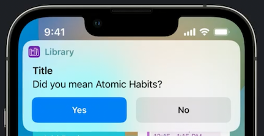

# **Dive into App Intents**

### **Introducing AppIntents**

AppIntents have three key components:

* `Intents` are actions built into your app that can be used throughout the system
* Intents use `Entities` to represent app's concepts
* `App Shortcuts` wrap your intents to make them automatic and discoverable

With App Shortcuts:

* Everyone can use your app's features with their voice through Siri, without needing to set anything up first. The same adoption also makes your intents appear in Spotlight when people search for your app and when your app's suggested.
* Build Focus Filters, letting customers customize your app for a specific focus
	* **Meet Focus Filters** #session
* Intents show up in the Shortcuts app automatically
* **Design great actions for Shortcuts, Siri, and Suggestions** #session from WWDC 2021
* Do not require an App Extension

---

### **Intents and parameters**

App Intents

* Single piece of app functionality
	* e.g. make a new calendar event, or open a particular screen
* Performed manually or automatically
	* Manually with Siri or running a shortcut
	* Automatically with Focus filters or a Shortcuts automation
* Returns a result or throws an error when run

App Intents include

* Metadata - information about the intent
* Parameters - inputs that the intent can use when it's run
* Perform method - the actual work to be done when the intent is executed

Using a sample Library app for examples - an app to track books one has read, wants to read, or is currently reading

First example would be an App Intent to open the "Currently Reading" shelf

* Run `perform` on `@MainActor` because the Navigator expects the main thread
* Provide a `title`

```
struct OpenCurrentlyReading: AppIntent {
    static var title: LocalizedStringResource = "Open Currently Reading"

    @MainActor
    func perform() async throws -> some PerformResult {
        Navigator.shared.openShelf(.currentlyReading)
        return .finished
    }

    static var openAppWhenRun: Bool = true
}
```

Once an App Intent has been turned into a shortcut, it can be used in many ways throughout the system:


You can add support for App Shortcuts with just a little bit of code

* Intent will automatically show up in Spotlight and the Shortcuts app
* **Implement App Shortcuts with App Intents** #session

```
public struct LibraryAppShortcuts: AppShortcutsProvider {
    static var appShortcuts: [AppShortcut] {
        AppShortcut(
            intent: OpenCurrentlyReading(),
            phrases: ["Open Currently Reading"],
            systemImageName: "books.vertical.fill"
        )
    }
}
```

Next, we'll generalize our shortcut to open any of the shelves

* Add enum to represent shelves
	* Must conform to the `AppEnum` protocol
	* Must provide a string rawValue
	* Must provide localizable, human-readable titles for each of the enum cases as a dictionary literal
	* Add a typeDisplayName; a user-visible, localizable name for this enum type as a whole
* `Shelf` parameter is declared using an `@Parameter` property wrapper, initialized with info about the parameter
	* Parameter is read in the `perform` method
* Add a parameter summary using the `ParameterSummary` API
	* A sentence that represents your intent and its parameters in the editor
	* Always a good idea to include this
* You can also define which parameters show up below the fold and which are hidden
	* Can do things like carrying the summary based on the actual values of a parameter of your intent
* `openAppWhenRun` ensures that the app is open when the intent is run
	* defaults to false


```
public enum Shelf: String {
    case currentlyReading
    case wantToRead
    case read
}

extension Shelf: AppEnum {
    static var typeDisplayName: LocalizedStringResource = "Shelf"

    static var caseDisplayRepresentations: [Shelf: DisplayRepresentation] = [
        .currentlyReading: "Currently Reading",
        .wantToRead: "Want to Read",
        .read: "Read",
    ]
}

struct OpenShelf: AppIntent {
    static var title: LocalizedStringResource = "Open Shelf"

    @Parameter(title: "Shelf")
    var shelf: Shelf

    @MainActor
    func perform() async throws -> some PerformResult {
        Navigator.shared.openShelf(shelf)
        return .finished
    }

    static var parameterSummary: some ParameterSummary {
        Summary("Open \(\.$shelf)")
    }

    static var openAppWhenRun: Bool = true
}
```

Parameters support the following types:


Here's how the intent looks in the Shortcuts editor:

Without a parameter summary | With a parameter summary
--------------------------- | ------------------------
 | 

---

### **Entities, queries, and results**

Entities:

* A concept that your app exposes to App Intents
* Use instead of an enum when the values are dynamic or user-defined
* To provide instances of entities, your app can implement queries, and return entities as results from intents
* In the Shortcuts editor, people can tap on an entity
	* Can include a set of suggested entities provided by the app
	* Can also search entities


Need to create a book entity and the corresponding query.

* An entity contains at least three things:
	* Identifier
	* Display representation
	* Entity type name
* Create a struct conforming to `AppEntity` and `Identifiable`
* `displayRepresentation` shows the entity to a user
	* Can be as simple as a string of text
	* Can also supply a subtitle and an image
* `typeDisplayName` is a human-readable string representing the *type* of an entity
* Finally, we define `defaultQuery`, implemented next


```
struct BookEntity: AppEntity, Identifiable {
    var id: UUID
    var title: String
  
    var displayRepresentation: DisplayRepresentation {
        DisplayRepresentation(title: LocalizedStringResource(stringLiteral: title))
    }

    static var typeDisplayName: LocalizedStringResource = "Book"
  
    static var defaultQuery = BookQuery()
}
```

**Queries**

* An interface for retrieving Entities from your app
	* All queries look up entities by ID
	* `StringQuery` looks up entities using a search string
	* `PropertyQuery` looks up entities based on other criteria
	* Can provide suggested entities to pick from
* Make a swift struct that conforms to `EntityQuery`
* Only one required method: `entities(for:)`

```
struct BookQuery: EntityQuery {
    func entities(for identifiers: [UUID]) async throws -> [BookEntity] {
        identifiers.compactMap { identifier in
            Database.shared.book(for: identifier)
        }
    }
}
```

Now that `BookEntity` conforms to `AppEntity`, it can be sued as a parameter in the `OpenBook` intent:

```
struct OpenBook: AppIntent {
    @Parameter(title: "Book")
    var book: BookEntity

    static var title: LocalizedStringResource = "Open Book"

    static var openAppWhenRun = true

    @MainActor
    func perform() async throws -> some PerformResult {
        guard try await $book.requestConfirmation(for: book, dialog: "Are you sure you want to clear read state for \(book)?") else {
            return .finished
        }
        Navigator.shared.openBook(book)
        return .finished
    }

    static var parameterSummary: some ParameterSummary {
        Summary("Open \(\.$book)")
    }
  
    init() {}

    init(book: BookEntity) {
        self.book = book
    }
}
```

In order to support the book picker, the query needs to provide suggested results

* Need to implement one more query, returning all the books added to my Library app
* `suggestedEntities` function will return a list of entities
* We also want to be able to search for entities
	* Adopt the `EntityStringQuery` subprotocol gives us one more method to implement
	* `entities(matching:)` is then used to filter and return search results

```
struct BookQuery: EntityStringQuery {
    func entities(for identifiers: [UUID]) async throws -> [BookEntity] {
        identifiers.compactMap { identifier in
            Database.shared.book(for: identifier)
        }
    }

    func suggestedEntities() async throws -> [BookEntity] {
        Database.shared.books
    }

    func entities(matching string: String) async throws -> [BookEntity] {
        Database.shared.books.filter { book in
            book.title.lowercased().contains(string.lowercased())
        }
    }
}
```

Next we want to build an intent that adds a book to the library

* Three parameters:
	* Title
	* Author (optional)
	* Recommended by (optional)
* `perform` will add the book to the library by looking it up with an API call using async/await
	* It will throw an error if it can't find a match
	* To localize this error, I conform my error type to the CustomLocalizedString ResourceConvertible protocol

```
struct AddBook: AppIntent {
    static var title: LocalizedStringResource = "Add Book"

    @Parameter(title: "Title")
    var title: String

    @Parameter(title: "Author Name")
    var authorName: String?

    @Parameter(title: "Recommended By")
    var recommendedBy: String?

    func perform() async throws -> some PerformResult {
        guard var book = await BooksAPI.shared.findBooks(named: title, author: authorName).first else {
            throw Error.notFound
        }
        book.recommendedBy = recommendedBy
        Database.shared.add(book: book)

        return .finished(
            value: book,
            showResultIntent: OpenBook(book: book)
        )
    }

    enum Error: Swift.Error, CustomLocalizedStringResourceConvertible {
        case notFound

        var localizedStringResource: LocalizedStringResource {
            switch self {
                case .notFound: return "Book Not Found"
            }
        }
    }
}
```

You can make intents more flexible if they can be combined with other intents

* Change `perform` method to return a value as part of its result

```
struct AddBook: AppIntent {
	...
	
	func perform() async throws -> some IntentResult & ReturnsValue<Book> {
        guard var book = await BooksAPI.shared.findBooks(named: title, author: authorName).first else {
            throw Error.notFound
        }
        book.recommendedBy = recommendedBy
        Database.shared.add(book: book)

        return .result(value: book)
    }
    
	...
}
```

It's a common pattern to return a result from an intent and open it in the app

* App Intents have a built-in way to express this called the `openIntent`
* If added, users get a new switch in Shortcuts called "Open When Run"
* If the switch is turned off, users can use the intent as part of a shortcut in the background
* If the switch is turned on, the app can handle the entity returned (in this case, the newly added book will be opened in the app).


```
struct AddBook: AppIntent {
	...
	
	func perform() async throws -> some IntentResult & ReturnsValue<Book> {
        guard var book = await BooksAPI.shared.findBooks(named: title, author: authorName).first else {
            throw Error.notFound
        }
        book.recommendedBy = recommendedBy
        Database.shared.add(book: book)

        return .result(
            value: book,
            openIntent: OpenBook(book: book)
        )
    }
    
	...
}
```

---

### **Properties, finding, and filtering**

To expose more information about our entities, we can use Properties

* Properties support all the same types that parameters do
* Each one takes a localized title


```
struct BookEntity: AppEntity, Identifiable {
    var id: UUID

    @Property(title: "Title")
    var title: String

    @Property(title: "Publishing Date")
    var datePublished: Date

    @Property(title: "Read Date")
    var dateRead: Date?

    var recommendedBy: String?

    var displayRepresentation: DisplayRepresentation {
        DisplayRepresentation(title: LocalizedStringResource(stringLiteral: title))
    }

    static var typeDisplayName: LocalizedStringResource = "Book"

    static var defaultQuery = BookQuery()

    init(id: UUID) {
        self.id = id
    }

    init(id: UUID, title: String) {
        self.id = id
        self.title = title
    }
}
```

Combining properties with queries, your app automatically gets Find and Filter actions in Shortcuts

* Using the Sort by and Limit options, you can support even more advanced queries, like find the three most recently published books by an author


**Property Queries**

* Conform `BookQuery` to `EntityPropertyQuery`
* Declare query properties to specify how the entity can be searched
	* Implement `properties` using the QueryProperties result builder
		* Each entry specifies a keyPath of a Property that can be queried, and within it, each comparator that is applicable to that property
		* For each comparator, provide an NSPredicate, as we've chosen NSPredicate as our comparator mapping type
* Declare sorting options to define how query results can be sorted
	* Implement `sortingOptions` to define how results can be ordered
* Implement `entities(matching:)` to run the search
	* Queries the database and returns matching entities
	* Takes an array of predicates, as defined in `properties`

```
struct BookQuery: EntityPropertyQuery {
    static var sortingOptions = SortingOptions {
        SortableBy(\BookEntity.$title)
        SortableBy(\BookEntity.$dateRead)
        SortableBy(\BookEntity.$datePublished)
    }

    static var properties = EntityQueryProperties {
        Property(keyPath: \BookEntity.title) {
            EqualToComparator { NSPredicate(format: "title = %@", $0) }
            ContainsComparator { NSPredicate(format: "title CONTAINS %@", $0) }
        }
        Property(keyPath: \BookEntity.datePublished) {
            LessThanComparator { NSPredicate(format: "datePublished < %@", $0 as NSDate) }
            GreaterThanComparator { NSPredicate(format: "datePublished > %@", $0 as NSDate) }
        }
        Property(keyPath: \BookEntity.dateRead) {
            LessThanComparator { NSPredicate(format: "dateRead < %@", $0 as NSDate) }
            GreaterThanComparator { NSPredicate(format: "dateRead > %@", $0 as NSDate) }
        }
    }

    func entities(for identifiers: [UUID]) async throws -> [BookEntity] {
        identifiers.compactMap { identifier in
            Database.shared.book(for: identifier)
        }
    }

    func suggestedEntities() async throws -> [BookEntity] {
        Model.shared.library.books.map { BookEntity(id: $0.id, title: $0.title) }
    }

    func entities(matching string: String) async throws -> [BookEntity] {
        Database.shared.books.filter { book in
            book.title.lowercased().contains(string.lowercased())
        }
    }

    func entities(
        matching comparators: [NSPredicate],
        mode: ComparatorMode,
        sortedBy: [Sort<BookEntity>],
        limit: Int?
    ) async throws -> [BookEntity] {
        Database.shared.findBooks(matching: comparators, matchAll: mode == .and, sorts: sortedBy.map { (keyPath: $0.by, ascending: $0.order == .ascending) })
    }
}
```

---

### **User interactions**

App Intents supports a number of ways to interact with users:

* *Dialog* for giving text and voice feedback to your users when an intent has completed
* *Snippets* for giving visual feedback
* *Request value* and *disambiguation* for asking the user to clarify values for intent parameters
* *Confirmation* for verifying parameter values or checking with the user on intents that are transactional or destructive.

We'll add a needsValueDialog that's spoken when asking for a book title and a result dialog returned from my perform method


```
struct AddBook: AppIntent {
    static var title: LocalizedStringResource = "Add Book"

    @Parameter(title: "Title", needsValueDialog: "What's the book title?")
    var title: String

    ...
    
    func perform() async throws -> some IntentResult & ProvidesDialog & ProvidesValue<Book> {
        guard var book = await BooksAPI.shared.findBooks(named: title, author: authorName).first else {
            throw Error.notFound
        }
        book.recommendedBy = recommendedBy
        Database.shared.add(book: book)

        return .result(
            value: book,
            dialog:"Added \(book) to Library!"
        )
    }

    ...
}
```

Snippets are the visual equivalent of dialog, letting you add a visual representation to the result of your intent


```
struct AddBook: AppIntent {
    ...

    func perform() async throws -> some IntentResult & ShowsSnippetView & ProvidesValue<Book> {
        ...
        
        return .result(value: book, dialog: "Added \(book) to Library") {
            CoverView(book: book)
        }
    }

    ...
}
```

App Intents also supports asking the user for a value by throwing requestValue

* For instance, when you need a value for a parameter that is sometimes optional
* In this example, requestValue helps when the string search returns more than one book


```
struct AddBook: AppIntent {
    ...

    func perform() async throws -> some IntentResult & ShowsSnippetView & ProvidesValue<Book> {
        let books = await BooksAPI.shared.findBooks(named: title, author: authorName)
        guard !books.isEmpty else {
            throw Error.notFound
        }
        
        if books.count > 1 && authorName == nil {
            throw $authorName.requestValue("Who wrote the book?")
        }
        
        ...
    }

    ...
}
```

Disambiguation is great when you need the user to choose between a set of values for a parameter.

* Get a list of author names from the generated books, and request disambiguation with those possible values
* The user will be asked to pick between them, and then get the result back


```
struct AddBook: AppIntent {
    ...

    func perform() async throws -> some IntentResult & ShowsSnippetView & ProvidesValue<Book> {
        let books = await BooksAPI.shared.findBooks(named: title, author: authorName)
        guard !books.isEmpty else {
            throw Error.notFound
        }
        
        if books.count > 1 && authorName == nil {
            let chosenAuthor = try await $authorName.requestDisambiguation(among: books.map { $0.authorName }, dialog: "Which author?")
        }
        
        ...
    }

    ...
}
```

App Intents supports two different kinds of confirmation:

* Parameter value - might be useful when you have a guess at what that value should be but you want to confirm, just to make sure
* Result of an intent - great for placing orders; for example, if you want to make sure that an order is correct



```
struct AddBook: AppIntent {
    ...

    func perform() async throws -> some IntentResult & ShowsSnippetView & ProvidesValue<Book> {
        ...
        
        let confirmed: Bool = try await $title.requestConfirmation(for: mostPopularBook.title, dialog: "Did you mean \(mostPopularBook)?")
        
        ...
    }

    ...
}
```


```
struct AddBook: AppIntent {
    ...

    func perform() async throws -> some IntentResult & ShowsSnippetView & ProvidesValue<Book> {
        ShowsSnippetView {
            ...
            
            let order = OrderEntity (book: book, count: count)
            try await requestConfirmation(output: .result (value: order,
                                          dialog: "Are you ready to order?") {
                OrderPreview(order: order)
            })
            
            ...
            
            return .result(value: order) {
                OrderConfirmation(order: order, dialog: "Thank you for your order!")
            }
        }
    }

    ...
}
```

---

### **Architecture and lifecycle**

App Intents can be both in your app and in a separate extension

* Implementing in the app is the simplest
	* No need for a framework/duplicated code
	* No cross-process coordination
	* Higher memory limits
	* Ability to start an audio session
	* Intents run in the foreground if you set `openAppWhenRun`
	* Implement multi-scene support for best performance in the background
* Extension Intents
	* Lighter-weight
	* Best performance
	* Focus filter intents run immediately when Focus changes

Static Extraction

* Your code is the only source of truth
* Xcode extracts App Intents at build-time
* Stored in a metadata file within you app/extension
* Compile AppIntents code directly into app/extension
* Use same bundle for localized strings

Upgrading to App Intents

* Widget or Siri Domain adopters: keep using SiriKit Intents framework
* Adopters of Custom Intents for Siri and Shortcuts: upgrade to App Intents
* To upgrade, use "Convert to App Intent" button in intent definition file