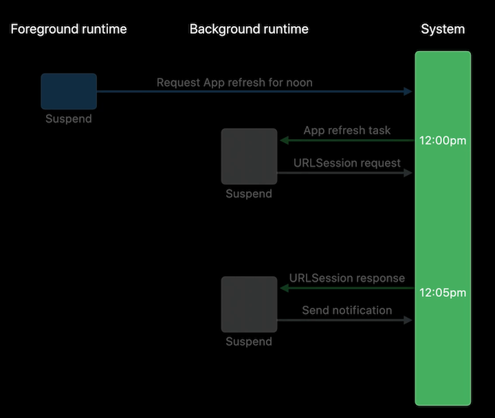
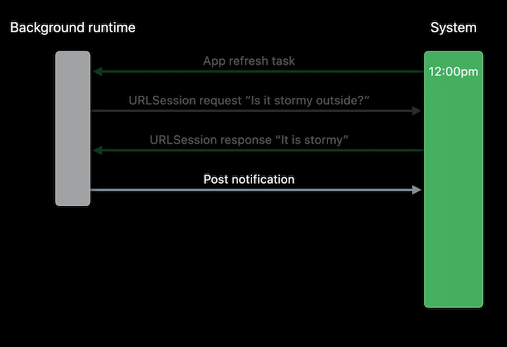
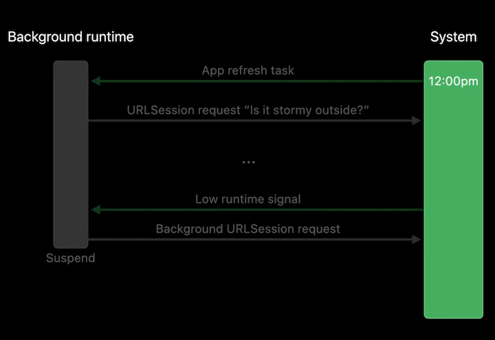

# [**Efficiency awaits: Background tasks in SwiftUI**](https://developer.apple.com/videos/play/wwdc2022/10142/)

### **Stormy: A storm photos app**

Background Tasks in SwiftUI

* Unified API for watchOS, iOS, tvOS, Mac Catalyst, and Widgets
* Async/await with Swift Concurrency
* Good platform citizen by default

App will prompt users via a notification, requesting the user take a photo of the sky

* Tapping on the notification, they will open up a camera view to take a photo of the sky
* Photo will upload in the background
* Another notification will be sent when the upload is finished



---

### **Background on Background Tasks**

App Refresh

* App gets a time limit for how long it can run in the background
* Background network requests allow a request to be completed immediately, and be woken again for additional background runtime when the request completes

Request Completes | Additional Time Required
----------------- | ------------------------
 | 

---

### **SwiftUI API in practice**

* Write a function to schedule background app refresh
	* Create a `BGAppRefreshTaskRequest` with an identifier and begin date, then submit it to `BGTaskScheduler`
* Call this functionality using the new `.backgroundTask()` scene modifier
	* The `.appRefresh` Task Type, which provides the app with limited background runtime at a desired date
	* Using the same identifer for the request and the handler lets the system identify which handler to call when the task is received by the application
* Many API, such as adding a notification, already support Swift Concurrency for async operations

```
@main
struct StormyApp: App {
	var body: some Scene {
		WindowGroup{
			ContentView)
		}
		.backgroundTask(.appRefresh("StormyNoon")) {
			scheduleAppRefresh()
			if await isStormy() {
				await notifyForphoto()
			}
		}
	}
}

func scheduleAppRefresh() {
	let today = Calendar.current.startOfDay(for: .now)
	let tomorrow = Calendar.current.date (byAdding: .day, value: 1, to: today)!
	let noonComponent = DateComponents (hour: 12)
	let noon = Calendar.current.date (byAdding: noonComponent, to: tomorrow)

	let request = BGAppRefreshTaskRequest(identifier: "StormyNoon")
	request.earliestBeginDate = noon
	try? BGTaskScheduler.shared.submit(request)
}

func notifyForPhoto() async {
	let notificationRequest=photoUploadNotification()
	do {
		try await UNUserNotificationCenter.current().add(notificationRequest)
	} catch {
		print ("Notification failed with error: \(String(describing: error))")
	}
}
```

---

### **Swift Concurrency**

The `isStormy()` function will utilize Swift Concurrency. Here is code that DOES NOT leverage all the functionality that we need

```
func isStormy () async -> Bool {
	let session = URLSession.shared
	
	let request = URLRequest (url: WEATHER URL)
	
	let response = try? await session.data(for: request)

	if let data = response {
		return parseWeather(data)
	}
	return false
}
```

To fix our code

* Will want to use a Background URLSession in case to ensure that it will send launch events to our application
	* Will create a URLSession from a background configuration instead of `URLSession.shared`
	* Set `sessionSendsLaunchEvents` property to true to tell the system that some network requests should run, even when the app is suspended
* When the background app runtime expires, the closure provided to the background task modifier will be cancelled, as will our network request
	* Instead of awaiting the result directly, we place our task into a `withTaskCancellationHandler` call and await that as well
		* The first block passed is the async procedure we'd like to run and await
		* The second, `onCancel`, is code that will run when the task is cancelled
			* We promote the network request to a background download task where we can call resume, triggering the background download that will persist even when the app is suspended
		* Since we are using the same URLSession to back the calls in both parts, we will not make the call twice. URLSession will de-duplicate any in-process requests under the hood.

```
func isStormy() async -> Bool {
	let config = URLSessionConfiguration.background(withIdentifier: "isStormy")
	config.sessionSendsLaunchEvents = true
	let session = URLSession(configuration: config)
	
	let request = URLRequest(url: WEATHER_URL)
	let response = await withTaskCancellationHandler {
		try? await session.data(for: request)
	} onCancel:
		let task = session.downloadTask(with: request)
		task.resume()
	}
	
	if let data = response {
		return parseWeather(data)
	}
	return false
}
```

Finally, we need to update our App to handle a launch from a background URL Session, by using the `.urlSession` task type

```
@main
struct MyApp: App {
	var body: some Scene {
		WindowGroup {
			ContentView()
		}
		.backgroundTask(.appRefresh("StormyNoon")) {
			scheduleAppRefresh()
			if await isStormy() {
				await notifyForPhoto()
			}
		}
		.backgroundTask(.urlSession("isStormy")) {
			// ...
		}
	}
}
```

* [**Meet Async/await in Swift**](https://developer.apple.com/videos/play/wwdc2021/10132) session from WWDC 2021
* [**Discover Concurrency in SwiftUI**](https://developer.apple.com/videos/play/wwdc2021/10019/) session from WWDC 2021