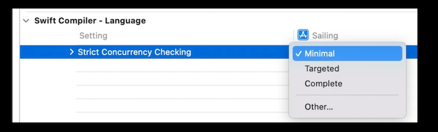

# **Eliminate data races using Swift Concurrency**

### **Task isolation**

A Task performs a specific job from start to finish

* Sequential
* Asynchronous
* Self-contained

```
Task.detached {
  let fish = await catchFish()
  let dinner = await cook(fish)
  await eat(dinner)
}
```

If the tasks are completely independent, we already have concurrency with no more code. If we need them to interact, we need to do more work. We'll start by defining a pineapple type to be passed between boats in this very silly analogy.

* We will use a struct, as that will help maintain isolation
* When we pass a pineapple from one boat to another, we pass a copy, so each boat has its own copy
* When we mutate a pineapple with the `slice` or `ripen` functions, we only affect that pineapple, not the copies - thus maintaining isolation

```
enum Ripeness {
  case hard
  case perfect
  case mushy(daysPast: Int)
}

struct Pineapple {
  var weight: Double
  var ripeness: Ripeness
  
  mutating func ripen() async { … }
  mutating func slice() -> Int { … }
}
```

Next we'll add a chicken class

* Because we use a class, the chicken is passed from one boat to another
* Both boats have a reference to the same chicken, so the boats are no longer independent

```
final class Chicken {
  let name: String
  var currentHunger: HungerLevel
  
  func feed() { … }
  func play() { … }
  func produce() -> Egg { … }
}
```

We need a way to know that it's safe to share pineapples amongst boats, but not chickens

* We also need a way for the compiler to check to insure that chickens aren't accidentally passed from one boat to another
* The `Sendable` protocol is used to describe types that can be safely shared across different isolation domains without creating data races
* Use conformance to specify which types are `Sendable`

```
struct Pineapple: Sendable { … } // conforms to Sendable because its a value type
class Chicken: Sendable { } // cannot conform to Sendable because its an unsynchronized reference type.
```

Modeling Sendable as a protocol allows us to describe the places where data is going to be shared across isolation domains

* Tasks exchange data when they return

```
// will get an error because Chicken is not Sendable
let petAdoption = Task {
  let chickens = await hatchNewFlock()
  return chickens.randomElement()!
}
let pet = await petAdoption.value
```

Wherever tasks can exchange data, there is a `Sendable` constraint

* The constraint comes from the definition of the Task struct itself, which specifies that the result type of a Task (called Success), must conform to the Sendable protocol.

```
struct Task<Success: Sendable, Failure: Error> {
  var value: Success {
    get async throws { … }
  }
}
```

The compiler will check for Sendable correctness at many different points

* `Sendable` types must be correct by construction, and cannot allow any shared data to be smuggled through them.
* Enums and structs generally define value types, which copy all of their instance data along with them to produce independent values.
	* They can be `Sendable` as long as all their instance data is also `Sendable`
* `Sendable` can be propagated through collections and other generic types using conditional conformance.
	* An array of `Sendable` types is `Sendable`
	* 

```
enum Ripeness: Sendable {
  case hard
  case perfect
  case mushy(daysPast: Int)
}

struct Pineapple: Sendable {
  var weight: Double
  var ripeness: Ripeness
}

// contains an array of Sendable types, therefore is Sendable
struct Crate: Sendable {
  var pineapples: [Pineapple]
}

// will throw an error "stored property 'flock' of 'Sendable'-conforming struct 'Coop' has non-sendable type '[Chicken]'"
struct Coop: Sendable {
  var flock: [Chicken]
}
```

Classes are reference types, so they can only be made Sendable under very narrow circumstances

* When a final class only has immutable storage
* It is possible to implement reference types that do their own internal synchronization, for example, by using a lock consistently. These types are conceptually Sendable, but there is no way for Swift to reason about that.
	* Use `@unchecked Sendable` to disable the compiler's checking

```
// Can be Sendable if a final class has immutable storage
final class Chicken: Sendable {
  let name: String
  var currentHunger: HungerLevel //'currentHunger' is mutable, therefore Chicken cannot be Sendable
}

// @unchecked can be used, but be careful!
class ConcurrentCache<Key: Hashable & Sendable, Value: Sendable>: @unchecked Sendable {
  var lock: NSLock
  var storage: [Key: Value]
}
```

Task creation involves executing a closure in a new, independent task

* Like sending off a rowboat from your boat.
* We can capture values from the original task and pass them into the new task, so we need Sendable checking to insure we don't introduce data races.

```
let lily = Chicken(name: "Lily")
Task.detached { @Sendable in
	lily.feed() // Compiler throws an error: "capture of 'lily' with non-sendable type 'Chicken'
}
```

**Sendable function types**

* `@Sendable` function types conform to `Sendable`
* Implies that values of that function type can be passed to other isolation domains and called there without introducing data races on their captured state
* Normally function types cannot conform to protocols, but Sendable is special because the compiler validates the semantic requirements for it.
	* There is similar support for tuples of Sendable types conforming to the Sendable protocol, which allows Sendable to be used throughout the entire language.

```
struct Task<Success: Sendable, Failure: Error> {
  static func detached(
    priority: TaskPriority? = nil,
    operation: @Sendable @escaping () async throws -> Success
  ) -> Task<Success, Failure>
}
```

Sendable checking maintains task isolation

* Tasks are isolated, independently executing asynchronous operations
* `Sendable` checking insures the tasks remain isolated
* Use `Sendable` constraints wherever values need to be shared

---

### **Actor isolation**

Actors isolate mutable state and all the code that touches it

* The `advanceTime` function below "lives" on the island, and has access to all of the island's state
* Provide mutual exclusion
	* Only one task can execute on an actor at a time
	* Other tasks must wait their turn
	* Because a task might have to wait to run code on an actor, entering into an actor is a potential suspension point marked by the `await` keyword

```
actor Island {
  var flock: [Chicken]
  var food: [Pineapple]

  func advanceTime()
}

func nextRound(islands: [Island]) async {
  for island in islands {
    await island.advanceTime()
  }
}
```

Non-Sendable data cannot be shared between a task and an actor

```
// Both examples cannot be shared because chickens are not Sendable
await myIsland.addToFlock(myChicken)
myChicken = await myIsland.adoptPet()
```

**Actor reference isolation**

* Actors isolate all their internal mutable state
* All actor types are implicitly `Sendable`
* Instance properties of an actor are isolated to that actor
* Instance methods on the actor or an extension of the actor are also isolated by default, like the advanceTime method below
* Closures that are not Sendable, such as the closure passed to the reduce algorithm, stay on the actor and are actor-isolated when they are in an actor-isolated context.
* The Task initializer also inherits actor isolation from its context, so the created task will be scheduled on the same actor as it was initiated from.
* A `detached` task **does not** inherit actor isolation from its context, because it is completely independent of the context where it was created
	* The code in the detached closure below is considered to be outside the actor because it needs to use `await` to refer to the isolated `food` property.
	* The term for this is `non-isolated` code

```
actor Island {
  var flock: [Chicken]
  var food: [Pineapple]

  func advanceTime() {
    let totalSlices = food.indices.reduce(0) { (total, nextIndex) in
      total + food[nextIndex].slice()
    }

    Task {
      flock.map(Chicken.produce)
    }

    Task.detached {
      let ripePineapples = await food.filter { $0.ripeness == .perfect }
      print("There are \(ripePineapples.count) ripe pineapples on the island")
    }
  }
}
```

**Non-isolated code**

Functions within actors can be explicitly marked as non-isolated

* You can explicitly make a function that's within an actor non-isolated by using the `nonisolated` keyword, putting it outside of the actor.
* Non-isolated async code executes on the global cooperative pool
* The code below will throw a compiler error, as an instance of the non-Sendable Chicken class is trying to leave the island

```
extension Island {
  nonisolated func meetTheFlock() async {
    let flockNames = await flock.map { $0.name }
    print("Meet our fabulous flock: \(flockNames)")
  }
}
```

* Non-isolated Synchronous code executes wherever it is called
	* `greet` is an operation that is non-isolated, synchronous code
	* In the `greetOne` method below, this works fine, because `greet` is called from the actor itself, and remains there
	* If instead we had a non-isolated async operation that calls `greet`, then `greet` will run there, and that will also work

```
func greet(_ friend: Chicken) { }

extension Island {
  func greetOne() {
    if let friend = flock.randomElement() { 
      greet(friend)
    }
  }
}

func greetAny(flock: [Chicken]) async {
  if let friend = flock.randomElement() { 
    greet(friend)
  }
}
```

Actor isolation summary

* Each actor instance is isolated from everything else in the program
* Only one task can execute on an actor at a time
* `Sendable` checking occurs whenever you *enter* or *exit* and actor
* Actors themselves are *Sendable*

**MainActor**

MainActor represents the main thread, where all of the drawing and interaction for your UI occurs

* Main actor carries a lot of state related to the program's UI
* Lots of UI framework code and app code needs to run on it
* It can still only run a single job at a time
	* Need to be careful not to putt too much work or long running work on the main actor
* `@MainActor` can be applied to a function or closure to indicate that the code must run on the main actor
	* That code is isolated to the main actor
* The Swift compiler will guarantee that main-actor-isolated code will only be executed on the main thread
	* Uses the same mechanism that ensures mutually exclusive access to other actors
	* If one calls `updateView` from a context that isn't isolated to the main actor, it will need to introduce an “await” to account for the switch over to the main actor

```
@MainActor func updateView() { … }

Task { @MainActor in
	// …
  view.selectedChicken = lily
}

nonisolated func computeAndUpdate() async {
  computeNewValues()
  await updateView()
}
```

@MainActor can also be applied to types

* Instances of the type will be isolated to the main actor
* Properties of the type are only accessible while on the main actor
* Methods are isolated unless explicitly opted out
* References to main actor classes are Sendable, because their data is isolated
* Suitable for Views and View Controllers

```
@MainActor
class ChickenValley: Sendable {
  var flock: [Chicken]
  var food: [Pineapple]

  func advanceTime() {
    for chicken in flock {
      chicken.eat(from: &food)
    }
  }
}
```

**Architecting your app with actors**

* Views and View controllers should be on the main actor
* Other program logic should be separated from that main actor, using other actors to safely model shared state and tasks to describe independent work
* Tasks can shuttle between the main actor and other actors as necessary
* Tools to help can be seen in the [**Visualize and Optimize Swift Concurrency**](Visualize and optimize Swift concurrency.md) session

---

### **Atomicity**

* Actors run one task at a time
* When you stop running on an actor, it can run other tasks
* This requires you to consider your actor's invariants carefully around await statements
	* Otherwise, you can end up with a high-level data race where the program is in an unexpected state, even though no data is actually corrupted
* Below, we have a `deposit` function that is outside of an actor, so it's non-isolated, async code
	* It gets a copy of the island's food, which happens in the actor
	* Next, it adds the pineapples to the food copy it got from the actor
	* Finally, it copies that total food back to the island
	* The problem is that all of the code does not happen on the island - so `island.food` could change if another task ran code to mutate it in the actor
	* The compiler will generate an error on the `await island.food = food` method, stating the `actor-isolated property 'food' can not be mutated from a non-isolated context`

```
func deposit(pineapples: [Pineapple], onto island: Island) async {
   var food = await island.food
   food += pineapples
   await island.food = food
}
``` 

The solution is to rewrite the `deposit` function as synchronous code on the actor:

```
extension Island {
   func deposit(pineapples: [Pineapple]) {
      var food = self.food
      food += pineapples
      self.food = food
   }
}
```

Think transactionally

* Identify synchronous operations that can be interleaved
* Keep async actor operations simple

---

### **Ordering**

* Programs often rely on handling events in a consistent order
	* User Input
	* Messages from a server
* Effects of each event should appear in the order they happened
* Actors are not strictly first-in, first-out
	* Actors execute the highest-priority work first
	* Important semantic difference vs. serial Dispatch queues

**Tools for ordering**

* Tasks run code in order
* `AsyncStreams` deliver elements in order

```
for await event in eventStream {
  await process(event)
}
```

**Eliminating data races**

* Isolation with `Sendable` checking eliminates data races
* Staged rollout of `Sendable` checking through Swift 5 for completion in Swift 6
* Swift 5.7 introduces a build setting to specify how strictly the Swift compiler should check for Sendability
	* In Swift 5, the compiler will show a warning for Sendability issues (Swift 6 will show an error)
	* Default setting is `Minimal`, compiler only diagnoses places where one has explicitly marked something as `Sendable` 
	* `Targeted` setting is stricter, checking for code that uses Swift Concurrency features
		* For example, attempts to capture values of a non-Sendable type in a newly created Task
		* `@preconcurrency` will silence Sendable warnings for types that come from a module that doesn't support concurrency yet
		* Once the module is updated, one of two things will happen
			* non-Sendable objects will be made Sendable, and `@preconcurrency` can be removed
		* Objects will be known to be non-Sendable, and the warnings will show again
	* `Complete` checking approximates Swift 6 data-race elimination
		* Checks everything that `minimal` and `targeted` check, but for all code in the module
		* 



```
// Minimal checking
import FarmAnimals
struct Coop: Sendable {
  var flock: [Chicken] // will throw a warning that Chicken is non-Sendable
}


// Targeted checking
@preconcurrency import FarmAnimals

func visit(coop: Coop) async {
  guard let favorite = coop.flock.randomElement() else {
    return
  }

  Task {
    favorite.play() // Without `@preconcurrency` above, this will show a warning with that Chicken is non-Sendable
  }
}


// Complete checking
import FarmAnimals

func doWork(_ body: @Sendable @escaping () -> Void) {
  DispatchQueue.global().async {
    body() // Without `@Sendable` two lines above, compiler will show a warning here indicating `capture of 'body' with non-sendable type '() -> Void' in a '@Sendable' closure`
  }
}

func visit(friend: Chicken) {
  doWork {
    friend.play() // With `@Sendable` in the `doWork` function, compiler will show a `capture of 'friend' with non-sendable type 'Chicken' in a '@Sendable' closure` warning here
  }
}
```

The road to data-race safety

* Enable stricter concurrency checking one module at a time
* Use `@precoconcurrency` to suppress warnings from another module 