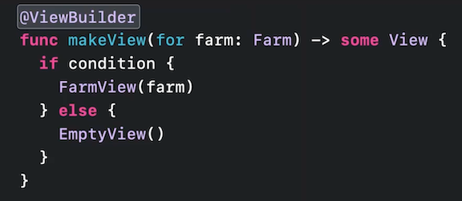

# [**Embrace Swift generics**](https://developer.apple.com/videos/play/wwdc2022/110352/)

### **Model with concrete types**

Want to write some code to simulate a farm. We will start with concrete types

```
struct Cow
	func eat(_food: Hay) { ... }
}

struct Hay {
	static func grow() -> Alfalfa { ... }
}

struct Alfalfa {
	func harvest() -> Hay { ... }
}

struct Farm {
	func feed(_ animal: Cow) {
		let alfalfa = Hay.grow()
		let hay = alfalfa.harvest()
		animal.eat(hay)
	}
}
```

Now we want to add more animals...

```
struct Horse
	func eat(_food: Carrot) { ... }
}

struct Chicken
	func eat(_food: Grain) { ... }
}

struct Farm {
	func feed(_ animal: Cow) { ... }
	
	func feed(_ animal: Horse) {
		let root = Carrot.grow()
		let carrot = root.harvest()
		animal.eat(carrot)
	}
	
	func feed(_ animal: Chicken) {
		let wheat = Grain.grow()
		let grain = wheat.harvest()
		animal.eat (grain)
	}
```

Already we have a lot of code that is mostly repeated. For every animal/food that we grow, we essentially need to copy/paste the structs for another animal/food and edit it to create the new implementation.

---

### **Identify common capabilities**

Each animal has the ability to eat some type of food

* Each animal does have a different way of eating, though, so each implementation will have differences in behavior.
* We want abstract code to call the eat method, and have that code behave differently depending on the concrete type it's operating on

**Polymorphism**

Allows one piece of code to have many behaviors

* Function overloading achieves ad-hoc polymorphism
	* the same function call can mean different things depending on the argument type (what we had above)
	* Not a general solution, leads to repetitive code
* Subtypes achieve subtype polymorphism
	* Code operating on a super-type can have different behavior based on the specific subtype the code is using at runtime
* Generics achieve parametric polymorphism
	* Uses type parameters to allow writing one piece of code that works with different types
	* Concrete types themselves are used as arguments

Let's try subtype polymorphism...

```
class Animal {
	func eat(_ food: ???) { fatalError( "Subclass must implement 'eat'") }
}

class Cow: Animal {
	override func eat(_ food: Hay) {
		// Eat the hay
	}
}

class Horse: Animal {
	override func eat(_ food: Carrot) {
		// Munch on the carrot
	}
}

class Chicken: Animal {
	override func eat(_ food: Grain) {
		// Peck at the grain
	}
}
```

One major problem already - we don't have a parameter type for the `eat` method on `Animal` (see `???` above)

Other issues:

* Using classes forced us into reference semantics, even though we don't need/want any state to be shared between animal instances
* Requires subclasses to override methods in the base classes - but forgetting to do this would not be caught until runtime
* Bigger problem - each animal eats a different type of food
	* We could let the method take `Any` - this creates more code, and runtime failures that cannot be caught at compile time
	* We could instead express the animal's feed type in a type-safe way by introducing a `Food` parameter
		* The Food type parameter would need to be elevated to the declaration of the Animal class, so all references to the Animal class would need to reference the food type, whether it dealt with food or not
		* Further, the more types we add that are specific to each animal (e.g. `Habitat` and `Commodity` would require us to add those each reference for every animal


We've identified the common capabilities of each animal as:

* A specific type of food
* An operation for consuming some of its food

---

### **Build an interface**

We use a `protocol` to write the interface, to separate ideas of what the type does from the implementation details

We will start with a protocol named `Animal`, and write it's protocol requirements

* the specific type of food will map to an `associatedtype`
	* An `associatedtype` serves as a placeholder for a concrete type
	* Depend on the specific type that conforms to the protocol
	* Relationship is guaranteed, so each instance of a specific animal always has the same type of food
* the operation for consuming food will map to a method
	* Accept a parameter of the animal's feed type
	* Protocol does not have an implementation of the method, and concrete animal types are required to implement it
	* The compiler checks that all requirements are met

```
protocol Animal {
	associatedtype Feed: AnimalFeed
	func eat(_ food: Feed)
}

struct Cow: Animal {
	func eat(_ food: Hay) {}
}

struct Horse: Animal {
	func eat(_ food: Carrot) {}
}

struct Chicken: Animal {
	func eat(_ food: Grain) {}
}
```

---

### **Write generic code**

Now we can write a feed method using the Animal protocol in the farm struct. Initial Attempt:

```
struct Farm {
    func feed<A: Animal>(_ animal: A) { ... }
}
```

We can simplify this, though, by expressing the abstract type in terms of the protocol conformance:

* Use the `some` keyword
* Indicates a specific type you are working with
* Always followed by a conformance requirement (in this case, the `Animal` protocol)
* Can be used in parameter and result types

```
struct Farm {
	func feed(_ animal: some Animal) {
		
	}
}
```

**Opaque types**

* An abstract type that represents a concrete type
	* The specific concrete type that is substituted in is called the underlying type, which is fixed for the scope of the value
* Whether using `some` or <T: _>, `both declare an opaque type`
* Can be used for both inputs an outputs
	* can be declared in parameter or result position
* Named type parameters are always declared on the input side, so the caller decides the underlying type, and the implementation uses the abstract type


**Inferring the underlying type for `some`**

Local variables:

* Inferred from the value on the right hand side from assignment
* Must always have an initial value, or you will get a compiler error
* Must be fixed for the scope of the value (cannot change an `Animal` variable from `Horse` to `Chicken`)

Parameters:

* Inferred from the argument value at the call site (new in Swift 5.7)
* The underlying type only needs to be fixed for the scope of the parameter, so each call can provide a different argument type

Local Variable | Parameters
-------------- | ----------
 | 

Results:

* Underlying type is inferred from the return value in the implementation
* A method or computed property can be called from anywhere in the program, so the scope is global
	* Underlying return type must be the same across all return statements
	* Will report a mismatched type error if they don't
	* @ViewBuilder will enable the Result to be built for us

Result | ViewBuilder
------ | -----------
 | 

When you need to refer to the opaque type multiple times in the function signature, then the name type parameter comes in handy


Now we can build out the final implementation of the Feed method:

```
protocol Animal {
	associatedtype Feed: AnimalFeed
	func eat(_ food: Feed)
}

struct Farm {
	func feed(_ animal: some Animal) {
		let crop = type(of: animal).Feed.grow()
		let produce = crop.harvest()
		animal.eat(produce)
	}
}
```

To learn how the other farm protocols were crafted to express the relationship between the animal feed type and its plant, see [**Design protocol interfaces in Swift**](Design protocol interfaces in Swift.md) session

Let's add a method to feed all animals:

* We want to make a function that accepts an array that can hold different types of Animals
* We cannot use `some`, because all animals in the array will need to be the same type
* We can instead use the `any` keyword
	* `any Animal` can store any type of underlying `Animal`
	* `any` is always followed by conformance requirement

Sometimes, a value has to be allocated elsewhere because it is too large, so a pointer is stored. 

* The static type `any Animal` that can dynamically store any concrete `Animal` type is called an existential type. 
* The strategy for using different concrete types is called type erasure.
* The concrete type is "erased" at compile time, and is only known at runtime
* Same static type, but different dynamic types


The following won't work:

* Will provide a "Member 'eat' cannot be used on value of type 'any Animal'"
* Because we've eliminated the type-level distinction between specific animal types, we've also eliminated all type relationships that depend on the specific animal type, including associated types.
* We can't know what type of feed this animal expects

```
struct Farm {
	func feed(_ animal: some Animal) { ... }

	func feedAll(_ animals: [any Animal]) {
		for animal in animals {
			animal.eat(food: Animal.Feed)
		}
	}
}
```

We need to get back into a contact where the specific type of animal is fixed

* Instead of calling `eat` directly on `any Animal`, we need to call the `feed` method that expects `some Animal`
* We use "unboxing" to get the value stored inside of `any Animal`
* This gives us flexible storage where we need it, but still have the ability to get back to a context where we have the full static type system by fixing the underlying type for the scope of a function

```
struct Farm {
	func feed(_ animal: some Animal) { ... }

	func feedAll(_ animals: [any Animal]) {
		for animal in animals {
			feed(animal)
		}
	}
}
```

**Capabilities of `some` and `any`**

* `some`
	* Holds a fixed concrete type
	* Guarantees type relationships
* `any`
	* Holds an arbitrary concrete type
	* Erases type relationships

Write `some` by default - you only pay the cost of type erasure when you need storage flexibility it provides