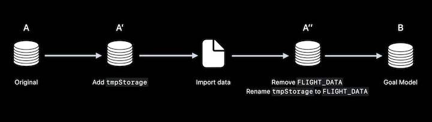
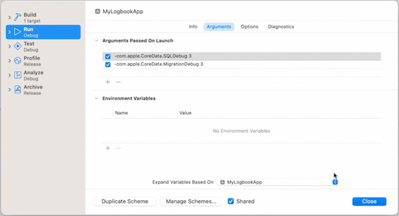

# **Evolve your Core Data schema**

### **What is a schema migration**

* Your app's data model may require changes
	* Necessitates update of the storage schema
* Without migrating your schema, your app won't work
	* Core Data will refuse to open your persistent store
	* `NSPersistentStoreIncompatibleVersionHashError`

---

### **Strategies for migration**

* Core Data has built-in migration tools
* Referred to as lightweight migration
	* Preferred method of migration
	* Automatically analyzes and infers the necessary migration changes
	* Performed at runtime
		* Core Data looks for the models in the bundles returned by .allBundles and .allFrameworks methods of the NSBundle class
		* Lightweight migration then generates a mapping model to materialize the changes you've made in your app in your database schema
	* Changes have to fit an obvious migration pattern

**Lightweight operations**

* Lightweight operations involving attributes include
	* Adding an attribute
	* Removing an attribute
	* Making a non-optional attribute optional
	* Making an optional attribute non-optional
		* And defining a default value
	* Renaming an attribute
		* Set the renaming identifier in the destination model to the name of the corresponding attribute in the source model
			* Available in the Xcode Data Model Editor
* Can also make changes to Relationships
	* Add a new relationship
	* Remove a relationship
	* Rename a relationship (similar to renaming an attribute)
	* Change cardinality
		* a to-one to a to-many, non-ordered to-many to an ordered to-many, and vice versa
* Entities
	* Add an entity
	* Remove an entity
	* Rename an entity
	* Create new parent and child entities
	* Move attributes up and down within an entity hierarchy
	* Modify the entity hierarchy (move into or our of a hierarchy)
	* *Cannot* merge entity hierarchies

Lightweight migration is controlled by two options keys:

* `NSMigratePersistentStoresAutomaticallyOption`
* `NSInferMappingModelAutomaticallyOption`
* The presence of these keys set to a `true` when the store is added to the persistent coordinator will cause Core Data to perform lightweight migration automatically if it detects the persistent store no longer matches the current model
	* When using `NSPersistentContainer` and `NSPersistentStoreDescription`, these keys are set automatically

Lightweight migration can be requested by setting an options dictionary setting the following to `YES`

* `NSMigratePersistentStoresAutomaticallyOption`
* `NSInferMappingModelAutomaticallyOption`
* Useful when using an alternative API such as `NSPersistentStoreCoordinator.addPersistentStore(type:configuration:at:options:)`
* Example in code below
* Make the changes to the data model in the same model file
	* No need to create a new version of the model to make changes

```
// Migrate your Core Data schema

import CoreData

let storeURL = NSURL.fileURL(withPath: "/path/to/store")
let momURL = NSURL.fileURL(withPath: "/path/to/model")
guard let mom = NSManagedObjectModel(contentsOf: momURL) else { 
    fatalError("Error initializing managed object model for URL: \(momURL)")
}
let coordinator = NSPersistentStoreCoordinator(managedObjectModel: mom)
do {
    let opts = [NSMigratePersistentStoresAutomaticallyOption: true,
                      NSInferMappingModelAutomaticallyOption: true]

    try coordinator.addPersistentStore(ofType: NSSQLiteStoreType,
                                       configurationName: Optional<String>.none,
                                       at: storeURL,
                                       options: opts)
} catch {
    fatalError("Error configuring persistent store: \(error)")
}
```

To determine if changes are lightweight:

* Use `NSMappingModel.inferredMappingMOdel(forSourceModel:destinationModel:)`
* Returns a valid model if Core Data can migrate, nil if not

**Staged lightweight migrations**

* Sometimes changes exceed the capability of lightweight migration
* Lightweight migration can still be used by doing it in stages
* Decompose the task into a series of migrations that are lightweight (*Migration decomposition*)
* Automate by serially migrating unprocessed models
	* An event loop could be built that opens the persistent store with the lightweight migration options set and iteratively steps through each unprocessed model in a serial order, and Core Data will migrate the store
* If you perform app-specific logic during your migrations, that logic must be "restartable" in the event the migration is interrupted due to the process terminating



---

### **CloudKit schema migration**

* Core Data + CloudKit requires a shared data model
* Model is defined in Core Data
* Model used to generate CloudKit schema
* Deployed form Development to Production
* Core Data + CloudKit has limitations:
	* Unique constraints aren't supported
	* `Undefined` and `objectID` attribute types are unavailable
	* All relationships must be optional and have an inverse relationship
	* CloudKit does not support the Deny deletion rule

**CloudKit schema**

* Schema can be modified in Development
* Schema is immutable in Production
* Cloudkit schema migration is more restrictive
* Supported operations
	* Adding new fields
	* Adding new record types
	* *Cannot* modify or delete existing record types or fields
* Migration only changes the store file
* Does not change the CloudKit schema
	* Still need to run the schema initializer in the Development environment and promote those changes to Production using the CloudKit console
* The latest version of the app will know about any new additions to the schema
	* Old versions of the app won't know about the new fields or record types

**CloudKit migration strategies**

* CloudKit schema is additive
	* Consider the effects on older versions
* Incrementally add new files to existing record types
* Version your entities by including a version attribute
	* Use a fetch request to select only the records that are compatible with the current version of the app
* Use a completely new container using `NSPersistentCloudKitContainerOptions` to associate the new store with a new container
* Test your app across different model versions

When migrating, you can debug by setting the `-com.apple.CoreData.SQLDebug` and `-com.apple.CoreData.MigrationDebug` environment variables in the schema editor to cause Core Data to log the steps it takes



*Last ~5 minutes is a migration demo*


