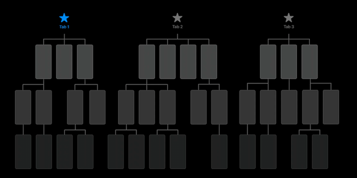
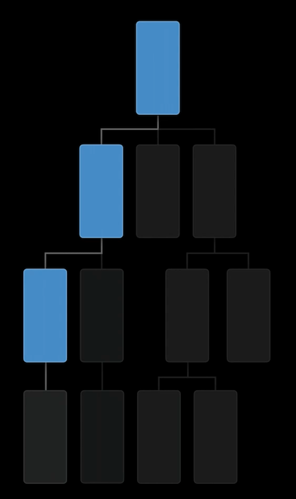
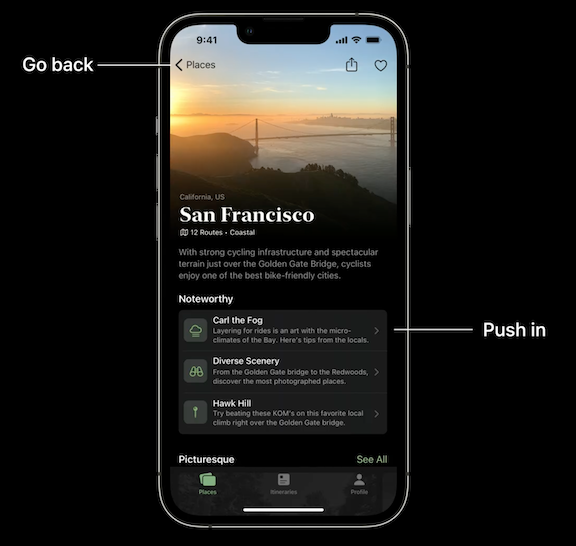
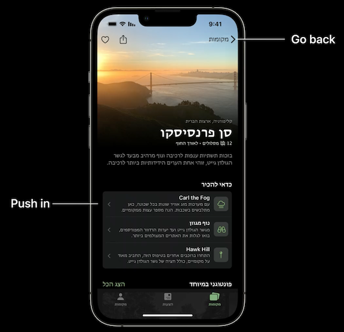
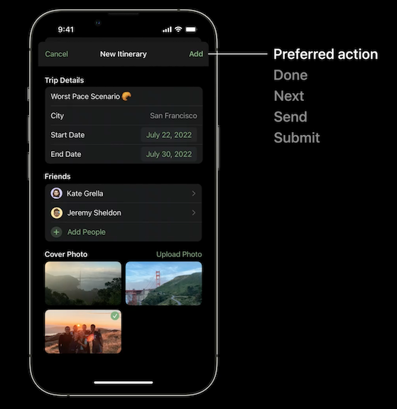

# [**Explore navigation design for iOS**](https://developer.apple.com/videos/play/wwdc2022/10001/)

### **Tab bars**

Use tabs to reflect your information hierarchy

* Top level content goes in the tab bar icons
* Balance features throughout tabs
	* Don't overload too much info into one tab
	* Think about why people use your app, what features they want to use, and let that help dictate what goes in each tab based on separate functionality
* Avoid duplicating features/functionality into a single tab (such as a home tab)
	* It can make sense to duplicate content, sorted/filtered/etc. in a different way in your app, but duplicating functionality can be confusing
* Keep tabs persistent throughout your app (don't hide it when navigating deep into the app)
* Use clear and concise labels for each tab

---

### **Hierarchical navigation**

* Use to traverse your app's hierarchy
	* Reinforces the relationship between top-level and secondary content
* Keep the tab bar anchored to the bottom of the screen when navigating the hierarchy
* Use the navigation bar to orient people
	* The back button reflects the title of the screen the user just came from
* Use with a disclosure indicator
* When navigating frequently between content
	* e.g. the messages app, easy to move back and forth between conversations

Left-to-right languages | Right-to-left languages
----------------------- | -----------------------
 | 

---

### **Modal presentations**

* Present from the bottom of the screen
	* Intentionally interrupts information hierarchy
	* Reinforces focus on the task
* Use for self-contained tasks
	* Simple task - e.g. creating an event or a reminder
	* Multi-step task - e.g. adding transit card to wallet
	* Full screen content - e.g. article, video, etc.
* Dismiss modal with `cancel` and preferred actions
	* Left action (cancel) indicates abandoning the workflow
		* Might want to display an alert/action sheet here to show user they will lose data
	* Having a preferred action be inactive shows that fields are required in order to continue
* Use close for minimal interaction
	* Use when there is no user interaction in the modal, so the user doesn't need to choose between saving/cancelling
* Limit modals over modals
	* You can have sub-navigation (popovers, push actions)
	* Sometimes required, e.g. adding a photo from the photo library

