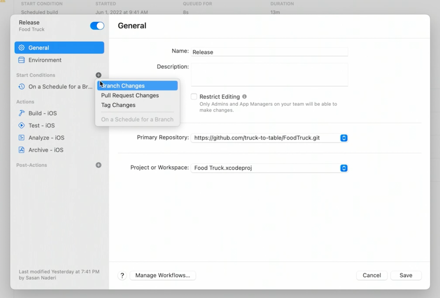

# **Get the most out of Xcode Cloud**

### **Xcode Cloud overview**

* Continuous integration and delivery service
* Brings together TestFlight, App Store Connect, and Testing in an online service
* Meet Xcode Cloud #session from 2021

---

### **Review an existing Workflow**

Dashboard

* Overview shows when build was started, and how long each stage took in the build process

---

### **Xcode Cloud usage dashboard**

Usage Overview

Usage Trends

You can see how much time each of the workflows is using

---

### **Best Practices**

Check out Explore Xcode Cloud Workflows #session from 2021

**Avoid unintended builds**

You can define start conditions based on:

* Branch changes
* Pull request changes
* Tag changes
* On a schedule for a branch

 
You can exclude files/folders from triggering a build

 
**Select reasonable test destinations**

Make sure you are not testing on unnecessary test devices

All the devices | Just the recommended set
--------------- | ------------------------
 | 

**Skip builds**

* put `[ci skip]` tag in your commit message to skip a CI build

**Optimize custom scripts and tests**

* Check out the Customize your advanced Xcode Cloud workflows #session from 2021
* Author fast and reliable tests for Xcode Cloud #session

---

**Revisit optimized build**

Making the changes above did the following to the original workflow:

* build duration was 1m less
* usage was 4 minutes less
* Integration builds trended -7% time

For teams, check out the Deep Dive into Xcode Cloud for Teams #session from 2021
