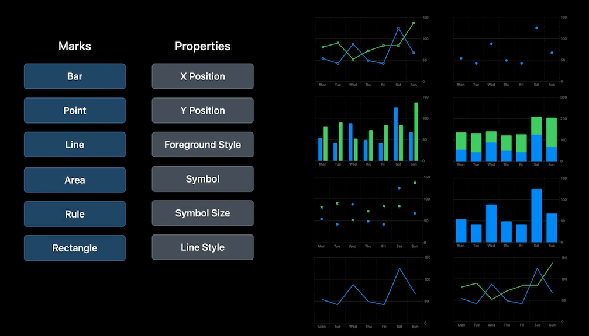

# [**Hello Swift Charts**](https://developer.apple.com/videos/play/wwdc2022/10136/)

* Apple-designed charts
* uses same declarative syntax of SwiftUI
* By providing data, you get the graphics and axes labels for free
* support dark mode, dynamic type, device screen size, high-contrast, localization,  and more by default

**Static chart**

```
import Charts
import SwiftUI

struct StylesDetailsChart: View {
	var body:	some View {
		Chart {
			BarMark(
				x: .value ("Name", "Cachapa"),
				y: .value("Sales', 916
			)
			BarMark(
				x: .value ("Name", "Injera"),
				y: .value("Sales", 850)
			)
		}
	}
}
```


**Data-driven chart**

```
import Charts
import SwiftUI

struct Pancakes: Identifiable {
	let name: String
	let sales: Int
	
	var id: String { name }
}

let sales: [Pancakes] = [
	.init (name :"Cachapa", sales: 916)
	.init(name: "Injera", sales: 850)
	.init (name : "Crêpe", sales: 802), 
	.init (name: "Jian Bing", sales: 753),
	.init (name :	"Dosa", sales: 654),
	.init (name : "American", sales: 618)
]

struct StylesDetailsChart: View {
	var body: some View {
		Chart(sales) { element in
			BarMark(
				x: .value("Sales", element.sales)
				y: .value ("Name", element.name)
			)
		}
	}
}
```


**Voiceover**

* charts get voiceover support by default
* the name of the item and the quantity will be spoken by default when navigating the chart via voiceover
* support audiograph feature by default as well

---

### **Build three version of a chart**


**Chart 1**

```
import Charts
import SwiftUI

struct SalesSummary: Identifiable {
	let weekday: Date
	let sales: Int
	
	var id: Date { weekday }
}

let cupertinoData: [SalesSummary] = [
	/// Monday
	.init (weekday: date (2022, 5, 2), sales: 54),
	/// Tuesday
	.init (weekday: date (2022, 5, 3), sales: 42)
	/// Wednesday
	.init (weekday: date (2022, 5, 4), sales: 88),
	/// Thursday
	.init (weekday: date (2022, 5, 5), sales: 49),
	/// Friday
	.init (weekday: date(2022, 5, 6), sales: 42),
	/// Saturday
	•init (weekday: date (2022, 5, 7), sales: 125),
	/// Sunday
	.init (weekday: date (2022, 5, 8), sales: 67)
]

struct CupertinoDetailsChart: View {
	var body: some View {
		Chart(cupertinoData) { element in
			BarMark(
				x: .value ("Day", element.weekday, unit: .day),
				y: .value("Sales", element.sales)
			)
		}
	}
}
```

**Chart 2**

```
import Charts
import SwiftUI

let sfData: [SalesSummary] = [
	.init(weekday: date(2022, 5, 2), sales: 81),
	.init(weekday: date(2022, 5, 3), sales: 90),
	.init (weekday: date (2022, 5, 4), sales: 52),
	.init (weekday: date (2022, 5, 5), sales: 72),
	.init (weekday: date (2022, 5, 6), sales: 84),
	.init (weekday: date (2022, 5, 7), sales: 84),
	.init (weekday: date (2022, 5, 8), sales: 137)
]

struct LocationsToggleChart: View {
	@State var city: City = .cupertino

	var data: [SalesSummary] {
		switch city {
		case .cupertino:
			return cupertinoData
		case .sanFrancisco:
			return sfData
		}
	}
	
	var body: some View {
		VStack {
			Picker("City", selection: $city) {
				Text("Cupertino").tag(City.cupertino)
				Text("San Francisco').tag(City.sanFrancisco)
			}
			.pickerStyle(.segmented)

			Chart(data) { element in
				BarMark(
					x: .value ("Day", element.weekday, unit: .day),
					y: .value("Sales", element.sales)
				)
			}
		}
	}
}
```

**Chart 3**

```
import Charts
import SwiftUI

struct Series: Identifiable {
	let city: String
	let sales: [SalesSummary]
	
	var id: String { city }
}

let seriesData: [Series] = [
	.init(city: "Cupertino", sales: cupertinoData),
	.init(city: "San Francisco",sales: sfData),
]

struct LocationsDetailsChart: View {
	var body: some View {
		Chart(seriesData) { series in
			ForEach(series.sales) { element in
				LineMark(
					x: .value ("Day", element.weekday, unit: .day),
					y: .value("Sales", element.sales)
				)
				.foregroundStyle(by: value("City", series.city))
				.symbol(by: .value("City", series.city))
			}
		}
	}
}
```

---

### **Marks + Mark Properties**

* Chart can have multiple marks (points and lines, for example)
* Marks and Properties are extensible
* You can add custom marks
* [**Swift Charts: Raise the bar**](Swift Charts - Raise the bar.md) session


