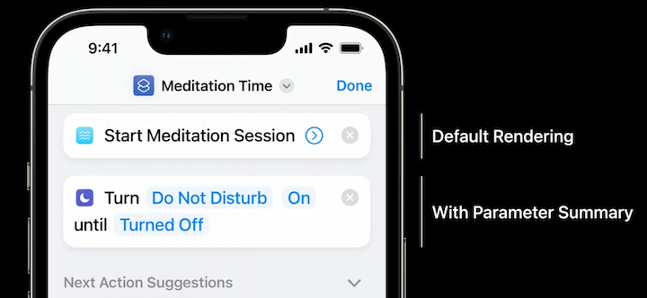
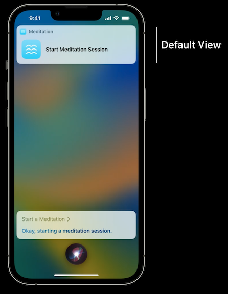
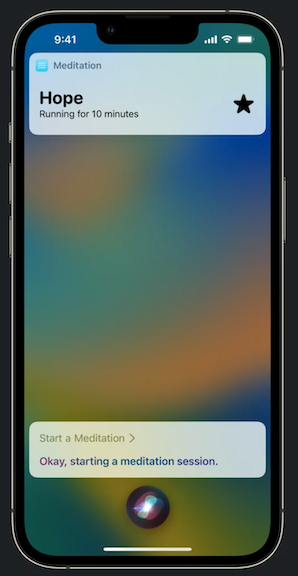
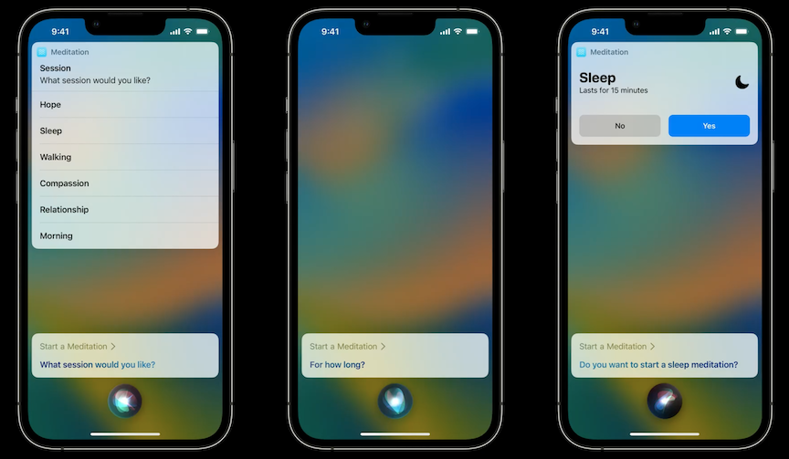
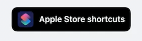

# **Implement App Shortcuts with App Intents**

### **Overview**

* App Shortcuts require no user setup
* Available as soon as your app is installed
* Can be run from Shortcuts, Spotlight, and Siri

---

### **Implement App Shortcuts**

* App Shortcuts are built with App Intents
* App Intents are implemented in Swift
* `AppShortcutsProvider` defines phrases for your Shortcuts
* Required to include app's name in the trigger phrase
* Basic Intent has two requirements:
	* A title
	* A method named `perform()`
* Make sure to localize strings

```
// StartMeditationIntent creates a meditation session.

import AppIntents

struct StartMeditationIntent: AppIntent {
    static let title: LocalizedStringResource = "Start Meditation Session"

    func perform() async throws -> some IntentResult & ProvidesDialog {
        await MeditationService.startDefaultSession()
        return .result(dialog: "Okay, starting a meditation session.")
    }
}
```

Shortcuts will show a default rendering (title), but you can add a parameter summary to customize the look of the intent and show values inline.



App Shortcuts are defined in Swift code by implementing the `AppShortcutsProvider` protocol

* To implement the protocol, create a single getter that returns all the app shortcuts I want to set up for the user
* In total, your app can have a maximum of 10 app shortcuts

```
// An AppShortcut turns an Intent into a full fledged shortcut
// AppShortcuts are returned from a struct that implements the AppShortcuts
// protocol

import AppIntents

struct MeditationShortcuts: AppShortcutsProvider {
    static var appShortcuts: [AppShortcut] {
        AppShortcut(
            intent: StartMeditationIntent(),
            phrases: ["Start a \(.applicationName)"]
        )
    }
}
```

Be sure to provide alternate (localized) phrases to initialize your shortcut via Siri

* Shortcuts that launch the app *will not* show up in Spotlight

```
// An AppShortcut turns an Intent into a full fledged shortcut
// AppShortcuts are returned from a struct that implements the AppShortcuts
// protocol

import AppIntents

struct MeditationShortcuts: AppShortcutsProvider {
    static var appShortcuts: [AppShortcut] {
        AppShortcut(
            intent: StartMeditationIntent(),
            phrases: [
                "Start a \(.applicationName)",
                "Begin \(.applicationName)",
                "Meditate with \(.applicationName)",
                "Start a session with \(.applicationName)"
            ]
        )
    }
}
```

Siri has a default view when running an intent, but you can show custom views

* App Intents leverage SwiftUI, similar to Widgets
* Don't need to build a separate UI extension for your custom view, just return a view when running your intent
* Can't include interactivity or animations
* Your app can display custom UI at multiple steps
	* Value confirmation
	* Intent confirmation
	* Once the intent is finished

```
// Custom views give your intent more personality
// and can convey more information

func perform() async throws -> some ProvidesDialog & ShowsSnippetView {
    await MeditationService.startDefaultSession()

    return .result(
        dialog: "Okay, starting a meditation session.",
        view: MeditationSnippetView()
    )
}
```

Default View | Custom View
------------ | -----------
 | 

---

### **Add parameters**

To use parameters, you need to create an entity conforming to `AppEntity`

* Requires an `id` (can be a UUID, String, Int, and a few others)
* Provide `typeDisplayName` and `displayRepresentation`
* A `defaultQuery`
	* Requires creating a query that conforms to `EntityQuery`
* Update your AppIntent with an `@Parameter` property
	* lets App Intents know that the session property is part of the intent

```
// An entity is a type that can be used as a parameter
// for an AppIntent.

import AppIntents

struct MeditationSession: AppEntity {
    let id: UUID
    let name: LocalizedStringResource

    static var typeDisplayName: LocalizedStringResource = "Meditation Session"
    var displayRepresentation: AppIntents.DisplayRepresentation {
        DisplayRepresentation(title: name)
    }

    static var defaultQuery = MeditationSessionQuery()
}

// Queries allow the App Intents framework to
// look up your entities by their identifier

struct MeditationSessionQuery: EntityQuery {
    func entities(for identifiers: [UUID]) async throws -> [MeditationSession] {
        return identifiers.compactMap { SessionManager.session(for: $0) }
    }
}

// Adding a parameter to an intent allows you to prompt the user
// to provide a value for the parameter

struct StartMeditationIntent: AppIntent {

    @Parameter(title: "Session Type")
    var sessionType: SessionType?

    // ...

}
```

After adding this parameter to the intent, we need to ask the user which session they'd like to run

* App Intents framework has support for asking users follow-up questions to gather values for intent parameters
* When run from Siri, Siri will speak out the question and ask the use to speak the answer
* In Spotlight/Shortcuts, the user will be presented with the same prompt in a touch-driven UI
* Three types of value prompts
	* Disambiguation asks the user to pick from a distinct list
	* Value prompts allow you to ask the user for an open-ended value
	* Confirmation asks the user to verify a particular value
	* Check out [**Design App Shortcuts**](Design App Shortcuts.md) session for more insight into designing intents



To prompt for a value, add code to the `perform()` method

* Present `requestDisambiguation` to get list of session types
* Present `dialog` to let the user know the intent has started

```
// Prompting for values can be done by calling methods
// on the property's wrapper type.

func perform() async throws -> some ProvidesDialog {
    let sessionToRun = self.session ?? try await $session.requestDisambiguation(
           among: SessionManager.allSessions,
           dialog: IntentDialog("What session would you like?")
       )
    }
    await MeditationService.start(session: sessionToRun)
    return .result(
       dialog: "Okay, starting a \(sessionToRun.name) meditation session."
    )
}
```

**Parameterized phrases**

* App Shortcuts support predefined parameters
	* Cuts out multiple steps of asking users for a parameter by allowing the parameter to be in the Siri trigger phrase
* Not meant for open ended values
* Specified ahead of time when your app is running

Implementing parameterized phrases

* Implement the `suggestedResults` method on your Query
* Notify App Intents when your values change
	* Call the `updateAppShortcutParameters()` method
* Create new, parameterized phrases
	* Use your keyPath within the phrases, e.g. `\(.$session)`
	* The text used for each value is pulled from the title property on the SessionEntity's display representation

```
// Queries can provide suggested values for your Entity
// that serve as parameters for App Shortcuts

struct MeditationSessionQuery: EntityQuery {
    func entities(for identifiers: [UUID]) async throws -> [MeditationSession] {
        return identifiers.compactMap { SessionManager.session(for: $0) }
    }

    func suggestedEntities() async throws -> [MeditationSession] {
        return SessionManager.allSessions
    }
}

// Your app must notify App Intents when your values change
// This is typically best done in your app’s model layer

class SessionModel {
    @Published
    var sessions: [MeditationSession] = []
    private var cancellable: AnyCancellable?

    init() {
        self.cancellable = $sessions.sink { _ in
            MeditationShortcuts.updateAppShortcutParameters()
        }
    }

    // ...

}

// Phrases can also contain a single parameter reference

import AppIntents

struct MeditationShortcuts: AppShortcutsProvider {
    static var appShortcuts: [AppShortcut] {
        AppShortcut(
            intent: StartMeditationIntent(),
            phrases: [
                "Start a \(.applicationName)",
                "Begin \(.applicationName)",
                "Meditate with \(.applicationName)",
                "Start a \(\.$session) session with \(.applicationName)",
                "Begin a \(\.$session) session with \(.applicationName)",
                "Meditate on \(\.$session) with \(.applicationName)"
            ]
        )
    }
}
```

---

### **Add discoverability**

**Natural phrases**

* Great phrases are short and memorable
* Consider using your app name as a noun or a verb
* App name synonyms can help immensely

**Siri Tip**

* "Add to Siri" button no longer needed
* Replaced by "Siri Tip" view
* Best placed contextually
	* e.g. show tip for placing an order when a user completes an order
* Supports dismissal
	* Will want to consider when to dismiss tip just once, forever, or for a certain amount of time
* Also added `ShortcutsLink` that opens the Shortcuts app to a list of shortcuts from your app

Siri Tip | Shortcuts Link
-------- | --------------
 | 

**App Installation**

* App Shortcuts appear as soon as your app is installed
	* If your app requires a login flow, you want to fail gracefully with an error message explaining to the user that they need to log in.
* Parameter values won't be gathered until the app has been launched and you've notified the App Intents framework with those values
	* Parameterized shortcuts won't appear until first launch
	* If you only have parameterized shortcuts, the user won't see your app in Shortcuts until they launch the app once
	* May be worth considering adding at least one non-parameterized shortcut to avoid this
* Siri will show your App Shortcuts when asked "What can I do here?"
	* No need to do anything for this functionality
* Ordering determined by the order in your source code
	* First phrase in your phrase array will be considered the primary phrase for that app shortcut
		* Primary phrase is used as the label on the Shortcut tile, and is shown when the user asks Siri for help with your app

Other sessions:

* [**Design app Shortcuts**]()
* [**Dive into App Intents**]()