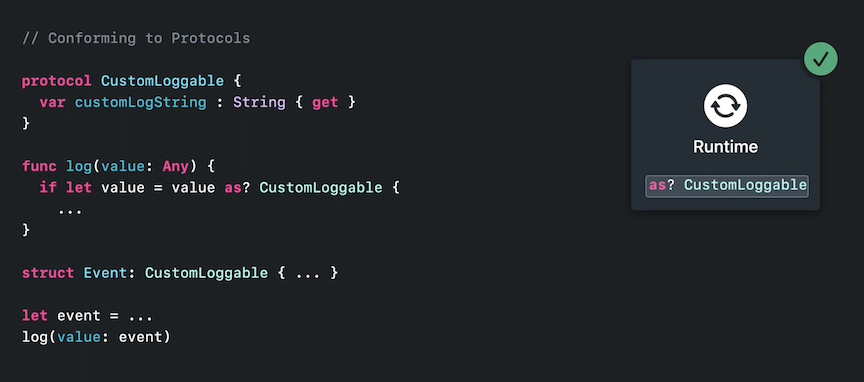
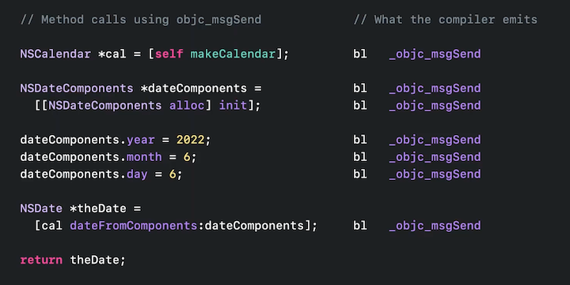
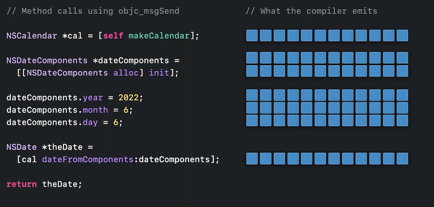
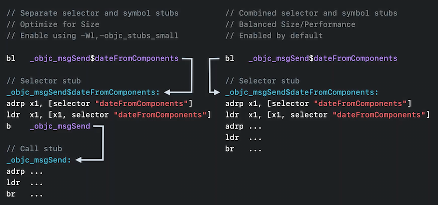
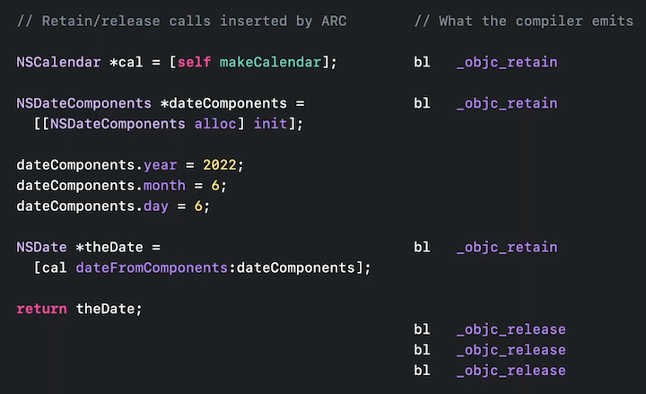
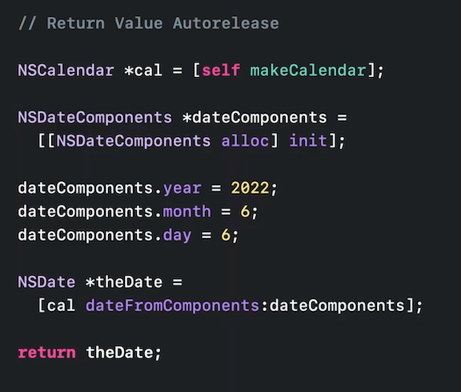
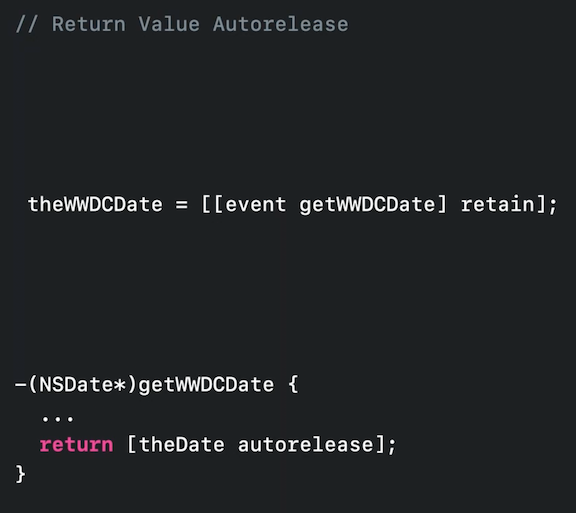
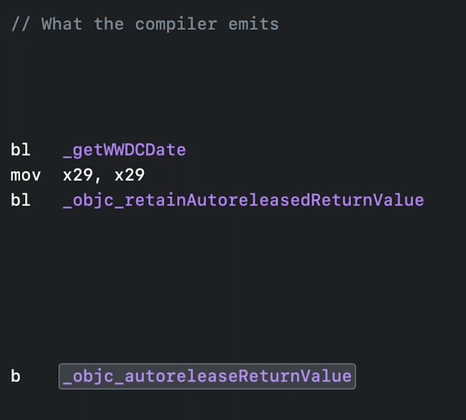

# **Improve app size and runtime performance**

### **Protocol checks**

* Protocol check metadata costs launch time
* Now precomputed as part of the dyld closure
* Enabled even for existing apps in iOS 16, et al
* To learn more about dyld and launch closures, watch the **App Startup Time: Past, Present, and Future** #session from WWDC 2017

---

### **Message send**

* Message send up to 8 bytes smaller in Xcode 14 (down from 12 on Arm64)
* Binaries up to 2% smaller overall
* Enabled automatically when building with Xcode 14, even with a lower deployment target
	* Defaults to balanced performance and sixe
	* Can opt into optimizing for size only using `-W1, -objc_stubs_small`

**Previous process**

Behind the scenes | bytes used
----------------- | ----------
 | 

* Now the Selector Stub is stored in a helper function that is called repeatedly, instead emitting every time we have a message send
	* This saves instruction bytes over many calls
* Then we call the `_objc_msgSend` Call Stub function to load the function address and call it
* Having these be two separate calls (code on the left below) is still not ideal, though
	* We can combine the stub functions into a single call, keeping the code closure together and don't need as many calls

* You can still choose whether to optimize for size alone, and get the maximum size savings available.
	* Enable that using the `-objc_stubs_small` linker flag
	* Or you can use the code generation that provides size benefits while keeping the best performance.
		* Unless you're severely size-constrained, this is recommended and is the default

---

### **Retain and release**

* Retain and release calls are now up to 4 bytes smaller
* Binaries up to 2% smaller overall
* Unlike message send stubs, this does need runtime support, so you have to set the deployment target to iOS 16, et al

* Under the hood, these objc_retain/release functions are just plain C functions taking a single argument (the object to be released)
* With ARC, the compiler inserts calls, passing the appropriate object pointers.
	* These calls have to respect the C calling convention, so there is more code to do these calls, to pass the pointer in the right register
		* This creates additional "move" instructions
* Now, retain/release is specialized with a custom calling convention, the compiler uses right variant depending on where the object pointer already is, so that it doesn't need to move it.
* This means there are less redundant code for all these calls, which adds up over an entire app

---

### **Autorelease elision**

* Faster
	* Happens automatically when run on iOS 16, et al
* Smaller binary
	* Set deployment target to iOS 16, et al

**What is Autorelease elision?**

The old Method:

* When we call autorelease, that goes into the objc runtime (`_objc_autoreleaseReturnValue`)
* The runtime tries to recognize what's happening: that we're returning an autoreleased value.
* To help it out, the compiler emits a special marker that we never use otherwise (`mov x29, x29`)
	* It's there to tell the runtime that this is eligible for autorelease elision.
	* Followed by the retain, that we will execute later (`_objc_retainAutoreleasedReturnValue`)
	* But right now, we're still in the autorelease, so when we do it, the runtime loads the special marker instruction, as data, and compares it to see if it is the special marker value it expects.
		* If it is, that means the compiler told the runtime that we're returning a temporary that will immediately be retained.
	* This lets us elide, or remove, the matching autorelease and retain calls.

Code | Auto-release Pseudo-Code | Runtime
---- | ------------------------ | -------
 |  | 

Loading code as data is not optimal on the CPU, so we can do better

* Instead of storing the `mov x29, x29` marker, we can instead store the return address to where the function completes execution
	* Getting a return address is very cheap, it's just a pointer
	* We can leave the runtime autorelease call, and return the caller
	* Then we can re-enter the runtime when doing the retain
		* At this point, we get another pointer for our current return address, and compare pointers, which is much cheaper than loading data
		* If the comparison succeeds, then we can elide the autorelease/retain pair with improved performance