# **Link fast: Improve build and launch times**

Linking is needed to use code from libraries and frameworks

Two types of linking:

* Static linking (happens when you build your app)
* Dynamic linking (happens on app launch)

### **What is static linking**

The compiler is split into two parts:

* The first part compiles source code to a new intermediate relocatable `.o` file
* The second part reads the `.o` file and produces an executable program
* Over time, optimizations were created to allow the compiler to only pull the parts of a library that it needs

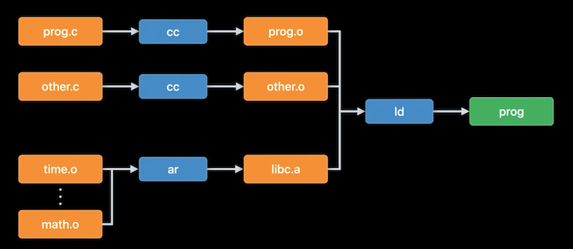

---

### **Recent ld64 improvements**

ld64 is Xcode's static linker

* 2x faster with Xcode 14
* Now makes better use of multiple cores to do work in parallel
	* Copying content from input to output file
	* Building different parts of LINKEDIT in parallel
	* Computed hashes in parallel (UUID computation and code signing hashes)
* Optimized exports-trie builder algorithm
* Accelerated UUID computation (new crypto libraries)
* Improved static library processing
* Faster debug-notes generation

---

### **Static linking best practices**

**When to use static libraries**

* Code changes force static library rebuild - if you are actively working on a source file that builds into a static library, you've introduced a slowdown to your build time
	* After the file is compiled, the entire static library has to be rebuilt, including its table of contents
* Static libraries make the most sense for stable code - e.g. code not being actively changed
	* Move code under active development out of a static library to reduce build time

**`-all_load` or `force_load`**

`-all_load` enables linker to parse all `.a` files in parallel, just like `.o` files

* May get duplicate symbol errors
	* if you have multiple static libraries implementing the same symbols, and depends on command line order of the static libraries to drive which implementation is used, don't use `-all_load`
* May pull in too much code - unused code is being added in
	* Add `-dead_strip` to remove unreachable code and data
	* This is fast, and usually pays for itself - but may not always be a net win

**`-no_exported_symbols`**

* Linker builds a trie data structure of all exported symbols
* Usually main executables don't need exports
	* Usually nothing looks up symbols in the main executable
	* Can use this for the app target to skip creation of trie data structure to improve link time
* Exports trie required if app loads plugins, or used as host in xctest - cannot use `no_exported_symbols` in those scenarios
* Run: `dyld_info -exports /path/to/binary | wc -l` to count the number of exported symbols
	* Only makes sense to suppress exports if the number is high
	* If the export count is high, but trie is never used, skip building it

**`-no_deduplicate`**

* Combines C++ functions that contain exact same code
* Deduplication is an expensive operation, unneeded during development
* Xcode adds this by default to debug builds
* Clang adds this when link line as `-O0`
* If you use C++, and have a custom build system, consider adding `-no_deduplicate` for Debug builds

**Static linking surprises**

* When you have source code that builds into a static library which your app links with, and that code does not end up in the final app
	* you added `__attribute__((used}}` to some function, or you have an Objective-C category.
	* Because of the selective loading the linker does, if those object files in the static library don't also define some symbol that is needed during the link, those object files won't get loaded by the linker.
* Dead stripping hides errors
	* Can hide many static libraries issues like missing or duplicate systems if they are from unreachable code
* static library may be incorporated into multiple dylibs
	* Duplicate symbols at runtime

---

### **What is dynamic linking**

* As we add more and more libraries via static linking, the program grows larger and larger
* We can change the `ar` steps to `ld`, making the product an executable binary

The static linker treats linking with a dynamic library differently

* Instead of copying code out of the library into the final program, the linker records the symbol name used from the dynamic library and what the library's path will be at runtime
* Program file size only contains your code, and a list of libraries it needs at runtime
* No longer get copies of library code in your program
* Your program's static link time is independent of the number of dynamic libraries you link with

Virtual memory system will re-use the same physical pages of RAM for all processes that use the same dynamic libraries

**Dynamic library downsides**

* Slower launch time - you've deferred some linking costs from build time to run time
* More dirty memory (__DATA pages) 
	* Each library has it's own data page, whereas static libraries share a data page
* Requires the need for a dynamic linker

**Dynamic linking at runtime**

* An executable binary is divided up into segments, usually at least TEXT, DATA, and LINKEDIT
* Segments are always a multiple of the page size for the OS. Each segment has a different permission. 
	* For example, the TEXT segment has "execute" permissions. That means the CPU may treat the bytes on the page as machine code instructions.
* At runtime, dyld has to mmap() the executables into memory with each segments' permissions
* Because the segments are page sized and page aligned, that makes it straightforward for the virtual memory system to just set up the program or dylib file as backing store for a VM range.
* That means nothing is loaded into RAM until there is some memory access on those pages, which triggers a page fault
	* causes the VM system to read the proper subrange of the file and fill in the needed RAM page with its content.
	* Somehow the program needs to be "wired up" or bound to the dylib - for that we have "fixups"

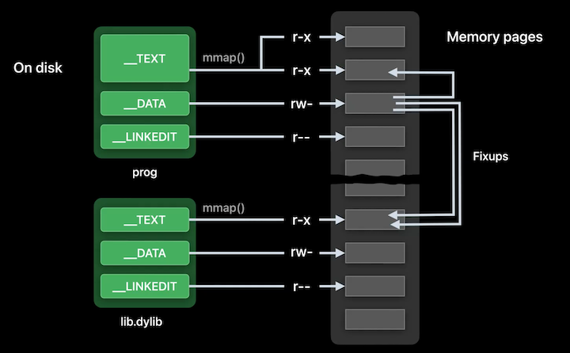

**Fixups**

* Static linker sees that malloc was in a dylib and transformed the call site
	* Becomes a call to a stub synthesized by the linker in the same TEXT segment, so the relative address is known at build time, so the instruction can be correctly formed
	* The stub loads a pointer from DATA and jumps to that location
	* Now, no changes to TEXT are needed at runtime, just DATA
	* TL;DR - all fixups done by dyld are just dyld setting a pointer in DATA

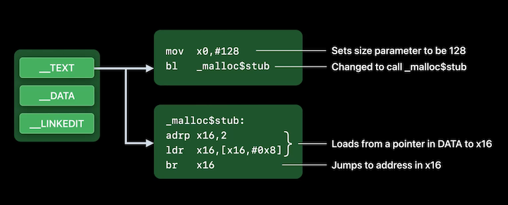

**Three kinds of Fixups**

* Rebases
	* When a dylib or app has a pointer that points within itself
	* Security feature called ASLR causes dyld to load dylibs at random addresses. That means those interior pointers cannot just be set at build time. Instead, dyld needs to adjust or "rebase" those pointers at launch
	* On disk, those pointers contain their target address, if the dylib were to be loaded at address zero.
		* All the LINKEDIT needs to record is the location of each rebase location.
		* Dyld can then just add the actual load address of the dylib to each of the rebase locations to correctly fix them up.
* Binds
	* Symbolic references - target is a symbol name and not a number
	* For instance, a pointer to the function `_malloc`. 
		* The string `_malloc` is actually stored in LINKEDIT, and dyld uses that string to look up the actual address of malloc in the exports trie of libSystem.dylib. 
		* Then, dyld stores that value in the location specified by the bind
* Chained
	* New in Xcode 14
	* LINKEDIT is smaller because instead of storing all the fixup locations, the new format just stores where the first fixup location is in each DATA page, as well as a list of the imported symbols
		* The rest of the information is encoded in the DATA segment itself, in the place where the fixups will ultimately be set
		* The LINKEDIT just says where the first fixup was, then in the 64-bit pointer location in DATA, some of the bits contain the offset to the next fixup location
	* Also packed in there is a bit that says if the fixup is a bind or a rebase. 
		* If it is a bind, the rest of the bits are the index of the symbol. 
		* If it's a rebase, the rest of the bits are the offset of the target within the image
	* Support for chained fixups is in iOS 13.4 and later

Rebases | Binds | Chained
------- | ----- | -------
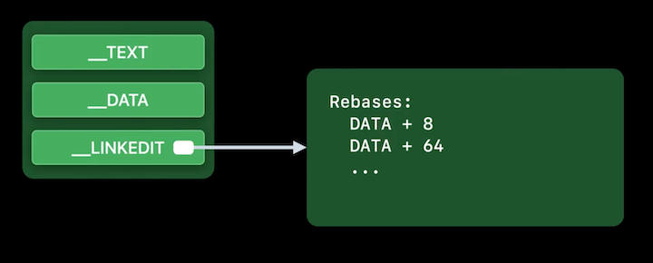 | 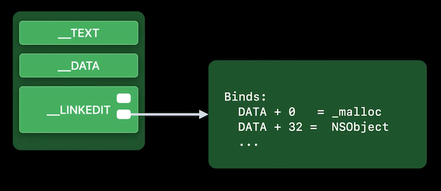 | 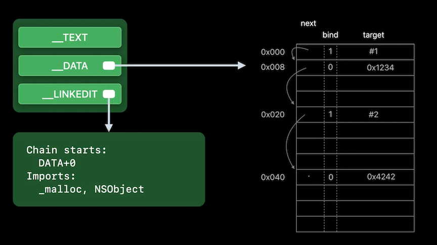

**Dynamic linking, dyld**

* Dyld starts with the main executable (e.g. your app)
	* Parses that mach-o to find the dependent dylibs, that is, what promised dynamic libraries it needs. 
	* It finds those dylibs and mmap()s them. Then for each of those, it recurses and parses their mach-o structures, loading any additional dylibs as needed. 
	* Once everything is loaded, dyld looks up all the bind symbols needed and uses those addresses when doing fixups. 
	* Lastly, once all the fixups are done, dyld runs initializers, bottom up. 
	* Five years ago Apple announced a new dyld technology.
	* It was realized that the steps in green below were the same every time your app was launched. So as long as the program and dylibs did not change, all the steps in green could be cached on first launch and re-used on subsequent launches.

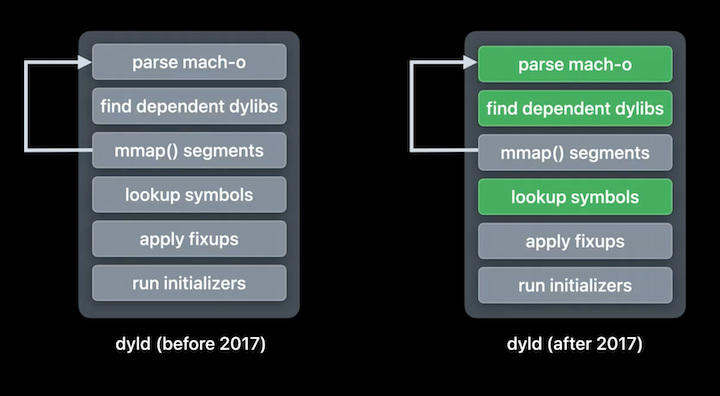

---

### **Recent dyld improvements**

Page-in linking

* Instead of dyld applying all the fixups to all dylibs at launch, the kernel can now apply fixups to your DATA pages lazily, on page-in
	* Reduces dirty memory
	* Reduces launch time
	* DATA_CONST pages are clean, so they can be evicted/recreated just like TEXT pages, reducing memory pressure
* Available in iOS 16, et all
* Only works for binaries built with chained fixups
	* Linker generates chained fixups when targeting iOS 13.4 or later
* Does not work for `dlopen()` just dylibs linked at launch
* dyld has been optimizing the steps below in green by caching that work on first launch and reusing it on later launches.
	* Now, dyld can optimize the "apply fixup" step by not actually doing the fixups, and letting the kernel do them lazily on page-in

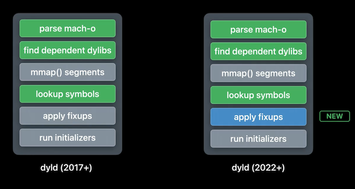

---

### **Dynamic linking best practices**

* Use fewer dylibs - the less, the less work to be performed
* Optimize or eliminate static initializers
	* Don't do IO or networking (anything that takes more than a few milliseconds) in a static initializer
* Find your sweet spot for static vs. dynamic libraries
	* Too many static libraries, and build/debug time is slower
	* Too many dynamic libraries, and launch time is slower
	* Re-evaluate this with the new linker
* Use chained fixups by updating to iOS 13.4 minimum when possible

---

### **New tools**

**`dyld_usage`**

* Available on macOS 13 (can use on apps launching in simulator)
* Command line tool that logs dyld operations
	* Similar to `fs_usage`
* Uses same mechanism as Instruments.app to trace

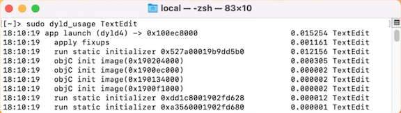

**`dyld_info`**

* Available on macOS 12
* Command line tool
	* Similar to `nm` or `tool`
* Can show info about mach-o files and dylibs in the dyld cache
* Can run with `fixups` and `-exports` options

Fixups | Exports
------ | -------
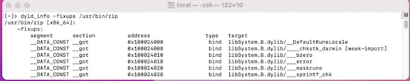 | 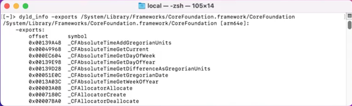
