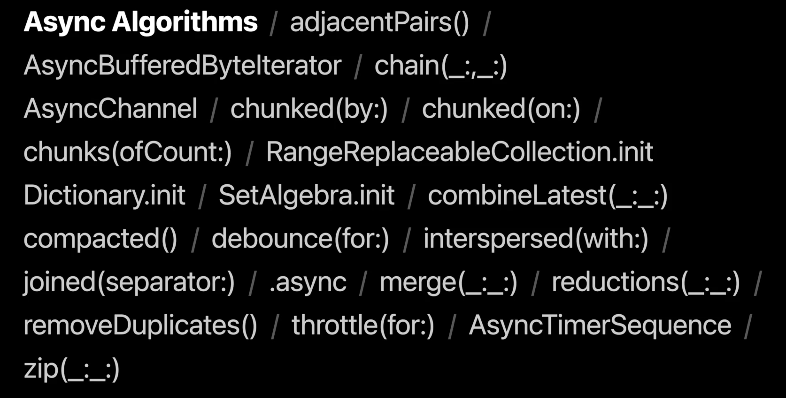

# [**Meet Swift Async Algorithms**](https://developer.apple.com/videos/play/wwdc2022-110355)

### **AsyncSequence Recap**

* Just like Sequence
* Iteration uses Swift Concurrency
* Iteration can throw
* Meet AsyncSequence #session from 2021

---

### **Swift Async Algorithms Overview**

* open source package
* augment swift concurrency
* Swift algorithms package - Meet the Swift Algorithms and Collections packages #session from 2021

---

### **Multi-input algorithms**

**Zip**

* Combines values produced into tuples
* Iterates conccurrently
* Rethrows failures

```
// upload attachments of videos and previews such that
every video has a preview that are created concurrently
so that neither blocks each other.

for try await (vid, preview) in zip(videos, previews) {
	try await upload(vid, preview)
}
```
 
**Merge**

* Combine multiple AsyncSequences into one AsyncSequence
* Element types must be the same
* Awaits elements concurrently and rethrows failures

```
// Display previews of messages from either the primary or secondary account

for try await message in merge (primaryAccount.messages, secondaryAccount.messages) {
	displayPreview(message)
}
```

---

### **Clock, instant, duration**

**Clock**

* Protocol for defining time
	* Defines a way to wake up after a given instant
	* Defines a concept of now
* Built-in clocks:
	* Continuous clock
		* measures time like a stopwatch where time progresses no matter what
		* use for measuering human time, or delays by an absolute duration
	* Suspending clock
		* suspends when machine is put to sleep
		* use for measuring device time, or delays for animations

```
// Sleep until a given deadline
let clock = SuspendingClock()
var deadline = clock.now + .seconds(3)
try await clock.sleep(until: deadline)

// Measure elapsed duration of work

let clock = ContinuousClock()
let elapsed = await clock.measure {
	await someLongRunningWork()
}
```

**Algorithms using time**

```
// Control searching messages

class SearchController {
	let searchResults = AsyncChannel<SearchResult>()
	
	func search<SearchValues: AsyncSequence> (_ searchValues: SearchValues) where SearchValues.Element == String
}
```

**Debounce**

* Awaits a quiescence period to produce events
* Rethrows failures immediately

```
// Debounce input by 300ms

let queries = searchValues.debounce(for: milliseconds (300))

for await query in queries {
	let results = try await performSearch (querv)
	await channel.send(results)
}
```

**Chunks**

* Groups elements into collections
	* By count
	* By time
	* By content

```
// Gather messages up to serialize them into packets
// to be sent to the server by batching into chunks

let batches = outboundMessages.chunked(by: .repeating(everv: .milliseconds (509)))

let encoder = JSONEncoder()
for await batch in batches {
	let data = try encoder.encode (batch)
	try await postToServer(data)
}
```

**Collection initializers**

* Intialize from an AsyncSequence
	* Dictionary
	* Set
	* Array

```
// Create a message with awaiting attachments to be encoded

init<Attachments: AsyncSequence>(_ attachments: attachments: Attachments) async rethrows {
	self.attachments = try await Array(attachments)
}
```

---


