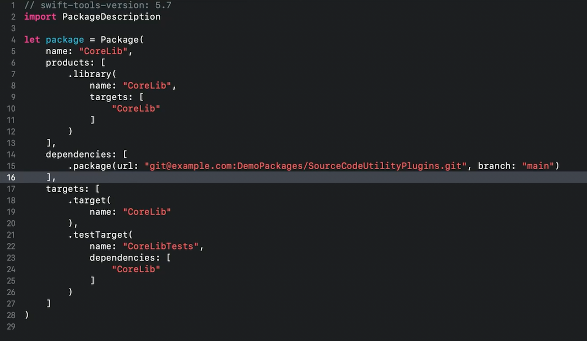
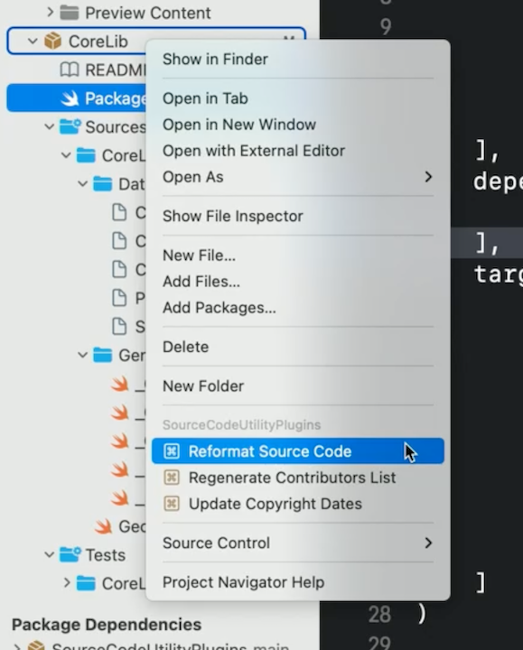
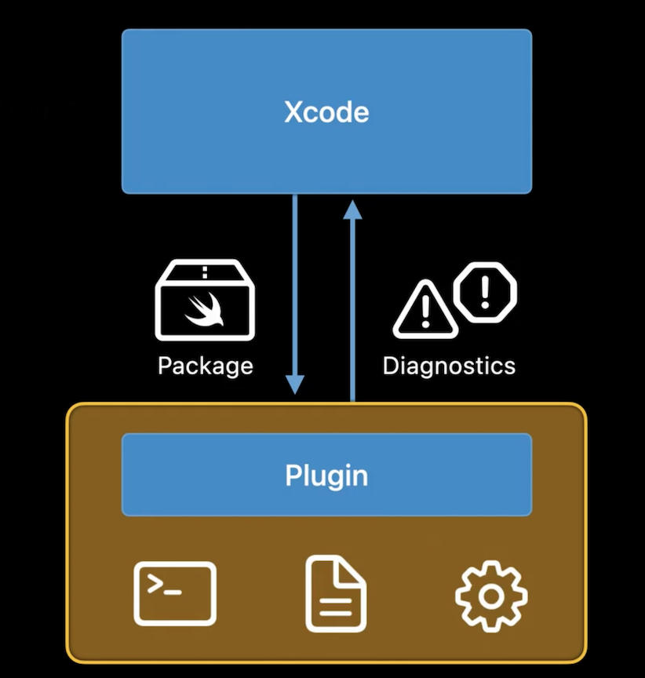
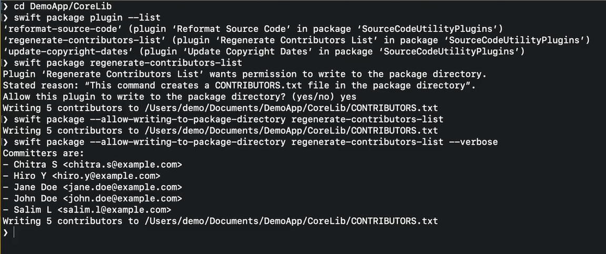
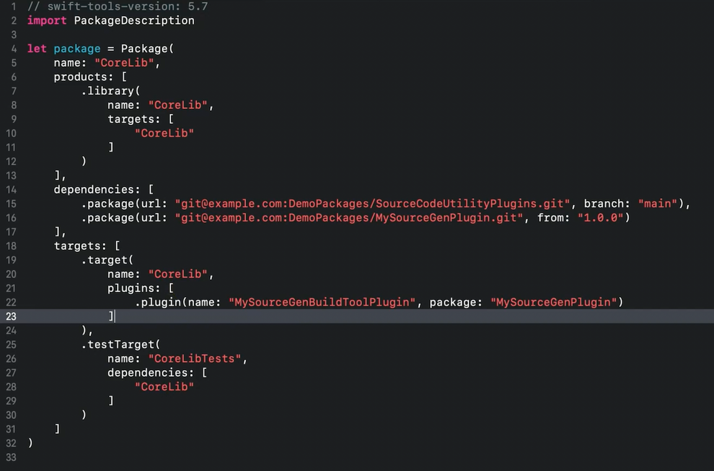

# **Meet Swift Package Plugins**

### **What is a package plugin?**

A swift script that can perform actions on a swift package or Xcode project

* Implemented as Swift packages
* Can provide:
	* plugins together with libraries and executables
	* or focus only on providing plugins
* Can be implemented more one source file
* A swift package can define more than one plugin

Two kinds of plugins:
* Highly specialized - private to the package that provides it, and is only available within that package
* General purpose plugin - can be made available to other packages by defining it as a package product
	* similar to how a package can use a library from another package

Does not bring in runtime content like a library
* instead lets you access development tools that run on your own machine or build automations

**What can a package plugin do?**

Two kinds of plugins:
* Command plugin
	* implement custom actions that can run whenever you want to (e.g. linters, prepare for distribution)
	* Can as for permission to modify files in a package
* Build tool plugin
	* Extend the build systems dependency graph (e.g. generate source files/resources)
	* Applied to each target that needs them

Add a dependency to your swift Package file the same way you do a library dependency
* will automatically add subdependencies



Use the context menu on the package you want to apply the command to



When a package needs to write files, you will be prompeted to give it permission

---

### **How do plugins work?**

Package plugins are swift scripts that are compiled and run when needed

* Each plugin runs as a separate process
* Plugins have access to a distilled representation of the input package, including its source files
* A plugin also gets information about any dependencies of the package
* Many plugins call command-line tools as part of doing their work
* Plugins can also create files and directories, and can perform other actions using standard libraries such as Foundation. 
* A plugin runs in a sandbox that prevents network access and that only allows writing to a few places in the file system, such as the build outputs directory. 
	* Command plugins can ask for permission to also modify files in the package source directory. If the user approves, the sandbox is configured to allow writing to those locations.
* Plugin can also send results back to Xcode



```
// Package plugin entry points

import PackagePlugin

@main
struct MyPlugin: CommandPlugin {
	// Entry points specific to plugin capability
}
```

Create Swift Package Plugins #session

---

### **Command plugins**

* Implement development-time actions
	* run interactively, not during a build
	* can ask for permission to modify package sources
	* usually depend on other tools to do the actual work

```
// Command plugin entry point

import PackagePlugin
@main struct MyPlugin: CommandPlugin {
	func performCommand (context: PluginContext, arguments: [String]) throws {
		// Perform command's action
	}
}
```

Can also be run via the command line



---

### **Build tool plugins**

Provide commands for the build system

* can invoke executables provided as binaries or built from source
* supports build commands and prebuild commands
* output files are stored with other build artifacts, not among package sources
* commands run in a sandbox that prevents changes to the package

```
// Build tool plugin entry points

import PackagePlugin

@main
struct MyPlugin: BuildToolPlugin {
	func createBuildCommands (context: PluginContext, target: Target) throws -> [Command] {
		// Configure and return build commands
	}
}
```

Two kinds of build commands:

* Build commands run as part of the build
	* Specify input paths and output paths
	* Run when outputs are missing or inputs change
* Prebuild commands run before the build starts
	* Can generate output whose names can't be known beforehand
	* Run before every build
	* Should do as little work as possible when there are no changes

New `plugins` parameter parameter in the package manifest

* Add a dependency on the package that provides the source generator plugin I want to use
* In the target that needs to use the plugin, add a plugins parameter to its definition




