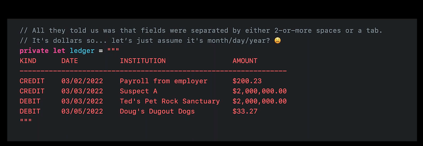
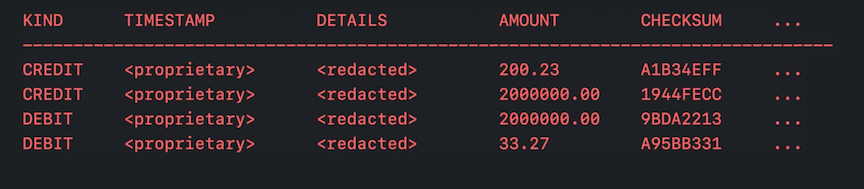

# [**Meet Swift Regex**](https://developer.apple.com/videos/play/wwdc2022/110357/)

Scenario - need to parse transaction data

* data is not well structured, instead, it's a bunch of strings
	* strings separated by tabs or a two-or-more-spaces
	* date field is ambiguous (date/month/year or month/date/year?)



Processing collections: two kinds

* Element based: `map`, `filter`, `split`
	* the field separator being inconsistent means splitting on white space alone won't work (see code below)
	* this process is element based, but our data has a more complex pattern

```
let transaction = "DEBIT       03/05/2022    Doug's Dugout Dogs            $33.27"]

let fragments = transaction.split(whereSeparator: \.isWhitespace)
// ["DEBIT",  "03/05/2022", "Doug)'s", "Dugout", "Dogs", "$33.27"]
```
	
* Low-Level index-based: `index(after:)`, `firstIndex(of:)`, slicing subscript
	* hard to do right, and even if you know what you are doing it's a lot of code

**struct Regex<Output>**

```
// Regex literals
let digits = /\d+/
// digits: Regex<Substring>

// Run-time construction
let runtimeString = #"\d+"#
let digits = try Regex(untimeString)
// digits: Regex<AnyRegexOutput>

// Regex builders
let digits = OneOrMore(.digit)
// digits: Regex<Substring>
```

Let's adapt our element based approach from earlier

* `\s{2,}` matches two or more occurences of any whitespace character
* `|` represents an OR
* `t` represents a tab

```
let transaction = "DEBIT       03/05/2022    Doug's Dugout Dogs            $33.27"]

let fragments = transaction.split(separator: /\s{2,}|\t/)
// ["DEBIT", "03/05/2022", "Doug's Dugout Dogs", "$33.27"]
```

We can go a step further and replace all matches to a single tab

```
let transaction = "DEBIT       03/05/2022    Doug's Dugout Dogs            $33.27"]

let normalized = transaction.replacing(/\s{2,}|\t/, with: "(t")
// DEBIT»03/05/2022»Doug's Dugout Dogs»$33.27
```

Swift Regex removes some of the confusion and difficulty inherent with regular expressions

* Regular expressions are concise, but quickly become cryptic
	* Swift Regex Literals are concise, builders provide structure
* Data formats need a real parser
	* Swift Regex lets you interweave real parsers as parts of a regex
* World is Unicode, not just ASCII
	* Swift Regex does Unicode
* Uncertain or unconstrained execution
	* Swift Regex provides predictable execution and surfaces controls prominently

**Using Regex Builders**

* import RegexBuilder
* reuse fieldSeparator we already defined
* first field is either `CREDIT` or `DEBIT`
	* use literal syntax to write that
* Parsing dates is a bad idea, use foundation parsers with an explicit locale (best guess, we can change later)
* Third field can be anything, want to tell it to stop when it reaches the field separator
	* many ways to do this, NegativeLookahead is one
* Match the amounts using a foundation currency parser.
	* Assuming comma is a thousands separator while period is a decimal separator, we make that assumption explicit
* We use `Capture` to pull out the data we want for each field

```
// CREDIT      03/02/2022    Payroll from employer             $200.23
// CREDIT      03/03/2022    Suspect A                         $2,000,000.00
// DEBIT       03/03/2022    Ted's Pet Rock Sanctuary          $2,000,000.00
// DEBIT       03/05/2022    Doug's Dugout Dogs                $33.27

import RegexBuilder

let fieldSeparator = /\s{2,}|\t/
let transactionMatcher = Regex
	{ Capture { /CREDIT|DEBIT/ }
	fieldSeparator

	Capture { One(.date(.numeric, locale: Locale(identifier: "en_US"), timeZone: .gmt)) }
	fieldSeparator

	Capture {
		OneOrMore {
			NegativeLookahead { fieldSeparator }
			CharacterClass.any
		}
	}
	fieldSeparator
	Capture { One(.localizedCurrency(code: "USD").locale(Locale(identifier: "en_US"))) }
}
// transactionMatcher: Regex<(Substring, Substring, Date, Substring, Decimal)>

func shouldIgnore(_ date: Date, amount: Decimal) { ... }

guard let match = transaction.wholeMatch(of: transactionMatcher) else {
	fatalError ("Investigators, what do you want to do here?")
}

if shouldIgnore(match.2, match.4) {
	continue
}
// ... further analysis
```

**Plot twist - we find out more information about the date and currency formats**

* When the currency is in British pounds, it's day/month/year
* When it's in US Dollars, it's month/day/year

We will write a sed-like script to disambiguate this

* We will use an extended delimiter in our Regex
	* allows us to use slashes inside without having to escape them
	* get access to an extended syntax mode where whitespace is ignored, so we can use it for readability
* We use named captures which show up in the Regex output as tuple labels
* Used a Unicode property to recognize currency symbols

```
let regex = #/
	(?<date>		1d{2} / \d{2} / \d{4})
	(?<middle>	\P{currencySymbol}+)
	(?<currency>	\p{currencySymbol})
/＃
// Regex<(Substring, date: Substring, middle: Substring, currency: Substring)>

func pickStrategy(_ currency: Substring) -> Date.ParseStrategy {
	switch currency {
	case "$": return .date(.numeric, locale: Locale(identifier: "en US")
	case "£": return .date(.numeric, locale: Locale(identifier: "en_GB")
	default: fatalError( "We found another one!")
	}
}

ledger.replace(regex) { match -> String in
	let date = try! Date(String(match.date), strategy: pickStrategy (match.currency) )

	// ISO 8601, it's the only way to be sure yyyy-MM-dd
	let newDate = date.formatted(.is08601.year().month().day())
	
	return newDate + match.middle + match.currency
}
```

**Many models of strings**

* String is a collection of characters (Unicode extended grapheme clusters)
* String provides views of Unicode scalars
* Stored in memory encoded as UTF Bytes
	* Can be used using `.utf8`

```
let aZombieLoveStory = "🧟‍♀️💖🧠"
// Characters: 🧟‍♀️, 💖, 🧠

aZombieLoveStory.unicodeScalars
// Unicode scalar values: U+1F9DF, U+200D, U+2640, U+FE0F, U+1F496, U+1F9E0

aZombieLoveStory.utf8
// UTF-8 code units: F0 9F A7 9F E2 80 8D E2 99 80 EF B8 8F FO 9F 92 96 F0 9F A7 AO
```

Comparison

* String (and Character) compoarison follow Unicode Canonical Equivalence
* String's views are compared at binary level

```
"café".elementsEqual("cafe\u{301}")
// true

"café".unicodeScalars.elementsEqual("cafe\u{301}".unicodeScalars)
// false

"café".utf8.elementsEqual("cafe\u{301}".utf8)
// false
```

Unicode processing

* Switch over a pair of strings
* `.` is the "any character string
* `e\u{301}` compare equal strings as equals
* `.ignoresCase()`, well, ignores case

```
switch ("🧟‍♀️💖🧠", "The Brain Cafe\u{301}") {
case (/.\N{SPARKLING HEART}./, /.*café/.ignoresCase()):
	print("Oh no! «4, but @fe!")
default:
	print( "No conflicts found")
}
```

Complex scalar processing

* If you do need to process unicode scalar properties, you can by matching with unicode scalar semantics

```
let input = "Oh no! 🧟‍♀️💖🧠,  but tell 💖🧠☕️
input.firstMatch(of: /.\N{SPARKLING HEART}./)
// 🧟‍♀️💖🧠

input.firstMatch(of: /.\N{SPARKLING HEART}./.matchingSemantics(.unicodeScalar))
// 💖🧠
```

**Live Processing**

New data set:

* Proprietory date timestamp
* Details field which includes individuals and identification codes, filtered against this field
	* Want to bail early on unintersting transactions
* Still delimiting by tab or 2-or-more spaces



They have a transaction manager that is technically working, but not scaling well

* Timestamp and details regexes match much more of the inputs than their fields
	* Ideally would be constrained to only run over a single field

```
let timestamp = Regex { ... } // proprietary
let details = try Regex(inputString)
let amountMatcher = /[\d.]+/

// CREDIT    <proprietary>    <redacted>    200.23    A1B34EFF    ...
let fieldSeparator = /\s{2,}|\t/
let transactionMatcher = Regex {
	Capture { /CREDIT|DEBIT/ }
	fieldSeparator

	Capture { timestamp }
	fieldSeparator

	Capture { details }
	fieldSeparator
	
	// ...
}
```

* We can use NegativeLookahead to constrain their regexes
	* We could use post-processing for this, but we want to be able to bail early on uninteresting transactions on live processing
	* We can use `TryCapture` for this

```
// CREDIT    <proprietary>    <redacted>    200.23    A1B34EFF    ...
let fieldSeparator = /\s{2,}|\t/
let field = OneOrMore {
	NegativeLookahead { fieldSeparator }
	CharacterClass.any
}
let transactionMatcher = Regex {
	Capture { /CREDIT|DEBIT/ }
	fieldSeparator

	TryCapture(field) { timestamp ~= $0 ? $0 : nil }
	fieldSeparator
	
	TryCapture (field) { details
	fieldSeparator
	
	// ...
}
```

* One problem remaining - when something later on in the transaction matcher fails, it can take a long time to exit
	* Our field separator will match all white space characters (e.g. 8) before trying the rest of the regex
		* But if it fails, it will back up and match 7, then try again.
		* After another fail, it will back up and match 6, then try again.
		* Only after failing all options, it will fail overall
	* We want to match all white space and never give it up
		* We can use a `Local` backtracking scope instead of a global one - `Local { /\s{2,}|\t/ }`
			* Creates a scope where untried alternatives are discarged on a successful match
			* Global is the default, great for search and fuzzy matching
			* Local is great for precisely specified tokens

```
// CREDIT    <proprietary>    <redacted>    200.23    A1B34EFF    ...
let fieldSeparator = Local { /\s{2,}|\t/ }
let field = OneOrMore {
	NegativeLookahead { fieldSeparator }
	CharacterClass.any
}
let transactionMatcher = Regex {
	Capture { /CREDIT|DEBIT/ }
	fieldSeparator

	TryCapture(field) { timestamp ~= $0 ? $0 : nil }
	fieldSeparator
	
	TryCapture (field) { details
	fieldSeparator
	
	// ...
}
```

**WrapUp**

* Regex builders vs. literals is subjective
* Use real parsers whenever possible
* The Unicode Way, by default
* Thing globally, act Locally
* [Swift Regex: Beyond the basics](./Swift%20Regex%20-%20Beyond%20the%20basics.md) session