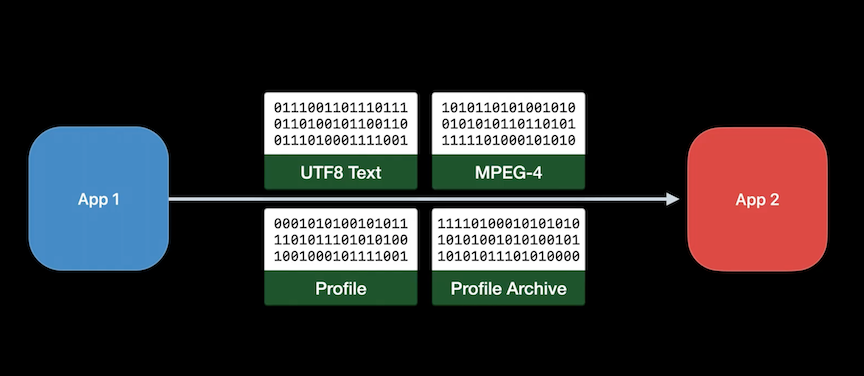
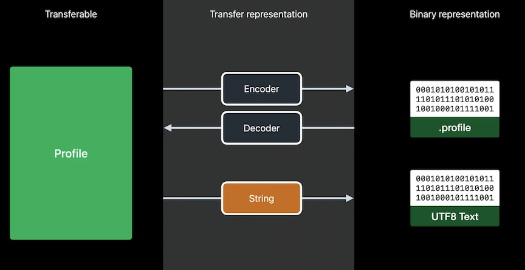
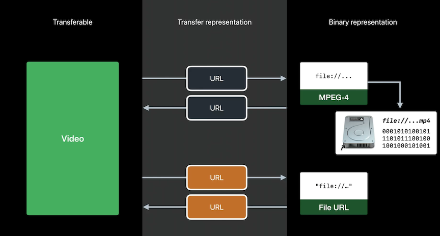

# **Meet Transferable**

A swift-first, declarative way to describe how your models can be serialized and deserialized for sharing and data transfer

### **Anatomy of a Transferable**



All the types that can be shared with other apps (or within a single app) must provide

* Ways to convert them to and from binary data
* The content type that corresponds to the structure of the binary data and tells the receiver what they actually got

**Uniform type identifiers**

* Describes the identifer for different binary structures and abstract concepts
* Form a tree, and we can also define custom identifiers


To declare a custom identifer:

* Add it's declaration to the info.plist file
	* It's a good idea to add a file extension so the system knows that the app can open the file
* Declare it in code
* Uniform Type Identifiers - A reintroduction #video


```
extension UTType {
	static var profile: UTType = { UTType (exportedAs: "com.example.profile") }
}
```

Many standard types already conform to transferable

* String
* Data
* URL
* Attributed String
* Image
* More...

**New Swift Paste Button**


```
PasteButton(payloadType: String.self) { funFacts in
	profile.addFunFacts(funFacts)
}
```

**Receive drag and drop images from a view**

```
@State private var portrait: Image

var body: some View {
	PortraitBackground(portrait: portrait)
		.draggable (portrait)
		.dropDestination(pavloadType:Image.self){images in
			if let image = images.first [
				portrait = image
			}
		}
}
```

**ShareLink**

```
@State private var portrait: Image

var body: some View {
	Profile()
		.toolbar {
			ShareLink(item: portrait)
		}
	}
}
```

---

### **Conforming custom types**

To conform to Transferable, you only need to implement the `transferRepresentation` parameter

```
extension Profile: Transferable {
	static var transferRepresentation: some TransferRepresentation {
	
}
```

Three important represenations:

* CodableRepresentation
	* To learn more about Codable: Data you can trust #session from WWDC 2018
* DataRepresentation
* FileRepresentation

**CodableRepresentation**

```
struct Profile: Codable {
	var id: UUID
	var name: String
	var bio: String
	var funFacts: [String]
	var video: URL?
	var portrait: URL?
}

struct Profile: Codable, Transferable f
	static var transferRepresentation: some TransferRepresentation {
		CodableRepresentation(contentType: .profile)
}

extension UTType {
	static var profile: UTType = { UTTvpe (exportedAs: "com.example.profile") }
	}
```


**DataRepresentation**

```
struct ProfilesArchive {
	init(csvData: Data) throws
	func convertToCSV() throws -> Data
}

extension ProfilesArchive: Transferable {
	static var transferRepresentation: some TransferRepresentation {
		DataRepresentation(contentType: .commaSeparatedText) { archive in
			try archive.convertTocsv()
		} importing: { data in
			try ProfileArchive(csvData: data)
		}
	}
}
```


**FileRepresentation**

```
struct Video: Transferable {
	let file: URL
	static var transferRepresentation: some TransferRepresentation {
		FileRepresentation(contentType: .mpeg4Movie) { SentTransferredFile($0. file) }
			importing: { received in
				let copy = // copy the received.file
				Self.init(file: copy)
			}
	}
}
```


**Choosing a representation**


---

### **Advanced tips and tricks**

**Proxy Representation**

* If we wanted to copy a profile to a pasteboard and pasted into a TextField, we want it to show the profile's name
* Proxy Representation allows other transferable types to represent our model
* Important that we put the proxy represenation after codable - order is important
	* the receiver will use the first representation that they support

```
struct Profile: Codable, Transferable {
	static var transferRepresentation: some TransferRepresentation {
		CodableRepresentation(contentType:.profile)
		ProxvRepresentation(exporting: \.name)
	}
}
```



**File Representation vs. Proxy Representation**

* File representation works with urls written to disk, and ensures receivers access to the file, or its copy by granting a temporary sandbox extension
	* allows the receiver to access the file
	* payload is the asset on disk
* Proxy representation treats URLS the same way as any other Transferable items, like strings - it doesn't have any additional capabilities that we need for files.
	* will be used when pasting the copied video into a TextField
	* payload is the URL structure itself

```
struct Video: Transferable {
	let file: URL
	static var transferRepresentation: some TransferRepresentation{
		FileRepresentation(contentType: .mpeg4Movie) { SentTransferredFile($0.file) }
			importing: { received in
				let copy = // copy the received.file
				Self.init(file: copy) }
		ProxyRepresentation(exporting: \.file)
	}
}
```



Handle cases when a conversion isn't possible

* use `.exportingCondition`
	* if an archive doesn't support csv for this example, it won't be exported as such

```
extension ProfileArchive: Transferable {
	var supportsCSV: Bool
	init(cvsData:)
	func convertToCSV() -> Data?
}

extension ProfileArchive: Transferable {
	static var transferRepresentation: some TransferRepresentation
		DataRepresentation(contentType: .commaSeparatedText) { archive in
			try archive.convertTocsv()
		} importing: { data in
			try ProfileArchive(csvData: data)
		}
		.exportingCondition { $0. supportscsv }
	}
}
```

