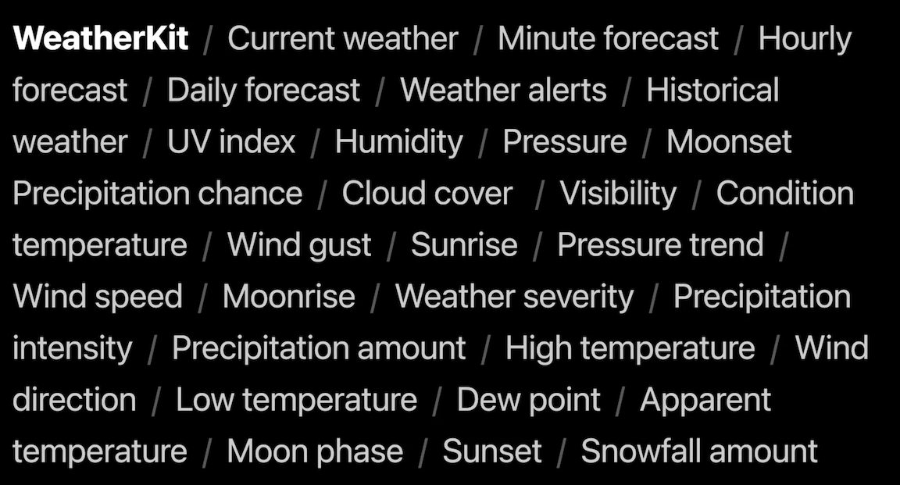

# **Meet WeatherKit**

* Powered by Apple Weather Service
* High-resolution weather models
* Machine learning and prediction algorithms
* Hyperlocal weather forecasts around the globe



Privacy

* Location is only used for weather forecasts
* No personally identifying information
* Never shared or sold

### **Available datasets**

* Current weather
	* Represents "now" conditions
		* Apparent temperature
		* Cloud cover
		* Condition
		* Dew point
		* Humidity
		* Pressure
		* Pressure trend
		* Temperature
		* UV index
		* Visibility
		* Wind direction
		* Wind gust
		* Wind speed
* Minute forecast
	* Precipitation conditions for the next hour 
		* Precipitation chance
		* Precipitation intensity
* Hourly forecast
	* Starting on the current hour for up to 240 hours
		* Apparent temperature
		* Cloud cover
		* Condition
		* Dew point
		* Humidity
		* Pressure
		* Pressure trend
		* Temperature
		* UV index
		* Visibility
		* Wind direction
		* Wind gust
		* Wind speed
* Daily forecast
	* 10 days
		* High temperature
		* Low temperature
		* Moon phase
		* Moonset
		* Precipitation amount
		* Snowfall amount
		* Sunrise
		* Sunset
		* Wind direction
* Weather alerts
	* Severe weather warnings for the requested location
		* Region
		* Severity
		* Source
		* Summary
* Historical weather
	* Saved weather forecasts from the past to see trends
	* Access by specifying a start and end date to the hourly and daily requests
		* Apparent temperature 
		* Cloud cover
		* Condition
		* Dew point
		* High temperature
		* Humidity
		* Low temperature
		* Moon phase
		* Moonrise
		* Moonset
		* Pressure
		* Precipitation amount
		* Precipitation chance
		* Precipitation intensity
		* Pressure
		* Pressure trend
		* Snowfall amount
		* Sunrise
		* Sunset
		* Temperature
		* UV index
		* Visibility
		* Wind direction
		* Wind gust
		* Wind speed

---

### **Requesting weather**

**Native framework**

* import `WeatherKit` and `CoreLocation`
* create a `WeatherService` instance with a `CLLocation`
* call `weather(for:)` on the `WeatherService` instance

```
// Request the weather
import WeatherKit
import CoreLocation

let weatherService = WeatherService()

let syracuse = CLLocation(latitude: 43, longitude: -76)

let weather = try! await weatherService.weather(for: syracuse)

let temperature = weather.currentWeather.temperature

let uvIndex = weather.currentWeather.uvIndex
```

To use WeatherKit, you must also:

* Register App Id in the developer portal, and enable WeatherKit
* Add the WeatherKit capability to the project

The video mentions attached code, but it does not exist. You can find other [sample code here](https://developer.apple.com/documentation/weatherkit/fetching_weather_forecasts_with_weatherkit)
	
**REST API**

```
/* Request a token */
const tokenResponse = await fetch('https://example.com/token');
const token = await tokenResponse.text();

/* Get my weather object */
const url = "https://weatherkit.apple.com/1/weather/en-US/41.029/-74.642?dataSets=weatherAlerts&country=US"

const weatherResponse = await fetch(url, {
	headers: {
		"Authorization": token
	}
});
const weather = await weatherResponse.json();

/* Check for active weather alerts */
const alerts = weather.weatherAlerts;
const detailsUrl = weather.weatherAlerts.detailsUrl;
```

There are a few more steps to enable authentication:

* In the developer portal, create an authentication key enabled for WeatherKit, and an associated services id
* Private key created in the key section of the portal


**JWT signing service**

* Create JSON Web Token header
* Create JSON Web Token payload
* Return signed JSON Web Token

---

### **Publishing requirements**

Publishing requirements

* Required for both Swift and REST API
* Display active link to attribution
* Display Apple Weather logo
* Provide link to Weather alert attribution