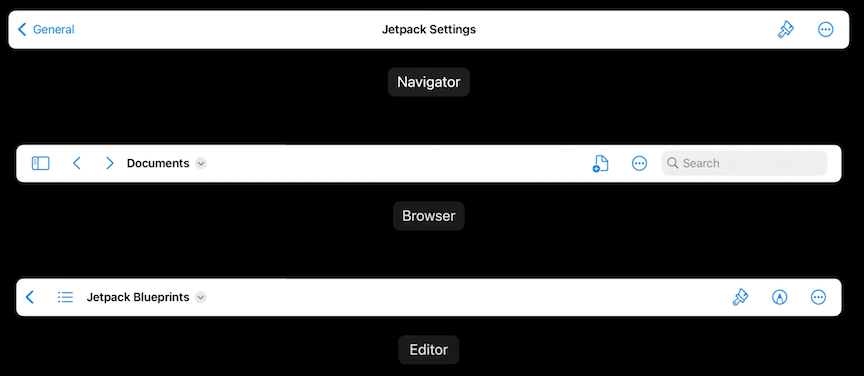
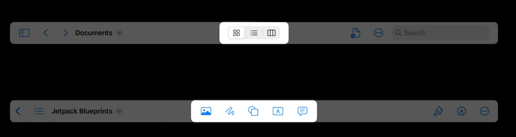
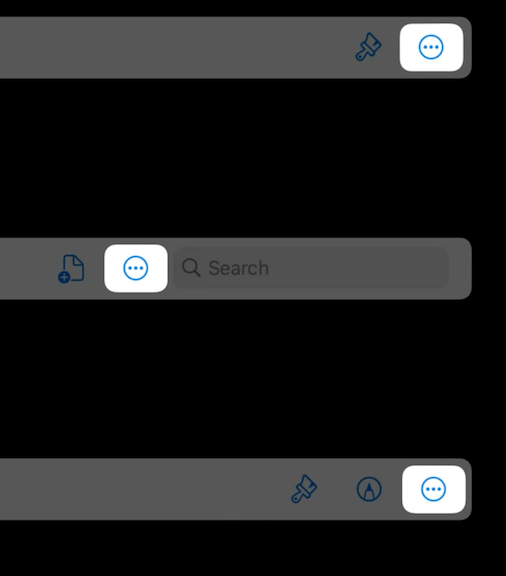
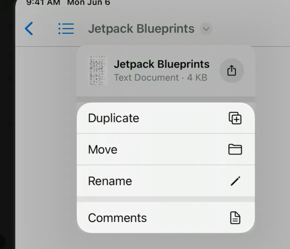

# [**Meet desktop-class iPad**](https://developer.apple.com/videos/play/wwdc2022/10069/)

### **Application design**

iOS 16 brings

* More functionality
* More and bigger displays
* Keyboard and pointer
* Accelerators for common tasks

UIKit adds

* Navigation bar updates
* Find and replace
* Edit menu
* Collection view improvements

For more info on Find and Replace/Edit menu, watch

* [**Adopt desktop class editing interactions**](./Adopt%20desktop-class%20editing%20interactions.md) session
* [**Build a desktop class iPad app**](./Build%20a%20desktop-class%20iPad%20app.md) session

---

### **Styling and controls**

New UINavigationBar styles



iOS 16 allows you to add center items in the Browser and Editor styles

* Include support for UIBarButtonItemGroup, Customization, and Overflow Support



Overflow support is available in all styles

* allows navigator style to indirectly support center items as well 



Individual controls continue to be specified as UIBarButtonItems, but are now organized as UIBarButtonGroups

* allows for denser presentaiton when space is at a premium
* fixed groups always appear first in the bar
* when customization menu is invoked, UIKit automatically applies the rules you specified based on how you created groups
	* fixed and movable groups can be removed
	* optional groups can be added or removed
	* UIKit will try collapsing groups, but depending on space, other items will be moved to overflow
* example with five buttons, in four groups:


```
let insertGroup = UIBarButtonItem(title: "Insert", ...).creatingFixedGroup()

// Convenient form of
// UIBarButtonItemGroup.movableGroup(customizationIdentifier:representativeltem:items:)
let drawGroup = UIBarButtonItem(title: "Draw", ...)
	.creatingMovableGroup(customizationIdentifier: "Draw")

// Single-item form is
/ / UIBarButtonItem.optionalGroup(customizationIdentifier:isInDefaultCustomization:)
let shapeGroup = UIBarButtonItemGroup.optionalGroup(
	customizationIdentifier: "Shapes",
	representativeltem: UIBarButtonItem(title: "Shapes", image: shapeImage),
	items: [
		UIBarButtonItem(title: "Square", ...),
		UIBarButtonItem(title: "Circle", ...),
		...
	])

navigationItem.customizationIdentifier = "com.jetpack.blueprints.maineditor"
navigationItem.centerItemGroups = [
	// The groups created earlier in the default customization
	insertGroup, drawGroup, shapesGroup, textGroup,
	
	// additional group that is not in the default customization
	.optionalGroup(customizationIdentifier: "Format", isInDefaultCustomization: false,
					representativeltem:UIBarButtonItem(title: "BIU", image: biuImage),
					items:[
						UIBarButtonItem(title: "Bold", ...),
						UIBarButtonItem(title: "Italic", ...),
						UIBarButtonItem(title: "Underline", ...),
					])
]
```

---

### **Document interactions**

UINavigationBar now supports adding a menu to the title view



Standard title menu items

* Duplicate `duplicate(_:)`
* Move `move(_:)`
* Rename `rename(_:)` or `UINavigationItem.renameDelegate`
* Export `export(_:)`
* Print `printContent(_:)`

```
navigationItem.titleMenuProvider={ suggestedActions in
	var children = suggestedActions
	children += [
		UlAction(title: "Comments", image: commentImage) { _ in }
	]
	return UIMenu(children: children)
}
```

Title menu also allows sharing and drag and drop

* provide a UIDocumentProperties instance that describes your document
	* represents metadata about your document (including a preview)

```
let documentProperties = UIDocumentProperties (url: url)

if let itemProvider = NSItemProvider (contentsOf: url) {
	documentProperties.dragItemsProvider = { _ in
		[UIDragItem(itemProvider:itemProvider)]
	}
	
	documentProperties.activityViewControllerProvider = {
		UIActivityViewController(activityItems: [itemProvider], applicationActivities: nil)
	}
}

navigationItem.documentProperties = documentProperties
```

**Title menu on Mac Catalyst**

* Suggested items
	* Exist in File menu
	* Add additional items via `UIMenuBuilder`
* Document properties
	* Produces macOS proxy icon

**Rename**

* Inline rename is provided by setting `UINavigationItemRenameDelegate`
* You can also control the entire experience yourself by implementing `UIResponder.Rename`

```
// Supporting inline renaming

class ViewController: UIViewController {
	override func viewDidLoad() {
		super. viewDidLoad()
		navigationItem.renameDelegate = self
	}
}

extension ViewController: UINavigationItemRenameDelegate {
	func navigationItem(_ navigationItem: UINavigationItem, didEndRenamingWith title: string) {
		// Execute the rename usina `title`
	}
}
```

---

### **Search**

Search is now inline on iPadOS (toolbar on macOS)

* Can restore old behavior with `UINavigationItem.preferredSearchBarPlacement`
* Search suggestions appear when search is activated, and can be updated alongside the updating search query
	* Conform to UISearchResultsUpdating
	* UITextFile also has search suggestions if you prefer that over UISearch

```
class ViewController: UIViewController {
	override func viewDidLoad() {
		super. viewDidLoad()
		searchController.searchResultsUpdater = self
	}
}

extension ViewController:UISearchResultsUpdating {
	func updateSearchResults (for searchController: UISearchController) {
		let querySuggestions = self.fetchQuerySuggestions (for: searchController)
		searchController.searchSuggestions = querySuggestions.map { name, icon in
			UISearchSuggestionItem(localizedSuggestion:name,
										localizedDescription: nil,
										icon: icon)
		}
	}
	
	func updateSearchResults (for searchController: UISearchController,
									selecting searchSuggestion: UISearchSuggestion) {
		updateSearch(searchController, query: searchSuggestion.localizedSuggestion)
	}
}
```