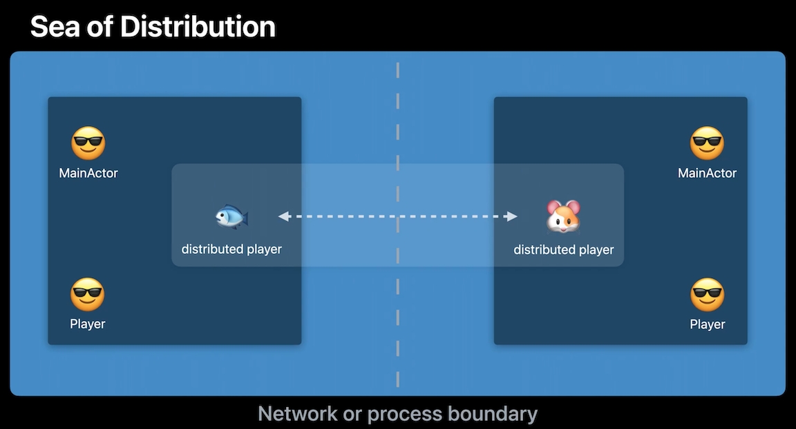

# [**Meet distributed actors in Swift**](https://developer.apple.com/videos/play/wwdc2022/110356/)

Swift Actors: [**Protect mutable state with Swift actors**](https://developer.apple.com/videos/play/wwdc2021/10133/) session from WWDC 2021

### **Tic Tac Fish**

Plan is to take a Tic Tac Toe game that is currently offline only against a bot opponent, and add multiplayer modes

**Sea of Concurrency**

* each actor is its own island in the sea
* instead of accessing each other's islands directly, they exchange messages between them
	* implemented as asyncronous method calls
* in combination with actor state isolation allows the compiler to guarantee that once an actor based program compiles, it is free from low level data races



**Location Transparency**

Distributed actors as useful as local actors, but also ready for remote interaction whenever necessary

* We can interact with a distrubuted actor regardless of where it is located

---

### **Play offline**

```
struct GameView: View {
	@StateObject private var model: GameViewModel

	let player: OfflinePlayer
	let mode: GameMode
	
	init (mode: GameMode, team: CharacterTeam) { ... }

	var body: some View {
		TitleView(selectedTeam:model.playerTeam, mode: mode)

		if model.opponent == nil {
			matchMakingView()
		}
		
		Spacer()

		LazyVGrid(columns: model.columns) {
			ForEach(model.fields) { position in
				GameCellView(position: position, model: model) { position in
					await player.makeMove(at: position)
				}
			}
		}
		
		gameResultRowViewl)
	}
}

// OfflinePlayer represents the "end-user" playing the game on the device

public actor OfflinePlayer: Identifiable {
	nonisolated public let id: ActorIdentity = .random

	let team: CharacterTeam
	let model: GameViewModel
	var movesMade: Int = 0

	public func makeMove(at position: Int) async -> GameMove {
		let move = GameMove (playerID: id, position: position,
			team: team, teamCharacterID: team.characterID(for: movesMade))
		await model.userMadeMove (move: move)
		
		movesMade += 1
		return move
	}
	
	public func opponentMoved(_ move: GameMove) async throws {
		do {
			try await model.markOpponentMove(move)
		} catch {
			log ("player", "Opponent made illegal move! \ (move)")
		}
	}
}

public actor BotPlayer: Identifiable {
	public nonisolated let id: ActorIdentity = .random

	let difficulty: BotAIDifficulty
	var ai: PlayerBotAI
	var gameState: GameState = .init()
	
	public init(team: CharacterTeam, difficulty: BotAIDifficulty) {
		self.ai = RandomPlayerBotAI(self.id, team: team, difficulty: difficulty)
	}
	
	public func makeMove() throws -› GameMove {
		return try ai.decideNextMove(given:&gameState)
	}
	
	public func opponentMoved(_ move: GameMove) throws {
		try gameState.mark(move)
	}
}

```

---

### **Play with a remote AI**

**Distributed, but still local, bot player**

* Convert bot player to a distributed actor, but still locally
	* `import Distributed`
	* Put `distributed` in front of the `BotPlayer` actor declaration
		* Will create compile time error that `BotPlayer` does not declare `ActorSystem` it can be used with
			* Distributed Actors always belong to a distributed `ActorSystem` (handles serialization and networking)
			* Can use LocalTestingDistributedActorSystem for this case
		* Another compile time error that the `nonisolated` `id` property cannot be applied to distributed actor stored properties
			* conflicts with a synthesized `id` property - so we can just remove this property
		* Next, we need to pass our `ActorSystem` into the init
			* Doing so makes unit testing easier
		* Finally, we need to add the `distributed` keyword to our `makeMove` and `opponentMoved` functions, since both are intended to be called remotely
			* This will create two new errors, one for each function, that they do not conform to codable, and is resolved by making `GameMove` Codable

```
import Distributed

public distributed actor BotPlayer: Identifiable {
	public typealias ActorSystem = LocalTestingDistributedActorSystem
	
	var ai: RandomPlayerBotAI
	var gameState: GameState

	public init(team: CharacterTeam, actorSystem: ActorSystem) {
		self.actorSystem = actorSystem
		self.gameState = .init()
		self.ai = RandomPlayerBotAI (playerID: self.id, team: team)
	}
	
	public distributed func makeMove() throws -> GameMove {
		return try ai.decideNextMove(given:&gameState)
	}
	
	public distributed func opponentMoved(_ move: GameMove) async throws {
		try gameState.mark(move)
	}
}

public struct GameMove: Hashable, Sendable, Codable {
	public let playerID: ActorIdentity
	public let position: Int // between 0 and 8

	public let team: CharacterTeam
	public let teamCharacterID: Int // between 0 and 2

	public init(playerID: ActorIdentity, position: Int, team: CharacterTeam, teamCharacterID: Int) {
		self.playerID = playerID
		self.position = position
		self.team = team
		self.teamCharacterID = teamCharacterID
	}

	public var character: String {
		team.select(teamCharacterID)
	}
}
```

**Server-side bot player**

* The only thing we need to do for `BotActor` is change the declared actor system from `LocalTestingDistributedActorSystem` to `SampleWebSocketActorSystem`

```
public distributed actor BotPlayer: Identifiable {
	public typealias ActorSystem = SampleWebSocketActorSystem
	
	var ai: RandomPlayerBotAI
	var gameState: GameState

	public init(team: CharacterTeam, actorSystem: ActorSystem) {
		self.actorSystem = actorSystem
		self.gameState = .init()
		self.ai = RandomPlayerBotAI (playerID: self.id, team: team)
	}
	
	public distributed func makeMove() throws -> GameMove {
		return try ai.decideNextMove(given:&gameState)
	}
	
	public distributed func opponentMoved(_ move: GameMove) async throws {
		try gameState.mark(move)
	}
}
```

Local vs. Remote reference to an actor

```
//Creating a "local" bot
let bot = BotPlayer(team: .rodents, actorSystem: ...)

// Resolving a "potentially remote" bot
let sampleSystem: SampleWebSocketActorSystem

let opponentID: BotPlayer.ID = .randomID (opponentFor: self.id)
let bot = try BotPlayer.resolve(id: opponentID, using: sampleSystem)
```

Server code


```
import TicTacFishShared
import SampleActorSystems

@main
struct Main {
	static func main() async throws {
		let system = try! SampleWebSocketActorSystem(mode: •server0nly(host: "localhost", port: 8888))

		system.resolveCreateOnDemand { id in
			// Invoked whenever an ID known to live on this host, fails to resolve an existing actor
			// Here we can create new bot players "ad-hoc" as they are requested for.
			// Subsequent resolves will return the same instance.
			if id.isBotPlayerID {
				return WebSocketBotPlayer(team: .rodents, actorSystem: system)
			}

			return nil // unable to create-on-demand for given id
		}
		
		print("=== TicTacFish Server Running on: ws://\(system.host) : \(system.port)")
		try await server. terminated
	}
}
```


---
 
### **Play with friends**

**Peer-to-peer: local networking**

* Local Networking implementation not in this talk
	* Can find more information in [**Advances in Networking, Part 2**](https://developer.apple.com/videos/play/wwdc2019/712/) session from WWDC 2019
* Use carefully, can expose very privacy-centered information

Can no longer just make up ideas like previously - we gave to discover the specific actor on the other device

* Use the Receptionist Pattern
	* Similar to a hotel, actors need to check in with it in order to become known and available for others to meet
	* Every actor system has its own receptionist
 


```
protocol DistributedActorReceptionist<ActorSystem:DistributedActorSystem>{
	func checkIn<Guest>(actor: Guest, tag: String?) async
		where Guest: DistributedActor, Guest: Codable, Guest.ActorSystem == ActorSystem
		
	func listing<Act> (of type: Act.Type, tag: String?) async -> AsyncCompactMapSequence<AsyncStream<any DistributedActor>, Guest>
		where Guest: DistributedActor, Guest: Codable, Act.ActorSystem == ActorSystem
```


Updates to game view code:

* Add a matchmaking view, that will show a "looking for opponent" message when trying to discover one
* Once opponent appears, we will kick off the match making
* Will use an async for loop to await incoming opponent actors
	* Will assume opponent is always ready to play a game and immediately store it in the model to start playing
	* return to break out of for loop, as we only need one opponent

```
// Matchmaking / Actor Discovery
HStack {
	ProgressView().padding(2)
	Text("Looking for opponent...")
} .task {
	await startMatchMaking()
}

func startMatchMaking() async {
	guard model.opponent == nil else { return }

	let listing = await localNetworkSystem
		.receptionist
		.listing(of: LocalNetworkPlayer.self,
					tag: model.opposingTeam)
	for try await opponent in listing {
		model.opponent = opponent
		
		let first = checkPlayerGoesFirst (player, opponent: opponent)
		return try await opponent.startGameWith(opponent: player, startTurn: !first)
	}
}
```

Will need to change Offline Player implementation to Local Network Player

* Will introduce a `humanSelectedField` function to our view model to allow for a human to perform the move rather than a bot

```
// LocalNetworkPlayer.swift
public distributed actor LocalNetworkPlayer {
	public typealias ActorSystem = SampleLocalNetworkActorSystem

	public distributed func makeMove() async -> GameMove {
		let field = await model.humanSelectedField()

		defer { movesMade += 1 }
		return GameMove(field: field, /* ... */)
	}
	
	public distributed func makeMove(at position: Int) async -> GameMove {
		defer { movesMade += 1 }
		let move = GameMove(/* ... */)
		
		return await model.userMadeMove (move: move)
	}
	
	public distributed func opponentMoved(_ move: GameMove) async throws {
		try await model.markOpponentMove(move)
	}
	
	public distributed func startGameWith(opponent: OpponentPlayer, startTurn: Bool) async {
		await model.foundOpponent (opponent, myself: self, informOpponent: false)
		await model.waitforOpponentMove(shouldWaitForOpponentMove(myselfID:self.id, opponentID: opponent.id))
	}
}
```

**Online: clustered server-side lobby system**

Server-side match making


ClusterSystem

* Uses Swift Distributed Actors Cluster Library
	* Implemented using SwiftNIO
	* Applies advanced techniques for failure detection
	* Comes with its own implementation of a cluster-wide receptionist


**Next Steps**

* [Sample code app](https://developer.apple.com/documentation/swift/tictacfish_implementing_a_game_using_distributed_actors)
* Swift Evolution
	* SE-0336 Distributed Actor Isolation
	* SE-0344 Distributed Actor Runtime
* Swift Forums
	* Distributed actors category
* Other sessions
	* [**Protect mutable state with Swift actors**](https://developer.apple.com/videos/play/wwdc2021/10133/) session from WWDC 2021
	* [**Advances in Networking, Part 2**](https://developer.apple.com/videos/play/wwdc2019/713/) session from WWDC 19