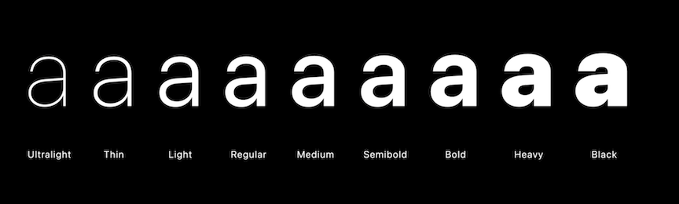
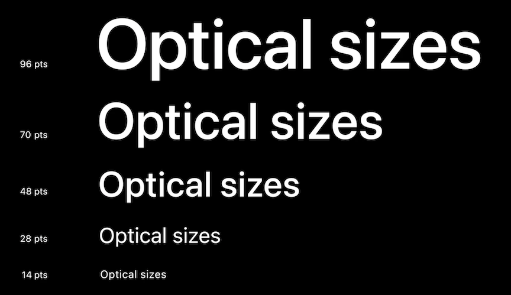
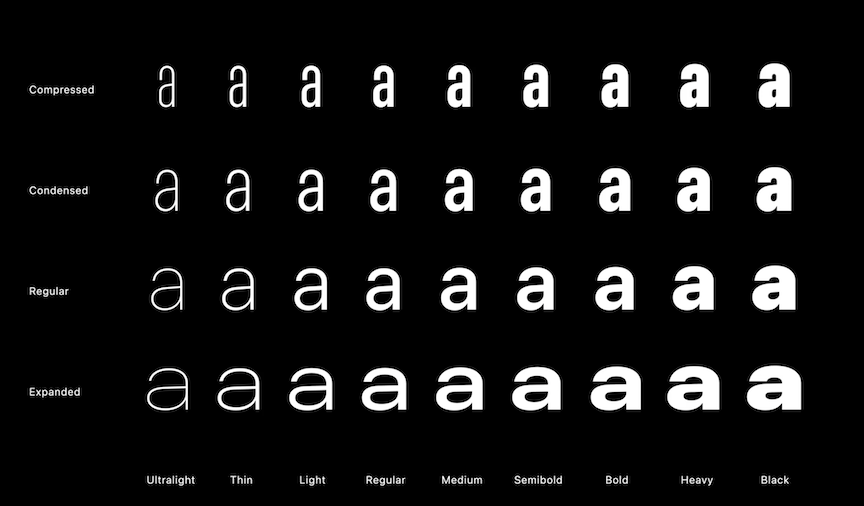
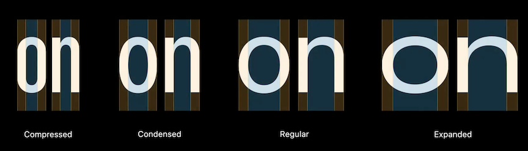
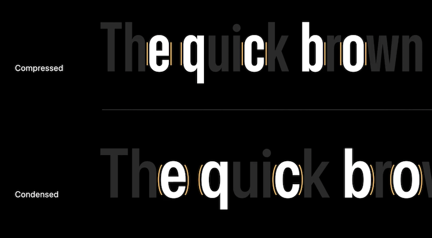
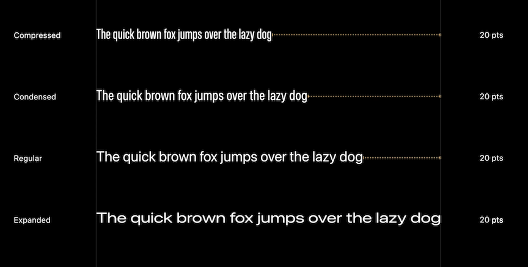
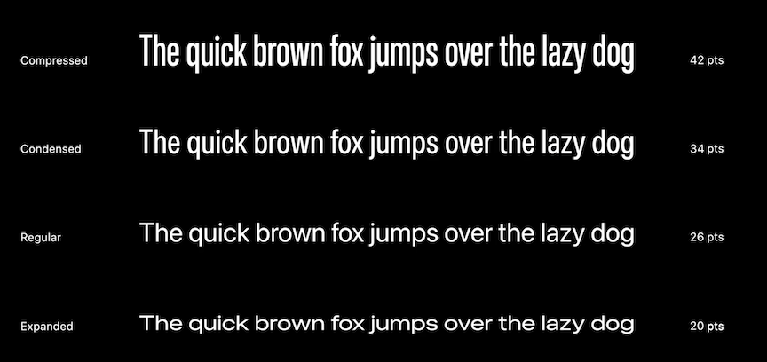

# [**Meet the expanded San Francisco font family**](https://developer.apple.com/videos/play/wwdc2022/110381/)

### **Meet the family**

SF Pro

* Pro Rounded
* Compact
* Compact Rounded 
* Mono

Many weights

Optical sizes - fonts display slightly differently based on point size

For more about typography: [**The details of UI typography**](https://developer.apple.com/videos/play/wwdc2020/10175/) session from WWDC 2020

---

### **Exlore the new widths**

Three new styles

* Condensed
* Compressed (most compact style)
* Expanded

* Styles near center of above map are generally more neutral
* Styles near the edges are more expressive/have more voice
* All styles contain the same language support
* Vertical proportions are the same across styles and weights
* Stem thickness is consistent (with some minor optical adjustments), but the negative "air" inside the glyphs tightens or widens

While being tightened, Compressed also offers flat sides to glyphs

Same point size | Same space used
--------------- | ---------------
 | 

While changing to a tighter font (condensed or compressed) can use less space to display a block of text, compressed can hamper readability when text is longer than a line or two

**Widths Recap**

* Unlock space efficiency
* Help to reinforce hierarchies
* Expressive display styles when using extreme widths and weights
* Latin, Greek, and Cyrillic support
	* be sure to have a fallback when using localization for other writing systems

---

### **Welcome SF Arabic**

SF Arabic was introduced last year

* Features same weights as SF Pro: ultralight -> black
* Also has optical size features
* Highly multilingual - not just Arabic, but also Malay, pashto, Persian, Sindhi, Uyghur, and others
* Contains numerous localization, tone and poetic marks, extended vowel signs, honorifics, and Quranic annotations

New member added this year - SF Arabic Rounded

