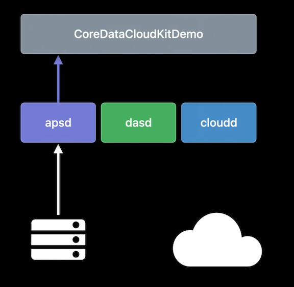

# [**Optimize your use of Core Data and CloudKit**](https://developer.apple.com/videos/play/wwdc2022/10119/)

Related Content:

* `NSPersistentCloudKitContainer`
* [Sample Application](https://developer.apple.com/documentation/coredata/synchronizing_a_local_store_to_the_cloud)
* [**Build apps that share data though CloudKit and Core Data**](https://developer.apple.com/videos/play/wwdc2021/10015/) session from WWDC 2021
* [**Using Core Data with CloudKit**](https://developer.apple.com/videos/play/wwdc2019/202/) session from WWDC 2019
* [**Getting Started with Instruments**](https://developer.apple.com/videos/play/wwdc2019/411/) session from WWDC 2019
* [**Diagnose performance issues with the Xcode Organizer**](https://developer.apple.com/videos/play/wwdc2020/10076/) session from WWDC 2020

### **Exploration**

* The primary goal of exploration is to facilitate learning
* Verify assumptions:
	* What does this button do
	* Will it sync
	* How much data is too much
* What happens to the sample application when the shape, structure, and variance of the data is changed

We will use data generators to explore

* Algorithmic data generators follow a set of predetermined rules like "insert 1000 objects" or "make sure every field has a value"
* We can also hand-craft specific data sets in code, SQL, or by interacting with the application
* We will create a new data generator - `LargeDataGenerator`
	* Give it a single `generateData(context:)` method
	* Generate 60 posts, each with 11 image attachments
* We can then write a test to verify the generator behaves correctly
* Then we will create one more test to verify that the data syncs correctly
	* Uses a `newContainer(context:)` helper method to get an instance of `NSPersistentCloudKitContainer`
	* Wait for up to 20 minutes to give the data set time to upload

```
class LargeDataGenerator {
    func generateData(context: NSManagedObjectContext) throws {
        try context.performAndWait {
            for postCount in 1...60 {
                //add a post               
                for attachmentCount in 1...11 {
                    //add an attachment with an image
                    let imageFileData = NSData(contentsOf: url!)!
               }
            }
        }
    }
}

class TestLargeDataGenerator: CoreDataCloudKitDemoUnitTestCase {
    func testGenerateData() throws {
        let context = self.coreDataStack.persistentContainer.newBackgroundContext()
        try self.generator.generateData(context: context)
        try context.performAndWait {                     
            let posts = try context.fetch(Post.fetchRequest())
            for post in posts {
                self.verify(post: post, has: 11, matching: imageDatas)
            }
        }
    }
}

func testExportThenImport() throws {
    let exportContainer = newContainer(role: "export", postLoadEventType: .setup)
    try self.generator.generateData(context: exportContainer.newBackgroundContext())
    self.expectation(for: .export, from: exportContainer)
    self.waitForExpectations(timeout: 1200)
}
```

* This test appears to be doing a lot of waiting for different types of events
	* When creating the container, we wait for the container to finish setting up.
	* Using `self.expectation(for:from:)` helper method to create XCTestExpectations for an export event from the container
		* Creates one expectation for each persistent store in the container using XCTestCase's `expectationForNotification` method to observe `NSPersistentCloudKitContainer`'s eventChanged notification
		* In the notification handler block, it verifies that the incoming event is of the correct type for the specific store this expectation is for, and that it's finished by checking `endDate` is not equal to nil

```
func expectation(for eventType: NSPersistentCloudKitContainer.EventType,
                 from container: NSPersistentCloudKitContainer) -> [XCTestExpectation] {
    var expectations = [XCTestExpectation]()
    for store in container.persistentStoreCoordinator.persistentStores {
        let expectation = self.expectation(
            forNotification: NSPersistentCloudKitContainer.eventChangedNotification,
            object: container
        ) { notification in
            let userInfoKey = NSPersistentCloudKitContainer.eventNotificationUserInfoKey
            let event = notification.userInfo![userInfoKey]               
            return (event.type == eventType) &&
                (event.storeIdentifier == store.identifier) &&
                (event.endDate != nil)
        }
        expectations.append(expectation)
    }
    return expectations
}
```

* Back in the test, we add a new container to import the data that was just exported
	* It creates a new instance of NSPersistentCloudKitContainer with empty store files
	* This allows the test to take advantage of NSPersistentCloudKitContainer's first-time import to explore what happens when all of this data is downloaded by a device

```
func testExportThenImport() throws {
    let exportContainer = newContainer(role: "export", postLoadEventType: .setup)
    try self.generator.generateData(context: exportContainer.newBackgroundContext())
    self.expectation(for: .export, from: exportContainer)
    self.waitForExpectations(timeout: 1200)
    
    let importContainer = newContainer(role: "import", postLoadEventType: .import)
    self.waitForExpectations(timeout: 1200)
}
```

* Can easily test this generator within an app
	* Use the code below to generate data on one device
	* On a second device, watch as the synced data populates

```
UIAlertAction(title: "Generator: Large Data", 
              style: .default) {_ in
    let generator = LargeDataGenerator()
    try generator.generateData(context: context)
    self.dismiss(animated: true)
}
```

---

### **Analysis**

* Use Instruments to analyze the time and memory complexity of the data set created by `LargeDataGenerator`
	* Time Profiler
	* Allocations
* Examine logs to find a record of activity from
	* `NSPersistentCloudKitContainer`
	* CloudKit
	* The system scheduler
	* Push notifications

You can right-click on a test and choose `Profile`. Xcode will build the test an automatically launch Instruments

* You can then double-click on the **Time Profiler** instrument to examine where the test spends time doing work
* Clicking the record button will launch the application and execute the selected test
* When profiling our test from above, we see that the `generateData(context:)` method is spending a lot of time creating thumbnails
	* Since thumbnails are generated elsewhere in the application's data model, the `attachment.thumbnail = ...` line below is unnecessary
	* We can remove that line, and change the `autoreleasepool` closure to just read `return NSData(contentsOf: url!)!`
* Rerunning the test in instruments, completes a lot faster than previously (test now executes in 1/10th the time)

```
func generateData(context: NSManagedObjectContext) throws {
    try context.performAndWait {
        for postCount in 1...60 {
            for attachmentCount in 1...11 {
                let attachment = Attachment(context: context)
                let imageData = ImageData(context: context)
                imageData.attachment = attachment
                imageData.data = autoreleasepool {
                    let imageFileData = NSData(contentsOf: url!)!
                    attachment.thumbnail = Attachment.thumbnail(from: imageFileData,        
                                                                thumbnailPixelSize: 80)
                    return imageFileData
                }
            }
        }
    }
}
```

Next, we'll use the **Allocations** instrument

* We see there are a lot of large allocations that are allocated for the tests
* Some of the allocations are not freed for almost two seconds
	* Usually a sign that the object was retained by a fetch, an autoreleasepool, or an object in the test
* The offending code is below, in the `XCTAssertNotNil` verifier
	* The verifier keeps the attachment and the associated image data registered with the managed object context

```
func verifyPosts(in context: NSManagedObjectContext) throws {
    try context.performAndWait {
        let fetchRequest = Post.fetchRequest()
        let posts = try context.fetch(fetchRequest)

        for post in posts {
            // verify post

            let attachments = post.attachments as! Set<Attachment>
            for attachment in attachments {

                XCTAssertNotNil(attachment.imageData)
                //verify image
            }
        }
    }
}
```

* Instead of verifying by fetching posts, we can fetch attachments instead
	* If we also fetch only the objectIDs, the managed object context won't capture any of the loaded objects until we ask it to
* We can use NSManagedObjectContext's objectWithID method to fetch the attachments as I go for validation
* Finally, for every 10 attachments validated, reset the context, freeing all of the cached state and the associated memory
* When re-running the test, the verifier now uses less memory than the `LargeDataGenerator` does when it inserts the objects

```
func verifyPosts(in context: NSManagedObjectContext) throws {
    try context.performAndWait {
        let fetchRequest = Attachment.fetchRequest()
        fetchRequest.resultType = .managedObjectIDResultType
        let attachments = try context.fetch(fetchRequest) as! [NSManagedObjectID]

        for index in 0...attachments.count - 1 {
            let attachment = context.object(with: attachments[index]) as! Attachment

            //verify attachment
            let post = attachment.post!
            //verify post

            if 0 == (index % 10) {
                context.reset()
            }
        }
    }
}
```

**Lifecycle of a Change**

* `NSPersistentCloudKitContainer` does work inside of the application process, in this case, `CoreDataCloudKitDemo`
* When data is written to a persistent store, it asks a system service called `dasd` if now is a good time to export that data to CloudKit
	* If it is, `dasd` will tell `NSPersistentCloudKitContainer` to run an activity.
* `NSPersistentCloudKitContainer` will then schedule work with a process called `cloudd` to export the changed objects to CloudKit


* You can observe logs from each of these processes in the Console app
* `cloudd` logs can be filtered by the container they are identified with
* Here's an example entry from `dasd`

```
501:com.apple.coredata.cloudkit.activity.export.183A4E03-9F31-45DA-8D78-67297241247A:3E214B:
[{
	name: ApplicationPolicy, policyWeight: 25.000,
	response: { Decision: Must Proceed, Score: 1.00 }
}], FinalDecision: Must Proceed
```

* When changes are imported on a receiving device, the process `apsd` is responsible for receiving push notifications and forwarding them to the application
* That causes `NSPersistentCloudKitContainer` to initiate a series of activities similar to the export process.
* It asks `dasd` for time to perform an import and then works with `cloudd` to fetch all of the updated objects from CloudKit and import them into the local store
* `apsd` logs when it receives a push notification for an application, and this log captures a number of important details
	* The log message includes the container identifier and the subscription name and zone identifier that triggered the push notification
	* These are managed by `NSPersistentCloudKitContainer` and will always start with the prefix `com.apple.coredata.cloudkit`

```
‹APSCourier 0x100a39ef® development>: Received message for enabled topic "com.apple.icloud-
container.com.apple.example.CoreDataCloudKitDemo' onInterface: NonCellular with payload '{
	aps =	{
		"content-available"=1;
	};
	ck =	{
		ce = 2;
		cid = "iCloud.com.apple.example.CoreDataCloudKitDemo";
		ckuserid = "2437e3046dc483afd9729082dd59e64d";
		met =	{
			dbs = 1;
			sid = "com.apple.coredata.cloudkit.private.subscription";
			zid = "com.apple.coredata.cloudkit.zone";
			zoid = "2437e3046dc483afd9729082dd59e64d";
		};
		nid = "9ba3bb0a-2605-46bb-9892-b5720814f5e2";
	};
}' with priority 5 for device token: YES
```



You can also use the `log stream` command in Terminal to display logs with different predicates

```
# Application
log stream --predicate 'process = "CoreDataCloudKitDemo" AND 
                        (sender = "CoreData" OR sender = "CloudKit")'

# CloudKit 
log stream --predicate 'process = "cloudd" AND
                        message contains[cd] "iCloud.com.example.CloudKitCoreDataDemo"'

# Push
log stream --predicate 'process = "apsd" AND message contains[cd] "CoreDataCloudKitDemo"'

# Scheduling
log stream --predicate 'process = "dasd" AND 
                        message contains[cd] "com.apple.coredata.cloudkit.activity" AND
                        message contains[cd] "CEF8F02F-81DC-48E6-B293-6FCD357EF80F"'
```

---

### **Feedback**

Collect diagnostics information from devices

* Generate feedback that is actionable and aligned with a specific goal
* Can collect from any device
* Three steps:
	* Install the CloudKit logging profile
		* Done by going to the "Profiles and Logs" page on the developer portal
		* Search for the CloudKit profile and tap the profile to download it
		* Some systems will show a notification to install the profile
			* On iOS, you need to install it manually via the Settings app
	* Collect a Sysdiagnose from the affected device
		* Done using a keychord, described in the instructions page for the profile
		* On an iPhone, this is done by holding down both volume keys and the power button for a few seconds and then releasing
		* After a while, a sysdiagnose will be available in Settings
			* The instructions for finding it are also found in the instructions file for the profile
			* In Settings, navigate to `Privacy & Security`, `Analytics and Improvements`, then choose `Analytics Data`
				* Scroll through the logs until you find the sysdiagnose
				* Can then tap on the sysdiagnose and share it with the share menu
	* If we have physical access to the device, we can collect Store Files from Xcode
		* In the Xcode Organizer, select the app from the "Installed Apps" section
		* Click on the disclosure button and choosing "Download Container..." and saving it

With a sysdiagnose, you can use the `log show` command to print out logs form the sysdiagnose

* Can combine many of the predicates discussed earlier to form a unified log of all the activity relevant to an application

```
log show --info --debug
    --predicate 'process = "apsd" AND
                 message contains[cd] "iCloud.com.example.CloudKitCoreDataDemo"'
    system_logs.logarchive

log show --info --debug
    --start "2022-06-04 09:40:00"
    --end "2022-06-04 09:42:00"
    --predicate 'process = "apsd" AND 
                 message contains[cd] "iCloud.com.example.CloudKitCoreDataDemo"'
    system_logs.logarchive

log show --info --debug
    --start "2022-06-04 09:40:00" --end "2022-06-04 09:42:00"
    --predicate '(process = "CoreDataCloudKitDemo" AND
                      (sender = "CoreData" or sender = "CloudKit")) OR
                 (process = "cloudd" AND
                      message contains[cd] "iCloud.com.example.CloudKitCoreDataDemo") OR
                 (process = "apsd" AND message contains[cd] "CoreDataCloudKitDemo") OR 
                 (process = "dasd" AND
                     message contains[cd] "com.apple.coredata.cloudkit.activity" AND
                     message contains[cd] "CEF8F02F-81DC-48E6-B293-6FCD357EF80F")'
    system_logs.logarchive
```

