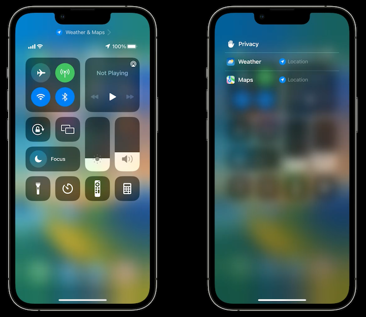

# **Power down: Improve battery consumption**

### **Adopt Dark Mode**

* Pixels on OLED displays consume varying levels of power
	* Less luminous pixels consume less power
* Dark Mode results in less pixel luminance
* Display can be the leading contributor to battery drain
* Up to 70% display power savings with dark mode - the higher the brightness, the higher the power savings
* Dynamic colors for background, text, and images
	* System will update colors based on mode
* Use alternate images for different modes
* **Implementing Dark Mode** #session from WWDC 2019
* Web content
	* `color-scheme` style property to support dark mode
	* Stylesheet variables for text and background colors
	* `prefers-color-scheme` for picture and media query
	* Choose other image variants for web content in Dark Mode
	* **Supporting Dark Mode in Your Web Content** #session from WWDC 2019

---

### **Audit frame rates**

* Multiple elements compose frame
* Each element has an independent	 frame rate
* Screens adapt to the element with the highest frame rate
	* High frame rate elements causes high screen refresh rate
	* Higher screen refresh rate consumes more battery
* Reducing frame rate from 60fps to 30fps (where it makes sense) can save up to 20% of battery drain
* Use instruments to debug frame rate usage
* `CADisplayLink` is synchronized with display refresh rate
	* Give hints to the system about desired refresh rates
		* Set `preferredFrameRateRange` with minimum, maximum, preferred rates
	* System determines the rate it can handle based on your hint
* **Optimize for variable refresh rate displays** #session from WWDC 2021

```
// Create a display link

func createDisplayLink() {
   let displayLink = CADisplayLink(target: self, selector: #selector(step))

    // Configure your desired refresh rate by calling preferredFrameRateRange
    displayLink.preferredFrameRateRange = CAFrameRateRange(minimum: 10,
                                                           maximum: 60,
                                                           preferred: 30)

// then activate your CADisplayLink by adding it to the main runloop.
    displayLink.add(to: .current, forMode: .defaultRunLoopMode)
}
```

---

### **Limit background time**

**Location Services**

* Ensure your app stops background services - call `stopUpdatingLocation()` when you no longer need location
* Tools to detect background location sessions
	* Xcode Gauges
	* MetricKit
		* Use the `cumulativeBackgroundLocationTime` property to find out how long the app was using location in the background
	* New Location Usage in Control Center in iOS 16
		* Tap the Location banner at the top of control center to view what apps are using location in the background



**Audio session**

* Stop audio engine when playback stops
* Ensure hardware is stopped when idle to save power
	* Use `autoShutdownEnabled` property of `AVAudioEngine`
	* Enforced behavior on watchOS

---

### **Defer work**

* Some work, like analytics, ML tasks, or backups can be deferred to when the device is charging to save battery and avoid contended with user initiated/interactive work
* Use `BGProcessingTask` to defer tasks which run for long durations
	* Defer background long running tasks for a better time
	* Use `BGProcessingTaskRequest` API with app identifier
		* Set `requiresExternalPower` and `requiresNetworkConnectivity` properties
* Discretionary `URLSession` to schedule deferrable networking
	* Allows the system to defer a download until a better time
	* Discretionary flag for smart scheduling
* Leverage proper Push Priority to help servers deliver pushes at the right time
	* High priority pushes wake up the system
		* Increased battery drain
		* Only use high priority pushes for urgent notifications
	* Low priority pushes utilize system resources better
		* Set `apns-priority` to 5
		* Coalesces multiple pushes together

```
// Set up background URL session 
let config = URLSessionConfiguration.background(withIdentifier: "com.app.attachments") 
let session = URLSession(configuration: config, delegate: ..., delegateQueue: ...) 

// Set discretionary 
config.isDiscretionary = true

// Set timeout intervals
config.timeoutIntervalForResource = 24 * 60 * 60 
config.timeoutIntervalForRequest = 60 

// Create request and task 
var request = URLRequest(url: url) 
request.addValue("...", forHTTPHeaderField: "...") 
let task = session.downloadTask(with: request) 

// Set time window of two hours
task.earliestBeginDate = Date(timeIntervalSinceNow: 2 * 60 * 60) 

// Set workload size 
task.countOfBytesClientExpectsToSend = 160 
task.countOfBytesClientExpectsToReceive = 4096 

task.resume()
```