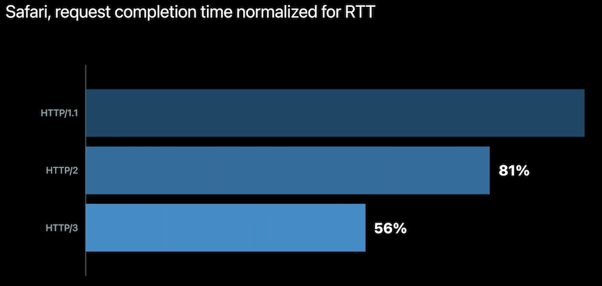
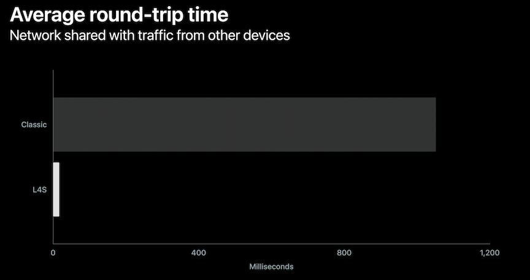

# [**Reduce networking delays for a more responsive app**](https://developer.apple.com/videos/play/wwdc2022-10078)

### **Latency Matters**

Most latency happens at the modem level queueing

Two factors that multiply together to determine your app's responsiveness: the *duration of each round trip* and the *number of round trips*

Improving latency has more of an affect in a load time than increased bandwidth has

---

### **Design responsive apps**

You can reduce your app's latency significantly by adopting modern protocols

* IPv6
* TLS 1.3
* HTTP/3
* Related:
	* [**Reduce network delays for your app**](https://developer.apple.com/videos/play/wwdc2021/10239/) session from WWDC 2021
	* [**Accelerate networking with HTTP/3 and QUIC**](https://developer.apple.com/videos/play/wwdc2021/10094/) session from WWDC 2021



When a device moves from Wi-Fi to cellular, it takes time to reestablish new connections and that can make your application stall

* Using connection migration eliminates those stalls
	* To opt in, set the `multipathServiceType` property to .handover on your URLSession configuration, or on your NWParameters

```
// Enable connection migration on URLSessionConfiguration for HTTP/3
let configuration = URLSessionConfiguration.default
configuration.multipathServiceType = .handover


// Enable connection migration on NWParameters for QUIC
let parameters = NWParameters.quic(alpn: ["myproto"])
parameters.multipathServiceType = .handover
```

If you design your own protocol that uses UDP directly, iOS 16 and macOS Ventura introduce a better way to send datagrams

* QUIC datagrams provide many benefits over plain UDP
	* The most important being that QUIC datagrams react to congestion in the network which keeps the round-trip time low and reduces packet loss
* To opt in on the client, set isDatagram to true on your QUIC options
	* Set the maximum datagram frame size you want to use

```
// Opt-in to QUIC datagrams
// Only one datagram flow can be created per connection
let options = NWProtocolQUIC.Options()
options.isDatagram = true

// Enable datagrams by setting the maximum datagram frame size
options.maxDatagramFrameSize = 65535
```

---

### **Speed up your server**

Network quality tool introduced in macOS Monterey

* Configure your server - [https://github.com/network-quality/server](https://github.com/network-quality/server)
	* Needs to be configured to act as a destination of the tool
	* Then run the tool on the client, first against Apple's default server, then against your own server

```
// Network quality tool in macOS
networkQuality -s -C https://myserver.example.com/config
```

After investigating video streaming issues (specifically related to skipping forward in a video), the following changes were made on a server

* Larger buffer sizes were not always better
	* Application buffer lowered from 4MB to 256KB
	* TLS buffer lowered from 256KB to 16KB
	* TCP buffer lowered from 4MB to 128KB
* Exact configuration below

```
/Recommended configuration for Apache Traffic Server
% cat /opt/ats/etc/trafficserver/records.config

# Set not-sent low-water mark trigger threshold to 128 kilobytes
CONFIG proxy.config.net.sock_notsent_lowat INT 131072

# Set Socket Options flag to the sum of the options we want
# TCP_NODELAY(1) + TCP_FASTOPEN(8) + TCP_NOTSENT_LOWAT(64) = 73
CONFIG proxy.config.net.sock_option_flag_in INT 73

...

# Enable Dynamic TLS record sizes
CONFIG proxy.config.ssl.max_record_size INT -1

...

# Reduce low-water mark and buffer block size for HTTP/2
CONFIG proxy.config.http2.default_buffer_water_mark INT  32768
CONFIG proxy.config.http2.write_buffer_block_size   INT 262144
```

---

### **Speed up the network**

Network quality tool added in iOS 15/macOS Monterey

* Waveform Bufferbloat test
	* [https://www.waveform.com/tools/bufferbloat](https://www.speedtest.net/)
* Responsiveness test written in Go
	* [https://github.com/network-quality/goresponsiveness](https://www.speedtest.net/)
* Responsiveness added to Ookla Speediest app
	* [https://www.speedtest.net/](https://www.speedtest.net/)

Apple is working with the networking community on a new technology called L4S

* Low Latency, Low Loss and Scalable throughput
* Available as a beta in iOS 16 and macOS Ventura
* Reduces queuing delay significantly and also achieves zero congestion loss
* To keep a consistently short queue, the network explicitly signals congestion instead of dropping packets, and the sender adjusts its sending rate based on the congestion feedback from the network



* Enable L4S in iOS Developer settings
* `defaults write -g network_enable_l4s -bool true` on macOS
* Linux
	* Accurate ECN
	* Scalable congestion control algorithm
* To see L4S benefits, network support is needed