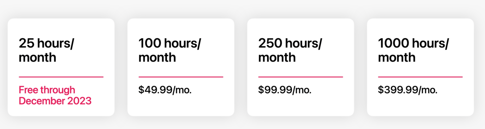

State of the platform

Xcode Cloud available today


Vision for Platforms
- Swift
    - Concurrency
        - new open source package Async Algorithms
        - distributed actors can communicate across multiple processes
    - Readability
        - regular expression literals
        - Regex builders
        - Expanded generics syntax
    - Customization
        - Swift package plugins - code that helps build your app
    - Performance
        - Link time is twice is fast
        - async tasks are sped up as well
        - launch time is dramatically faster on iOS 16
- SwiftUI
    - All new navigation API 🙌
    - major layout improvements
        - new grid API
        - custom layout API
    - half sheets
    - share sheets
    - new Transferrable API
    - easier to adopt SwiftUI incrementally
        - can write collection view cells in SwiftUI with new wrapper
    - Swift Charts
        - customizable charting framework built on top of SwiftUI
        - gets voiceover out of the box
        - charts can be easily animated
    - multi-column swiftUI tableview
    - ViewThatFits switches between vertical/horizontal based on available space
    - NavigationSplitView for sidebar/detail view

System Experience
- Home screen widgets
    - circular
    - rectangular
    - inline
    - work on iOS and watchOS
- Live activities
    - stay on top of things that are happening in real time
    - still created with widgetKit, but states are determined in realtime
    - not available until point update for iOS 16
- Messages collaboration API
    - updated for drag and drop, also in share sheet
    - collaboration popover to offer tools to quickly go back and forth between messages and documents
- App Intents
    - automatic adding of shortcuts to make App Shortcuts
    - works with Siri and shortcuts
    - shows shortcuts in spotlight
    - shown below app suggestions
    - appear immediately in the shortcuts app
    - Swift code is the only source of truth, no other dependencies
    - A way to do things inside your app from outside your app
    - SiriTipView added to make shortcuts discoverable
- Passkeys
    - can use on device, or use camera on phone to scan QR code
    - Uses WebAuthn standard

New APIs
- iPadOS
    - Get new Find/Replace UI for free
    - DriverKit
- watchOS
    - PhoneKit
    - Bluetooth
- SKAdNetwork
    - ads without tracking users
    - lots of other ad stuff added
- ScanKit and RoomPlan
    - new AR APIs
- Focus filters
    - built on top of app intents
    - allow app to adjust content based on Focus states
- Metal 3
    - we will never use this
- MapKit
    - 3D city experience available to devs
    - Look Around views
    - Apple Maps server APIs
        - geocode
        - reverse geocode
        - search
        - ETA
- WeatherKit
    - current weather
    - 10 day forecast
        - tempurature
        - precipitation
        - UV
    - hourly forecast
    - historical data
    - location only used for weather, not combined with identifiable information
    - 5000 API calls/month free
- Live Text/Vision APIs
    - quick actions like “copy all” or “translate”
    - data scanner API allows live text with a video feed
