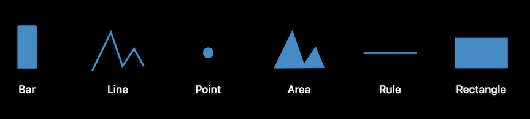
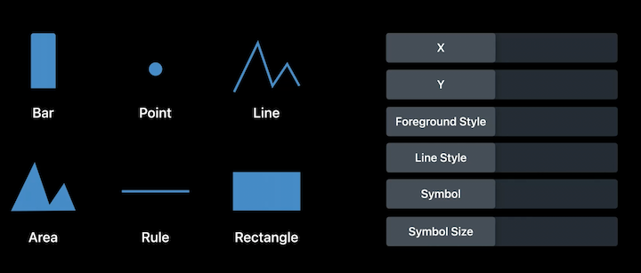

# [**Swift Charts: Raise the bar**](https://developer.apple.com/videos/play/wwdc2022-10137)

### **Marks and composition**

Mark

* A graphical element that represents data
* May be a line, dot, bar, etc.

Want to show a chart with top sales

* Can set the color of marks with `.foregroundStyle`
* Want to make sure your chart is accessible, use `.accessibilityLabel` and `. accessibilityValue`

```
import SwiftUI
import Charts

struct TopStyleChart: View {
    let data = [
        (name: "Cachapa", sales: 916),
        (name: "Injera", sales: 850),
        (name: "Crêpe", sales: 802),
        (name: "Jian Bing", sales: 753),
        (name: "Dosa", sales: 654),
        (name: "American", sales: 618)
    ]

    var body: some View {
        Chart(data, id: \.name) {
            BarMark(
                x: .value("Sales", $0.sales),
                y: .value("Name", $0.name)
            )
            // Set the foreground style of the bars.
            .foregroundStyle(.pink)
            // Customize the accessibility label and value.
            .accessibilityLabel($0.name)
            .accessibilityValue("\($0.sales) sold")
        }
    }
}
```


Now a chart for daily sales

* To use a line chart, just change `BarMark` to `LineMark` below

```
struct DailySalesChart: View {
    var body: some View {
        Chart {
            ForEach(dailySales, id: \.day) {
                // Try change to LineMark.
                BarMark( 
                    x: .value("Day", $0.day, unit: .day),
                    y: .value("Sales", $0.sales)
                )
            }
        }
    }
  
    let dailySales: [(day: Date, sales: Int)] = [
        (day: date(year: 2022, month: 5, day: 8), sales: 168),
        (day: date(year: 2022, month: 5, day: 9), sales: 117),
        (day: date(year: 2022, month: 5, day: 10), sales: 106),
        (day: date(year: 2022, month: 5, day: 11), sales: 119),
        (day: date(year: 2022, month: 5, day: 12), sales: 109),
        (day: date(year: 2022, month: 5, day: 13), sales: 104),
        (day: date(year: 2022, month: 5, day: 14), sales: 196),
        (day: date(year: 2022, month: 5, day: 15), sales: 172),
        (day: date(year: 2022, month: 5, day: 16), sales: 122),
        (day: date(year: 2022, month: 5, day: 17), sales: 115),
        (day: date(year: 2022, month: 5, day: 18), sales: 138),
        (day: date(year: 2022, month: 5, day: 19), sales: 110),
        (day: date(year: 2022, month: 5, day: 20), sales: 106),
        (day: date(year: 2022, month: 5, day: 21), sales: 187),
        (day: date(year: 2022, month: 5, day: 22), sales: 187),
        (day: date(year: 2022, month: 5, day: 23), sales: 119),
        (day: date(year: 2022, month: 5, day: 24), sales: 160),
        (day: date(year: 2022, month: 5, day: 25), sales: 144),
        (day: date(year: 2022, month: 5, day: 26), sales: 152),
        (day: date(year: 2022, month: 5, day: 27), sales: 148),
        (day: date(year: 2022, month: 5, day: 28), sales: 240),
        (day: date(year: 2022, month: 5, day: 29), sales: 242),
        (day: date(year: 2022, month: 5, day: 30), sales: 173),
        (day: date(year: 2022, month: 5, day: 31), sales: 143),
        (day: date(year: 2022, month: 6, day: 1), sales: 137),
        (day: date(year: 2022, month: 6, day: 2), sales: 123),
        (day: date(year: 2022, month: 6, day: 3), sales: 146),
        (day: date(year: 2022, month: 6, day: 4), sales: 214),
        (day: date(year: 2022, month: 6, day: 5), sales: 250),
        (day: date(year: 2022, month: 6, day: 6), sales: 146)
    ]
}

func date(year: Int, month: Int, day: Int = 1) -> Date {
    Calendar.current.date(from: .init(year: year, month: month, day: day)) ?? Date()
}
```

BarMark | LineMark
------- | --------
 | 

Show sales by location with a line mark

* Can set a foreground for each mark by using `.value("City", series.city)` in our `.foregroundStyle`
	* Swift Charts will automatically select a color and give us a legend
* Add symbols to a line with `.symbol(by: .value("City", series.city))`, will put a symbol at each data point
* Smooth the line by using `.interpolationMethod(.catmullRom)`

```
struct LocationsChart: View {
    var body: some View {
        Chart {
            ForEach(seriesData, id: \.city) { series in
                ForEach(series.data, id: \.weekday) {
                    LineMark(
                        x: .value("Weekday", $0.weekday, unit: .day),
                        y: .value("Sales", $0.sales)
                    )
                }
                .foregroundStyle(by: .value("City", series.city))
                .symbol(by: .value("City", series.city))
                .interpolationMethod(.catmullRom)
            }
        }
    }

    let seriesData = [
        (
            city: "Cupertino", data: [
                (weekday: date(year: 2022, month: 5, day: 2), sales: 54),
                (weekday: date(year: 2022, month: 5, day: 3), sales: 42),
                (weekday: date(year: 2022, month: 5, day: 4), sales: 88),
                (weekday: date(year: 2022, month: 5, day: 5), sales: 49),
                (weekday: date(year: 2022, month: 5, day: 6), sales: 42),
                (weekday: date(year: 2022, month: 5, day: 7), sales: 125),
                (weekday: date(year: 2022, month: 5, day: 8), sales: 67)
            ]
        ),
        (
            city: "San Francisco", data: [
                (weekday: date(year: 2022, month: 5, day: 2), sales: 81),
                (weekday: date(year: 2022, month: 5, day: 3), sales: 90),
                (weekday: date(year: 2022, month: 5, day: 4), sales: 52),
                (weekday: date(year: 2022, month: 5, day: 5), sales: 72),
                (weekday: date(year: 2022, month: 5, day: 6), sales: 84),
                (weekday: date(year: 2022, month: 5, day: 7), sales: 84),
                (weekday: date(year: 2022, month: 5, day: 8), sales: 137)
            ]
        )
    ]
}

func date(year: Int, month: Int, day: Int = 1) -> Date {
    Calendar.current.date(from: DateComponents(year: year, month: month, day: day)) ?? Date()
}
```

Straight Lines | Interpolated
-------------- | ------------
 | 

We can switch to a BarMark and removing the irrelevant bar marks now gives us a stacked bar chart

* We can add `.position(by: .value("City", series.city))` to view our bar marks next to each other instead of stacked

```
var body: some View {
    Chart {
        ForEach(seriesData, id: \.city) { series in
            ForEach(series.data, id: \.weekday) {
                BarMark(
                    x: .value("Weekday", $0.weekday, unit: .day),
                    y: .value("Sales", $0.sales)
                )
            }
            .foregroundStyle(by: .value("City", series.city))
            .position(by: .value("City", series.city))
        }
    }
}
```

Stacked | Positioned
------- | ----------
 | 

**Types of marks**



Marks can be combined in a single chart - such as line and area marks to visualize an average along with min/max values

```
struct MonthlySalesChart: View {
    var body: some View {
        Chart {
            ForEach(data, id: \.month) {
                AreaMark(
                    x: .value("Month", $0.month, unit: .month),
                    yStart: .value("Daily Min", $0.dailyMin),
                    yEnd: .value("Daily Max", $0.dailyMax)
                )
                .opacity(0.3)
                LineMark(
                    x: .value("Month", $0.month, unit: .month),
                    y: .value("Daily Average", $0.dailyAverage)
                )
            }
        }
    }

    let data = [
        (month: date(year: 2021, month: 7), sales: 3952, dailyAverage: 127, dailyMin: 95, dailyMax: 194),
        (month: date(year: 2021, month: 8), sales: 4044, dailyAverage: 130, dailyMin: 96, dailyMax: 189),
        (month: date(year: 2021, month: 9), sales: 3930, dailyAverage: 131, dailyMin: 101, dailyMax: 184),
        (month: date(year: 2021, month: 10), sales: 4217, dailyAverage: 136, dailyMin: 96, dailyMax: 193),
        (month: date(year: 2021, month: 11), sales: 4006, dailyAverage: 134, dailyMin: 104, dailyMax: 202),
        (month: date(year: 2021, month: 12), sales: 3994, dailyAverage: 129, dailyMin: 96, dailyMax: 190),
        (month: date(year: 2022, month: 1), sales: 4202, dailyAverage: 136, dailyMin: 96, dailyMax: 203),
        (month: date(year: 2022, month: 2), sales: 3749, dailyAverage: 134, dailyMin: 98, dailyMax: 200),
        (month: date(year: 2022, month: 3), sales: 4329, dailyAverage: 140, dailyMin: 104, dailyMax: 218),
        (month: date(year: 2022, month: 4), sales: 4084, dailyAverage: 136, dailyMin: 93, dailyMax: 221),
        (month: date(year: 2022, month: 5), sales: 4559, dailyAverage: 147, dailyMin: 104, dailyMax: 242),
        (month: date(year: 2022, month: 6), sales: 1023, dailyAverage: 170, dailyMin: 120, dailyMax: 250)
    ]
}

func date(year: Int, month: Int, day: Int = 1) -> Date {
    Calendar.current.date(from: DateComponents(year: year, month: month, day: day)) ?? Date()
}
```


Can visualize the same data with a combination of bars and rectangles

* You can set a `height` on RectangleMark in terms points
* Can set a width via a ratio - so `.ratio(0.6)` will set the width of the bars/rectangles to 60% of the width of the month area

```
var body: some View {
    Chart {
        ForEach(data, id: \.month) {
            BarMark(
                x: .value("Month", $0.month, unit: .month),
                yStart: .value("Daily Min", $0.dailyMin),
                yEnd: .value("Daily Max", $0.dailyMax),
                width: .ratio(0.6)
            )
            .opacity(0.3)
            RectangleMark(
                x: .value("Month", $0.month, unit: .month),
                y: .value("Daily Average", $0.dailyAverage),
                width: .ratio(0.6),
                height: 2
            )
        }
    }
}
```

Only Height Set | Width Ratio Set
--------------- | ---------------
 | 

Finally, we want to add the average daily sales among all the months

* Set the `foregroundStyle` of what we have to a translucent gray to de-emphasize them
* Add a RuleMark outside of ForEach to add the average line
* Add an `.annotation` to the RuleMark to add a text label to it

```
var body: some View {
    Chart {
        ForEach(data, id: \.month) {
            BarMark(
                x: .value("Month", $0.month, unit: .month),
                yStart: .value("Daily Min", $0.dailyMin),
                yEnd: .value("Daily Max", $0.dailyMax),
                width: .ratio(0.6)
            )
            .opacity(0.3)
            RectangleMark(
                x: .value("Month", $0.month, unit: .month),
                y: .value("Daily Average", $0.dailyAverage),
                width: .ratio(0.6),
                height: 2
            )
        }
        .foregroundStyle(.gray.opacity(0.5))

        RuleMark(
            y: .value("Average", averageValue)
        )
        .lineStyle(StrokeStyle(lineWidth: 3))
        .annotation(position: .top, alignment: .leading) {
            Text("Average: \(averageValue, format: .number)")
                .font(.headline)
                .foregroundStyle(.blue)
        }
    }
}
```


---

### **Plotting data with mark properties**

Swift Charts supports three major types of data


We can view the same data multiple ways, simply by switching our axes

Horizontal | Vertical
---------- | --------
 | 

When we use all three properties to chart data, we get something like this stacked chart


Swift Charts has six mark types, and six mark properties that you can plot data with



When building a chart, we can use the scale modifiers to set consistent scales for your data

* By default, Swift Charts will infer the scale automatically based on the data
* Can use a modifier, such as `.chartYScale` to set a consistent scale, regardless of data
* Can also change how the two cities map to foreground style using the `.chartForegroundStyleScale` modifier

```
struct LocationsChart: View {
    var body: some View {
        Chart {
            ForEach(seriesData, id: \.city) { series in
                ForEach(series.data, id: \.weekday) {
                    LineMark(
                        x: .value("Weekday", $0.weekday, unit: .day),
                        y: .value("Sales", $0.sales)
                    )
                }
                .foregroundStyle(by: .value("City", series.city))
                .symbol(by: .value("City", series.city))
                .interpolationMethod(.catmullRom)
            }
        }
        .chartYScale(domain: 0 ... 200)
        .chartForegroundStyleScale([
            "San Francisco": .orange,
            "Cupertino": .pink
        ])
    }
  
    let seriesData = [
        (
            city: "Cupertino", data: [
                (weekday: date(year: 2022, month: 5, day: 2), sales: 54),
                (weekday: date(year: 2022, month: 5, day: 3), sales: 42),
                (weekday: date(year: 2022, month: 5, day: 4), sales: 88),
                (weekday: date(year: 2022, month: 5, day: 5), sales: 49),
                (weekday: date(year: 2022, month: 5, day: 6), sales: 42),
                (weekday: date(year: 2022, month: 5, day: 7), sales: 125),
                (weekday: date(year: 2022, month: 5, day: 8), sales: 67)
            ]
        ),
        (
            city: "San Francisco", data: [
                (weekday: date(year: 2022, month: 5, day: 2), sales: 81),
                (weekday: date(year: 2022, month: 5, day: 3), sales: 90),
                (weekday: date(year: 2022, month: 5, day: 4), sales: 52),
                (weekday: date(year: 2022, month: 5, day: 5), sales: 72),
                (weekday: date(year: 2022, month: 5, day: 6), sales: 84),
                (weekday: date(year: 2022, month: 5, day: 7), sales: 84),
                (weekday: date(year: 2022, month: 5, day: 8), sales: 137)
            ]
        )
    ]
}

func date(year: Int, month: Int, day: Int = 1) -> Date {
    Calendar.current.date(from: DateComponents(year: year, month: month, day: day)) ?? Date()
}
```

Auto Scale | Defined Scale
---------- | -------------
 | 

---

### **Customizations**

A chart consists of:

* Axes
* Legend (when needed)
* Plot area

**Customizing axes and legend**

* We can use AxisMarks to show different intervals
	* Use `AxisMarks()` to recreate the default axis
	* Use `AxisMarks(values: .stride(by: .month))` to mark the axis by month
		* This will cause an issue because the axis will attempt to use the entire month name, crowding the axis
		* We then build the axis from individual components as seen in the code below, telling the `AxisValueLabel` to use a `.narrow` format

```
struct MonthlySalesChart: View {
    var body: some View {
        Chart(data, id: \.month) {
            BarMark(
                x: .value("Month", $0.month, unit: .month),
                y: .value("Sales", $0.sales)
            )
        }
        .chartXAxis {
            AxisMarks(values: .stride(by: .month)) { value in
                AxisGridLine()
                AxisTick()
                AxisValueLabel(
                    format: .dateTime.month(.narrow)
                )
            }
        }
    }

    let data = [
        (month: date(year: 2021, month: 7), sales: 3952),
        (month: date(year: 2021, month: 8), sales: 4044),
        (month: date(year: 2021, month: 9), sales: 3930),
        (month: date(year: 2021, month: 10), sales: 4217),
        (month: date(year: 2021, month: 11), sales: 4006),
        (month: date(year: 2021, month: 12), sales: 3994),
        (month: date(year: 2022, month: 1), sales: 4202),
        (month: date(year: 2022, month: 2), sales: 3749),
        (month: date(year: 2022, month: 3), sales: 4329),
        (month: date(year: 2022, month: 4), sales: 4084),
        (month: date(year: 2022, month: 5), sales: 4559),
        (month: date(year: 2022, month: 6), sales: 1023)
    ]

    let averageValue = 137
}

func date(year: Int, month: Int, day: Int = 1) -> Date {
    Calendar.current.date(from: DateComponents(year: year, month: month, day: day)) ?? Date()
}
```

Default x-axis | Full month x-axis | Narrow month x-axis
-------------- | ----------------- | -------------------
 |  | 

We can also conditionally set set the grid marks

* In this case, we will check if the month is the first month of each quarter
	* If it is, we can highlight the first month of each quarter with a different foreground style.
	* Otherwise, we display a grid line without a tick or a label
* We can also set the AxisValueLabel format to `.quarter()` style

```
struct MonthlySalesChart: View {
    var body: some View {
        Chart(data, id: \.month) {
            BarMark(
                x: .value("Month", $0.month, unit: .month),
                y: .value("Sales", $0.sales)
            )
        }
        .chartXAxis {
            AxisMarks(values: .stride(by: .month)) { value in
                if value.as(Date.self)!.isFirstMonthOfQuarter {
                    AxisGridLine().foregroundStyle(.black)
                    AxisTick().foregroundStyle(.black)
                    AxisValueLabel(
                        format: .dateTime.year().quarter()
                    )
                } else {
                    AxisGridLine()
                }
            }
        }
    }

    ...
}

extension Date {
    var isFirstMonthOfQuarter: Bool {
        Calendar.current.component(.month, from: self) % 3 == 1
    }
}

...
```


We can move the AxisMarks to the leading edge (trailing edge is the default)


```
var body: some View {
    Chart(data, id: \.month) {
        BarMark(
            x: .value("Month", $0.month, unit: .month),
            y: .value("Sales", $0.sales)
        )
    }
    .chartYAxis {
        AxisMarks( preset: .extended, position: .leading)
    }
}
```


* Using `.chartXAxis(.hidden)` and/or `.chartYAxis(.hidden)` will hide each axis entirely
* Using `.chartLegend(.hidden)` will hide the automatically generated chart legend

Hidden axes | Hidden legend
----------- | -------------
 | 

**Customizing the plot area**

* We might want the plot area to have an exact size or aspect ratio
	* for instance, define the plot area's height by the number of categories in a chart
	* use the `.frame` modifier to achieve this
* We can use the `.background` modifier to give a background to the chart area
* `.border(.pink, width: 1)` will add a border around the plot area

```
struct TopStyleChart: View {
    var body: some View {
        Chart(data, id: \.name) {
            BarMark(
                x: .value("Sales", $0.sales),
                y: .value("Name", $0.name)
            )
            // Set the foreground style of the bars.
            .foregroundStyle(.pink)
            // Customize the accessibility label and value.
            .accessibilityLabel($0.name)
            .accessibilityValue("\($0.sales) sold")
        }
        .chartPlotStyle { plotArea in
            plotArea.frame(height: 60 * 6)
                    .background(.pink.opacity(0.2))
                    .border(.pink, width: 1)
        }
    }

    let data = [
        (name: "Cachapa", sales: 916),
        (name: "Injera", sales: 850),
        (name: "Crêpe", sales: 802),
        (name: "Jian Bing", sales: 753),
        (name: "Dosa", sales: 654),
        (name: "American", sales: 618)
    ]
}
```

Default Chart | Defined Plot Area | Background and border
------------- | ----------------- | ---------------------
 |  | 

**ChartProxy**

Access the X and Y scales in a chart with `ChartProxy`

* `proxy.position(forX: 123)` gets the X position for value 123.0
* `proxy.value(atX: 100)` gets the data value at X position 100 pt.
* Can get a chart proxy object from the `.chartOverlay` or `.chartBackground` modifiers
* In the code below, we will use a `DragGesture` inside `.chartOverlay` to detect when a user drags along the chart, and highlight the data for the selected chart values


```
struct InteractiveBrushingChart: View {
    @State var range: (Date, Date)? = nil

    var body: some View {
        Chart {
            ForEach(data, id: \.day) {
                LineMark(
                    x: .value("Month", $0.day, unit: .day),
                    y: .value("Sales", $0.sales)
                )
                .interpolationMethod(.catmullRom)
                .symbol(Circle().strokeBorder(lineWidth: 2))
            }
            if let (start, end) = range {
                RectangleMark(
                    xStart: .value("Selection Start", start),
                    xEnd: .value("Selection End", end)
                )
                .foregroundStyle(.gray.opacity(0.2))
            }
        }
        .chartOverlay { proxy in
            GeometryReader { nthGeoItem in
                Rectangle().fill(.clear).contentShape(Rectangle())
                    .gesture(DragGesture()
                        .onChanged { value in
                            // Find the x-coordinates in the chart’s plot area.
                            let xStart = value.startLocation.x - nthGeoItem[proxy.plotAreaFrame].origin.x
                            let xCurrent = value.location.x - nthGeoItem[proxy.plotAreaFrame].origin.x
                            // Find the date values at the x-coordinates.
                            if let dateStart: Date = proxy.value(atX: xStart),
                               let dateCurrent: Date = proxy.value(atX: xCurrent) {
                                range = (dateStart, dateCurrent)
                            }
                        }
                        .onEnded { _ in range = nil } // Clear the state on gesture end.
                    )
            }
        }
    }

    let data: [(day: Date, sales: Int)] = [
        (day: date(year: 2022, month: 5, day: 8), sales: 168),
        (day: date(year: 2022, month: 5, day: 9), sales: 117),
        (day: date(year: 2022, month: 5, day: 10), sales: 106),
        (day: date(year: 2022, month: 5, day: 11), sales: 119),
        (day: date(year: 2022, month: 5, day: 12), sales: 109),
        (day: date(year: 2022, month: 5, day: 13), sales: 104),
        (day: date(year: 2022, month: 5, day: 14), sales: 196),
        (day: date(year: 2022, month: 5, day: 15), sales: 172),
        (day: date(year: 2022, month: 5, day: 16), sales: 122),
        (day: date(year: 2022, month: 5, day: 17), sales: 115),
        (day: date(year: 2022, month: 5, day: 18), sales: 138),
        (day: date(year: 2022, month: 5, day: 19), sales: 110),
        (day: date(year: 2022, month: 5, day: 20), sales: 106),
        (day: date(year: 2022, month: 5, day: 21), sales: 187),
        (day: date(year: 2022, month: 5, day: 22), sales: 187),
        (day: date(year: 2022, month: 5, day: 23), sales: 119),
        (day: date(year: 2022, month: 5, day: 24), sales: 160),
        (day: date(year: 2022, month: 5, day: 25), sales: 144),
        (day: date(year: 2022, month: 5, day: 26), sales: 152),
        (day: date(year: 2022, month: 5, day: 27), sales: 148),
        (day: date(year: 2022, month: 5, day: 28), sales: 240),
        (day: date(year: 2022, month: 5, day: 29), sales: 242),
        (day: date(year: 2022, month: 5, day: 30), sales: 173),
        (day: date(year: 2022, month: 5, day: 31), sales: 143),
        (day: date(year: 2022, month: 6, day: 1), sales: 137),
        (day: date(year: 2022, month: 6, day: 2), sales: 123),
        (day: date(year: 2022, month: 6, day: 3), sales: 146),
        (day: date(year: 2022, month: 6, day: 4), sales: 214),
        (day: date(year: 2022, month: 6, day: 5), sales: 250),
        (day: date(year: 2022, month: 6, day: 6), sales: 146)
    ]
}

func date(year: Int, month: Int, day: Int = 1) -> Date {
    Calendar.current.date(from: DateComponents(year: year, month: month, day: day)) ?? Date()
}
```


Other sessions to check out:

* [Design App Experiences with Charts](./Design%20app%20experiences%20with%20charts.md)
* [Design an Effective Chart](./Design%20an%20effective%20chart.md)