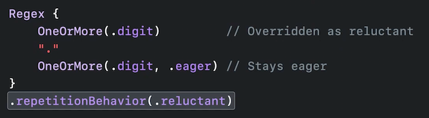

# [**Swift Regex: Beyond the basics**](https://developer.apple.com/videos/play/wwdc2022-110358)

Two new ways of string processing:

* `Regex` type, e.g. `/Hi, WWDC\d{2}!/`
* RegexBuilder result builder API (see below)
* Check out the [**Meet Swift Regex**](./Meet%20Swift%20Regex.md) session

```
Regex {
    "Hi, WWDC"
    Repeat(.digit, count: 2)
    "!"
}
```

A simple Example

* Start with `let regex = /user_id:\s*(\d+)/`, which creates a `Regex` type, similar to how `NSRegularExpression` is used
* Can switch to `let regex = /user_id:\s*(\d+)/`, and we get syntax highlighting

```
let input = "name:  John Appleseed,  user_id:  100"

// let regex = try Regex(#"user_id:\s*(\d+)"#)
let regex = /user_id:\s*(\d+)/

if let match = input.firstMatch(of: regex) {
    print("Matched: \(match[0])")
    print("User ID: \(match[1])")
}

// Matched: user_id: 100
// User ID: 100
```

* For even better readability, switch to using the Regex builder DSL

```
import RegexBuilder

let input = "name:  John Appleseed,  user_id:  100"

let regex = Regex {
    "user_id:"
    OneOrMore(.whitespace)
    Capture(.localizedInteger)
}

if let match = input.firstMatch(of: regex) {
    print("Matched: \(match.0)")
    print("User ID: \(match.1)")
}

// Matched: user_id: 100
// User ID: 100
```

### **How does Regex work**

* A Regex is a program that is to be executed by its underlying Regex engine
* When executing a Regex, the Regex engine takes an input string, and performs matching from the start to the end of the string
* In the example below, the Regex engine matches one or more `a` characters until it fails
	* The engine then moves on to the next pattern, where it matches one or more digit until it hits the end of the string, finding a match for the desired pattern

```
let regex = Regex {
    OneOrMore("a")
    OneOrMore(.digit)
}

let match = "aaa12".wholeMatch(of: regex)
```

Several different matching operations:

* `firstMatch` - finds the first occurrence of a Regex in a string
* `wholeMatch` - matches the entire string against a Regex
* `prefixMatch` - matches the prefix of a string against a Regex
* Also has APIs for Regex-based predication
	* `starts`
	* `replacing`
	* `trimmingPrefix`
	* `split`
* Can also be used in pattern matching syntax in control flow statements (e.g. `switch`)

```
let input = "name:  John Appleseed,  user_id:  100"

let regex = /user_id:\s*(\d+)/ 

input.firstMatch(of: regex)           // Regex.Match<(Substring, Substring)>
input.wholeMatch(of: regex)           // nil
input.prefixMatch(of: regex)          // nil

input.starts(with: regex)             // false
input.replacing(regex, with: "456")   // "name:  John Appleseed,  456"
input.trimmingPrefix(regex)           // "name:  John Appleseed,  user_id:  100"
input.split(separator: /\s*,\s*/)     // ["name:  John Appleseed", "user_id:  100"]

switch "abc" {
case /\w+/:
    print("It's a word!")
}
```

Foundation has also added Regex support

* Formatters and parsers suck as Date, Number, ISO8601, Currency, and (newly) URL
* Check out the **What's new in Foundation** #session from WWDC 2021
* Can use a Foundation-provided date parser with a custom format, or a currency parser with a domain-specific parse strategy

```
let statement = """
    DSLIP    04/06/20 Paypal  $3,020.85
    CREDIT   04/03/20 Payroll $69.73
    DEBIT    04/02/20 Rent    ($38.25)
    DEBIT    03/31/20 Grocery ($27.44)
    DEBIT    03/24/20 IRS     ($52,249.98)
    """

let regex = Regex {
    Capture(.date(format: "\(month: .twoDigits)/\(day: .twoDigits)/\(year: .twoDigits)"))
    OneOrMore(.whitespace)
    OneOrMore(.word)
    OneOrMore(.whitespace)
    Capture(.currency(code: "USD").sign(strategy: .accounting))
}
```

---

### **Use a Regex**

Example - parse XCTest logs

* A test log starts and ends with the status of a `Test Suite`
* XCTest runs every test case and reports the status of the test case in between

```
Test Suite 'RegexDSLTests' started at 2022-06-06 09:41:00.001
Test Case "-[RegexBuilderTests.RegexDSLTests testAlternation]' started.
/path/to/tests/RegexDSLTests.swift:138: error: -[RegexBuilderTests.RegexDSLTests
testAlternation]: XCTAssertTrue failed  
Test Case '-[RegexBuilderTests. RegexDSLTests testAlternation]' failed (0.508 seconds).
Test Suite 'RegexDSLTests' failed at 2022-06-06 09:41:00.606.
```

Parsing process

* import `RegexBuilder`
* Each test suite line contains three things we care about
	* The test suite's name
	* the status
	* whether it started, passed, or failed

```
import RegexBuilder

let regex = Regex {
    "Test Suite '"
    /[a-zA-Z][a-zA-Z0-9]*/
    "' "
    ChoiceOf {
        "started"
        "passed"
        "failed"
    }
    " at "
    OneOrMore(.any)
    Optionally(".")
}

let testSuiteTestInputs = [
    "Test Suite 'RegexDSLTests' started at 2022-06-06 09:41:00.001",
    "Test Suite 'RegexDSLTests' failed at 2022-06-06 09:41:00.001.",
    "Test Suite 'RegexDSLTests' passed at 2022-06-06 09:41:00.001."
]

for line in testSuiteTestInputs {
    if let match = line.wholeMatch(of: regex) {
        print("Matched: \(match.output)")
    }
}
```

**Regex literal**

* Starts and ends with a `/`
* Compiler checked
* Output type is `Substring`
* Uses strongly typed capturing groups
	* `/Hello, WWDC(?<year>\{2})!/` would match "Hello WWDC22!"
	* The result would be in the form of `Regex<(Substring, year: Substring)>`
* Swift also supports extended Regex literals
	* In the form `#/.../#`
	* Non-semantic whitespaces
	* Allows you to split your pattern into multiple lines

A few more notes from the code above:

* `ChoiceOf` allows us to match one of a specific group of options
* `OneOrMore(.any)` matches any character
* `Optionally(".")` will match a `.` when it exists

**Capture**

* `Capture(...)` saves a portion of the input
* Appends the matched `Substring` to the `Output` tuple type
* The Output tuple contains the entire matched substring, followed by all captures
* Below, there are two captures:
	* `Capture("b")` captures `b` explicitly
	* `/d(e)f/` captures `e` in a shorthand manner


```
let regex = Regex {
   "a"
   Capture("b")
   "c"
   /d(e)f/
}

if let match = "abcdef".wholeMatch(of: regex) {
    let (wholeMatch, b, e) = match.output
}
```

We can use captures to update the code above to give us direct access to the three parts we want:

```
import RegexBuilder

let regex = Regex {
    "Test Suite '"
    Capture(/[a-zA-Z][a-zA-Z0-9]*/)
    "' "
    Capture {
        ChoiceOf {
            "started"
            "passed"
            "failed"
        }
    }
    " at "
    Capture(OneOrMore(.any))
    Optionally(".")
}

let testSuiteTestInputs = [
    "Test Suite 'RegexDSLTests' started at 2022-06-06 09:41:00.001",
    "Test Suite 'RegexDSLTests' failed at 2022-06-06 09:41:00.001.",
    "Test Suite 'RegexDSLTests' passed at 2022-06-06 09:41:00.001."
]

for line in testSuiteTestInputs {
    if let (whole, name, status, dateTime) = line.wholeMatch(of: regex)?.output {
        print("Matched: \"\(name)\", \"\(status)\", \"\(dateTime)\"")
    }
}

// Matched: "RegexDSLTests", "started", "2022-06-06 09:41:00.001"
// Matched: "RegexDSLTests", "failed", "2022-06-06 09:41:00.001."
// Matched: "RegexDSLTests", "passed", "2022-06-06 09:41:00.001."
```

**Repetition behavior**

* We can make one more change to make sure we don't include the period in the date when it occurs
	* We do this with  `Capture(OneOrMore(.any, .reluctant))`
* Swift Regex has the following repetitions:
	* `OneOrMore(...)`
	* `ZeroOrMore(...)`
	* `Optionally(...)`
	* `Repeat(...)`
* Repetitions are `.eager` by default - matching as many occurrences as possible
* Using `.reluctant` matches the repetition as few characters as possible
	* Will always try to match the rest of the Regex first, backtracking back to the repetition when the rest of the Regex doesn't match
	* The capture will not consume the optional period at the end with this behavior

```
import RegexBuilder

let regex = Regex {
    "Test Suite '"
    Capture(/[a-zA-Z][a-zA-Z0-9]*/)
    "' "
    Capture {
        ChoiceOf {
            "started"
            "passed"
            "failed"
        }
    }
    " at "
    Capture(OneOrMore(.any, .reluctant))
    Optionally(".")
}
```

* Repetitions are eager by default
	* Can specify behavior at a per-repetition behavior by passing an extra argument
	* Can also use `repetitionBehavior` modifier to override all repetitions that are not specified



**Transforming capture**

* Appends transform result type to the `Output` tuple
	* Returns an optional type in the tuple
* `TryCapture` removes optionality form transform
	* Backtracks when transform returns nil

```
Regex {
    Capture {
        OneOrMore(.digit)
    } transform: {
        Int($0)     // Int.init?(_: some StringProtocol)
    }
} // Regex<(Substring, Int?)>


Regex {
    TryCapture {
        OneOrMore(.digit)
    } transform: {
        Int($0)     // Int.init?(_: some StringProtocol)
    }
} // Regex<(Substring, Int)>
```

* `TryCapture` is a natural fit when using enumerations
* We can replace our `Capture` for the test status by creating an enum and using `TryCapture` to have our tuple return our status as an enum value

```
enum TestStatus: String {
    case started = "started"
    case passed = "passed"
    case failed = "failed"
}

let regex = Regex {
    "Test Suite '"
    Capture(/[a-zA-Z][a-zA-Z0-9]*/)
    "' "
    TryCapture {
        ChoiceOf {
            "started"
            "passed"
            "failed"
        }
    } transform: {
        TestStatus(rawValue: String($0))
    }
    " at "
    Capture(OneOrMore(.any, .reluctant))
    Optionally(".")
} // Regex<(Substring, Substring, TestStatus, Substring)>

// Matched: "RegexDSLTests", TestStatus.started, "2022-06-06 09:41:00.001"
// Matched: "RegexDSLTests", TestStatus.failed, "2022-06-06 09:41:00.001."
// Matched: "RegexDSLTests", TestStatus.passed, "2022-06-06 09:41:00.001."
```

* Next, we can capture our timestamp using a `.iso8601` date parser to parse the timestamp as a date object instead of just as a string

```
let regex = Regex {
    "Test Suite '"
    Capture(/[a-zA-Z][a-zA-Z0-9]*/)
    "' "
    TryCapture {
        ChoiceOf {
            "started"
            "passed"
            "failed"
        }
    } transform: {
        TestStatus(rawValue: String($0))
    }
    " at "
    Capture(.iso8601(
        timeZone: .current, includingFractionalSeconds: true, dateTimeSeparator: .space))
    Optionally(".")
} // Regex<(Substring, Substring, TestStatus, Date)>

// Matched: "RegexDSLTests", TestStatus.started, 2022-06-06 09:41:00 +0000
// Matched: "RegexDSLTests", TestStatus.failed, 2022-06-06 09:41:00 +0000
// Matched: "RegexDSLTests", TestStatus.passed, 2022-06-06 09:41:00 +0000
```

---

### **Reuse an existing parser**

Example - we want to parse the duration of a test case

* Will use the Foundation-provided floating point parser with full support for localization (e.g. `.localizedDouble`)

```
let input = "Test Case '-[RegexDSLTests testCharacterClass]' passed (0.001 seconds)."

let regex = Regex {
    "Test Case "
    OneOrMore(.any, .reluctant)
    "("
    Capture {
        .localizedDouble
    }
    " seconds)."
}

if let match = input.wholeMatch(of: regex) {
    print("Time: \(match.output)")
}
```

**Call to pre-existing parser**

* `strtod` is a function from the C standard library
	* `double strtod(const char *string, char **end)`
		* Takes a string pointer
		* Parses the underlying string
		* Assigns the end position of the match to the end pointer
* Can define a custom parser type by conforming to the CustomConsumingRegexComponent
	* Set a `RegexOutput` as `Double`
	* Implement the `consuming` method

```
import Darwin

struct CDoubleParser: CustomConsumingRegexComponent {
    typealias RegexOutput = Double

    func consuming(
        _ input: String, startingAt index: String.Index, in bounds: Range<String.Index>
    ) throws -> (upperBound: String.Index, output: Double)? {
        input[index...].withCString { startAddress in
            var endAddress: UnsafeMutablePointer<CChar>!
            let output = strtod(startAddress, &endAddress)
            guard endAddress > startAddress else { return nil }
            let parsedLength = startAddress.distance(to: endAddress)
            let upperBound = input.utf8.index(index, offsetBy: parsedLength)
            return (upperBound, output)
        }
    }
}


let input = "Test Case '-[RegexDSLTests testCharacterClass]' passed (0.001 seconds)."

let regex = Regex {
    "Test Case "
    OneOrMore(.any, .reluctant)
    "("
    Capture {
        CDoubleParser()
    }
    " seconds)."
} // Regex<(Substring, Double)>

if let match = input.wholeMatch(of: regex) {
    print("Time: \(match.1)")
}

// Time: 0.001
```