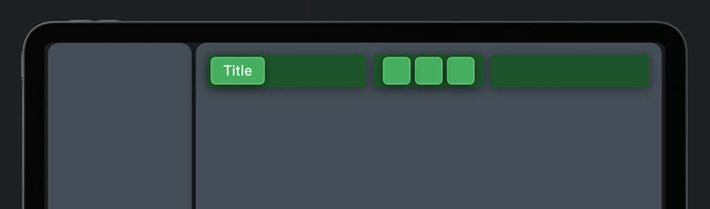
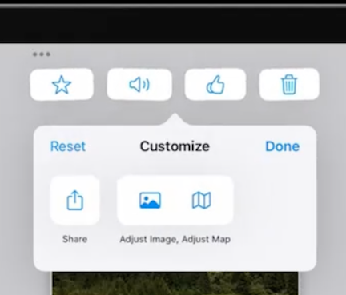
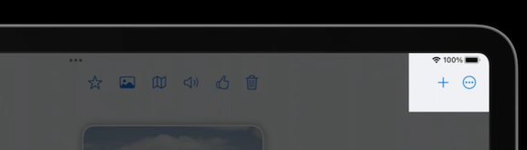
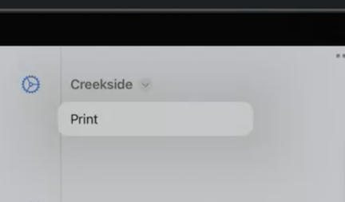
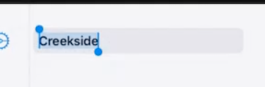
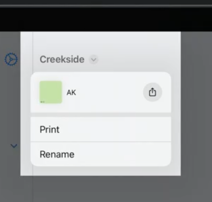

# [**SwiftUI on iPad: Add toolbars, titles, and more**](https://developer.apple.com/videos/play/wwdc2022-110343)

Check out part 1: [SwiftUI on iPad: Organize your interface](SwiftUI on iPad - Organize your interface.md)

### **Toolbars**

Previously, common practice was to add a menu to the toolbar

```
PlaceDetailContent(place: $place)
    .toolbar {
        ToolbarItem(placement: .primaryAction) {
            Menu {
                FavoriteToggle(place: $place)
                AdjustImageButton(place: $place)
                AdjustMapButton(place: $place)
            } label: {
                Label("More", systemImage: "ellipsis.circle")
            }
        }
    }
```

These types of menus are now Overflow Menus in iOS 16

* Below code is all you need for iPad and Mac to automatically move items into an overflow menu when needed

```
PlaceDetailContent(place: $place)
    .toolbar {
        ToolbarItemGroup(placement: .primaryAction) {
            FavoriteToggle(place: $place)
            AdjustImageButton(place: $place)
            AdjustMapButton(place: $place)
        }
    }
```

**Placements**

* Define the area in which a toolbar item is rendered
* Different placements can resolve to the same area
* Navigation bars have three distinct areas: leading, center, and trailing
	* `.primaryAction` resolves to the trailing area on iPad and Mac
	* `.secondaryAction` represents controls that are not the most used controls, but still warrant their own toolbar items
		* by default, not visible in the toolbar, but live in the overflow menu
		* New `.toolbarRole()` modifier can change this - Navigation bar interprets this as a desire to have more space for toolbar items
			* moves title to the leading area
			* secondary items move to the center area before moving to the overflow menu
			* in compact bar sizes, the buttons do not move and the title is still rendered in the center

```
PlaceDetailContent(place: $place)
    .toolbar {
        ToolbarItemGroup(placement: .secondaryAction) {
            FavoriteToggle(place: $place)
            AdjustImageButton(place: $place)
            AdjustMapButton(place: $place)
        }
    }
    .toolbarRole(.editor)
```



**iPadOS now supports user customization**

* Use the existing API for macOS
* Only `ToolbarItem`s are customizable
* Also requires every item in the toolbar to have a unique/consistent Id
	* Ids are persisted across app launches, and uses them to lookup associated view to render
* Add an ide to the toolbar as a whole

```
PlaceDetailContent(place: $place)
    .toolbar(id: "place") {
        ToolbarItem(id: "favorite", placement: .secondaryAction) {
            FavoriteToggle(place: $place)
        }
        ToolbarItem(id: "image", placement: .secondaryAction) {
            AdjustImageButton(place: $place)
        }
        ToolbarItem(id: "map", placement: .secondaryAction) {
            AdjustMapButton(place: $place)
        }
    }
    .toolbarRole(.editor)
```

**Some items can start as hidden initially**

* Unique to customizable toolbars
* Can be added later by dragging it into the share link
* Good for options more useful to specific workflows
* Share link below is hidden by default
	* More on share links: [Meet Transferable](Meet Transferable.md) session

```
PlaceDetailContent(place: $place)
    .toolbar(id: "place") {
        ToolbarItem(id: "favorite", placement: .secondaryAction) {
            FavoriteToggle(place: $place)
        }
        ToolbarItem(id: "image", placement: .secondaryAction) {
            AdjustImageButton(place: $place)
        }
        ToolbarItem(id: "map", placement: .secondaryAction) {
            AdjustMapButton(place: $place)
        }
        ToolbarItem(id: "share", placement: .secondaryAction, showsByDefault: false) {
            ShareLink(item: place)
        }
    }
    .toolbarRole(.editor)
```

**ControlGroup**

* Can group multiple items together, so they cannot be separated
	* First move them to the same `ToolbarItem`
	* Then wrap them in a `ControlGroup`

```
PlaceDetailContent(place: $place)
    .toolbar(id: "place") {
        ToolbarItem(id: "favorite", placement: .secondaryAction) {
            FavoriteToggle(place: $place)
        }
        ToolbarItem(id: "image", placement: .secondaryAction) {
            ControlGroup {
                AdjustImageButton(place: $place)
                AdjustMapButton(place: $place)
            }
        }
        ToolbarItem(id: "share", placement: .secondaryAction, showsByDefault: false) {
            ShareLink(item: place)
        }
    }
    .toolbarRole(.editor)
```



Can even add a label to `ControlGroup` to collapse it to a smaller menu

```
PlaceDetailContent(place: $place)
    .toolbar(id: "place") {
        ToolbarItem(id: "favorite", placement: .secondaryAction) {
            FavoriteToggle(place: $place)
        }
        ToolbarItem(id: "image", placement: .secondaryAction) {
            ControlGroup {
                AdjustImageButton(place: $place)
                AdjustMapButton(place: $place)
            } label: {
                Label("Edits", systemImage: "wand.and.stars")
            }
        }
    }
    .toolbarRole(.editor)
```

Primary actions are not customizable

* on macOS, all items are customizable
* But on iPadOS, only secondary items are customizable

```
PlaceDetailContent(place: $place)
    .toolbar(id: "place") {
        ToolbarItem(id: "new", placement: .primaryAction) {
            NewButton()
        }
        ToolbarItem(id: "favorite", placement: .secondaryAction) {
            FavoriteToggle(place: $place)
        }
        ToolbarItem(id: "image", placement: .secondaryAction) {
            ControlGroup {
                AdjustImageButton(place: $place)
                AdjustMapButton(place: $place)
            } label: {
                Label("Edits", systemImage: "wand.and.stars")
            }
        }
        ToolbarItem(id: "share", placement: .secondaryAction, showsByDefault: false) {
            ShareLink(item: place)
        }
    }
    .toolbarRole(.editor)
```



---

### **Titles and documents**

**Dealing with documents in a non-document group based app**

Navigation titles now support presenting a menu

* Provide a set of actions to the navigation title, like you would a normal menu
	* Title now has a menu indicator

```
PlaceDetailContent(place: $place)
    // toolbar customizations ...
    .navigationTitle(place.name) {
        MyPrintButton()
    }
```



* You can support editing titles with a binding

```
PlaceDetailContent(place: $place)
    // toolbar customizations ...
    .navigationTitle($place.name) {
        MyPrintButton()
        RenameButton()
    }
```

Rename Menu | Rename
----------- | ------
 | 

* You can also associate a document to your view
	* The title menu renders a specialized header with a preview of your document
	* Preview can be dragged, and quick access to share the docujent
	* Use `.navigationDocument()` to get header
		* Provide a type that conforms to Transferable, or provide a URL directly
	* The navigation document modifier will also configure the proxy icon of the window toolbar on macOS when providing a URL

```
PlaceDetailContent(place: $place)
    // toolbar customizations ...
    .navigationTitle($place.name) {
        MyPrintButton()
        RenameButton()
    }
    .navigationDocument(place.url)
```




