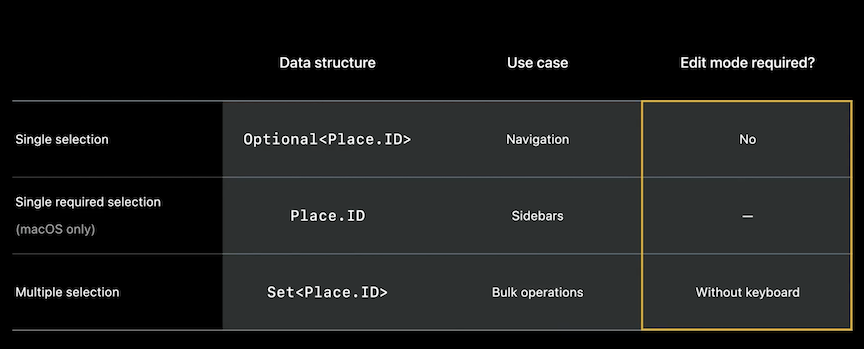
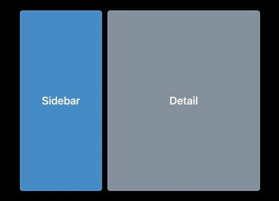
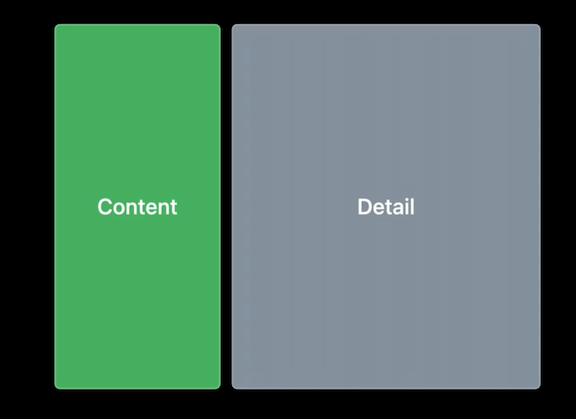
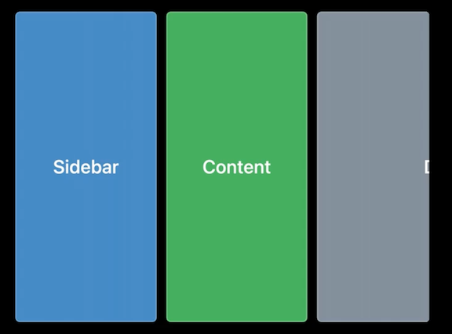

# [**SwiftUI on iPad: Organize your interface**](https://developer.apple.com/videos/play/wwdc2022-10058)

### **Lists and tables**

Multi-column tables

* Now available on iPad
* Same API as on the Mac
* Supports `Section` on both platforms
* In compact width layouts, tables will only show their first column (iPhone, slide-over)
* [**SwiftUI on the Mac: Build the fundamentals**](https://developer.apple.com/videos/play/wwdc2021/10062/) session from WWDC 2021


* Tables are sortable by creating a `@State` value using an array of `KeyPathComparator` values
	* Sort by tapping on the header
* Tables do not scroll horizontally

```
// Original Code
struct PlacesList: View {
    @Binding var modelData: ModelData

    var body: some View {
        List(modelData.places) { place in
            PlaceCell(place)
        }
    }
}

// Updated Code
struct PlacesTable: View {
    @Binding var modelData: ModelData
    @State private var sortOrder = [KeyPathComparator(\Place.name)]

    var body: some View {
        Table(modelData.places, sortOrder: $sortOrder) {
            TableColumn("Name", value: \.name) { place in
                PlaceCell(place)
            }
            TableColumn("Comfort Level", value: \.comfortDescription).width(200)
            TableColumn("Noise", value: \.noiseLevel) { place in
                NoiseLevelView(level: place.noiseLevel)
            }
        }
        .onChange(of: sortOrder) {
            modelData.sort(using: $0)
        }
    }
}
```

---

### **Selection and menus**

List and table selection

* Rows in a table have a tag - a unique value to help the list manage selection
* There is also a state that holds the selection (single or multiple)
* The List coordinates between the tags and selection via a selection binding


**Tags**

* Hashable value associated with a view
* Can be synthesized automatically
* Similar to identifiers, but not the same
* Automatic Tags
	* `ForEach` will automatically tag content with its explicit identity
	* `Table` will automatically tag content with the row value identity
	* `.id` does not set the tag
	* Check out [**Demystify SwiftUI**](../2021/Demystify SwiftUI.md) session from WWDC 2021
* Manual Tags
	* Use `View.tag(_:)`
	* Tag type is important
	* Use only one tag type in each selectable container
		* It's important that all views in a selectable container share the same tag type

**Selection state**

iPadOS 16 also introduces lightweight multiple selection

* Multiple selection with a keyboard without entering edit mode
	* works with common shortcuts, like shift and command
* Must use edit mode without a keyboard
	* Accelerated using a two-finger pan

List selection on iPad and iPhone no longer requires edit mode when selecting a single row

* Works with upated navigation APIs



```
struct PlacesTable: View {
	@EnvironmentObject var modelData: ModelData
	@State private var sortOrder = [KeyPathComparator(\Place.name)]
	@State private var selection: Set<Place.ID> = []

	var body: some View {
		Table(modelData.places, selection: $selection, sortOrder: $sortOrder) {
			// columns
       }
		.toolbar {
			ToolbarItemGroup(placement: .navigationBarTrailing) {
				if !selection.isEmpty {
	         		AddToGuideButton(selection)
				}
			}

			ToolbarItemGroup(placement: .navigationBarLeading) {
				EditButton()
    		}
    	}
	}
}
```

**Multi-select context menus**

Three variations

* Show a context menu on multiple items
* Show a menu on an individual item
* Show a menu on an empty area

```
Table(modelData.places, selection: $selection, sortOrder: $sortOrder) {
    ...
}
.contextMenu(forSelectionType: Place.ID.self) { items in
    if items.isEmpty {
        // Empty area
        AddPlaceButton()
    } else {
        if items.count == 1 {
            // Single item
            FavoriteButton(isSet: $modelData.places[items.first!].isFavorite)
        }

        // Single and multiple items
        AddToGuideButton(items)
    }
}
```

---

### **Split Views**

Navigation Split Views

* Supported on iOS, iPadOS, and macOS
* Two- or three-column layouts
* Multiple styles
* [The SwiftUI cookbook for navigation](The SwiftUI cookbook for navigation.md) session

Two-column Split Views

* The detail column is often more important
* Change style if weighting of columns differs
* Use `.balanced` to even priority between sidebar and detail
* Use `.prominentDetail` to prefer detail always

Landscape | Portrait
--------- | --------
 | 

Three-column Split Views

* Landscape
	* Content and Detail show by default
	* Sidebar can be toggled, detail column slides out of the way

Default | Sidebar
------- | -------
 | 

* Portait
	* Only detail is shown
	* Tapping on toolbar button shows the content
	* From there, tapping again show the sidebar
	* Sidebar and content overlay the detail view

Content | Sidebar
------- | -------
 | 

* Prefer automatic sizing style with three columns
* Specialized for larger iPads and macOS
* Collapses to stack in compact sizes

```
struct ContentView: View {
    var body: some View {
        NavigationSplitView {
            SidebarView()
       } detail: {
            Text("Select a place")
        }
    }
}
```

