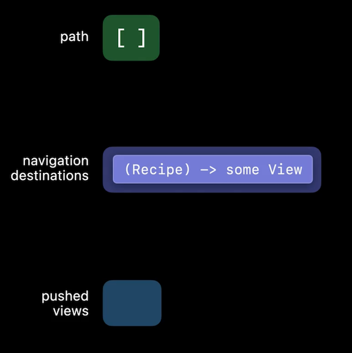
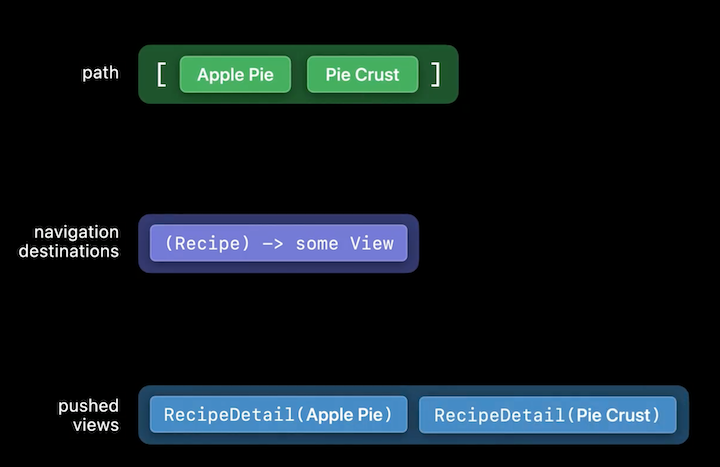

# **The SwiftUI cookbook for navigation**

**New navigation APIs**
* NavigationStack
	* for push/pop behavior
```
NavigationStack(path: Spath) {
	RecipeDetail()
}
```

* NavigationSplitView
	* Multi-column apps
	* Automatically adapts to single column stack in compact widths
	* Two sets of initializers for two and three column views
```
NavigationSplitView {
	RecipeCategories()
} detail: {
	RecipeGrid()
}
```

```
NavigationSplitView{
	RecipeCategories()
} content: {
	RecipeList()
} detail: {
	RecipeDetail()
}
```

* 	NavigationLink varieties
	*  New init takes a value instead of the view

```
NavigationLink( "Show detail") {
	DetailView()
}

NavigationLink("Apple Pie", value: applePieRecipe)
```
___
 
**Recipes for navigation**
* As you add more views to the stack, NavigationStack pushes another view, keeping track of the path and pushed views
	* Back button removes the last item from the stack and pushed views
	* Path uses new NavigationPathCollection

```
@State private var path: [Recipe] = []

var body: some View {
	NavigationStack(path: Spath) {
		List (Category.allCases) { category in
			Section(category.localizedName) {
				ForEach(dataModel.recipes (in: category)) { recipe in
					NavigationLink(recipe.name, value: recipe)
				}
			}
		}
		.navigationTitle( "Categories")
		.navigationDestination(for: Recipe.self) { recipe in
			RecipeDetail(recipe: recipe)
		}
	}
}
```

* NavigationStack in action:
	
Stack Start | Push first view | Push second view
----------- | --------------- | ----------------
 |  | 

* Can add a method to jump to any view
```
func showRecipeOfTheDay() {
	path = [dataModel.recipeOfTheDay]
}
```
* Can add another method to jump back to the root
```
func popToRoot() {
	path.removeAll()
}
```
* Build a productivity app for Apple Watch #session

* NavigationSplitView example
	* use state to keep track of selected item from main list
	* can use the same ideas as NavigationStack to track path ofr the content/detail views
```
@State private var selectedCategory: Category?

var body: some View {
	NavigationSplitView {
		List(Category.allCases, selection: $selectedCategory) { category in
			NavigationLink(category.localizedName, value: category)
		}
		.navigationTitle( "Categories")
	} content: {
		Text("Choose a category")
	} detail: {
		Text("Choose a recipe")
	}
}
```
```
@State private var selectedCategory: Category?
@State private var selectedRecipe: Recipe?

var body: some View {
	NavigationSplitView {
	...
	} content: {
		List(dataModel.recipes (in: selectedCategory), selection: $selectedRecipe) { recipe in
			NavigationLink(recipe.name, value: recipe)
		}
		.navigationTitle(selectedCategory?.localizedName ?? "Recipes")
	} detail: {
		RecipeDetail(recipe: selectedRecipe)
	}
}
```
* can also navigate to any view in the split view programmatically
```
func showRecipeOfTheDay() {
	let recipe = dataModel.recipeOfTheDay
	selectedCategory = recipe.category
	selectedRecipe = recipe
}
```
* programmatic changes apply properly to compact views, despite collapsing to a stack

* NavigationSplitView with NavigationStack
	* Can put a NavigationStack inside the detail of a NavigationSplitView
```
@State private var selectedCategory: Category?
@State private var path: [Recipe] = []

var body: some View {
	NavigationSplitView {
		List(Category.allCases, selection: $selectedCategory) { category in
			NavigationLink(category.localizedName, value: category)
		}
		.navigationTitle("Categories")
	} detail: {
		NavigationStack(path: $path){
			RecipeGrid(category: selectedCategory)
		}
	}
}
```
* `.navigationDestination` should be attached to the scrollView, not to the NavigationLink
		* Lazy containers like List, Table, LazyVGrid don't load all views immediately
		* would be repeated for every item in the Grid
```
struct RecipeGrid: View {
	var category: Category?

	var body: some View {
		if let category = category {
			ScrollView {
				LazyVGrid(columns: columns) [
					ForEach(dataModel.recipes (in: category)) { recipe in
						NavigationLink(value: recipe) { RecipeTile (recipe: recipe)
					}
				}
			}
			.navigationTitle(category.name)
			•navigationDestination(for: Recipe.self) { recipe in RecipeDetail (recipe: recipe)
		} else { .. }
	}
}
```

---

**Persistent state**
* Uses Codable and SceneStorage
	1. 	Move navigation state into a model type
```
class NavigationModel: ObservableObject {
	@Published var selectedCategory: Category?
	@Published var path: [Recipe] = []
}

@StateObject private var navModel = NavigationModel()

var body: some View {
	NavigationSplitView {
		List (Category.allCases, selection: SnavModel.selectedCategory) { category in
			NavigationLink(category.localizedName, value: category)
		}
		.navigationTitle( "Categories")
	} detail: {
		NavigationStack(path: SnavModel.path) {
			RecipeGrid(category: navModel.selectedCategory)
		}
	}
}
```
2. Make the navigation model codable
		* Don't store entire model value
			* Repeated information
			* Can change independently
```
class NavigationModel: ObservableObject, Codable {
	@Published var selectedCategory: Category?
	@Published var path: [Recipe] = []

	enum CodingKeys: String, CodingKey {
		case selectedCategory
		case recipePathIds
	}
	
	func encode (to encoder: Encoder) throws {
		var container = encoder.container (keyedBy: CodingKeys.self)
		try container.encodeIfPresent(selectedCategory, forkey: .selectedCategory)
		try container.encode (path.map(\.id), forKey:.recipePathIds)
	}

	required init(from decoder: Decoder) throws {
		let container = try decoder.container(keyedBy: CodingKeys.self)
		self.selectedCategory = try container.decodeIfPresent(Category.self, forkey: .selectedCategory)
		let recipePathIds = try container.decode([Recipe.ID].self, forKey: .recipePathIds)
		self.path = recipePathIds.compactMap { DataModel.shared[$0] }
	}
	
	var jsonData: Data? { ... }
}
```
3. Use SceneStorage to save and restore
```
@StateObject private var navModel = NavigationModel()
@SceneStorage ("navigation") private var data: Data?

var body: some View {
	NavigationSplitView { ... }
		.task {
			if let data = data {
				navModel.jsonData = data
			}
			for await _ in navModel.objectWillChangeSequence {
				data = navModel.jsonData
			}
		}
	}
}
```

---

* Navigation tips
	* NavigationView with stack style -> NavigationStack
	* NavigationView with multiple columns -> NavigationSplitView
	* `NavigationLink(... isActive: ...)` and `NavigationLink(... tag: ... selection: ...) -> NavigationLink(... value: ...)
		* old style is deprecated
	* [https://developer.apple.com/documentation/swiftui/migrating-to-new-navigation-types](Migrating to new navigation types)
	* Compose NavigationSplitView, NavigationStack, and List
	* Put navigationDestination modifiers within easy reach, but not inside lazy containers
	* Start with NavigationSplitView when it makes sense (even on iPhone)
