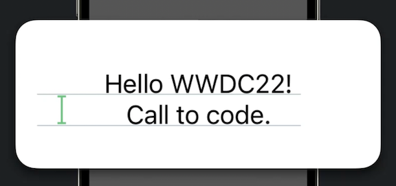
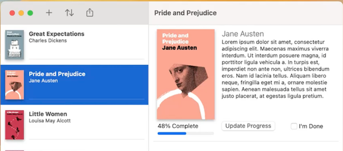
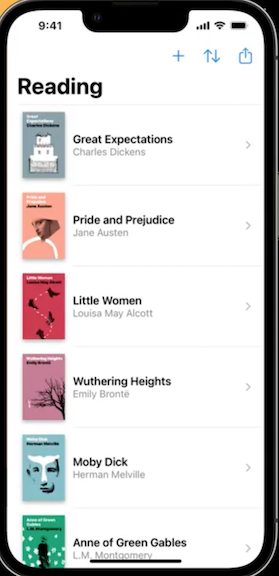
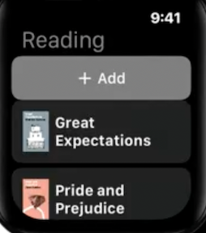
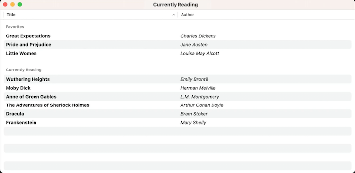
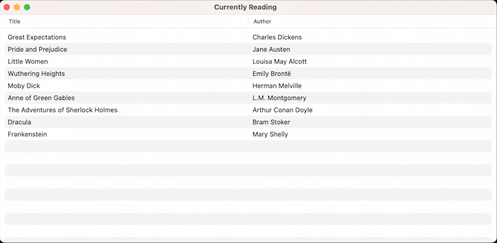

# **The craft of SwiftUI API design: Progressive disclosure**

Call site and declaration site:

* Progressive disclosure is designing APIs so that the complexity of the call site grows with the complexity of the use case
* An ideal API is both simple and approachable but also be able to accommodate powerful use cases
* Benefits:
	* Minimizes time to first build and run
	* Lowers the learning curve
	* Tightens feedback loop

```
// Declaration site
struct BookView: View {
    let pageNumber: Int
    let book: Book

    init(book: Book, pageNumber: Int) {
        self.book = book
        self.pageNumber = pageNumber
    }

    var body: some View { ... }
}

// Call site
VStack {
    BookView(book: favoriteBook, page: 1)
    BookView(book: savedBook, page: 234)
}
```

### **Consider common use cases**

Labels are an example of where SwiftUI considers multiple use cases:

```
// Label is just text - only needed the vast majority of the time
Button("Next Page") {
    currentPage += 1
}

// Label is still just text, but could be any view
Button {
    currentPage += 1
} label: {
    Text("Next Page")
}

// Label needs to be an HStack
Button {
    currentPage += 1
} label: {
    HStack {
        Text("Next Page")
        NextPagePreview()
    }
}
```

---

### **Provide intelligent defaults**

Text is an example of providing the most used default

```
Text("Hello WWDC22!")
```

* The above will do the following by default:
	* Localize your text by looking up the localized string in your app bundle with the environment locale
	* Adapt to the current color scheme, supporting dark mode right out of the box.
	* Scale the text up or down depending on the current accessibility dynamic type size
* Text does even more behind the scenes
	* When you put two texts next to each other into a stack, the space between the texts is automatically adjusted to the correct line spacing for text in the current context
	* intelligent defaults mean that when they aren't relevant to your use case, they don't appear at the call site

```
VStack {
    Text("Hello WWDC22!")
    Text("Call to Code.")
}
```



Toolbar also provides defaults, based on context

* The code below creates a toolbar without explicitly specifying button positions
	* On macOS, the buttons will appear in the leading edge of the toolbar
	* On iOS, they'll appear in the navigation bar, starting from the trailing edge
	* On watchOS, only the first item appears, pinned under the navigation bar

```
.toolbar {
    Button {
        addItem()
    } label: {
        Label("Add", systemImage: "plus")
    }

    Button {
        sort()
    } label: {
        Label("Sort", systemImage: "arrow.up.arrow.down")
    }

    Button {
        openShareSheet()
    }: label: {
        Label("Share", systemImage: "square.and.arrow.up")
    }
}
```

macOS | iOS | watchOS
----- | --- | -------
 |  | 

This works great for most situations, but the API also provides specific placement options that can be used when they are needed:

```
.toolbar {
    ToolbarItemGroup(placement: .navigationBarLeading) {
        Button {
            addItem()
        } label: {
            Label("Add", systemImage: "plus")
        }

        Button {
            sort()
        } label: {
            Label("Sort", systemImage: "arrow.up.arrow.down")
        }

        Button {
            openShareSheet()
        }: label: {
            Label("Share", systemImage: "square.and.arrow.up")
        }
    }
}
```

---

### **Optimize the call site**

Table is an example of where the call site can be optimized for either simple or complex usages

```
// Fully featured table implementation
@State var sortOrder = [KeyPathComparator(\Book.title)]

var body: some View {
    Table(sortOrder: $sortOrder) {
        TableColumn("Title", value: \Book.title) { book in
            Text(book.title).bold()
        }
        TableColumn("Author", value: \Book.author) { book in
            Text(book.author).italic()
        }
    } rows: {
        Section("Favorites") {
            ForEach(favorites) { book in
                TableRow(book)
            }
        }
        Section("Currently Reading") {
            ForEach(currentlyReading) { book in
                TableRow(book)
            }
        }
    }
    .onChange(of: sortOrder) { newValue in
        favorites.sort(using: newValue)
        currentlyReading.sort(using: newValue)
    }
}
```




* We can create a simpler usage:
	* We no longer have sections
	* We still have a binding to allow for sorting

```
// Simpler usage
@State var sortOrder = [KeyPathComparator(\Book.title)]

var body: some View {
    Table(sortOrder: $sortOrder) {
        TableColumn("Title", value: \Book.title) { book in
            Text(book.title)
        }
        TableColumn("Author", value: \Book.author) { book in
            Text(book.author)
        }
    } rows: {
        ForEach(currentlyReading) { book in
            TableRow(book)
        }
    }
    .onChange(of: sortOrder) { newValue in
        currentlyReading.sort(using: newValue)
    }
}
```

We can optimize this at the call site even more:

* Pass the collection directly to table, and the ForEach is handled automatically

```
@State var sortOrder = [KeyPathComparator(\Book.title)]

var body: some View {
    Table(currentlyReading, sortOrder: $sortOrder) {
        TableColumn("Title", value: \.title) { book in
            Text(book.title)
        }
        TableColumn("Author", value: \.author) { book in
            Text(book.author)
        }
    }
    .onChange(of: sortOrder) { newValue in
        currentlyReading.sort(using: newValue)
    }
}
```

We can take this even further

* Most of the time, when one of the values to show in a table is a string, You can just use a text to display it in the column
* Whenever the value keypath points to a string, the API allows the view associated with the TableColumn to be omitted

```
@State var sortOrder = [KeyPathComparator(\Book.title)]

var body: some View {
    Table(currentlyReading, sortOrder: $sortOrder) {
        TableColumn("Title", value: \.title)
        TableColumn("Author", value: \.author)
    }
    .onChange(of: sortOrder) { newValue in
        currentlyReading.sort(using: newValue)
    }
}
```

Finally, if we don't need to deal with sorting, we can remove that as well

```
var body: some View {
    Table(currentlyReading) {
        TableColumn("Title", value: \.title)
        TableColumn("Author", value: \.author)
    }
}
```



We got from the complex case to the simple case by asking two questions at each step:

* What are the *common* use cases?
* What is the *essential* information that should always be required

---

### **Compose, don't enumerate**

We can use HStack to illustrate this

* Essential information
	* What content should be in the stack
	* How should the content be arranged
* Alignment is an example of where we could go more in depth, but would not scale well
	* The current options are `.leading`, `.trailing`, and `.centered`
	* We could also start adding other options like `.spacedEvenly`, `.spaceInBetweenElements`, and `.spaceBeforeLastElement`, but then we end up with an ungainly amount of options
	* Instead of continuing to enumerate, we stick with the three most common options, and can expand functionality from there by composing it with the elements of our stack, like the examples below

```
// leading
struct StackExample: View {
    var body: some View {
        HStack {
            Box().tint(.red)
            Box().tint(.green)
            Box().tint(.blue)
        }
    }
}

// centered
struct StackExample: View {
    var body: some View {
        HStack {
            Spacer()
            Box().tint(.red)
            Box().tint(.green)
            Box().tint(.blue)
            Spacer()
        }
    }
}

struct StackExample: View {
    var body: some View {
        HStack { // evenly spaced
            Spacer()
            Box().tint(.red)
            Spacer()
            Box().tint(.green)
            Spacer()
            Box().tint(.blue)
            Spacer()
        }
    }
}

// space only between elements
struct StackExample: View {
    var body: some View {
        HStack {
            Box().tint(.red)
            Spacer()
            Box().tint(.green)
            Spacer()
            Box().tint(.blue)
        }
    }
}

// space only before last element
struct StackExample: View {
    var body: some View {
        HStack {
            Box().tint(.red)
            Box().tint(.green)
            Spacer()
            Box().tint(.blue)
        }
    }
}

// space only after first element
struct StackExample: View {
    var body: some View {
        HStack {
            Box().tint(.red)
            Spacer()
            Box().tint(.green)
            Box().tint(.blue)
        }
    }
}
```