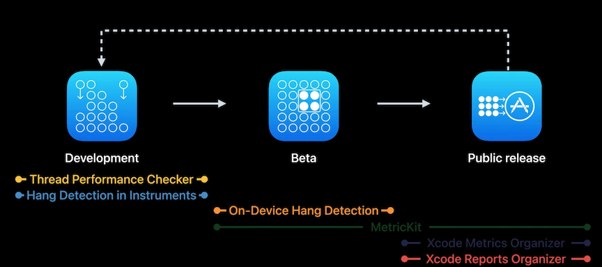

# [**Track down hangs with Xcode and on-device detection**](https://developer.apple.com/videos/play/wwdc2022-10082)

### **What are hangs**

* A hang is reported when the main thread is busy doing work or waiting on another thread or system resource, causing a delay in updating the view content by at least 250 milliseconds.
* The main thread is also unavailable to process new user interactions until the hang is resolved
* [**Understand and eliminate hangs from your app**](https://developer.apple.com/videos/play/wwdc2021/10258/) session from WWDC 2021

Previous to iOS 16 and Xcode 14, the following tools were provided:

* MetricKit - a framework that supports collecting non aggregated hang rate metrics and diagnostic reports from individual users on beta/public release apps
* Xcode Organizer provides aggregated hang rate metrics from public release apps

iOS 16/Xcode 14 introduces:

* Thread Performance Checker in Xcode alerts you to hang-causing threading issues while debugging your app without actively tracing it
* Instruments in Xcode now detects and labels hangs while tracing your app
* On-device hang detection provides hang detection without using Xcode or tracing, providing real-time hang notifications and supporting diagnostics while using your development-signed or TestFlight app
* The organizer in Xcode now supports hang reports, which provides aggregated hang diagnostics from users in the field

---

### **Development tooling**

**Thread Performance Checker**

* Notifies you in the Xcode Issue Navigator when it detects priority inversions and non-UI work on the main thread of your app
* Enable the Thread Performance Checker tool from the Diagnostics section of the appropriate scheme

**Time Profiler Instrument**

* Gives you the ability to know what each thread is doing over time by providing call stacks
* in Xcode 14, the Time Profiler also detects hangs and labels them directly in the corresponding process track
* Available by default in the Time Profiler and CPU Profiler instruments 
* Also a new standalone hang tracing instrument that you can add to any trace documents to surface hangs in combination with other instruments.
	* In addition to hang detection and labeling, it allows you to configure a hang duration threshold to find specific periods of unresponsiveness

---

### **Beta tooling**

**On-device hang detection**

* Available for development-side or TestFlight apps
* Delivers an on-device hang detection notification that the app is hanging (over three seconds in the image below)
* Can enable this feature under `Settings -> Developer -> Hang Detection`
	* Can set a minimum hang threshold
	* Shows apps monitored
	* Chronological list of available logs for the hangs you were alerted to
		* Monitored in the background with low priority, so processing can take a while. A passive notification is displayed whenever there are new diagnostics available.
		* Can share logs via the share menu

---

### **Public release tooling**

**Xcode Organizer hang reports**

* Only from customers who have consented to share app analytics with developers
* Appear in the Hangs section in the Organizer
* Hangs are sorted (be default) in order of percent of hang time
	* Similar hangs are grouped together to form a single signature
	* Each signature provides a few sample hang logs, containing:
		* The code responsible for the hang
		* The hang duration
		* the device and OS version from which the log originated
	* Each signature also provides aggregate statistics about how many hang logs the signature was responsible for, and a breakdown by OS Version and device

* Hang data can also be retrieved via the App Store Connect APIs
* [**Identify trends with the Power and Performance API**](https://developer.apple.com/videos/play/wwdc2020/10057/) session from WWDC 2020

**Regressions**

* Starting in Xcode 13.2, you can receive notifications when monitoring power and performance metrics in your app
* enable notifications by clicking the Notifications button in the top right of the Xcode Organizer's Regressions view
* Alerts you to sudden rises in your app's hang rate
* [**Diagnose Power and Performance Regressions in your app**](https://developer.apple.com/videos/play/wwdc2021/10087/) session from WWDC 2021

**Submitting symbols**

* Improves Xcode Organizer experience
* Used to add function names from your app to reports in the Xcode Organizer
* Also enables one-click navigation from a function name in a stack trace to the function definition in the Xcode source editor
* The information extracted is limited to function and methods, names and paths of source code files, and line number information
* The limited symbol information will be securely stored and will never be shared

