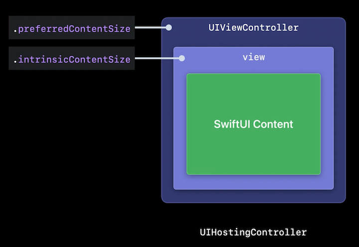
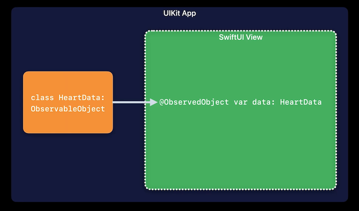
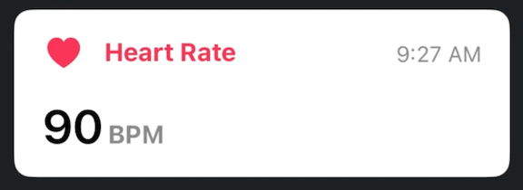
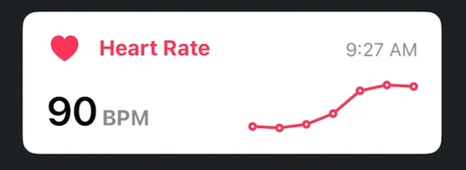
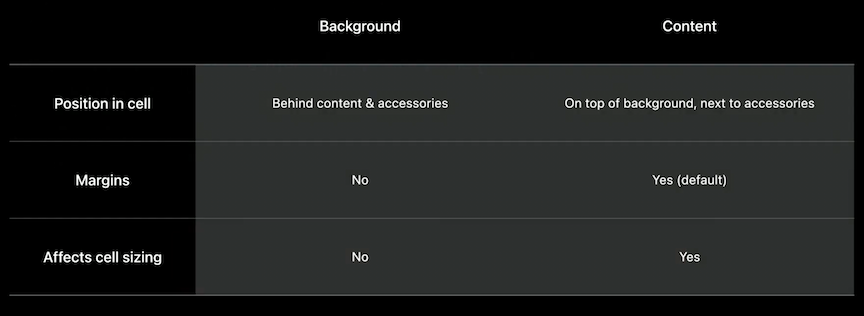
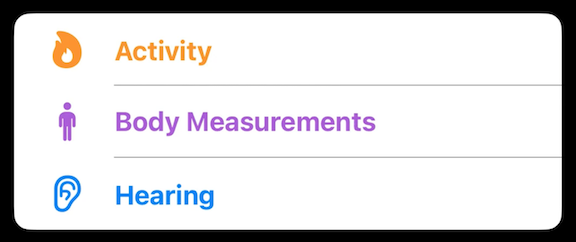
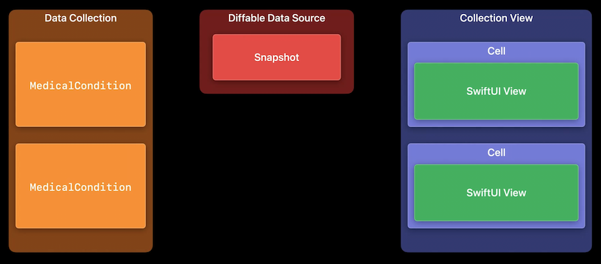
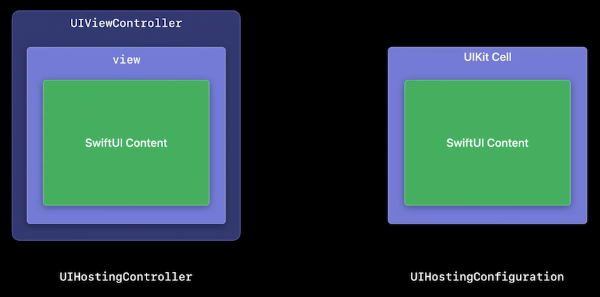

# **Use SwiftUI with UIKit**

### **UIHostingController**

UIHostingController is a UIViewController that contains a SwiftUI view hierarchy

```
// Presenting a UIHostingController

let heartRateView = HeartRateView() // a SwiftUI view
let hostingController = UIHostingController(rootView: heartRateView)

// Present the hosting controller modally
self.present(hostingController, animated: true)
```

A UIHostingController can also be used as a child view controller

```
// Embedding a UIHostingController

let heartRateView = HeartRateView() // a SwiftUI view
let hostingController = UIHostingController(rootView: heartRateView)

// Add the hosting controller as a child view controller
self.addChild(hostingController)
self.view.addSubview(hostingController.view)
hostingController.didMove(toParent: self)

// Now position & size the hosting controller’s view as desired…
```

In iOS 16, you now have control over a UIHostingController's `.preferredContentSize` and `.intrinsicContentSize`

```
// Presenting UIHostingController as a popover

let heartRateView = HeartRateView() // a SwiftUI view
let hostingController = UIHostingController(rootView: heartRateView)

// Enable automatic preferredContentSize updates on the hosting controller
hostingController.sizingOptions = .preferredContentSize

hostingController.modalPresentationStyle = .popover
self.present(hostingController, animated: true)
```



---

### **Bridging data**

SwiftUI offers a variety of data flow primitives to help you manage the data in your app

* `@State` and `@StateObject` are useful only when a SwiftUI view owns the data - so they don't apply here
	* Can learn more about these in the **Data Essentials in SwiftUI** #session from WWDC 2020
* You can pass arguments directly into a SwiftUI view as arguments
	* You are responsible for manually updating the UIHostingController when this data changes
	* Important note - we save a reference to the hosting controller and *not* `HeartRateView`, because `HeartRateView` is a value type, so it would only store a copy of the View

```
// Passing data to SwiftUI with manual UIHostingController updates

struct HeartRateView: View {
    var beatsPerMinute: Int

    var body: some View {
        Text("\(beatsPerMinute) BPM")
    }
}

class HeartRateViewController: UIViewController {
    let hostingController: UIHostingController<HeartRateView>
    var beatsPerMinute: Int {
        didSet { update() }
    }

    func update() {
        hostingController.rootView = HeartRateView(beatsPerMinute: beatsPerMinute)
    }
}
```

* `@ObservedObject` and `@EnvironmentObject` wrappers allow us to reference an external model object that conforms to the `ObservableObject` protocol
	* When we use these, SwiftUI automatically updated the view when the data changes



```
// Passing an ObservableObject to automatically update SwiftUI views

class HeartData: ObservableObject {
    @Published var beatsPerMinute: Int

    init(beatsPerMinute: Int) {
       self.beatsPerMinute = beatsPerMinute
    }
}

struct HeartRateView: View {
    @ObservedObject var data: HeartData

    var body: some View {
        Text("\(data.beatsPerMinute) BPM")
    }
}

class HeartRateViewController: UIViewController {
    let data: HeartData
    let hostingController: UIHostingController<HeartRateView>  

    init(data: HeartData) {
        self.data = data
        let heartRateView = HeartRateView(data: data)
        self.hostingController = UIHostingController(rootView: heartRateView)
    }
}
```

---

### **SwiftUI in cells**

New in iOS 16 - `UIHostingConfiguration`

* Seamlessly build table/collection view cells using SwiftUI
* No extra `UIView` or `UIViewcontroller` needed

```
cell.contentConfiguration = UIHostingConfiguration {
  // Start writing SwiftUI here!
}
```

Cell Configurations

* Used in UIKit
* Lightweight description of a cell's appearance
* Applied to a cell to render
* Composable
* See the **Modern cell configuration** #session from WWDC 2020

UIHostingConfiguration is a content configuration that is initialized with a SwiftUI ViewBuilder

* SwiftUI code can be written directly inside the `UIHostingConfiguration` closure
* Can also be written in a standalone (reusable) view that is called from the `UIHostingConfiguration` closure

```
// Building a custom cell using SwiftUI with UIHostingConfiguration

cell.contentConfiguration = UIHostingConfiguration {
    HeartRateTitleView()
}

struct HeartRateTitleView: View {
    var body: some View {
        HStack {
            Label("Heart Rate", systemImage: "heart.fill")
                .foregroundStyle(.pink)
                .font(.system(.subheadline, weight: .bold))
            Spacer()
            Text(Date(), style: .time)
                .foregroundStyle(.secondary)
                .font(.footnote)
        }
    }
}
```


Since the closure of `UIHostingConfiguration` contain SwiftUI code directly, you can put use Stacks to call multiple standalone SwiftUI views from it

```
// Building a custom cell using SwiftUI with UIHostingConfiguration

cell.contentConfiguration = UIHostingConfiguration {
    VStack(alignment: .leading) {
        HeartRateTitleView()
        Spacer()
        HeartRateBPMView()
    }
}

struct HeartRateBPMView: View {
    var body: some View {
        HStack(alignment: .firstTextBaseline) {
            Text("90")
                .font(.system(.title, weight: .semibold))
            Text("BPM")
                .foregroundStyle(.secondary)
                .font(.system(.subheadline, weight: .bold))
        }
    }
}
```



In iOS 16, we can even incorporate Swift Charts into a cell

* Check out the [**Hello Swift Charts**](Hello Swift Charts.md) session for more info

```
// Building a custom cell using SwiftUI with UIHostingConfiguration

cell.contentConfiguration = UIHostingConfiguration {
    VStack(alignment: .leading) {
        HeartRateTitleView()
        Spacer()
        HStack(alignment: .bottom) {
            HeartRateBPMView()
            Spacer()
            Chart(heartRateSamples) { sample in
                LineMark(x: .value("Time", sample.time),
                         y: .value("BPM", sample.beatsPerMinute))
                   .symbol(Circle().strokeBorder(lineWidth: 2))
                   .foregroundStyle(.pink)
            }
        }
    }
}
```



**Other features that `UIHostingConfiguration` supports**

* Content margins
	* SwiftUI content is inset to UIKit cell layout margins by default
	* Can set a `margins()` modifier on the `UIHostingConfiguration`

```
cell.contentConfiguration = UIHostingConfiguration {
    HeartRateBPMView()
}
.margins(.horizontal, 16)
```

* Background
	* Can use the `background()` modifier
	* There are key differences between the Background and the Content of a `UIHostingConfiguration` (see graphic below)

```
cell.contentConfiguration = UIHostingConfiguration {
   HeartTitleView()
} 
.background(.pink)
```



* List separators
	* Automatically aligned to text by default
	* Use `.alignmentGuide` modifier to customize



* List swipe actions
	* Cell must be inside a collection view list or table view
	* Make sure to use item identifier, not index path
	* [Sample Code](https://developer.apple.com/documentation/uikit/views_and_controls/using_swiftui_with_uikit) has a complete example of swipe actions

```
cell.contentConfiguration = UIHostingConfiguration {
    MedicalConditionView()
        .swipeActions(edge: .trailing) { … }
}
```

Cell interactions such as tap handling, highlighting, and selection will still be handled by the collection view or table view

* If you need to customize your SwiftUI views for any of these UIKit cell states, you can create your hosting configuration inside of the cell's `configurationUpdateHandler`, and use the state provided in your SwiftUI code
* The `configurationUpdateHandler` runs again any time the cell's state changes, creating a new `UIHostingConfiguration` for the new state and applying it to the cell

```
// Incorporating UIKit cell states

cell.configurationUpdateHandler = { cell, state in
    cell.contentConfiguration = UIHostingConfiguration {
      HStack {
        HealthCategoryView()
            Spacer()
            if state.isSelected {
                Image(systemName: "checkmark")
            }
        }
    }
}
```

---

### **Data flow for cells**

Displaying data in cells example

* App has a collection of MedicalCondition model objects, which we are going to display in the collection view
* For each item in this collection, we want to create a cell in the collection view to display that medical condition
* We'll create a diffable data source connected to the collection view
* We need to populate a diffable data source snapshot with the identifiers of the MedicalCondition model objects in the data collection
	* The diffable data source snapshot should contain the unique identifier of each MedicalCondition, not the MedicalCondition objects themselves
	* Ensures that the diffable data source can accurately track the identity of each item, and compute the correct changes when new snapshots are applied later
* By applying a snapshot with these item identifiers to the diffable data source, it will automatically update the collection view, which will create a new cell for each item
* Each cell is configured to display one MedicalCondition, using a SwiftUI view in a UIHostingConfiguration



Two types of changes we need to handle separately:

* Items are inserted, reordered, or deleted
	* These changes are handled by the applying a new snapshot to the diffable data source
	* Diffable data source will diff the old and new snapshots, and perform the necessary updates to the collection view, causing cells to be inserted, moved, or deleted
	* Because changes to the collection of data itself don't affect anything inside of cells, these types of changes are handled the same whether building cells with UIKit or SwiftUI
* Properties of individual model objects change
	* In UIKit, you would need to manually tell the diffable data source about these changes by reconfiguring or reloading items in the snapshot
	* In SwiftUI, because we store the `ObservableObject` model in an `ObservedObject` property in our SwiftUI view, changes to published properties automatically trigger SwiftUI to refresh the view

**Self-resizing cells**

* When SwiftUI cell content resizes itself, this is used by `UITableView` and `UICollectionView` to know how to resize the cell
* New in iOS 16
* Enabled by default for collection and table views
* Cells automatically resized when their content changes
* Learn more in the [**What's new in UIKit**](What's new in UIKit.md) #session

**Handling changes to properties of objects**

* You can create a two-way binding to a published property of an `ObservableObject`
* Data will flow from the `ObservableObject` into SwiftUI, but SwiftUI can also write back changes to the property on the model object
	* The `id` property of `MedicalCondition` is the unique id used to populate the diffable data source snapshot
	* The `text` property stores the text of the medical condition
	* By creating a binding to `text` in our `TextField`, changes to that property will write back directly to the `ObservableObject`

```
// Creating a two-way binding to data in SwiftUI

class MedicalCondition: Identifiable, ObservableObject {
    let id: UUID
   
    @Published var text: String
}

struct MedicalConditionView: View {
    @ObservedObject var condition: MedicalCondition

    var body: some View {
        HStack {
            TextField("Condition", text: $condition.text)
            Spacer()
        }
    }
}
```

**Two ways to add SwiftUI**

* When using `UIHostingController`, make sure to always add the view controller together with the view to your app
	* Many SwiftUI features, such as toolbars, keyboard shortcuts, and views that use UIViewControllerRepresentable, require a connection to the view controller hierarchy in UIKit to integrate properly, so never separate a hosting controller's view from the hosting controller itself
* When you apply a UIHostingConfiguration to a cell, your SwiftUI view is hosted in the cell without a UIViewController
	* SwiftUI views that depend on UIViewControllerRepresentable can't be used inside of cells

